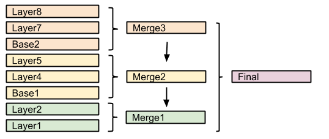

.. _sld-extensions_composite-blend_syntax:

Specifying compositing and blending in SLD
==========================================

Composites
----------

Both compositing and blending can be specified in SLD by adding the following VendorOption to
either the end of a Symbolizer or FeatureTypeStyle:

.. code-block:: xml

   <VendorOption name="composite">multiply</VendorOption>        

In case a custom opacity is desired, it can be added after the operation name separated with a comma:

.. code-block:: xml

   <VendorOption name="composite">multiply, 0.5</VendorOption>

.. note:: See the :ref:`full list of available modes <sld-extensions_composite-blend_modes>`.

.. warning::

   Blending against symbolizers causes exceptions inside the JDK when using OpenJDK. The `issue is known <https://bugs.openjdk.java.net/browse/JDK-8048782>`_ and has been reportedly fixed, but only in OpenJDK 9.

   One way to get around this issue with OpenJDK 7/8 is to install the `Marlin renderer <https://github.com/bourgesl/marlin-renderer>`_. This replaces the OpenJDK core renderer and does not suffer from the same issue.

   Oracle JDK 7 or 8 does not show this issue. 

Composite bases
---------------

For FeatureTypeStyles an additional vendor option can be added to control compositing groups:

.. code-block:: xml

   <VendorOption name="composite-base">true</VendorOption>

This will tell the rendering engine to use that FeatureTypeStyle as the destination, and will compose all subsequent FeatureTypeStyle/Layers on top of it, until another base is found. Once the full set of layers against a base is composed, then the base itself will be composed against the next set of composed layers, using its own compositing operator, if present.

Without this setting, the destination will be the full stack of all previous FeatureTypeStyles and layers drawn before the current one. This can be limiting for two reasons:

* It limits the usefulness of alpha-composite masking operations
* It breaks the WMS model, where the client can decide freely how to stack layers (the desired 
  compositing effects will be achieved only when a certain stack of layers is used)
  
Consider the following example:

In this example, the first two layers are drawn on top of each other, forming "Merge1".

The third layer is a composite base, as such it won't be merged on top of the already drawn map immediately, but it will be drawn to an off-screen buffer, and layer 4 and 5 will be drawn/composited on top of it. Once that happens, "Merge2" is ready, and gets drawn on top of "Merge1",

The next layer is another base, so "Base2" will be again drawn to an off-screen buffer, and layer 7 and 8 will be drawn/composited on top of it, forming Merge3. Once Merge3 is ready, it will be drawn/composited on top of the already fused Merge1/Merge2, generating the final map.
