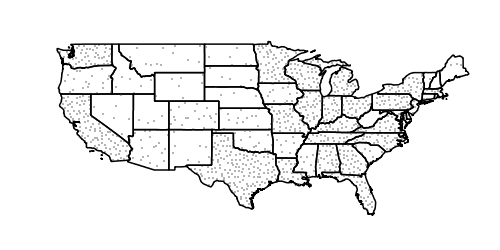

.. _randomized:

Fills with randomized symbols
=============================

Starting with GeoServer 2.4.2 it is possible to generate fills by randomly repeating a symbol in the polygons to be filled.
Or, to be more precise, generate the usual texture fill by repeating over and over a tile, whose contents is the random repetition of a fill.
The random distribution is stable, so it will be the same across calls and tiles, and it's controlled by the seed used to generate the distribution.

The random fill is generated by specifying a GraphicFill with a Mark or ExternalGraphic, and then adding vendor options to control how the
symbol is randomly repeated. Here is a table with options, default values, and possible values:

.. list-table::
   :widths: 20 10 70
   :header-rows: 1

   * - Option
     - Default value
     - Description
   * - random
     - none
     - Activates random distribution of symbol. Possible values are **none**, **free**, **grid**. 
       **none** disables random distribution, 
       **free** generates a completely random distribution, **grid** will generate a regular grid of positions, and only randomizes the 
       position of the symbol around the cell centers, providing a more even distribution in space
   * - random-tile-size
     - 256
     - Size the the texture fill tile that will contain the randomly distributed symbols
   * - random-rotation
     - none
     - Activates random symbol rotation. Possible values are **none** (no rotation) or **free**
   * - random-symbol-count
     - 16
     - The number of symbols in the tile. The number of symbols actually painted can be lower, as the distribution will ensure no
       two symbols overlap with each other.
   * - random-seed
     - 0
     - The "seed" used to generate the random distribution. Changing this value will result in a different symbol distribution

Here is an example:

.. code-block:: xml

       <sld:PolygonSymbolizer>
        <sld:Fill>
          <sld:GraphicFill>
            <sld:Graphic>
              <sld:Mark>
                <sld:WellKnownName>shape://slash</sld:WellKnownName>
                <sld:Stroke>
                  <sld:CssParameter name="stroke">#0000ff</sld:CssParameter>
                  <sld:CssParameter name="stroke-linecap">round</sld:CssParameter>
                  <sld:CssParameter name="stroke-width">4</sld:CssParameter>
                </sld:Stroke>
              </sld:Mark>
              <sld:Size>8</sld:Size>
            </sld:Graphic>
          </sld:GraphicFill>
        </sld:Fill>
        <sld:VendorOption name="random-seed">5</sld:VendorOption>
        <sld:VendorOption name="random">grid</sld:VendorOption>
        <sld:VendorOption name="random-tile-size">100</sld:VendorOption>
        <sld:VendorOption name="random-rotation">free</sld:VendorOption>
        <sld:VendorOption name="random-symbol-count">50</sld:VendorOption>
      </sld:PolygonSymbolizer>

.. figure:: images/random-slash.png
   :align: center
   
   *Random distribution of a diagonal line*

Randomized distributions can also be used for thematic mapping, for example, here is the SLD for a version of topp:states that displays the number of inhabitantìs varying the density of a random point distribution:

.. code-block:: xml

    <?xml version="1.0" encoding="UTF-8"?>
    <sld:UserStyle xmlns="http://www.opengis.net/sld" xmlns:sld="http://www.opengis.net/sld" xmlns:ogc="http://www.opengis.net/ogc" xmlns:gml="http://www.opengis.net/gml">
      <sld:Name>Default Styler</sld:Name>
      <sld:FeatureTypeStyle>
        <sld:Name>name</sld:Name>
        <sld:Rule>
          <ogc:Filter>
            <ogc:And>
              <ogc:Not>
                <ogc:PropertyIsLessThan>
                  <ogc:PropertyName>PERSONS</ogc:PropertyName>
                  <ogc:Literal>2000000</ogc:Literal>
                </ogc:PropertyIsLessThan>
              </ogc:Not>
              <ogc:Not>
                <ogc:PropertyIsGreaterThanOrEqualTo>
                  <ogc:PropertyName>PERSONS</ogc:PropertyName>
                  <ogc:Literal>4000000</ogc:Literal>
                </ogc:PropertyIsGreaterThanOrEqualTo>
              </ogc:Not>
            </ogc:And>
          </ogc:Filter>
          <sld:PolygonSymbolizer>
            <sld:Fill>
              <sld:GraphicFill>
                <sld:Graphic>
                  <sld:Mark>
                    <sld:WellKnownName>circle</sld:WellKnownName>
                    <sld:Fill>
                      <sld:CssParameter name="fill">#a9a9a9</sld:CssParameter>
                    </sld:Fill>
                  </sld:Mark>
                  <sld:Size>2</sld:Size>
                </sld:Graphic>
              </sld:GraphicFill>
            </sld:Fill>
            <sld:VendorOption name="random">grid</sld:VendorOption>
            <sld:VendorOption name="random-tile-size">100</sld:VendorOption>
            <sld:VendorOption name="random-symbol-count">150</sld:VendorOption>
          </sld:PolygonSymbolizer>
          <sld:LineSymbolizer>
            <sld:Stroke/>
          </sld:LineSymbolizer>
        </sld:Rule>
        <sld:Rule>
          <ogc:Filter>
            <ogc:PropertyIsLessThan>
              <ogc:PropertyName>PERSONS</ogc:PropertyName>
              <ogc:Literal>2000000</ogc:Literal>
            </ogc:PropertyIsLessThan>
          </ogc:Filter>
          <sld:PolygonSymbolizer>
            <sld:Fill>
              <sld:GraphicFill>
                <sld:Graphic>
                  <sld:Mark>
                    <sld:WellKnownName>circle</sld:WellKnownName>
                    <sld:Fill>
                      <sld:CssParameter name="fill">#a9a9a9</sld:CssParameter>
                    </sld:Fill>
                  </sld:Mark>
                  <sld:Size>2</sld:Size>
                </sld:Graphic>
              </sld:GraphicFill>
            </sld:Fill>
            <sld:VendorOption name="random">grid</sld:VendorOption>
            <sld:VendorOption name="random-tile-size">100</sld:VendorOption>
            <sld:VendorOption name="random-symbol-count">50</sld:VendorOption>
          </sld:PolygonSymbolizer>
          <sld:LineSymbolizer>
            <sld:Stroke/>
          </sld:LineSymbolizer>
        </sld:Rule>
        <sld:Rule>
          <ogc:Filter>
            <ogc:PropertyIsGreaterThanOrEqualTo>
              <ogc:PropertyName>PERSONS</ogc:PropertyName>
              <ogc:Literal>4000000</ogc:Literal>
            </ogc:PropertyIsGreaterThanOrEqualTo>
          </ogc:Filter>
          <sld:PolygonSymbolizer>
            <sld:Fill>
              <sld:GraphicFill>
                <sld:Graphic>
                  <sld:Mark>
                    <sld:WellKnownName>circle</sld:WellKnownName>
                    <sld:Fill>
                      <sld:CssParameter name="fill">#a9a9a9</sld:CssParameter>
                    </sld:Fill>
                  </sld:Mark>
                  <sld:Size>2</sld:Size>
                </sld:Graphic>
              </sld:GraphicFill>
            </sld:Fill>
            <sld:VendorOption name="random">grid</sld:VendorOption>
            <sld:VendorOption name="random-tile-size">100</sld:VendorOption>
            <sld:VendorOption name="random-symbol-count">500</sld:VendorOption>
          </sld:PolygonSymbolizer>
          <sld:LineSymbolizer>
            <sld:Stroke/>
          </sld:LineSymbolizer>
        </sld:Rule>
      </sld:FeatureTypeStyle>
    </sld:UserStyle>

   
   *Thematic map via point density approach*
