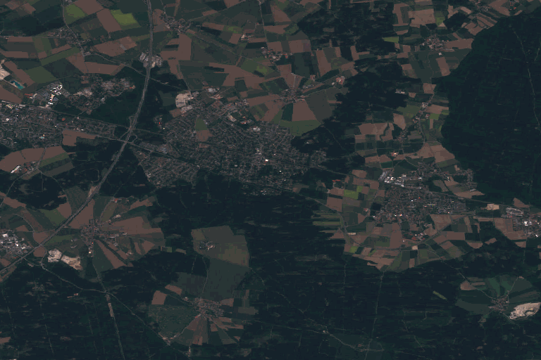

.. _rendering_transform:

Rendering Transformations
=========================

**Rendering Transformations** allow processing to be carried out 
on datasets within the GeoServer rendering pipeline.
A typical transformation computes a derived or aggregated result from the input data,
allowing various useful visualization effects to be obtained.
Transformations may transform data from one format into another
(i.e vector to raster or vice-versa),
to provide an appropriate format for display.

The following table lists examples of various kinds of rendering transformations
available in GeoServer:

.. list-table::
   :widths: 25 75 
   
   * - **Type** 
     - **Examples**
   * - Raster-to-Vector
     - **Contour** extracts contours from a DEM raster.
       **RasterAsPointCollections** extracts a vector field from a multi-band raster 
   * - Vector-to-Raster
     - **BarnesSurfaceInterpolation** computes a surface from scattered data points.
       **Heatmap** computes a heatmap surface from weighted data points.
   * - Vector-to-Vector
     - **PointStacker** aggregates dense point data into clusters.
       
 
Rendering transformations are invoked within SLD styles.
Parameters may be supplied to control the appearance of the output.
The rendered output for the layer is produced 
by applying the styling rules and symbolizers in the SLD to the result of transformation.

Rendering transformations are implemented using the same mechanism as :ref:`wps_processes`.
They can thus also be executed via the WPS protocol, if required.
Conversely, any WPS process can be executed as a transformation, as long
as the input and output are appropriate for use within an SLD.

This section is a general guide to rendering transformation usage in GeoServer. 
For details of input, parameters, and output for any particular 
rendering transformation, refer to its own documentation.

Installation
------------

Using Rendering Transformations requires the WPS extension to be installed. See :ref:`wps_install`.

.. note:: 

   The WPS service does not need to be **enabled** to use Rendering Transformations.
   To avoid unwanted consumption of server resources
   it may be desirable to disable the WPS service if it is not being used directly.

Usage
-----

Rendering Transformations are invoked by adding the ``<Transformation>`` element 
to a ``<FeatureTypeStyle>`` element in an SLD document.
This element specifies the name of the transformation process, 
and usually includes parameter values controlling the operation of the transformation.

The ``<Transformation>`` element syntax leverages the OGC Filter function syntax. 
The content of the element is a ``<ogc:Function>`` with the name of the rendering transformation process.
Transformation processes may accept some number of parameters,
which may be either required (in which case they must be specified),
or optional (in which case they may be omitted if the default value is acceptable).
Parameters are supplied as name/value pairs.
Each parameter's name and value are supplied via another function ``<ogc:Function name="parameter">``.
The first argument to this function is an ``<ogc:Literal>`` containing the name of the parameter.
The optional following arguments provide the value for the parameter (if any).
Some parameters accept only a single value, while others may accept a list of values.
As with any filter function argument, values may be supplied in several ways:

* As a literal value
* As a computed expression
* As an SLD environment variable, whose actual value is supplied in the WMS request
  (see :ref:`sld_variable_substitution`).
* As a predefined SLD environment variable (which allows obtaining values 
  for the current request such as output image width and height).

The order of the supplied parameters is not significant.

Most rendering transformations take as input a dataset to be transformed.
This is supplied via a special named parameter which does not have a value specified.
The name of the parameter is determined by the particular transformation being used.
When the transformation is executed, the input dataset
is passed to it via this parameter.

The input dataset is determined by the same query mechanism as used for all WMS requests,
and can thus be filtered in the request if required.

In rendering transformations which take as input a featuretype (vector dataset)
and convert it to a raster dataset, in order to pass validation
the SLD needs to mention the geometry attribute of the input dataset 
(even though it is not used).  
This is done by specifying the attribute name in the symbolizer ``<Geometry>`` element.

The output of the rendering transformation is styled using symbolizers 
appropriate to its format: 
:ref:`sld_reference_pointsymbolizer`, :ref:`sld_reference_linesymbolizer`, :ref:`sld_reference_polygonsymbolizer`, 
and :ref:`sld_reference_textsymbolizer` for vector data, 
and :ref:`sld_reference_rastersymbolizer` for raster coverage data.

If it is desired to display the input dataset in its orginal form, 
or transformed in another way, there are two options:

* Another ``<FeatureTypeStyle>`` can be used in the same SLD
* Another SLD can be created, and the layer displayed twice using the different SLDs

Notes
^^^^^

* Rendering transformations may not work correctly in tiled mode, 
  unless they have been specifically written to accomodate it.
  
Examples
--------

Contour extraction
^^^^^^^^^^^^^^^^^^

``ras:Contour`` is a **Raster-to-Vector** rendering transformation
which extracts contour lines at specified levels from a raster DEM.
The following SLD invokes the transformation
and styles the contours as black lines.

.. code-block:: xml
   :linenos:

     <?xml version="1.0" encoding="ISO-8859-1"?>
     <StyledLayerDescriptor version="1.0.0" 
       xsi:schemaLocation="http://www.opengis.net/sld StyledLayerDescriptor.xsd" 
       xmlns="http://www.opengis.net/sld" 
       xmlns:ogc="http://www.opengis.net/ogc" 
       xmlns:xlink="http://www.w3.org/1999/xlink" 
       xmlns:xsi="http://www.w3.org/2001/XMLSchema-instance">
       <NamedLayer>
         <Name>contour_dem</Name>
         <UserStyle>
           <Title>Contour DEM</Title>
           <Abstract>Extracts contours from DEM</Abstract>
           <FeatureTypeStyle>
             <Transformation>
               <ogc:Function name="ras:Contour">
                 <ogc:Function name="parameter">
                   <ogc:Literal>data</ogc:Literal>
                 </ogc:Function>
                 <ogc:Function name="parameter">
                   <ogc:Literal>levels</ogc:Literal>
                   <ogc:Literal>1100</ogc:Literal>
                   <ogc:Literal>1200</ogc:Literal>
                   <ogc:Literal>1300</ogc:Literal>
                   <ogc:Literal>1400</ogc:Literal>
                   <ogc:Literal>1500</ogc:Literal>
                   <ogc:Literal>1600</ogc:Literal>
                   <ogc:Literal>1700</ogc:Literal>
                   <ogc:Literal>1800</ogc:Literal>
                 </ogc:Function>
               </ogc:Function>
             </Transformation>
             <Rule>
               <Name>rule1</Name>
               <Title>Contour Line</Title>
               <LineSymbolizer>
                 <Stroke>
                   <CssParameter name="stroke">#000000</CssParameter>
                   <CssParameter name="stroke-width">1</CssParameter>
                 </Stroke>
               </LineSymbolizer>
               <TextSymbolizer>
                 <Label>
                   <ogc:PropertyName>value</ogc:PropertyName>
                 </Label>
                 
                   <CssParameter name="font-family">Arial</CssParameter>
                   <CssParameter name="font-style">Normal</CssParameter>
                   <CssParameter name="font-size">10</CssParameter>
                 
                 <LabelPlacement>
                   <LinePlacement/>
                 </LabelPlacement>
                 <Halo>
                   <Radius>
                     <ogc:Literal>2</ogc:Literal>
                   </Radius>
                   <Fill>
                     <CssParameter name="fill">#FFFFFF</CssParameter>
                     <CssParameter name="fill-opacity">0.6</CssParameter>        
                   </Fill>
                 </Halo>
                 <Fill>
                   <CssParameter name="fill">#000000</CssParameter>
                 </Fill>
                 <Priority>2000</Priority>
                 <VendorOption name="followLine">true</VendorOption>
                 <VendorOption name="repeat">100</VendorOption>
                 <VendorOption name="maxDisplacement">50</VendorOption>
                 <VendorOption name="maxAngleDelta">30</VendorOption>
               </TextSymbolizer>
             </Rule>
           </FeatureTypeStyle>
         </UserStyle>
       </NamedLayer>
      </StyledLayerDescriptor>

Key aspects of the SLD are:
      
* **Lines 14-15** define the rendering transformation, using the process ``ras:Contour``.
* **Lines 16-18** supply the input data parameter, named ``data`` in this process.
* **Lines 19-29** supply values for the process's ``levels`` parameter, 
  which specifies the elevation levels for the contours to extract.
* **Lines 35-40** specify a ``LineSymbolizer`` to style the contour lines.
* **Lines 41-70** specify a ``TextSymbolizer`` to show the contour levels along the lines.

The result of using this transformation is shown in the following map image
(which also shows the underlying DEM raster):

.. figure:: images/transform_contour_sf_dem.png
   :align: center

   
Heatmap generation
^^^^^^^^^^^^^^^^^^

``vec:Heatmap`` is a **Vector-to-Raster** rendering transformation 
which generates a heatmap surface from weighted point data.
The following SLD invokes a Heatmap rendering transformation 
on a featuretype with point geometries
and an attribute ``pop2000`` supplying the weight for the points
(in this example, a dataset of world urban areas is used).
The output is styled using a color ramp across the output data value range [0 .. 1].

.. code-block:: xml
   :linenos:
   
      <?xml version="1.0" encoding="ISO-8859-1"?>
      <StyledLayerDescriptor version="1.0.0" 
          xsi:schemaLocation="http://www.opengis.net/sld StyledLayerDescriptor.xsd" 
          xmlns="http://www.opengis.net/sld" 
          xmlns:ogc="http://www.opengis.net/ogc" 
          xmlns:xlink="http://www.w3.org/1999/xlink" 
          xmlns:xsi="http://www.w3.org/2001/XMLSchema-instance">
        <NamedLayer>
          <Name>Heatmap</Name>
          <UserStyle>
            <Title>Heatmap</Title>
            <Abstract>A heatmap surface showing population density</Abstract>
            <FeatureTypeStyle>
              <Transformation>
                <ogc:Function name="vec:Heatmap">
                  <ogc:Function name="parameter">
                    <ogc:Literal>data</ogc:Literal>
                  </ogc:Function>
                  <ogc:Function name="parameter">
                    <ogc:Literal>weightAttr</ogc:Literal>
                    <ogc:Literal>pop2000</ogc:Literal>
                  </ogc:Function>
                  <ogc:Function name="parameter">
                    <ogc:Literal>radiusPixels</ogc:Literal>
                    <ogc:Function name="env">
                      <ogc:Literal>radius</ogc:Literal>
                      <ogc:Literal>100</ogc:Literal>
                    </ogc:Function>
                  </ogc:Function>
                  <ogc:Function name="parameter">
                    <ogc:Literal>pixelsPerCell</ogc:Literal>
                    <ogc:Literal>10</ogc:Literal>
                  </ogc:Function>
                  <ogc:Function name="parameter">
                    <ogc:Literal>outputBBOX</ogc:Literal>
                    <ogc:Function name="env">
                      <ogc:Literal>wms_bbox</ogc:Literal>
                    </ogc:Function>
                  </ogc:Function>
                  <ogc:Function name="parameter">
                    <ogc:Literal>outputWidth</ogc:Literal>
                    <ogc:Function name="env">
                      <ogc:Literal>wms_width</ogc:Literal>
                    </ogc:Function>
                  </ogc:Function>
                  <ogc:Function name="parameter">
                    <ogc:Literal>outputHeight</ogc:Literal>
                    <ogc:Function name="env">
                      <ogc:Literal>wms_height</ogc:Literal>
                    </ogc:Function>
                  </ogc:Function>
                </ogc:Function>
              </Transformation>
             <Rule>
               <RasterSymbolizer>
               <!-- specify geometry attribute to pass validation -->
                 <Geometry>
                   <ogc:PropertyName>the_geom</ogc:PropertyName></Geometry>
                 <Opacity>0.6</Opacity>
                 <ColorMap type="ramp" >
                   <ColorMapEntry color="#FFFFFF" quantity="0" label="nodata" 
                     opacity="0"/>
                   <ColorMapEntry color="#FFFFFF" quantity="0.02" label="nodata" 
                     opacity="0"/>
                   <ColorMapEntry color="#4444FF" quantity=".1" label="nodata"/>
                   <ColorMapEntry color="#FF0000" quantity=".5" label="values" />
                   <ColorMapEntry color="#FFFF00" quantity="1.0" label="values" />
                 </ColorMap>
               </RasterSymbolizer>
              </Rule>
            </FeatureTypeStyle>
          </UserStyle>
        </NamedLayer>
       </StyledLayerDescriptor>

Key aspects of the SLD are:
       
* **Lines 14-15** define the rendering transformation, using the process ``vec:Heatmap``.
* **Lines 16-18** supply the input data parameter, named ``data`` in this process.
* **Lines 19-22** supply a value for the process's ``weightAttr`` parameter, 
  which specifies the input attribute providing a weight for each data point.
* **Lines 23-29** supply the value for the ``radiusPixels`` parameter,
  which controls the "spread" of the heatmap around each point.
  In this SLD the value of this parameter may be supplied by a SLD substitution variable
  called ``radius``, with a default value of ``100`` pixels.
* **Lines 30-33** supply the ``pixelsPerCell`` parameter,
  which controls the resolution at which the heatmap raster is computed.
* **Lines 34-38** supply the ``outputBBOX`` parameter, 
  which is given the value of the standard SLD environment variable ``wms_bbox``.
* **Lines 40-45** supply the ``outputWidth`` parameter, 
  which is given the value of the standard SLD environment variable ``wms_width``.
* **Lines 46-52** supply the ``outputHeight`` parameter, 
  which is given the value of the standard SLD environment variable ``wms_height``.
* **Lines 55-70** specify a ``RasterSymbolizer`` to style the computed raster surface.
  The symbolizer contains a ramped color map for the data range [0..1].
* **Line 58** specifies the geometry attribute of the input featuretype, 
  which is necessary to pass SLD validation.

This transformation styles a layer to produce a heatmap surface 
for the data in the requested map extent, as shown in the image below.
(The map image also shows the original input data points 
styled by another SLD, as well as a base map layer.)

.. figure:: images/heatmap_urban_us_east.png
   :align: center

Running map algebra on the fly using Jiffle
-------------------------------------------

The ``Jiffle`` rendering transformation allows to run map algebra on the bands of an input raster
layer using the `Jiffle language <https://github.com/geosolutions-it/jai-ext/wiki/Jiffle---language-summary>`_.
For example, the following style computes the NDVI index from a 13 bands Sentinel 2 image, in which
the red and NIR bands are the forth and eight bands (Jiffle band indexes are zero based),  
and then displays the resulting index with a color map:

.. code-block:: xml
   :linenos:

   <?xml version="1.0" encoding="UTF-8"?>
   <StyledLayerDescriptor xmlns="http://www.opengis.net/sld" xmlns:ogc="http://www.opengis.net/ogc" xmlns:xlink="http://www.w3.org/1999/xlink" xmlns:xsi="http://www.w3.org/2001/XMLSchema-instance" xsi:schemaLocation="http://www.opengis.net/sld
   http://schemas.opengis.net/sld/1.0.0/StyledLayerDescriptor.xsd" version="1.0.0">
     <NamedLayer>
       <Name>Sentinel2 NDVI</Name>
       <UserStyle>
         <Title>NDVI</Title>
         <FeatureTypeStyle>
           <Transformation>
             <ogc:Function name="ras:Jiffle">
               <ogc:Function name="parameter">
                 <ogc:Literal>coverage</ogc:Literal>
               </ogc:Function>
               <ogc:Function name="parameter">
                 <ogc:Literal>script</ogc:Literal>
                 <ogc:Literal>
                   nir = src[7];
                   vir = src[3];
                   dest = (nir - vir) / (nir + vir);
                 </ogc:Literal>
               </ogc:Function>
             </ogc:Function>
           </Transformation>
           <Rule>
             <RasterSymbolizer>
               <Opacity>1.0</Opacity>
               <ColorMap>
                 <ColorMapEntry color="#000000" quantity="-1"/>
                 <ColorMapEntry color="#0000ff" quantity="-0.75"/>
                 <ColorMapEntry color="#ff00ff" quantity="-0.25"/>
                 <ColorMapEntry color="#ff0000" quantity="0"/>
                 <ColorMapEntry color="#ffff00" quantity="0.5"/>
                 <ColorMapEntry color="#00ff00" quantity="1"/>
               </ColorMap>
             </RasterSymbolizer>
           </Rule>
         </FeatureTypeStyle>
       </UserStyle>
     </NamedLayer>
   </StyledLayerDescriptor>

Here are a view of the area, using the visible color bands:

and then the display of the NDVI index computed with the above style:

.. figure:: images/s2-ndvi.png
   :align: center
