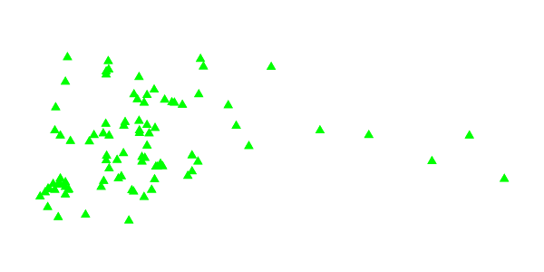

.. _sld_variable_substitution:

Variable substitution in SLD
=============================

Variable substitution in SLD is a GeoServer extension (starting in version 2.0.2) that allows passing values from WMS requests into SLD styles.
This allows dynamically setting values such as colors, fonts, sizes and filter thresholds.

Variables are specified in WMS ``GetMap`` requests by using the ``env`` request parameter followed by a list of ``name:value`` pairs separated by semicolons::

  ...&env=name1:value1;name2=value2&... 

In an SLD the variable values are accessed using the ``env`` function. 
The function retrieves a substitution variable value specified in the current request:
   
.. code-block:: xml 
   
   <ogc:Function name="env">
      <ogc:Literal>size</ogc:Literal>
   </ogc:Function>       
   
A default value can be provided.  It will be used if the variable was not specified in the request:

.. code-block:: xml 
   
   <ogc:Function name="env">
      <ogc:Literal>size</ogc:Literal>
      <ogc:Literal>6</ogc:Literal>
   </ogc:Function>  
   
   
The ``env`` function can be used in an SLD anywhere an OGC expression is allowed. 
For example, it can be used in ``CSSParameter`` elements, in size and offset elements, and in rule filter expressions. 
It is also accepted in some places where full expressions are not allowed, such as in the ``Mark/WellKnownName`` element.

Predefined Variables
--------------------

GeoServer has predefined variables which provide information about specific properties of the request output.  
These are useful when SLD parameters need to depend on output dimensions.
The predefined variables are:

.. list-table::
   :widths: 20 25 55
   
   
   * - **Name**
     - **Type**
     - **Description**
   * - ``wms_bbox``
     - ``ReferencedEnvelope``
     - the georeferenced extent of the request output
   * - ``wms_crs``
     - ``CoordinateReferenceSystem``
     - the definition of the output coordinate reference system
   * - ``wms_srs``
     - ``String``
     - the code for the output coordinate reference system
   * - ``wms_width``
     - ``Integer``
     - the width (in pixels) of the output image
   * - ``wms_height``
     - ``Integer``
     - the height (in pixels) of the output image
   * - ``wms_scale_denominator``
     - ``Integer``
     - the denominator of the output map scale
   * - ``kmlOutputMode``
     - Either ``vector`` or empty
     - this variable gets set to ``vector`` when the kml generator is writing out vector features as placemarks, as opposed to ground overlays

     

Example
-------     
 
The following SLD symbolizer has been parameterized in three places, with default values provided in each case:

.. code-block:: xml

          <PointSymbolizer>
            <Graphic>
              <Mark>
                <WellKnownName><ogc:Function name="env">
                      <ogc:Literal>name</ogc:Literal>
                      <ogc:Literal>square</ogc:Literal>
                   </ogc:Function>
                </WellKnownName>
                <Fill>
                  <CssParameter name="fill">
                    #<ogc:Function name="env">
                      <ogc:Literal>color</ogc:Literal>
                      <ogc:Literal>FF0000</ogc:Literal>
                   </ogc:Function>
                  </CssParameter>
                </Fill>
              </Mark>
              <Size>
                 <ogc:Function name="env">
                    <ogc:Literal>size</ogc:Literal>
                    <ogc:Literal>6</ogc:Literal>
                 </ogc:Function>
              </Size>
            </Graphic>
          </PointSymbolizer>
          
:download:`Download the full SLD style <artifacts/parpoint.sld>`

When no variables are provided in the WMS request, the SLD uses the default values and renders the sample ``sf:bugsites`` dataset as shown:

.. figure:: images/default.png

   *Default rendering* 

If the request is changed to specify the following variable values::
  
   &env=color:00FF00;name:triangle;size:12
   
the result is instead:

   *Rendering with variables supplied* 
