.. _sld_reference_labeling:

Labeling
========

This section discusses the details of controlling label placement
via the standard SLD options.
It also describes a number of GeoServer enhanced options for label placement 
that provide better cartographic output.

LabelPlacement
--------------

The SLD specification defines two alternative 
label placement strategies which can be used in the ``<LabelPlacement>`` element:

* ``<PointPlacement>`` places labels at a single point
* ``<LinePlacement>`` places labels along a line

PointPlacement
--------------

When ``<PointPlacement>`` is used the geometry is labelled at a single **label point**.
For lines, this point lies at the middle of the visible portion of the line.
For polygons, the point is the centroid of the visible portion of the polygon. 
The position of the label relative to the label point can be controlled by the following
sub-elements:

.. list-table::
   :widths: 30 70 

   * - **Element** 
     - **Description**
   * - ``<AnchorPoint>``
     - Determines the placement of the label relative to the label point. Values given as decimals between 0-1.
   * - ``<Displacement>``
     - Offsets the label from the anchor point. Values given in pixels.
   * - ``<Rotation>``
     - Rotates the label clockwise by a given number of degrees.
 	
The best way to explain these options is with examples.

	
AnchorPoint
^^^^^^^^^^^

The anchor point determines where the label is placed relative to the label point.

.. code-block:: xml

   <AnchorPoint>
     <AnchorPointX>
       0.5
     </AnchorPointX>
     <AnchorPointY>
       0.5
     </AnchorPointY>
   </AnchorPoint>

The anchor point values—listed here as (X, Y) ordered pairs—are specified relative to the bounding box of the label, with values from 0 to 1 inclusive. For example:

* *(Default)* Bottom left of the box is (0, 0)
* Top right is (1, 1)
* Center is (0.5, 0.5)

So to have the anchor location centered just below the label (label top-centered), use (0.5, 0):

.. code-block:: xml

   <AnchorPoint>
     <AnchorPointX>
       0.5
     </AnchorPointX>
     <AnchorPointY>
       0
     </AnchorPointY>
   </AnchorPoint>

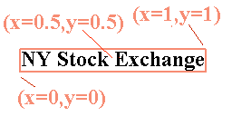

The following examples show how changing the anchor point affects the position of labels:

.. figure:: img/point_x0y0_5.png	

   (0, 0.5) places the label to the right of the label point

.. figure:: img/point_x0_5y0_5.png

   (0.5, 0.5) places the center of the label at the label point

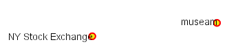

   (1, 0.5) places the label to the left of the label point

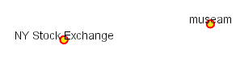

   (0.5, 0) places the label horizontally centered above the label point

Displacement
^^^^^^^^^^^^

Displacement allows fine control of the placement of the label.
The displacement values offset the location of the label 
from the anchor point
by a specified number of pixels.
The element syntax is:

.. code-block:: xml 

   <Displacement>
     <DisplacementX>
        10
     </DisplacementX>
     <DisplacementY>
         0
     </DisplacementY>
   </Displacement>

Examples:

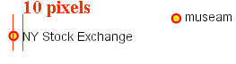
	
*Displacement of X=10 pixels (compare with default anchor point of (X=0, Y=0.5) shown above)*	

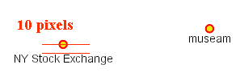

*Displacement of Y=-10 pixels (compare with anchor point (X= 0.5, Y=1.0) - not shown)*

Rotation
^^^^^^^^

The optional ``<Rotation>`` element specifies that labels should be rotated clockwise by a given number of degrees

.. code-block:: xml
  
  <Rotation>
    45
  </Rotation>

The examples below show how the rotation interacts with anchor points and displacements.
  
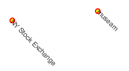

*45 degree rotation* 	

.. figure:: img/rot2.png

*45 degree rotation with anchor point (X=0.5, Y=0.5)*
	
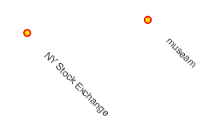
	
*45 degree rotation with 40-pixel X displacement* 	

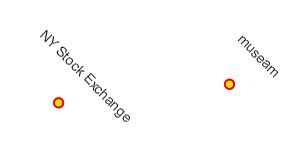

*45 degree rotation with 40-pixel Y displacement with anchor point (X=0.5, Y=0.5)*

LinePlacement
-------------

To label linear features (such as a road or river), the ``<LinePlacement>`` element can be specified. 
This indicates that the styler should determine the best placement and rotation for the labels 
along the lines. 

The standard SLD LinePlacement element provides one optional sub-element, ``<PerpendicularOffset>``.
GeoServer provides much more control over line label placement via vendor-specific options;
see below for details.

PerpendicularOffset
^^^^^^^^^^^^^^^^^^^

The optional ``<PerpendicularOffset>`` element allows you to position a label above or below a line.
(This is similiar to the ``<DisplacementY>`` for label points described above.)
The displacement value is specified in pixels.  
A positive value displaces upwards, a negative value downwards.

.. code-block:: xml 

  <LabelPlacement>
    <LinePlacement>
      <PerpendicularOffset>
         10
      </PerpendicularOffset>	       
    </LinePlacement>
  </LabelPlacement>

Examples:

.. figure:: img/lp_1.png
	
*PerpendicularOffset = 0 (default)*	

.. figure:: img/lp_2.png

*PerpendicularOffset = 10*

Composing labels from multiple attributes
-----------------------------------------

The ``<Label>`` element in `<TextSymbolizer>` allows mixed content.
This means its content can be a mixture of plain text and :ref:`Filter Expressions <sld_reference_parameter_expressions>`. 
The mix gets interepreted as a concatenation.
You can leverage this to create complex labels out of multiple attributes.

For example, if you want both a state name and its abbreviation to appear in a label, you can do the following:

.. code-block:: xml 

  <Label>
    <ogc:PropertyName>STATE_NAME</ogc:PropertyName> (<ogc:PropertyName>STATE_ABBR</ogc:PropertyName>)
  </Label>

and you'll get a label looking like ``Texas (TX)``.

If you need to add extra white space or newline, you'll stumble into an XML oddity.  
The whitespace handling in the Label element is following a XML rule called "collapse", in which all leading and trailing whitespaces have to be removed, whilst all whitespaces (and newlines) in the middle of the xml element are collapsed into a single whitespace.

So, what if you need to insert a newline or a sequence of two or more spaces between your property names? Enter CDATA. CDATA is a special XML section that has to be returned to the interpreter as-is, without following any whitespace handling rule.
So, for example, if you wanted to have the state abbreviation sitting on the next line you'd use the following:

.. code-block:: xml 

  <Label>
    <ogc:PropertyName>STATE_NAME</ogc:PropertyName><![CDATA[
  ]]>(<ogc:PropertyName>STATE_ABBR</ogc:PropertyName>)
  </Label>

GeoServer Enhanced Options
-----------------------------------

GeoServer provides a number of label styling options as extensions to the SLD specification.
Using these options gives more control over how the map looks, 
since the SLD standard isn't expressive enough to provide all the options one might want.

These options are specified as subelements of ``<TextSymbolizer>``.

.. _labeling_priority:

Priority Labeling 
^^^^^^^^^^^^^^^^^

The optional ``<Priority>`` element allows specifying label priority.
This controls how conflicts (overlaps) between labels are resolved during rendering.
The element content may be an :ref:`expression <sld_reference_parameter_expressions>` 
to retrieve or calculate a relative priority value for each feature in a layer.
Alternatively, the content may be a constant value,
to set the priority of a layer's labels relative to other layers on a rendered map.

The default priority for labels is 1000.

.. note:: **Standard SLD Conflict Resolution**

  If the ``<Priority>`` element is not present, or if a group of labels all have the same priority,
  then standard SLD label conflict resolution is used.
  Under this strategy, the label to display out of a group of conflicting labels is chosen essentially at random.

For example, take the following dataset of cities::

   City Name   | population
   ------------+------------
   Yonkers     |     197,818
   Jersey City |     237,681
   Newark      |     280,123
   New York    |   8,107,916

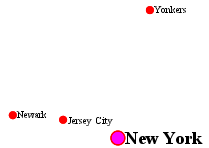

*City locations (large scale map)*

More people know where New York City is than where Jersey City is. 
Thus we want to give the label "New York" priority so it will be visible when in conflict with (overlapping) "Jersey City".
To do this we include the following code in the ``<TextSymbolizer>``:

.. code-block:: xml 

  <Priority>
      <ogc:PropertyName>population</ogc:PropertyName>
  </Priority>
  
This ensures that at small scales New York is labeled in preference to the less populous cities nearby: 

.. figure:: img/priority_some.png
   :align: center

*City locations (small scale map)*
   
Without priority labeling, Jersey City could be labeled in preference to New York, 
making it difficult to interpret the map.
At scales showing many features, 
priority labeling is essential to ensure that larger cities are more visible than smaller cities.

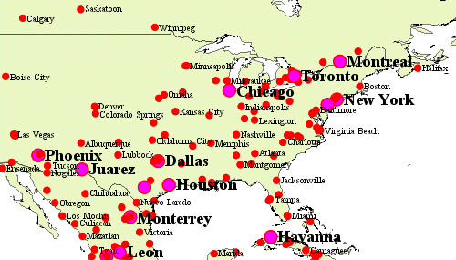

.. _labeling_group:

Grouping Features (group)
^^^^^^^^^^^^^^^^^^^^^^^^^

The ``group`` option allows displaying a single label for multiple features
in a logical group.

.. code-block:: xml
 
  <VendorOption name="group">yes</VendorOption>

Grouping works by collecting all features with the same label text, 
then choosing a representative geometry for the group,
according to the following rules:

.. list-table::
   :widths: 20 80 

   * - **Geometry** 
     - **Label Point**
   * - Point Set
     - The first point inside the view rectangle is used.
   * - Line Set
     - Lines are joined together, clipped to the view rectangle, and the longest path is used.
   * - Polygon Set
     - Polygons are clipped to the view rectangle, and the largest polygon is used.

If desired the labeller can be forced to label every element in a group by specifying the :ref:`labeling_all_group` option.
     
.. warning::  
   Be careful that the labels truly indicate features that should be grouped together. 
   For example, grouping on city name alone might end up creating a group
   containing both *Paris* (France) and *Paris* (Texas).

Road data is a classic example to show why grouping is useful.  
It is usually desirable to display only a single label for all of "Main Street", 
not a label for every block of "Main Street."

When the ``group`` option is off (the default), grouping is not performed and every block feature is labeled 
(subject to label deconfliction):

.. figure:: img/group_not.png
   :align: center

When the ``group`` option is used, geometries with the same label are grouped together 
and the label position is determined from the entire group.
This produces a much less cluttered map:

.. figure:: img/group_yes.png
   :align: center

.. _labeling_all_group:

labelAllGroup
^^^^^^^^^^^^^

The ``labelAllGroup`` option can be used in conjunction with the ``group`` option (see :ref:`labeling_group`).
It causes *all* of the disjoint paths in a line group to be labeled, not just the longest one.

.. code-block:: xml

  <VendorOption name="labelAllGroup">true</VendorOption>

.. _labeling_space_around:

Overlapping and Separating Labels (spaceAround)
^^^^^^^^^^^^^^^^^^^^^^^^^^^^^^^^^^^^^^^^^^^^^^^

By default GeoServer will not render labels "on top of each other". 
By using the ``spaceAround`` option you can either allow labels to overlap,
or add extra space around labels.
The value supplied for the option is a positive or negative size, in pixels.

.. code-block:: xml
 
  <VendorOption name="spaceAround">10</VendorOption>

Using the default value of 0, the bounding box of a label cannot overlap the bounding box of another label:

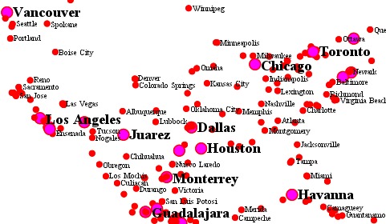

With a negative ``spaceAround`` value, overlapping is allowed:

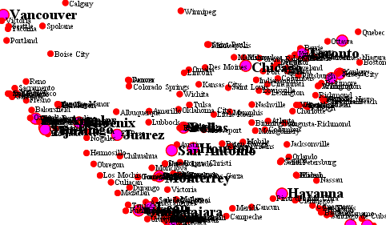

With a positive ``spaceAround`` value of 10, each label is at least 20 pixels apart from others:

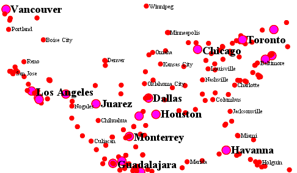

Positive ``spaceAround`` values actually provide twice the space that you might expect. 
This is because you can specify a spaceAround for one label as 5, and for another label (in another TextSymbolizer) as 3. 
The total distance between them is 8. 
Two labels in the first symbolizer ("5") will each be 5 pixels apart from each other, for a total of 10 pixels.

.. note:: **Interaction between values in different TextSymbolizers**

  You can have multiple TextSymbolizers in your SLD file, each with a different ``spaceAround`` option. If all the ``spaceAround`` options are >=0, this will do what you would normally expect. If you have negative values ('allow overlap') then these labels can overlap labels that you've said should not be overlapping. If you don't like this behavior, it's not difficult to change - feel free to submit a patch!

.. _labeling_follow_line:

followLine
^^^^^^^^^^

The ``followLine`` option forces a label to follow the curve of the line. To use this option add the following to the ``<TextSymbolizer>``.

.. note:: **Straight Lines**

  You don't need to use followLine for straight lines. GeoServer will automatically follow the orientation of the line. However in this case ``followLine`` can be used to ensure the text isn't rendered if longer than the line.

.. code-block:: xml
  
  <VendorOption name="followLine">true</VendorOption>  

It is required to use ``<LinePlacement>`` along with this option to ensure that labels are placed along lines:

.. code-block:: xml

  <LabelPlacement>
    <LinePlacement/>
  </LabelPlacement>

.. _labeling_max_displacement:

maxDisplacement
^^^^^^^^^^^^^^^

The ``maxDisplacement`` option controls the displacement of the label along a line, around a point and inside a polygon.

For lines, normally GeoServer labels a line at its center point only. If this label conflicts with another one it may not be displayed at all. When this option is enabled the labeller will attempt to avoid conflic by using an alternate location within **maxDisplacement** pixels along the line from the pre-computed label point.

If used in conjunction with :ref:`labeling_repeat`, the value for ``maxDisplacement`` should always be **lower** than the value for ``repeat``.

For points this causes the renderer to start circling around the point in search of a empty stop to place the label, step by step increasing the size of the circle until the max displacement is reached. The same happens for polygons, around the polygon labelling point (normally the centroid).

.. code-block:: xml

  <VendorOption name="maxDisplacement">10</VendorOption> 

.. _labeling_repeat:

repeat
^^^^^^

The ``repeat`` option determines how often GeoServer displays labels along a line. 
Normally GeoServer labels each line only once, regardless of length. 
Specifying a positive value for this option makes the labeller attempt to draw the label every **repeat** pixels.
For long or complex lines (such as contour lines) this makes labeling more informative.

.. code-block:: xml

  <VendorOption name="repeat">100</VendorOption>

.. _labeling_max_angle_delta:

maxAngleDelta
^^^^^^^^^^^^^

When used in conjunction with :ref:`labeling_follow_line`, the ``maxAngleDelta`` option sets the maximum angle, in degrees, between two subsequent characters in a curved label. Large angles create either visually disconnected words or overlapping characters. It is advised not to use angles larger than 30.

.. code-block:: xml

  <VendorOption name="maxAngleDelta">15</VendorOption>

.. _labeling_autowrap:

autoWrap
^^^^^^^^

The ``autoWrap`` option wraps labels when they exceed the given width (in pixels). 
The size should be wide enough to accommodate the longest word, otherwise single words will be split over multiple lines.

.. code-block:: xml

  <VendorOption name="autoWrap">50</VendorOption>

.. figure:: img/label_autoWrap.png	

*Labeling with autoWrap enabled* 

.. _labeling_force_left_to_right:

forceLeftToRight
^^^^^^^^^^^^^^^^

The renderer tries to draw labels along lines so that the text is upright, for maximum legibility.  
This means a label may not follow the line orientation, but instead may be rotated 180° to display the text the right way up. 
In some cases altering the orientation of the label is not desired; for example, if the label is a directional arrow showing the orientation of the line.

The ``forceLeftToRight`` option can be set to ``false`` to disable label flipping, making the label always follow the inherent orientation of the line being labelled:

.. code-block:: xml

  <VendorOption name="forceLeftToRight">false</VendorOption>

.. _labeling_conflict_resolution:

conflictResolution
^^^^^^^^^^^^^^^^^^

By default labels are subject to **conflict resolution**, meaning the renderer will not allow any label to overlap with a label that has been already drawn. 
Setting the ``conflictResolution`` option to ``false`` causes this label to bypass conflict resolution.
This means the label will be drawn even if it overlaps with other labels, and other labels drawn after it may overlap it.

.. code-block:: xml

  <VendorOption name="conflictResolution">false</VendorOption>

.. _labeling_goodness_of_fit:

goodnessOfFit
^^^^^^^^^^^^^

GeoServer will remove labels if they are a particularly bad fit for the geometry they are labeling.

.. list-table::
   :widths: 30 70 

   * - **Geometry** 
     - **Goodness of Fit Algorithm**
   * - Point
     - Always returns 1.0 since the label is at the point
   * - Line
     - Always returns 1.0 since the label is always placed on the line.
   * - Polygon
     - The label is sampled approximately at every letter. The distance from these points to the polygon is determined and each sample votes based on how close it is to the polygon. (see LabelCacheDefault#goodnessOfFit())

The default value is 0.5, but it can be modified using:

.. code-block:: xml

  <VendorOption name="goodnessOfFit">0.3</VendorOption>
  
polygonAlign
^^^^^^^^^^^^

GeoServer normally tries to place labels horizontally within a polygon, and gives up if the label position is busy or if the label does not fit enough in the polygon. 
This option allows GeoServer to try alternate rotations for the labels.

.. code-block:: xml

  <VendorOption name="polygonAlign">mbr</VendorOption>

.. list-table::
   :widths: 30 70 

   * - **Option** 
     - **Description**
   * - ``manual``
     - The default value. Only a rotation manually specified in the ``<Rotation>`` tag will be used
   * - ``ortho``
     - If the label does not fit horizontally and the polygon is taller than wider then vertical alignment will also be tried
   * - ``mbr``
     - If the label does not fit horizontally the minimum bounding rectangle will be computed and a label aligned to it will be tried out as well
     
     
.. _labeling_graphic_resize:

graphic-resize
^^^^^^^^^^^^^^

When a ``<Graphic>`` is specified for a label by default it is displayed at its native size
and aspect ratio.
The ``graphic-resize`` option instructs the renderer to magnify or stretch the graphic to fully contain the text of the label.
If this option is used the ``graphic-margin`` option may also be specified.

.. code-block:: xml

  <VendorOption name="graphic-resize">stretch</VendorOption>

.. list-table::
   :widths: 30 70 

   * - **Option** 
     - **Description**
   * - ``none``
     - Graphic is displayed at its native size (default)
   * - ``proportional``
     - Graphic size is increased uniformly to contain the label text
   * - ``stretch``
     - Graphic size is increased anisotropically to contain the label text
     
.. cssclass:: no-border

   .. figure:: img/label_graphic-resize_none.png

   .. figure:: img/label_graphic-resize_stretch.png
  
*Labeling with a Graphic Mark "square" - L) at native size; R) with "graphic-resize"=stretch and "graphic-margin"=3* 
     
.. _labeling_graphic_margin:

graphic-margin
^^^^^^^^^^^^^^

The ``graphic-margin`` options specifies a margin (in pixels) to use around the label text 
when the ``graphic-resize`` option is specified.

.. code-block:: xml

  <VendorOption name="graphic-margin">margin</VendorOption>

partials
^^^^^^^^

The ``partials`` options instructs the renderer to render labels that cross the map extent, which
are normally not painted since there is no guarantee that a map put on the side of the current one
(tiled rendering) will contain the other half of the label. By enabling "partials" the style editor
takes responsibility for the other half being there (maybe because the label points have been
placed by hand and are assured not to conflict with each other, at all zoom levels).

.. code-block:: xml

  <VendorOption name="partials">true</VendorOption>

.. _labeling_underline_text:

underlineText
^^^^^^^^^^^^^

The ``underlineText`` option instruct the renderer to underline labels. The underline will work like a typical word processor text underline. The thickness and position of the underline will be defined by the font and color will be the same as the text. Spaces will also be underlined.

.. code-block:: xml

  <VendorOption name="underlineText">true</VendorOption>

Some underlines examples:

.. figure:: img/label_underlines.png
   :align: center

.. _labeling_strikethrough_text:

strikethroughText
^^^^^^^^^^^^^^^^^

The ``strikethroughText`` option instruct the renderer to strikethrough labels. The strikethrough will work like a typical word processor text strikethrough. The thickness and position of the line will be defined by the font and color will be the same as the text. Spaces will also be stroken.

.. code-block:: xml

  <VendorOption name="strikethroughText">true</VendorOption>

Some strikethrough examples:

.. figure:: img/label_strikethrough.png
   :align: center
 
charSpacing
^^^^^^^^^^^

The ``charSpacing`` option controls the amount of space between characters, a positive value increases it, a negative value shrinks it (and will eventually make characters overlap).
The value is specified in pixels. 

.. code-block:: xml

  <VendorOption name="charSpacing">3</VendorOption>

Example of adding 3 extra pixels of space between chars on road names:

.. figure:: img/charSpacing.png
   :align: center

wordSpacing
^^^^^^^^^^^

The ``wordSpacing`` option controls the amount of space between words, for this option only positive values (or zero) are accepted.
The value is specified in pixels. 

.. code-block:: xml

  <VendorOption name="wordSpacing">5</VendorOption>

Example of adding 5 extra pixels of space between words on road names:

.. figure:: img/wordSpacing.png
   :align: center
   
displacementMode
^^^^^^^^^^^^^^^^
Comma separated list of label displacement directions for point/polygon labels (used along with maxDisplacement). 
The indicated directions will be tried in turn. 
Valid values are cardinal directions abbreviations, in particular, ``N, W, E, S, NW, NE, SW, SE``.

The following example sets the typical "diagonal displacement" typically used for points: 

.. code-block:: xml

  <VendorOption name="displacementMode">NE, NW, SW, SE</VendorOption>

While this one allows displacement only in the vertical direction:

.. code-block:: xml

  <VendorOption name="displacementMode">N, S</VendorOption>
