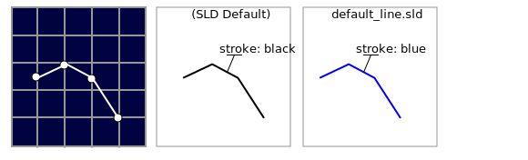
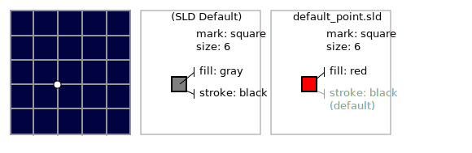

Style
=====

The design choices made to represent content is a key aspect of cartography. The style used when rendering data into a visualisation is the result of these choices.

The Open Geospatial Consortium standard for recording style is divided into two parts:

* **Symbology Encoding (SE)**: Records a "feature type style" documenting how individual features are drawn using a series of rules.
* **Style Layer Descriptor (SLD)**: Records which "feature type styles" may be used with a layer.

The **Symbology Encoding** standard provides the terms we will be using to describe style:

* **Stroke**: borders and outlines of shapes
* **Fill**: interior of shapes

Line symbolizer
---------------

A line symbolizer documents how individual strokes are used to draw a line string, including color and line width.
  

    
The SLD specification provides a default **stroke** used when drawing line strings. These values for color and width will be used if needed.
    
.. code-block:: xml

   <LineSymbolizer>
     <Stroke/>
   </LineSymbolizer>

GeoServer includes a default :file:`line.sld` file providing a blue stroke. This file is used when you initially set up a linestring layer.

From GeoServer's **line.sld** style:

.. code-block:: xml

   <LineSymbolizer>
     <Stroke>
       <CssParameter name="stroke">#0000FF</CssParameter>
     </Stroke>
   </LineSymbolizer>
  
Polygon symbolizer
------------------

A polygon symbolizer documents both the the stroke in addition to the fill used to draw a polygon. A fill can consist of a color, pattern, or other texture:
  
The SLD specification provides a default gray fill, but does not supply a stroke. These values will be used if you do not provide an alternative.
  
.. image:: img/PolygonSymbolizer.svg

GeoServer includes a default :file:`polygon.sld` file providing a gray fill and a black outline. This file will be used when you initially create a polygon layer.

From GeoServer's **polygon.sld** style:

.. code-block:: xml

   <PolygonSymbolizer>
     <Fill>
       <CssParameter name="fill">#AAAAAA</CssParameter>
     </Fill>
     <Stroke>
       <CssParameter name="stroke">#000000</CssParameter>
       <CssParameter name="stroke-width">1</CssParameter>
     </Stroke>
   </PolygonSymbolizer>

Point symbolizer
----------------

A point symbolizer documents the "mark" used to represent a point. A mark may be defined by a glyph (icon) or a common mark (circle, square, etc.). The point symbolizer records the stroke and fill used to draw the mark.
  

 
From GeoServer's default **point.sld** style:

.. code-block:: xml

   <PointSymbolizer>
     <Graphic>
       <Mark>
         <WellKnownName>square</WellKnownName>
         <Fill>
           <CssParameter name="fill">#FF0000</CssParameter>
         </Fill>
       </Mark>
       <Size>6</Size>
     </Graphic>
   </PointSymbolizer>
  
Text symbolizer
---------------

A text symbolizer provides details on how labels are to be drawn, including font, size, and color information.
  
.. image:: img/TextSymbolizer.svg

From the :file:`populated_places.sld` style:

.. code-block:: xml
  
     <sld:TextSymbolizer>
         <sld:Label>
             <ogc:PropertyName>NAME</ogc:PropertyName>
         </sld:Label>
         <sld:Font>
             <sld:CssParameter name="font-family">Arial</sld:CssParameter>
             <sld:CssParameter name="font-size">10.0</sld:CssParameter>
             <sld:CssParameter name="font-style">normal</sld:CssParameter>
             <sld:CssParameter name="font-weight">bold</sld:CssParameter>
         </sld:Font>
         <sld:Halo>
             <sld:Radius>1</sld:Radius>
             <sld:Fill>
                 <sld:CssParameter name="fill">#FFFFFF</sld:CssParameter>
             </sld:Fill>
         </sld:Halo>
         <sld:Fill>
             <sld:CssParameter name="fill">#000000</sld:CssParameter>
         </sld:Fill>
     </sld:TextSymbolizer>
                 
.. note::

   The **Style Layer Descriptor** standard makes use of the **Filter Encoding** specification to create small expressions as shown above to access the **NAME** of each city::
     
     <ogc:PropertyName>NAME</ogc:PropertyName>
  
   This same approach can be used to dynamically generate any values needed for styling.
  
Raster symbolizer
-----------------

A raster symbolizer provides a mapping from raster values to colors displayed. This can be provided by a color table, function, or directly mapping bands of data to use for the display channels.
  
From GeoServer's :file:`dem.sld` style:

.. code-block:: xml

    <RasterSymbolizer>
      <Opacity>1.0</Opacity>
      <ColorMap>
        <ColorMapEntry color="#000000" quantity="-500" label="nodata" opacity="0.0" />
        <ColorMapEntry color="#AAFFAA" quantity="0" label="values" />
        <ColorMapEntry color="#00FF00" quantity="1000"/>
        <ColorMapEntry color="#FFFF00" quantity="1200" label="values" />
        <ColorMapEntry color="#FF7F00" quantity="1400" label="values" />
        <ColorMapEntry color="#BF7F3F" quantity="1600" label="values" />
        <ColorMapEntry color="#000000" quantity="2000" label="values" />
      </ColorMap>
    </RasterSymbolizer>
