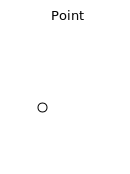

.. _styling_workshop_mbstyle_point:

Points
======

The next stop of the mbstyle styling tour is the representation of points. 

Review of point symbology:

* Points are used to represent a location only, and do not form a shape. The visual width of lines do not change depending on scale.

* SLD uses a **PointSymbolizer** record how the shape of a line is drawn.

* Labeling of points is anchored to the point location.

As points have no inherent shape of of their own, emphasis is placed on marking locations with an appropriate symbol.

Reference:

* :ref:`MBStyle Reference <mbstyle_reference>`
* `MapBox Style Spec Symbol Layer <https://www.mapbox.com/mapbox-gl-js/style-spec/#layers-symbol>`_
* `MapBox Style Spec Circle Layer <https://www.mapbox.com/mapbox-gl-js/style-spec/#layers-circle>`_
* :ref:`Point <sld_reference_pointsymbolizer>` (User Manual | SLD Reference )

This exercise makes use of the ``ne:populated_places`` layer.

#. Navigate to the **Styles** page.

#. Click :guilabel:`Add a new style` and choose the following:

   .. list-table:: 
      :widths: 30 70
      :header-rows: 0

      * - Name:
        - :kbd:`point_example`
      * - Workspace:
        - :kbd:`No workspace`
      * - Format:
        - :kbd:`MBStyle`

#. Replace the initial MBStyle definition with the following and click :guilabel:`apply`:

   .. code-block:: json

      {
        "version": 8,
        "name": "point_example",
        "sprite": "http://localhost:8080/geoserver/styles/sprites"
        "layers": [
          {
            "id": "point_example",
            "type": "symbol",
            "source-layer": "ne:populated_places",
            "layout": {
              "icon-image": "grey_circle",
            }
          }
        ]
      }

#. And use the :guilabel:`Layer Preview` tab to preview the result.

   .. image:: ../style/img/point_03_map.png

Sprite
------

The **symbol** layer controls the display of point data. Points are typically represented with an **icon-image**.

MBStyle uses a spritesheet defined at the top-level of the style to define a set of icons. You can view the names of all the icons in the spritesheet by looking at its json definition, at `http://localhost:8080/geoserver/styles/sprites.json <http://localhost:8080/geoserver/styles/sprites.json>`_.

#. Change the symbol used by the style to a square:

   .. code-block:: json
   
      {
        "version": 8,
        "name": "point_example",
        "sprite": "http://localhost:8080/geoserver/styles/sprites"
        "layers": [
          {
            "id": "point_example",
            "type": "symbol",
            "source-layer": "ne:populated_places",
            "layout": {
              "icon-image": "grey_square16",
            }
          }
        ]
      }

#. Map Preview:

   .. image:: ../style/img/point_mark_1.png

#. Before we continue we will use a selector to cut down the amount of data shown to a reasonable level.

   .. code-block:: json
   
      {
        "version": 8,
        "name": "point_example",
        "sprite": "http://localhost:8080/geoserver/styles/sprites"
        "layers": [
          {
            "id": "point_example",
            "type": "symbol",
            "source-layer": "ne:populated_places",
            "filter": ["<", "SCALERANK", 1],
            "layout": {
              "icon-image": "grey_square16",
            }
          }
        ]
      }

#. Resulting in a considerably cleaner image:
   
   .. image:: ../style/img/point_mark_2.png

#. Additional properties are available to control an icon's presentation:

   The **icon-size** property is used to control symbol size.

   The **icon-rotate** property controls orientation, accepting input in degrees.
   
   Trying these two settings together:

   .. code-block:: json

      {
        "version": 8,
        "name": "point_example",
        "sprite": "http://localhost:8080/geoserver/styles/sprites"
        "layers": [
          {
            "id": "point_example",
            "type": "symbol",
            "source-layer": "ne:populated_places",
            "filter": ["<", "SCALERANK", 1],
            "layout": {
              "icon-image": "grey_square16",
              "icon-size": 0.75,
              "icon-rotate": 45
            }
          }
        ]
      }

#. Results in each location being marked with a diamond:
   
   .. image:: ../style/img/point_mark_3.png

Circle
------

Another way of displaying point data is using the **circle** layer. Rather than rendering an icon from a preset sprite sheet, the circle layer lets us chose size and color for a simple circle.

#. Modify the style to render a grey circle using the **circle** layer:

   .. code-block:: json

      {
        "version": 8,
        "name": "point_example",
        "layers": [
          {
            "id": "point_example",
            "type": "circle",
            "source-layer": "ne:populated_places",
            "paint": {
              "circle-color": "gray",
              "circle-radius": 8
              "circle-stroke-color": "black",
              "circle-stroke-width": 1
            }
          }
        ]
      }

#. And use the :guilabel:`Layer Preview` tab to preview the result.

   .. image:: ../style/img/point_03_map.png

Label
-----

Labeling is now familiar from our experience with LineString and Polygons.

.. image:: ../style/img/Point_Label.svg

The **symbol** layer with the **label** property are used to to label Point Locations.

#. Replace ``point_example`` with the following:

   .. code-block:: json

      {
        "version": 8,
        "name": "point_example",
        "layers": [
           {
            "id": "point_circle",
            "type": "circle",
            "source-layer": "ne:populated_places",
            "paint": {
              "circle-color": "gray",
              "circle-radius": 8
              "circle-stroke-color": "black",
              "circle-stroke-width": 1
            }
          },
          {
            "id": "point_label",
            "source-layer": "ne:populated_places",
            "filter": ["<", "SCALERANK", 1],
            "type": "symbol",
            "layout": {
              "text-field": "{NAME}" 
            },
            "paint": {
              "text-color": "gray" 
            }
          }
        ]
      }

#. Confirm the result in ``Map`` preview.

   .. image:: ../style/img/point_label_1.png

#. Each label is drawn starting from the provided point - which is unfortunate as it assures each label will overlap with the symbol used. To fix this limitation we will make use of the MBStyle controls for label placement:

   **text-anchor** provides a value expressing how a label is aligned with respect to the starting label position.

   **text-translate** is used to provide an initial displacement using and x and y offset. For points this offset is recommended to adjust the label position away for the area used by the symbol.
   
   .. note::
   
      The property **text-anchor** defines an anchor position relative to the bounding box formed by the resulting label.  This anchor position is snapped to the label position generated by the point location and displacement offset.

#. Using these two facilities together we can center our labels below the symbol, taking care that the displacement used provides an offset just outside the area required for the symbol size.

   .. code-block:: json

      {
        "version": 8,
        "name": "point_example",
        "layers": [
          {
            "id": "point_circle",
            "type": "circle",
            "source-layer": "ne:populated_places",
            "paint": {
              "circle-color": "gray",
              "circle-radius": 8
              "circle-stroke-color": "black",
              "circle-stroke-width": 1
            }
          },
          {
            "id": "point_label",
            "source-layer": "ne:populated_places",
            "filter": ["<", "SCALERANK", 1],
            "type": "symbol",
            "layout": {
              "text-field": "{NAME}",
              "text-anchor": "top"
            },
            "paint": {
              "text-color": "black",
              "text-translate": [0, 12]
            }
          }
        ]
      }

#. Each label is now placed under the mark.
   
   .. image:: ../style/img/point_label_2.png

#. One remaining issue is the overlap between labels and symbols.
   
   MBStyle provides various parameters to control label rendering and conflict resolution, preventing labels from overlapping any symbols.

   **icon-allow-overlap** and **text-allow-overlap** allows the rendering engine to draw the indicated symbol atop previous labels and icons.

   **icon-ignore-placement** and **text-ignore-placement** allows the rendering engine to draw labels and icons over top of the indicated symbol.
   
   **icon-padding** and **text-padding**  tells the rendering engine to provide a minimum distance between the icons and text on the map, ensuring they do not overlap with other labels or icons.

   The **-allow-overlap** and **-ignore-placement** parameters are false by default, which is the behavior we want. Update our example to use **text-padding**:

   .. code-block:: json

      {
        "version": 8,
        "name": "point_example",
        "layers": [
          {
            "id": "point_circle",
            "type": "circle",
            "source-layer": "ne:populated_places",
            "paint": {
              "circle-color": "gray",
              "circle-radius": 8
              "circle-stroke-color": "black",
              "circle-stroke-width": 1
            }
          },
          {
            "id": "point_label",
            "source-layer": "ne:populated_places",
            "filter": ["<", "SCALERANK", 1],
            "type": "symbol",
            "layout": {
              "text-field": "{NAME}",
              "text-anchor": "top",
              "text-padding": 2
            },
            "paint": {
              "text-color": "black",
              "text-translate": [0, 12]
            }
          }
        ]
      }

#. Resulting in a considerably cleaner image:

   .. image:: ../style/img/point_label_3.png

Dynamic Styling
---------------

#. We will quickly use **minzoom** and **maxzoom** to select content based on SCALERANK selectors.

   .. code-block:: json

      {
        "version": 8,
        "name": "point_example",
        "layers": [
          {
            "id": "point_7",
            "type": "circle",
            "source-layer": "ne:populated_places",
            "filter": ["<", "SCALERANK", 7],
            "minzoom": 6,
            "maxzoom": 7,
            "paint": {
              "circle-color": "gray",
              "circle-radius": 8
              "circle-stroke-color": "black",
              "circle-stroke-width": 1
            }
          },
          {
            "id": "point_5",
            "type": "circle",
            "source-layer": "ne:populated_places",
            "filter": ["<", "SCALERANK", 5],
            "minzoom": 5,
            "maxzoom": 6,
            "paint": {
              "circle-color": "gray",
              "circle-radius": 8
              "circle-stroke-color": "black",
              "circle-stroke-width": 1
            }
          },
          {
            "id": "point_4",
            "type": "circle",
            "source-layer": "ne:populated_places",
            "filter": ["<", "SCALERANK", 4],
            "minzoom": 4,
            "maxzoom": 5,
            "paint": {
              "circle-color": "gray",
              "circle-radius": 8
              "circle-stroke-color": "black",
              "circle-stroke-width": 1
            }
          },
          {
            "id": "point_3",
            "type": "circle",
            "source-layer": "ne:populated_places",
            "filter": ["<", "SCALERANK", 3],
            "minzoom": 3,
            "maxzoom": 4,
            "paint": {
              "circle-color": "gray",
              "circle-radius": 8
              "circle-stroke-color": "black",
              "circle-stroke-width": 1
            }
          },
          {
            "id": "point_2",
            "type": "circle",
            "source-layer": "ne:populated_places",
            "filter": ["<", "SCALERANK", 2],
            "minzoom": 2,
            "maxzoom": 3,
            "paint": {
              "circle-color": "gray",
              "circle-radius": 8
              "circle-stroke-color": "black",
              "circle-stroke-width": 1
            }
          },
          {
            "id": "point_1",
            "type": "circle",
            "source-layer": "ne:populated_places",
            "filter": ["<", "SCALERANK", 1],
            "maxzoom": 2,
            "paint": {
              "circle-color": "gray",
              "circle-radius": 8
              "circle-stroke-color": "black",
              "circle-stroke-width": 1
            }
          },
          {
            "id": "point_0",
            "type": "circle",
            "source-layer": "ne:populated_places",
            "minzoom": 7,
            "paint": {
              "circle-color": "gray",
              "circle-radius": 8
              "circle-stroke-color": "black",
              "circle-stroke-width": 1
            }
          }
        ]
      }

#. Click :guilabel:`Submit` to update the :guilabel:`Map` after each step.

   .. image:: ../style/img/point_04_scale.png

#. To add labeling we can add a symbol layer for each of the existing circle layers.

   .. code-block:: json

     {
        "version": 8,
        "name": "point_example",
        "layers": [
          {
            "id": "point_7",
            "type": "circle",
            "source-layer": "ne:populated_places",
            "filter": ["<", "SCALERANK", 7],
            "minzoom": 6,
            "maxzoom": 7,
            "paint": {
              "circle-color": "gray",
              "circle-radius": 8
              "circle-stroke-color": "black",
              "circle-stroke-width": 1
            }
          },
          {
            "id": "point_7_text",
            "type": "symbol",
            "source-layer": "ne:populated_places",
            "filter": ["<", "SCALERANK", 7],
            "minzoom": 6,
            "maxzoom": 7,
            "layout": {
              "text-field": "{NAME}",
              "text-font": ["Arial"],
              "text-size": 10
            },
            "paint": {
              "text-color": "black"
            }
          },
          {
            "id": "point_5",
            "type": "circle",
            "source-layer": "ne:populated_places",
            "filter": ["<", "SCALERANK", 5],
            "minzoom": 5,
            "maxzoom": 6,
            "paint": {
              "circle-color": "gray",
              "circle-radius": 8
              "circle-stroke-color": "black",
              "circle-stroke-width": 1
            }
          },
          {
            "id": "point_5_text",
            "type": "symbol",
            "source-layer": "ne:populated_places",
            "filter": ["<", "SCALERANK", 5],
            "minzoom": 5,
            "maxzoom": 6,
            "layout": {
              "text-field": "{NAME}",
              "text-font": ["Arial"],
              "text-size": 10
            },
            "paint": {
              "text-color": "black"
            }
          },
          {
            "id": "point_4",
            "type": "circle",
            "source-layer": "ne:populated_places",
            "filter": ["<", "SCALERANK", 4],
            "minzoom": 4,
            "maxzoom": 5,
            "paint": {
              "circle-color": "gray",
              "circle-radius": 8
              "circle-stroke-color": "black",
              "circle-stroke-width": 1
            }
          },
          {
            "id": "point_4_text",
            "type": "symbol",
            "source-layer": "ne:populated_places",
            "filter": ["<", "SCALERANK", 4],
            "minzoom": 4,
            "maxzoom": 5,
            "layout": {
              "text-field": "{NAME}",
              "text-font": ["Arial"],
              "text-size": 10
            },
            "paint": {
              "text-color": "black"
            }
          },
          {
            "id": "point_3",
            "type": "circle",
            "source-layer": "ne:populated_places",
            "filter": ["<", "SCALERANK", 3],
            "minzoom": 3,
            "maxzoom": 4,
            "paint": {
              "circle-color": "gray",
              "circle-radius": 8
              "circle-stroke-color": "black",
              "circle-stroke-width": 1
            }
          },
          {
            "id": "point_3_text",
            "type": "symbol",
            "source-layer": "ne:populated_places",
            "filter": ["<", "SCALERANK", 3],
            "minzoom": 3,
            "maxzoom": 4,
            "layout": {
              "text-field": "{NAME}",
              "text-font": ["Arial"],
              "text-size": 10
            },
            "paint": {
              "text-color": "black"
            }
          },
          {
            "id": "point_2",
            "type": "circle",
            "source-layer": "ne:populated_places",
            "filter": ["<", "SCALERANK", 2],
            "minzoom": 2,
            "maxzoom": 3,
            "paint": {
              "circle-color": "gray",
              "circle-radius": 8
              "circle-stroke-color": "black",
              "circle-stroke-width": 1
            }
          },
          {
            "id": "point_2_text",
            "type": "symbol",
            "source-layer": "ne:populated_places",
            "filter": ["<", "SCALERANK", 2],
            "minzoom": 2,
            "maxzoom": 3,
            "layout": {
              "text-field": "{NAME}",
              "text-font": ["Arial"],
              "text-size": 10
            },
            "paint": {
              "text-color": "black"
            }
          },
          {
            "id": "point_1",
            "type": "circle",
            "source-layer": "ne:populated_places",
            "filter": ["<", "SCALERANK", 1],
            "maxzoom": 2,
            "paint": {
              "circle-color": "gray",
              "circle-radius": 8
              "circle-stroke-color": "black",
              "circle-stroke-width": 1
            }
          },
          {
            "id": "point_1_text",
            "type": "symbol",
            "source-layer": "ne:populated_places",
            "filter": ["<", "SCALERANK", 1],
            "maxzoom": 2,
            "layout": {
              "text-field": "{NAME}",
              "text-font": ["Arial"],
              "text-size": 10
            },
            "paint": {
              "text-color": "black"
            }
          },
          {
            "id": "point_0",
            "type": "circle",
            "source-layer": "ne:populated_places",
            "minzoom": 7,
            "paint": {
              "circle-color": "gray",
              "circle-radius": 8
              "circle-stroke-color": "black",
              "circle-stroke-width": 1
            }
          },
          {
            "id": "point_0_text",
            "type": "symbol",
            "source-layer": "ne:populated_places",
            "minzoom": 7,
            "layout": {
              "text-field": "{NAME}",
              "text-font": ["Arial"],
              "text-size": 10
            },
            "paint": {
              "text-color": "black"
            }
          }
        ]
      }

   
   .. image:: ../style/img/point_05_label.png

#. We will use **text-offset** to position the label above each symbol, and **text-padding** to give some extra space around our labels.

   Add the following line to each layer:

   .. code-block:: json
      :emphasize-lines: 10, 14
      
      {
        "id": "point_example",
        "type": "symbol",
        "source-layer": "ne:populated_places",
        "minzoom": 7,
        "layout": {
          "text-field": "{NAME}",
          "text-font": ["Arial"],
          "text-size": 10,
          "text-padding": 2
        },
        "paint": {
          "text-color": "black",
          "text-translate": [0, -12]
        }
      }

   .. image:: ../style/img/point_06_relocate.png

#. Now that we have clearly labeled our cities, zoom into an area you are familiar with and we can look at changing symbology on a case-by-case basis.

   We have used expressions previous to generate an appropriate label. Expressions can also be used for many other property settings.

   The ``ne:populated_places`` layer provides several attributes specifically to make styling easier:

   * **SCALERANK**: we have already used this attribute to control the level of detail displayed

   * **FEATURECLA**: used to indicate different types of cities. We will check for :kbd:`Admin-0 capital` cities.

   The first thing we will do is calculate the point **size** using a quick expression::
   
      {
        "property": "SCALERANK",
        "type": "exponential",
        "stops": [
          [0, 4.5],
          [10, 2.5]
        ]
      },

   This expression should result in sizes between 5 and 9 and will need to be applied to both point **size** and label **displacement**.
   
   .. code-block:: json
      :emphasize-lines: 8-15

      {
        "id": "point_0",
        "type": "circle",
        "source-layer": "ne:populated_places",
        "minzoom": 7,
        "paint": {
          "circle-color": "gray",
          "circle-radius": {
            "property": "SCALERANK",
            "type": "exponential",
            "stops": [
              [0, 4.5],
              [10, 2.5]
            ]
          },
          "circle-stroke-color": "black",
          "circle-stroke-width": 1
        }
      }

   .. code-block:: json
      :emphasize-lines: 14-21

      {
        "id": "point_0_text",
        "type": "symbol",
        "source-layer": "ne:populated_places",
        "minzoom": 7,
        "layout": {
          "text-field": "{NAME}",
          "text-font": ["Arial"],
          "text-size": 10,
          "text-padding": 2
        },
        "paint": {
          "text-color": "black",
          "text-translate": {
            "property": "SCALERANK",
            "type": "exponential",
            "stops": [
              [0, [0, -8]],
              [10, [0, -6]]
            ]
          },
        }
      }

   .. image:: ../style/img/point_07_expression.png

#. Next we can use ``FEATURECLA`` to check for capital cities.

   Adding a selector for capital cities at the top of the **rules** list:

   .. code-block:: json

      {
        "id": "point_capital",
        "type": "symbol",
        "source-layer": "ne:populated_places",
        "filter": ["all",["<", "SCALERANK", 2], ["==", "FEATURECLA", "Admin-0 capital"]]
        "minzoom": 2,
        "layout": {
          "icon-image": "star",
          "text-field": "{NAME}",
          "text-font": ["Arial"],
          "text-size": 10,
          "text-padding": 2
        },
        "paint": {
          "text-color": "black",
          "text-translate": [0, -12]
        }
      }

   Also add the spritesheet url to the top of the style if it is not present:

   .. code-block:: json
      :emphasize-lines: 4

      {
        "version": 8,
        "name": "point_example",
        "sprite": "http://localhost:8080/geoserver/styles/sprites",
      }

   And updating the populated places selectors to ignore capital cities:

   .. code-block:: json

      {
        "id": "point_7",
        "type": "circle",
        "source-layer": "ne:populated_places",
        "filter": ["all", ["<", "SCALERANK", 7], ["!=", "FEATURECLA", "Admin-0 capital"]],
        "minzoom": 6,
        "maxzoom": 7,
        "paint": {
          "circle-color": "gray",
          "circle-radius": {
            "property": "SCALERANK",
            "type": "exponential",
            "stops": [
              [0, 4.5],
              [10, 2.5]
            ]
          },
          "circle-stroke-color": "black",
          "circle-stroke-width": 1
        }
      }

   .. code-block:: json

      {
        "id": "point_7_text",
        "type": "symbol",
        "source-layer": "ne:populated_places",
        "filter": ["all", ["<", "SCALERANK", 7], ["!=", "FEATURECLA", "Admin-0 capital"]],
        "minzoom": 6,
        "maxzoom": 7,
        "layout": {
          "text-field": "{NAME}",
          "text-font": ["Arial"],
          "text-size": 10,
          "text-padding": 2
        },
        "paint": {
          "text-color": "black",
          "text-translate": {
            "property": "SCALERANK",
            "type": "exponential",
            "stops": [
              [0, [0, -8]],
              [10, [0, -6]]
            ]
          }
        }
      }

   .. code-block:: json

      {
        "id": "point_5",
        "type": "circle",
        "source-layer": "ne:populated_places",
        "filter": ["all", ["<", "SCALERANK", 5], ["!=", "FEATURECLA", "Admin-0 capital"]],
        "minzoom": 5,
        "maxzoom": 6,
        "paint": {
          "circle-color": "gray",
          "circle-radius": {
            "property": "SCALERANK",
            "type": "exponential",
            "stops": [
              [0, 4.5],
              [10, 2.5]
            ]
          },
          "circle-stroke-color": "black",
          "circle-stroke-width": 1
        }
      }

   .. code-block:: json

      {
        "id": "point_5_text",
        "type": "symbol",
        "source-layer": "ne:populated_places",
        "filter": ["all", ["<", "SCALERANK", 5], ["!=", "FEATURECLA", "Admin-0 capital"]],
        "minzoom": 5,
        "maxzoom": 6,
        "layout": {
          "text-field": "{NAME}",
          "text-font": ["Arial"],
          "text-size": 10,
          "text-padding": 2
        },
        "paint": {
          "text-color": "black",
          "text-translate": {
            "property": "SCALERANK",
            "type": "exponential",
            "stops": [
              [0, [0, -8]],
              [10, [0, -6]]
            ]
          }
        }
      }

   .. code-block:: json

      {
        "id": "point_4",
        "type": "circle",
        "source-layer": "ne:populated_places",
        "filter": ["all", ["<", "SCALERANK", 4], ["!=", "FEATURECLA", "Admin-0 capital"]],
        "minzoom": 4,
        "maxzoom": 5,
        "paint": {
          "circle-color": "gray",
          "circle-radius": {
            "property": "SCALERANK",
            "type": "exponential",
            "stops": [
              [0, 4.5],
              [10, 2.5]
            ]
          },
          "circle-stroke-color": "black",
          "circle-stroke-width": 1
        }
      }

   .. code-block:: json

      {
        "id": "point_4_text",
        "type": "symbol",
        "source-layer": "ne:populated_places",
        "filter": ["all", ["<", "SCALERANK", 4], ["!=", "FEATURECLA", "Admin-0 capital"]],
        "minzoom": 4,
        "maxzoom": 5,
        "layout": {
          "text-field": "{NAME}",
          "text-font": ["Arial"],
          "text-size": 10,
          "text-padding": 2
        },
        "paint": {
          "text-color": "black",
          "text-translate": {
            "property": "SCALERANK",
            "type": "exponential",
            "stops": [
              [0, [0, -8]],
              [10, [0, -6]]
            ]
          }
        }
      }

   .. code-block:: json

      {
        "id": "point_3",
        "type": "circle",
        "source-layer": "ne:populated_places",
        "filter": ["all", ["<", "SCALERANK", 3], ["!=", "FEATURECLA", "Admin-0 capital"]],
        "minzoom": 3,
        "maxzoom": 4,
        "paint": {
          "circle-color": "gray",
          "circle-radius": 8
          "circle-stroke-color": "black",
          "circle-stroke-width": 1
        }
      }

   .. code-block:: json

      {
        "id": "point_3_text",
        "type": "symbol",
        "source-layer": "ne:populated_places",
        "filter": ["all", ["<", "SCALERANK", 3], ["!=", "FEATURECLA", "Admin-0 capital"]],
        "minzoom": 3,
        "maxzoom": 4,
        "layout": {
          "text-field": "{NAME}",
          "text-font": ["Arial"],
          "text-size": 10,
          "text-padding": 2
        },
        "paint": {
          "text-color": "black",
          "text-translate": {
            "property": "SCALERANK",
            "type": "exponential",
            "stops": [
              [0, [0, -8]],
              [10, [0, -6]]
            ]
          }
        }
      }

   .. code-block:: json

      {
        "id": "point_2",
        "type": "circle",
        "source-layer": "ne:populated_places",
        "filter": ["all", ["<", "SCALERANK", 2], ["!=", "FEATURECLA", "Admin-0 capital"]],
        "minzoom": 2,
        "maxzoom": 3,
        "paint": {
          "circle-color": "gray",
          "circle-radius": {
            "property": "SCALERANK",
            "type": "exponential",
            "stops": [
              [0, 4.5],
              [10, 2.5]
            ]
          },
          "circle-stroke-color": "black",
          "circle-stroke-width": 1
        }
      }

   .. code-block:: json

      {
        "id": "point_2_text",
        "type": "symbol",
        "source-layer": "ne:populated_places",
        "filter": ["all", ["<", "SCALERANK", 2], ["!=", "FEATURECLA", "Admin-0 capital"]],
        "minzoom": 2,
        "maxzoom": 3,
        "layout": {
          "text-field": "{NAME}",
          "text-font": ["Arial"],
          "text-size": 10,
          "text-padding": 2
        },
        "paint": {
          "text-color": "black",
          "text-translate": {
            "property": "SCALERANK",
            "type": "exponential",
            "stops": [
              [0, [0, -8]],
              [10, [0, -6]]
            ]
          }
        }
      }

   .. code-block:: json

      {
        "id": "point_1",
        "type": "circle",
        "source-layer": "ne:populated_places",
        "filter": ["<", "SCALERANK", 1],
        "maxzoom": 2,
        "paint": {
          "circle-color": "gray",
          "circle-radius": {
            "property": "SCALERANK",
            "type": "exponential",
            "stops": [
              [0, 4.5],
              [10, 2.5]
            ]
          },
          "circle-stroke-color": "black",
          "circle-stroke-width": 1
        }
      }

   .. code-block:: json

      {
        "id": "point_1_text",
        "type": "symbol",
        "source-layer": "ne:populated_places",
        "filter": ["<", "SCALERANK", 1],
        "maxzoom": 2,
        "layout": {
          "text-field": "{NAME}",
          "text-font": ["Arial"],
          "text-size": 10,
          "text-padding": 2
        },
        "paint": {
          "text-color": "black",
          "text-translate": {
            "property": "SCALERANK",
            "type": "exponential",
            "stops": [
              [0, [0, -8]],
              [10, [0, -6]]
            ]
          }
        }
      }

   .. code-block:: json

      {
        "id": "point_0",
        "type": "circle",
        "source-layer": "ne:populated_places",
        "filter": ["!=", "FEATURECLA", "Admin-0 capital"],
        "minzoom": 7,
        "paint": {
          "circle-color": "gray",
          "circle-radius": {
            "property": "SCALERANK",
            "type": "exponential",
            "stops": [
              [0, 4.5],
              [10, 2.5]
            ]
          },
          "circle-stroke-color": "black",
          "circle-stroke-width": 1
        }
      }

   .. code-block:: json

      {
        "id": "point_0_text",
        "type": "symbol",
        "source-layer": "ne:populated_places",
        "filter": ["!=", "FEATURECLA", "Admin-0 capital"],
        "minzoom": 7,
        "layout": {
          "text-field": "{NAME}",
          "text-font": ["Arial"],
          "text-size": 10,
          "text-padding": 2
        },
        "paint": {
          "text-color": "black",
          "text-translate": {
            "property": "SCALERANK",
            "type": "exponential",
            "stops": [
              [0, [0, -8]],
              [10, [0, -6]]
            ]
          }
        }
      }

   .. image:: ../style/img/point_09_fill.png

#. If you would like to check your work the final file is here: :download:`point_example.mbstyle <../files/point_example.json>`

Bonus
-----

.. only:: instructor

   .. admonition:: Instructor Notes 

      The exercise section does not review the examples above, instead it explores the use of: 

      * rules using min/max scale and rules using attribute filters
      * recode to map from attribute to symbol
      * interpolate to change size by population

.. _mbstyle.point.q1:

Challenge Geometry Location
^^^^^^^^^^^^^^^^^^^^^^^^^^^
   
.. only:: instructor
  
   .. admonition:: Instructor Notes 

      As usual Explore invites readers to reapply the material covered in a slightly different context or dataset.
 
      The use of filters using the roads **type** attribute provides this opportunity.

#. The **mark** property can be used to render any geometry content.

#. **Challenge:** Try this yourself by rendering a polygon layer using a **mark** property. 

   .. note:: Answer :ref:`discussed <mbstyle.point.a1>` at the end of the workbook.

.. _mbstyle.point.q2:

Explore Dynamic Symbolization
^^^^^^^^^^^^^^^^^^^^^^^^^^^^^

#. We went to a lot of work to set up selectors to choose between star and circle for capital cities.

   This approach is straightforward when applied in isolation:

    .. code-block:: json

       {
         "version": 8,
         "name": "point_example",
         "sprite": "http://localhost:8080/geoserver/styles/sprites",
         "layers": [
           {
             "id": "point_capital",
             "type": "symbol",
             "source-layer": "ne:populated_places",
             "filter": ["==", "FEATURECLA", "Admin-0 capital"]
             "minzoom": 2,
             "layout": {
               "icon-image": "star",
             }
           },
           {
             "id": "point_0",
             "type": "circle",
             "source-layer": "ne:populated_places",
             "filter": ["!=", "FEATURECLA", "Admin-0 capital"],
             "minzoom": 7,
             "paint": {
               "circle-color": "gray",
               "circle-radius": 4,
               "circle-stroke-color": "black",
               "circle-stroke-width": 1
             }
           }
         ]
       }

   When combined with checking another attribute, or checking @scale as in our example, this approach can quickly lead to many rules which can be difficult to keep straight.

#. Taking a closer look, ``icon-image`` is expressed using a string:

    .. code-block:: json

       {
         "id": "point_capital",
         "type": "symbol",
         "source-layer": "ne:populated_places",
         "filter": ["==", "FEATURECLA", "Admin-0 capital"]
         "minzoom": 2,
         "layout": {
           "icon-image": "star",
         }
       }

   
   Which is represented in SLD as:
   
   .. code-block:: xml
   
      <sld:PointSymbolizer uom="http://www.opengeospatial.org/se/units/pixel">
        <sld:Graphic>
          <sld:ExternalGraphic>
            <sld:OnlineResource xmlns:xlink="http://www.w3.org/1999/xlink" xlink:type="simple" xlink:href="http://localhost:8080/geoserver/styles/sprites#icon=${strURLEncode('star')}&size=${strURLEncode(1.0)}"/>
            <sld:Format>mbsprite</sld:Format>
          </sld:ExternalGraphic>
        </sld:Graphic>
      </sld:PointSymbolizer>

#. MBStyle provides an opportunity for dynamic symbolization.

   This is accomplished by using a function for the value of the **icon-image**:

    .. code-block:: json
       :emphasize-lines: 11-18

       {
         "version": 8,
         "name": "point_example",
         "sprite": "http://localhost:8080/geoserver/styles/sprites",
         "layers": [
           {
             "id": "point_capital",
             "type": "symbol",
             "source-layer": "ne:populated_places",
             "layout": {
               "icon-image": {
                 "type": "categorical",
                 "property": "FEATURECLA",
                 "default": "grey_circle",
                 "stops": [
                   ["Admin-0 capital", "star"]
                 ]
               }
             }
           }
         ]
       }
      
   Which is represented in SLD as:
   
   .. code-block:: xml
   
       <sld:PointSymbolizer uom="http://www.opengeospatial.org/se/units/pixel">
         <sld:Graphic>
           <sld:ExternalGraphic>
             <sld:OnlineResource xmlns:xlink="http://www.w3.org/1999/xlink" xlink:type="simple" xlink:href="http://localhost:8080/geoserver/styles/sprites#icon=${strURLEncode(DefaultIfNull(Recode(FEATURECLA,'Admin-0 capital','star'),'grey_circle'))}&size=${strURLEncode(1.0)}"/>
             <sld:Format>mbsprite</sld:Format>
           </sld:ExternalGraphic>
         </sld:Graphic>
       </sld:PointSymbolizer>
   
#. **Challenge:** Use this approach to rewrite the *Dynamic Styling* example.

   .. note:: Answer :ref:`provided <mbstyle.point.a2>` at the end of the workbook.

.. hide:

   #. Challenge: Use the **Interpolate** function to smoothly change the mark **size** based on city population.

