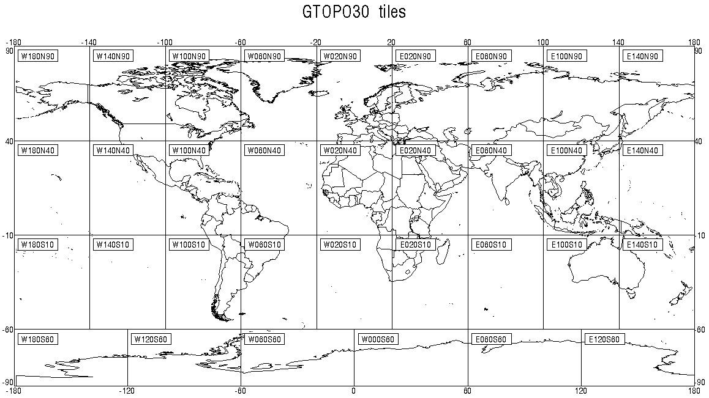

Course Data
===========

Natural Earth
-------------

The Natural Earth dataset is a free collection of vector and raster data published by the North American Cartographic Information Society to encourage mapping.

For this course we will be using the `Natural Earth <http://www.naturalearthdata.com/>`_ cultural and physical vector layers backed by a raster shaded relief dataset ( `vector <http://kelso.it/x/nequickstart>`_
| `raster <http://www.naturalearthdata.com/http//www.naturalearthdata.com/download/10m/raster/NE1_HR_LC_SR_W_DR.zip>`_).
  
.. figure:: img/natural_earth.png
   
   Natural Earth
   
The quickstart Natural Earth styling has been exported from QGIS and cleaned up in uDig for use in GeoServer.

Digital Elevation Model
-----------------------

A digital elevation model records height information for visualisation and analysis. We are using a dataset derived from the USGS GTOPO30 dataset.

   
   Digital Elevation Model

The GeoServer "dem" styling has been used for this dataset.

Configuration
-------------

.. note::
   
   In a classroom setting GeoServer has been preconfigured with the appropriate data directory.

To set up GeoServer yourself:

#. Use the **Importer** to add and publish - 
   
   the following TIF Coverage Stores:
   
   * dem/W100N40.TIF
   * ne/ne1/NE1_HR_LC_SR.tif
   
   the following directories of shape files:
 
   * ne/ne1/physical   
   * ne/ne1/cultural

   .. image:: img/stores.png
   
#. Cleaning up the published vector layers:
   
   * Layer names have been shortened for publication - the :file:`ne_10m_admin_1_states_provinces_lines_ship.shp` is published  named ``states_provinces_shp``
   * Use ``EPSG:4326`` as the spatial reference system
   * Appropriate SLD styles have been provided (from the uDig project)

   .. image:: img/cultural.png

#. To clean up the published raster layers:

   * The NE1 GeoTiff is styled with the default ``raster`` style
   * The usgs:dem GeoTiff is styled with the default ``DEM`` style
   
   .. image:: img/raster.png

   
#. Optional: create a ``basemap`` group layer consisting of:
   
   .. image:: img/group.png
   
   This offers a combined layer, forming a cohesive base map.
   
   .. image:: img/basemap.png