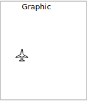

.. _styling_workshop_point:

Points
======

The next stop of the ysld styling tour is the representation of points.

.. figure:: ../style/img/PointSymbology.svg

Review of point symbology:

* Points are used to represent a location only, and do not form a shape. The visual width of lines do not change depending on scale.

* SLD uses a **PointSymbolizer** record how the shape of a line is drawn.

* Labeling of points is anchored to the point location.

As points have no inherent shape of of their own, emphasis is placed on marking locations with an appropriate symbol.

Reference:

* :ref:`YSLD Reference <ysld_reference>`
* :ref:`YSLD Reference Point symbolizer <ysld_reference_symbolizers_point>` (User Manual | YSLD Reference)
* :ref:`Point <sld_reference_pointsymbolizer>` (User Manual | SLD Reference )

This exercise makes use of the ``ne:populated_places`` layer.

#. Navigate to the **Styles** page.

#. Click :guilabel:`Add a new style` and choose the following:

   .. list-table::
      :widths: 30 70
      :header-rows: 0

      * - Name:
        - :kbd:`point_example`
      * - Workspace:
        - :kbd:`No workspace`
      * - Format:
        - :kbd:`YSLD`

#. Choose :guilabel:`point` from the ``Generate a default style`` dropdown and click :guilabel:`generate`.

#. Replace the initial YSLD definition with the following and click :guilabel:`apply`:

   .. code-block:: yaml

      symbolizers:
      - point:
          symbols:
          - mark:
              shape: circle
              stroke-width: 1

#. And use the :guilabel:`Layer Preview` tab to preview the result.

   .. image:: ../style/img/point_03_map.png

Mark
----

The **point** symbolizer controls the display of point data. Points are represented with the mandatory property **mark**.

.. figure:: ../style/img/PointSymbology.svg

The SLD standard provides "well-known" symbols for use with point symbology: ``circle``, ``square``, ``triangle``, ``arrow``, ``cross``, ``star``, and ``x``.

#. Change the symbol used by the style to a square:

   .. code-block:: yaml
      :emphasize-lines: 5

      symbolizers:
      - point:
          symbols:
          - mark:
              shape: square
              stroke-width: 1

#. Map Preview:

   .. image:: ../style/img/point_mark_1.png

#. Before we continue we will use a filter to cut down the amount of data shown to a reasonable level.

   .. code-block:: yaml
      :emphasize-lines: 1,2,3

      rules:
      - filter: ${SCALERANK < '1'}
        scale: [min, max]
        symbolizers:
        - point:
            symbols:
            - mark:
                shape: square
                stroke-width: 1

.. note:: **symbolizers** has been indented under **rules**

#. Resulting in a considerably cleaner image:

   .. image:: ../style/img/point_mark_2.png

#. Additional properties are available to control a mark's presentation:

   The **size** property is used to control symbol size.

   The **rotation** property controls orientation, accepting input in degrees.

   Trying these two settings together:

   .. code-block:: yaml
      :emphasize-lines: 6,7

      rules:
      - filter: ${SCALERANK < '1'}
        scale: [min, max]
        symbolizers:
        - point:
            size: 8
            rotation: 45.0
            symbols:
            - mark:
                shape: square
                stroke-width: 1

#. Results in each location being marked with a diamond:

   .. image:: ../style/img/point_mark_3.png

#. The **mark** property provides parameters to style the point symbol. Let's change the **fill-color** to gray.

   .. code-block:: yaml
      :emphasize-lines: 13

      rules:
      - filter: ${SCALERANK < '1'}
        scale: [min, max]
        symbolizers:
        - point:
            size: 8
            rotation: 45.0
            symbols:
            - mark:
                shape: square
                stroke-color: 'black'
                stroke-width: 1
                fill-color: 'gray'

#. Updating the mark to a gray square with a black outline.

   .. image:: ../style/img/point_mark_4.png

#. You can add more symbolizers to apply additional point styles.

   Using this approach marks can be composed of multiple symbols, each with its own settings:

   .. code-block:: yaml
      :emphasize-lines: 6,12,13,14,15,16,17,18,19,20,21

      rules:
      - filter: ${SCALERANK < '1'}
        scale: [min, max]
        symbolizers:
        - point:
            size: 16
            symbols:
            - mark:
                shape: square
                stroke-color: 'black'
                stroke-width: 1
                fill-color: 'red'
        - point:
            size: 14
            rotation: 45.0
            symbols:
            - mark:
                shape: cross
                stroke-color: 'white'
                stroke-width: 1
                fill-color: 'black'

#. Producing an interesting compound symbol effect:

   .. image:: ../style/img/point_mark_5.png

Graphic
-------

Symbols can also be supplied by an external graphic,

This technique was shown with the initial :file:`airport.svg` YSLD example.

#. To use an external graphic two pieces of information are required.

   **url** property is defined with a **url** reference to image.

   **format** property is used to tell the rendering engine what file format to expect

   This technique is used to reference files placed in the styles directory.

   .. code-block:: yaml

      rules:
      - filter: ${SCALERANK < '1'}
        scale: [min, max]
        symbolizers:
        - point:
            symbols:
            - external:
                url: file:/path/to/geoserver/data_dir/styles/port.svg
                format: image/svg

#. Drawing the provided shape in each location:

   .. image:: ../style/img/point_graphic_1.png

#. The property **url** reference can also be used to reference external images. We can make use of the GeoServer logo.

   .. code-block:: yaml
      :emphasize-lines: 6,9

      rules:
      - filter: ${SCALERANK < '1'}
        scale: [min, max]
        symbolizers:
        - point:
            size: 16
            symbols:
            - external:
                url: http://localhost:8080/geoserver/web/wicket/resource/org.geoserver.web.GeoServerBasePage/img/logo.png
                format: image/png

#. As shown in the map preview.

   .. image:: ../style/img/point_graphic_2.png

Label
-----

Labeling is now familiar from our experience with LineString and Polygons.

.. image:: ../style/img/Point_Label.svg

The **text** symbolizer with the **label** property are required to label Point Locations.

#. Replace ``point_example`` with the following:

   .. code-block:: yaml

      rules:
      - filter: ${SCALERANK < '1'}
        scale: [min, max]
        symbolizers:
        - point:
            symbols:
            - mark:
                shape: circle
                stroke-color: 'black'
                stroke-width: 1
                fill-color: 'gray'
        - text:
            label: ${NAME}
            fill-color: 'gray'
            placement: point

#. Confirm the result in ``Layer Preview`` preview.

   .. image:: ../style/img/point_label_1.png

#. Each label is drawn starting from the provided point - which is unfortunate as it assures each label will overlap with the symbol used. To fix this limitation we will make use of the YSLD controls for label placement:

   **anchor** provides two values expressing how a label is aligned with respect to the starting label position.

   **displacement** is be used to provide an initial displacement using and x and y offset. For points this offset is recommended to adjust the label position away for the area used by the symbol.

   .. note::

      The property **anchor** defines an anchor position relative to the bounding box formed by the resulting label.  This anchor position is snapped to the label position generated by the point location and displacement offset.

   Using these two facilities together we can center our labels below the symbol, taking care that the displacement used provides an offset just outside the area required for the symbol size.

   .. code-block:: yaml
      :emphasize-lines: 6,15,17,18

      rules:
      - filter: ${SCALERANK < '1'}
        scale: [min, max]
        symbolizers:
        - point:
            size: 10
            symbols:
            - mark:
                shape: circle
                stroke-color: 'black'
                stroke-width: 1
                fill-color: 'gray'
        - text:
            label: ${NAME}
            fill-color: 'black'
            placement: point
            anchor: [0.5, 1.0]
            displacement: [0, -12]

#. Each label is now placed under the mark.

   .. image:: ../style/img/point_label_2.png

#. One remaining issue is the overlap between labels and symbols.

   GeoServer provides a vendor specific parameter to allow symbols to take part in label conflict resolution, preventing labels from overlapping any symbols. This severely limits the area available for labeling and is best used in conjunction with a large maximum displacement vendor option.

   **x-labelObstacle** vendor parameter asks the rendering engine to avoid drawing labels over top of the indicated symbol. This applies to the point symbolizer.

   **x-maxDisplacement** vendor parameter provides the rendering engine a maximum distance it is allowed to move labels during conflict resolution. This applies to the text symbolizer.

   **x-spaceAround** vendor parameter tells the rendering engine to provide a minimum distance between the labels on the map, ensuring they do not overlap. This applies to the text symbolizer.

   Update our example to use these settings:

   .. code-block:: yaml
      :emphasize-lines: 13,20,21

      rules:
      - filter: ${SCALERANK < '1'}
        scale: [min, max]
        symbolizers:
        - point:
            size: 10
            symbols:
            - mark:
                shape: circle
                stroke-color: 'black'
                stroke-width: 1
                fill-color: 'gray'
            x-labelObstacle: true
        - text:
            label: ${NAME}
            fill-color: 'black'
            placement: point
            anchor: [0.5, 1.0]
            displacement: [0, -12]
            x-maxDisplacement: 100
            x-spaceAround: 2

#. Resulting in a considerably cleaner image:

   .. image:: ../style/img/point_label_3.png

Dynamic Styling
---------------

#. We will quickly use **scalerank** to select content based on @scale filters.

   .. code-block:: yaml

      define: &point
        size: 6
        symbols:
        - mark:
            shape: circle
            stroke-color: 'black'
            stroke-width: 1
            fill-color: 'gray'
      rules:
      - filter: ${SCALERANK < '7'}
        scale: ['4000000.0', '8000000.0']
        symbolizers:
        - point:
            <<: *point
      - filter: ${SCALERANK < '5'}
        scale: ['8000000.0', '1.7E7']
        symbolizers:
        - point:
            <<: *point
      - filter: ${SCALERANK < '4'}
        scale: ['1.7E7', '3.5E7']
        symbolizers:
        - point:
            <<: *point
      - filter: ${SCALERANK < '3'}
        scale: ['3.5E7', '7.0E7']
        symbolizers:
        - point:
            <<: *point
      - filter: ${SCALERANK < '2'}
        scale: ['7.0E7', '1.4E8']
        symbolizers:
        - point:
            <<: *point
      - filter: ${SCALERANK < '1'}
        scale: ['1.4E8', max]
        symbolizers:
        - point:
            <<: *point
      - scale: [min, '4000000.0']
        symbolizers:
        - point:
            <<: *point

#. Click :guilabel:`Apply` to update the :guilabel:`Layer Preview` after each step.

   .. image:: ../style/img/point_04_scale.png

   .. note:: This YSLD makes use of a **define** to avoid repeating the point symbolizer content multiple times. As an example the :kbd:`scale: [min, '4000000.0']` rule, combined with the :kbd:`define:` results in the following collection of properties:

     .. code-block:: yaml

        - scale: [min, '4000000.0']
          symbolizers:
          - point:
              size: 6
              symbols:
              - mark:
                  shape: circle
                  stroke-color: 'black'
                  stroke-width: 1
                  fill-color: 'gray'

#. To add labeling we must use both a point and text symbolizer in each scale filter.

   .. code-block:: yaml

      define: &point
        size: 6
        symbols:
        - mark:
            shape: circle
            stroke-color: 'black'
            stroke-width: 1
            fill-color: 'gray'
      define: &label
        label: ${NAME}
        fill-color: 'black'
        font-family: Arial
        font-size: 10
        font-style: normal
        font-weight: normal
        placement: point
      rules:
      - filter: ${SCALERANK < '7'}
        scale: ['4000000.0', '8000000.0']
        symbolizers:
        - point:
            <<: *point
        - text:
            <<: *label
      - filter: ${SCALERANK < '5'}
        scale: ['8000000.0', '1.7E7']
        symbolizers:
        - point:
            <<: *point
        - text:
            <<: *label
      - filter: ${SCALERANK < '4'}
        scale: ['1.7E7', '3.5E7']
        symbolizers:
        - point:
            <<: *point
        - text:
            <<: *label
      - filter: ${SCALERANK < '3'}
        scale: ['3.5E7', '7.0E7']
        symbolizers:
        - point:
            <<: *point
        - text:
            <<: *label
      - filter: ${SCALERANK < '2'}
        scale: ['7.0E7', '1.4E8']
        symbolizers:
        - point:
            <<: *point
        - text:
            <<: *label
      - filter: ${SCALERANK < '1'}
        scale: ['1.4E8', max]
        symbolizers:
        - point:
            <<: *point
        - text:
            <<: *label
      - scale: [min, '4000000.0']
        symbolizers:
        - point:
            <<: *point
        - text:
            <<: *label

   .. image:: ../style/img/point_05_label.png

#. We will use **displacement** and **anchor** to position the label above each symbol.

   Add the following two lines to the :kbd:`label` define:

   .. code-block:: yaml
      :emphasize-lines: 9,10

      define: &label
        label: ${NAME}
        fill-color: 'black'
        font-family: Arial
        font-size: 10
        font-style: normal
        font-weight: normal
        placement: point
        anchor: [0.5, 0]
        displacement: [0, 6]

   .. image:: ../style/img/point_05_align.png

#. A little bit of work with vendor specific parameters will prevent our labels from colliding with each symbol, while giving the rendering engine some flexibility in how far it is allowed to relocate a label.

   Add the following vendor options to the :kbd:`label` define:

   .. code-block:: yaml
      :emphasize-lines: 11,12

      define: &label
        label: ${NAME}
        fill-color: 'black'
        font-family: Arial
        font-size: 10
        font-style: normal
        font-weight: normal
        placement: point
        anchor: [0.5, 0]
        displacement: [0, 6]
        x-maxDisplacement: 90
        x-spaceAround: 2

   Add the following vendor option to the :kbd:`point` define:

   .. code-block:: yaml
      :emphasize-lines: 9

      define: &point
        size: 6
        symbols:
        - mark:
            shape: circle
            stroke-color: 'black'
            stroke-width: 1
            fill-color: 'gray'
        x-labelObstacle: true

   .. image:: ../style/img/point_06_relocate.png

#. Now that we have clearly labeled our cities, zoom into an area you are familiar with and we can look at changing symbology on a case-by-case basis.

   We have used expressions previous to generate an appropriate label. Expressions can also be used for many other property settings.

   The ``ne:populated_places`` layer provides several attributes specifically to make styling easier:

   * **SCALERANK**: we have already used this attribute to control the level of detail displayed

   * **LABELRANK**: hint used for conflict resolution, allowing important cities such as capitals to be labeled even when they are close to a larger neighbor.

   * **FEATURECLA**: used to indicate different types of cities. We will check for :kbd:`Admin-0 capital` cities.

   The first thing we will do is calculate the point **size** using a quick expression::

      ${10-(SCALERANK/2)}

   This expression should result in sizes between 5 and 9 and will need to be applied to both point **size** and label **displacement**.

   Rather than the "first come first served" default to resolve labeling conflicts we can manually provide GeoServer with a label priority. The expression provided is calculated for each label, in the event of a conflict the label with the highest priority takes precedence.

   The LABELRANK attribute goes from 1 through 10 and needs to be flipped around before use as a GeoServer label priority::

      ${10 - LABELRANK}

   This expression will result in values between 0 and 10 and will be used for the **priority**.

   .. code-block:: yaml
      :emphasize-lines: 2,19,20

      define: &point
        size: ${10-(SCALERANK/2)}
        symbols:
        - mark:
            shape: circle
            stroke-color: 'black'
            stroke-width: 1
            fill-color: 'gray'
        x-labelObstacle: true
      define: &label
        label: ${NAME}
        fill-color: 'black'
        font-family: Arial
        font-size: 10
        font-style: normal
        font-weight: normal
        placement: point
        anchor: [0.5, 0]
        displacement: [0, '${''10'' - SCALERANK / ''2''}']
        priority: ${'10' - LABELRANK}
        x-maxDisplacement: 90
        x-spaceAround: 2

   .. image:: ../style/img/point_07_expression.png

#. Next we can use ``FEATURECLA`` to check for capital cities.

   Adding a filter for capital cities at the top of the **rules** list:

   .. code-block:: yaml

      - filter: ${SCALERANK < '2' AND FEATURECLA = 'Admin-0 capital'}
        scale: ['7.0E7', max]
        name: capitals
        symbolizers:
        - point:
            symbols:
            - mark:
                shape: star
                stroke-color: 'black'
                stroke-width: 1
                fill-color: 'gray'
        - text:
            label: ${NAME}
            fill-color: 'gray'
            placement: point
      - filter: ${FEATURECLA = 'Admin-0 capital'}
        scale: [min, '7.0E7']
        name: capitals
        symbolizers:
        - point:
            symbols:
            - mark:
                shape: star
                stroke-color: 'black'
                stroke-width: 1
                fill-color: 'gray'
        - text:
            label: ${NAME}
            fill-color: 'gray'
            placement: point

   And updating the populated places filters to ignore capital cities:

   .. code-block:: yaml

      - filter: ${SCALERANK < '7' AND FEATURECLA <> 'Admin-0 capital'}
        scale: ['4000000.0', '8000000.0']
        symbolizers:
        - point:
            <<: *point
        - text:
            <<: *label
      - filter: ${SCALERANK < '5' AND FEATURECLA <> 'Admin-0 capital'}
        scale: ['8000000.0', '1.7E7']
        symbolizers:
        - point:
            <<: *point
        - text:
            <<: *label
      - filter: ${SCALERANK < '4' AND FEATURECLA <> 'Admin-0 capital'}
        scale: ['1.7E7', '3.5E7']
        symbolizers:
        - point:
            <<: *point
        - text:
            <<: *label
      - filter: ${SCALERANK < '3' AND FEATURECLA <> 'Admin-0 capital'}
        scale: ['3.5E7', '7.0E7']
        symbolizers:
        - point:
            <<: *point
        - text:
            <<: *label
      - filter: ${SCALERANK < '2' AND FEATURECLA <> 'Admin-0 capital'}
        scale: ['7.0E7', '1.4E8']
        symbolizers:
        - point:
            <<: *point
        - text:
            <<: *label
      - filter: ${SCALERANK < '1' AND FEATURECLA <> 'Admin-0 capital'}
        scale: ['1.4E8', max]
        symbolizers:
        - point:
            <<: *point
        - text:
            <<: *label
      - scale: [min, '4000000.0']
        symbolizers:
        - point:
            <<: *point
        - text:
            <<: *label

   .. image:: ../style/img/point_09_fill.png

#. If you would like to check your work the final file is here: :download:`point_example.ysld <../files/point_example.ysld>`

Bonus
-----

.. only:: instructor

   .. admonition:: Instructor Notes

      The exercise section does not review the examples above, instead it explores the use of:

      * rules using min/max scale and rules using attribute filters
      * recode to map from attribute to symbol
      * interpolate to change size by population

.. _ysld.point.q1:

Challenge Geometry Location
^^^^^^^^^^^^^^^^^^^^^^^^^^^

.. only:: instructor

   .. admonition:: Instructor Notes

      As usual Explore invites readers to reapply the material covered in a slightly different context or dataset.

      The use of filters using the roads **type** attribute provides this opportunity.

#. The **mark** property can be used to render any geometry content.

#. **Challenge:** Try this yourself by rendering a polygon layer using a **mark** property.

   .. note:: Answer :ref:`discussed <ysld.point.a1>` at the end of the workbook.

.. _ysld.point.q2:

Explore Dynamic Symbolization
^^^^^^^^^^^^^^^^^^^^^^^^^^^^^

#. We went to a lot of work to set up filters to choose between star and circle for capital cities.

   This approach is straightforward when applied in isolation:

    .. code-block:: yaml

       rules:
       - filter: ${FEATURECLA = 'Admin-0 capital'}
         scale: [min, max]
         symbolizers:
         - point:
             symbols:
             - mark:
                 shape: star
                 stroke-color: 'black'
                 stroke-width: 1
                 fill-color: 'gray'
       - filter: ${FEATURECLA <> 'Admin-0 capital'}
         scale: [min, max]
         symbolizers:
         - point:
             symbols:
             - mark:
                 shape: circle
                 stroke-color: 'black'
                 stroke-width: 1
                 fill-color: 'gray'

   When combined with checking another attribute, or checking @scale as in our example, this approach can quickly lead to many rules which can be difficult to keep straight.

#. Taking a closer look, ``shape`` can actually be expressed using a string:

    .. code-block:: yaml

       rules:
       - filter: ${FEATURECLA = 'Admin-0 capital'}
         scale: [min, max]
         symbolizers:
         - point:
             symbols:
             - mark:
                 shape: 'star'
                 stroke-color: 'black'
                 stroke-width: 1
                 fill-color: 'gray'

   Which is represented in SLD as:

   .. code-block:: xml

       <sld:PointSymbolizer>
         <sld:Graphic>
            <sld:Mark>
               <sld:WellKnownName>star</sld:WellKnownName>
               <sld:Fill/>
               <sld:Stroke/>
            </sld:Mark>
         </sld:Graphic>
      </sld:PointSymbolizer>

#. GeoServer recognizes this limitation of SLD Mark and ExternalGraphic and provides an opportunity for dynamic symbolization.

   This is accomplished by embedding a small CQL expression in the string passed to symbol or url. This sub-expression is isolated with :kbd:`${ }` as shown:

    .. code-block:: yaml

       - point:
           symbols:
           - mark:
               shape: ${if_then_else(equalTo(FEATURECLA,'Admin-0 capital'),'star','circle')}

   Which is represented in SLD as:

   .. code-block:: xml

       <sld:PointSymbolizer>
         <sld:Graphic>
            <sld:Mark>
               <sld:WellKnownName>${if_then_else(equalTo(FEATURECLA,'Admin-0 capital'),'star','circle')}</sld:WellKnownName>
               <sld:Fill/>
               <sld:Stroke/>
            </sld:Mark>
         </sld:Graphic>
      </sld:PointSymbolizer>

#. **Challenge:** Use this approach to rewrite the *Dynamic Styling* example.

   .. note:: Answer :ref:`provided <ysld.point.a2>` at the end of the workbook.

.. hide:

   #. Challenge: Use the **Interpolate** function to smoothly change the mark **size** based on city population.

.. _ysld.point.q3:

Challenge Layer Group
^^^^^^^^^^^^^^^^^^^^^

#. Use a **Layer Group** to explore how symbology works together to form a map.

   * ne:NE1
   * ne:states_provincces_shp
   * ne:populated_places

#. To help start things out here is a style for ``ne:states_provinces_shp``:

    .. code-block:: yaml

       symbolizers:
       - polygon:
           stroke-color: 'black'
           stroke-width: 0.25
           stroke-opacity: 0.5
           fill-color: 'white'
           fill-opacity: 0.05
       - polygon:
           stroke-color: 'black'
           stroke-width: 0.25
           stroke-opacity: 0.5
           fill-color: ${Recode(mapcolor9,'1','#8dd3c7','2','#ffffb3','3','#bebada','4','#fb8072','5','#80b1d3','6','#fdb462','7','#b3de69','8','#fccde5','9','#d9d9d9')}
           fill-opacity: 0.5

#. This background is relatively busy and care must be taken to ensure both symbols and labels are clearly visible.

#. **Challenge:** Do your best to style populated_places over this busy background.

   Here is an example with labels for inspiration:

   .. image:: ../style/img/point_challenge_1.png

   .. note:: Answer :ref:`provided <ysld.point.a3>` at the end of the workbook.

Explore True Type Fonts
^^^^^^^^^^^^^^^^^^^^^^^

#. In addition to image formats GeoServer can make use other kinds of graphics, such as True Type fonts:

   .. code-block:: yaml

       symbolizers:
       - point:
           symbols:
           - mark:
               shape: ttf://Webdings#0x0064
               stroke-color: 'blue'
               stroke-width: 1

#. Additional fonts dropped in the :file:`styles` directory are available for use.

Explore Custom Graphics
^^^^^^^^^^^^^^^^^^^^^^^

#. The GeoServer rendering engine allows Java developers to hook in additional symbol support.

   This facility is used by GeoServer to offer the shapes used for pattern fills. Community extensions allow the use of simple custom shapes and even charts.

#. Support has been added for custom graphics using the WKT Geometry representation.

    .. code-block:: yaml

       symbolizers:
       - point:
           symbols:
           - mark:
               shape: wkt://MULTILINESTRING((-0.25 -0.25, -0.125 -0.25), (0.125 -0.25, 0.25 -0.25), (-0.25 0.25, -0.125 0.25), (0.125 0.25, 0.25 0.25))
               stroke-color: 'blue'
               stroke-width: 1
