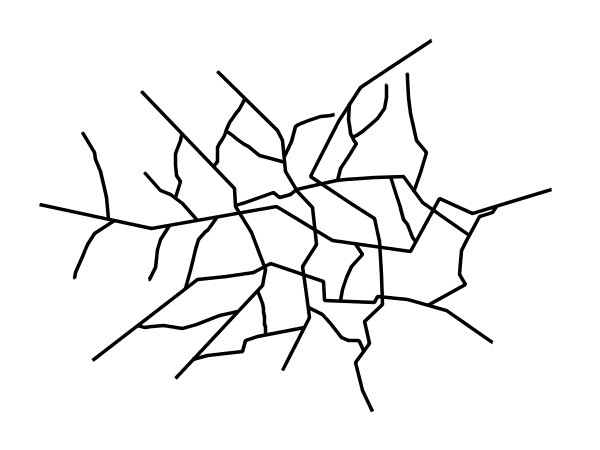
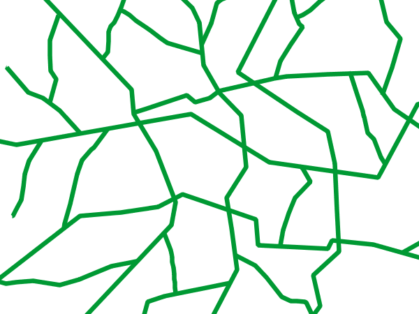
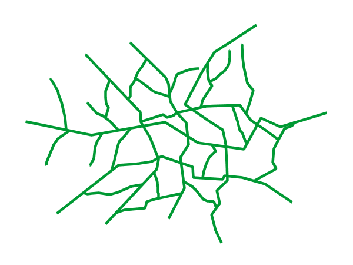

.. _ysld_cookbook.lines:

Lines
=====

While lines can also seem to be simple shapes, having length but no width, there are many options and tricks for making
lines display nicely.

.. _ysld_cookbook_lines_attributes:

Example lines layer
-------------------

The :download:`lines layer <artifacts/ysld_cookbook_line.zip>` used in the examples below contains road information for a
fictional country. For reference, the attribute table for the points in this layer is included below.

.. list-table::
   :widths: 30 40 30
   :header-rows: 1

   * - ``fid`` (Feature ID)
     - ``name`` (Road name)
     - ``type`` (Road class)
   * - line.1
     - Latway
     - highway
   * - line.2
     - Crescent Avenue
     - secondary
   * - line.3
     - Forest Avenue
     - secondary
   * - line.4
     - Longway
     - highway
   * - line.5
     - Saxer Avenue
     - secondary
   * - line.6
     - Ridge Avenue
     - secondary
   * - line.7
     - Holly Lane
     - local-road
   * - line.8
     - Mulberry Street
     - local-road
   * - line.9
     - Nathan Lane
     - local-road
   * - line.10
     - Central Street
     - local-road
   * - line.11
     - Lois Lane
     - local-road
   * - line.12
     - Rocky Road
     - local-road
   * - line.13
     - Fleet Street
     - local-road
   * - line.14
     - Diane Court
     - local-road
   * - line.15
     - Cedar Trail
     - local-road
   * - line.16
     - Victory Road
     - local-road
   * - line.17
     - Highland Road
     - local-road
   * - line.18
     - Easy Street
     - local-road
   * - line.19
     - Hill Street
     - local-road
   * - line.20
     - Country Road
     - local-road
   * - line.21
     - Main Street
     - local-road
   * - line.22
     - Jani Lane
     - local-road
   * - line.23
     - Shinbone Alley
     - local-road
   * - line.24
     - State Street
     - local-road
   * - line.25
     - River Road
     - local-road

:download:`Download the lines shapefile <artifacts/ysld_cookbook_line.zip>`

.. _ysld_cookbook_lines_simpleline:

Simple line
-----------

This example specifies lines be colored black with a thickness of 3 pixels.

   Simple line

Code
~~~~

:download:`Download the "Simple line" YSLD <artifacts/line_simpleline.ysld>`

.. code-block:: yaml
  :linenos:

  title: 'YSLD Cook Book: Simple Line'
  feature-styles:
  - name: name
    rules:
    - symbolizers:
      - line:
          stroke-color: '#000000'
          stroke-width: 3

Details
~~~~~~~

There is one rule in one feature style for this YSLD, which is the simplest possible situation. (All
subsequent examples will contain one rule and one feature style unless otherwise specified.)  Styling
lines is accomplished via the line symbolizer (**lines 5-8**). **Line 7** specifies the color of the line to be
black (``'#000000'``), while **line 8** specifies the width of the lines to be 3 pixels.

Line with border
----------------

This example shows how to draw lines with borders (sometimes called "cased lines").
In this case the lines are drawn with a 3 pixel blue center and a 1 pixel wide gray border.

.. figure:: ../../sld/cookbook/images/line_linewithborder.png

   Line with border

Code
~~~~

:download:`Download the "Line with border" YSLD <artifacts/line_linewithborder.ysld>`

.. code-block:: yaml
  :linenos:

  title: 'YSLD Cook Book: Line with border'
  feature-styles:
  - name: name
    rules:
    - symbolizers:
      - line:
          stroke-color: '#333333'
          stroke-width: 5
          stroke-linecap: round
  - name: name
    rules:
    - symbolizers:
      - line:
          stroke-color: '#6699FF'
          stroke-width: 3
          stroke-linecap: round

Details
~~~~~~~

Lines in YSLD have no notion of a "fill", only "stroke". Thus, unlike points or polygons, it is not possible to style the "edge" of the line geometry. It is, however, possible to achieve this effect by drawing each line twice: once with a certain width and again with a slightly smaller width. This gives the illusion of fill and stroke by obscuring the larger lines everywhere except along the edges of the smaller lines.

Since every line is drawn twice, the order of the rendering is *very* important. 
GeoServer renders ``feature-styles`` in the order that they are presented in the YSLD.
In this style, the gray border lines are drawn first via the first feature style, followed by the blue center lines in a second feature style. This ensures that the blue lines are not obscured by the gray lines, and also ensures proper rendering at intersections, so that the blue lines "connect".

In this example, **lines 3-9** comprise the first feature style, which is the outer line (or "stroke"). 
**Line 7** specifies the color of the line to be dark gray (``'#333333'``), **line 8** specifies the width of this line to be 5 pixels, and in **line 9** a ``stroke-linecap`` parameter of ``round`` 
renders the ends of the line as rounded instead of flat. 
(When working with bordered lines using a round line cap ensures that the border connects properly at the ends of the lines.)

**Lines 10-16** comprise the second ``feature-style``, which is the the inner line (or "fill"). **Line 14**
specifies the color of the line to be a medium blue (``'#6699FF'``), **line 15** specifies the width of this line to be 3 pixels, and **line 16** again renders the edges of the line to be rounded instead of flat.

The result is a 3 pixel blue line with a 1 pixel gray border, since the 5 pixel gray line will display 1 pixel on each side of the 3 pixel blue line.

Dashed line
-----------

This example alters the :ref:`ysld_cookbook_lines_simpleline` to create a dashed line consisting of 5 pixels of drawn
line alternating with 2 pixels of blank space.

.. figure:: ../../sld/cookbook/images/line_dashedline.png

   Dashed line

Code
~~~~

:download:`Download the "Dashed line" YSLD <artifacts/line_dashedline.ysld>`

.. code-block:: yaml
  :linenos:

  title: 'YSLD Cook Book: Dashed line'
  feature-styles:
  - name: name
    rules:
    - symbolizers:
      - line:
          stroke-color: '#0000FF'
          stroke-width: 3
          stroke-dasharray: 5 2

Details
~~~~~~~

In this example, **line 8** sets the color of the lines to be blue (``'#0000FF'``) and **line 8** sets the width of the lines to be 3 pixels. **Line 9** determines the composition of the line dashes. The value of ``5 2`` creates a repeating pattern of 5 pixels of drawn line, followed by 2 pixels of omitted line.

Offset line
-----------

This example alters the :ref:`ysld_cookbook_lines_simpleline` to add a perpendicular offset line on the left side of the line, at five pixels distance.

.. figure:: ../../sld/cookbook/images/line_offset.png

   Dashed line

Code
~~~~

:download:`Download the "Offset line" YSLD <artifacts/line_offsetline.ysld>`

.. code-block:: yaml
  :linenos:

  title: 'YSLD Cook Book: Dashed line'
  feature-styles:
  - name: name
    rules:
    - symbolizers:
      - line:
          stroke-color: '#000000'
          stroke-width: 2
      - line:
          stroke-color: '#0000FF'
          stroke-width: 3
          stroke-dasharray: 5 2
          offset: 3

Details
~~~~~~~

In this example, **lines 6-8** draw a simple black line like in the Simple line example. **Lines 9-12** draw a blue dashed line like in the above Dashed line example. **Line 13** modifies the dashed line with a 3 pixel offset from the line geometry.

Railroad (hatching)
-------------------

This example uses hatching to create a railroad style. Both the line and the hatches are black, with a 2 pixel
thickness for the main line and a 1 pixel width for the perpendicular hatches.

.. figure:: ../../sld/cookbook/images/line_railroad.png

   Railroad (hatching)

Code
~~~~

:download:`Download the "Railroad (hatching)" YSLD <artifacts/line_railroad.ysld>`

.. code-block:: yaml
  :linenos:

  title: 'YSLD Cook Book: Railroad (hatching)'
  feature-styles:
  - name: name
    rules:
    - symbolizers:
      - line:
          stroke-color: '#333333'
          stroke-width: 3
      - line:
          stroke-color: '#333333'
          stroke-width: 1
          stroke-graphic-stroke:
            size: 12
            symbols:
            - mark:
                shape: shape://vertline
                stroke-color: '#333333'
                stroke-width: 1

Details
~~~~~~~

In this example there are two line symbolizers. 
The first symbolizer, on **lines 6-8**, draws a standard line, with **line 7** drawing the lines as dark gray
(``'#333333'``) and **line 8** setting the width of the lines to be 2 pixels.

The hatching is invoked in the second symbolizer, on **lines 9-18**. **Line 16** specifies that the symbolizer draw a vertical line hatch (``shape://vertline``) perpendicular to the line geometry. **Lines 17-18** set the hatch color to dark gray (``'#333333'``) and width to 1 pixel. Finally, **line 13** specifies both the length of the hatch and the distance between each hatch to both be 12 pixels.

Spaced graphic symbols
----------------------

This example uses a graphic stroke along with dash arrays to create a "dot and space" line type. 
Adding the dash array specification allows to control the amount of space between one symbol and the next one.
Without using the dash
array the lines would be densely populated with dots, each one touching the previous one.

.. figure:: ../../sld/cookbook/images/line_dashspace.png

   Spaced symbols along a line

Code
~~~~

:download:`Download the "Spaced symbols" YSLD <artifacts/line_dashspace.ysld>`

.. code-block:: yaml
  :linenos:

  name: Default Styler
  title: 'YSLD Cook Book: Dash/Space line'
  feature-styles:
  - name: name
    rules:
    - symbolizers:
      - line:
          stroke-color: '#333333'
          stroke-width: 1
          stroke-dasharray: 4 6
          stroke-graphic-stroke:
            size: 4
            symbols:
            - mark:
                shape: circle
                stroke-color: '#333333'
                stroke-width: 1
                fill-color: '#666666'
      
Details
~~~~~~~
This example, like others before, uses a ``stroke-graphic-stroke`` to place a graphic symbol along a line. The symbol, defined on **lines 14-18** is a 4 pixel gray circle with a dark gray outline. The spacing between symbols is controlled with the ``stroke-dasharray`` at **line 9**, which specifies 4 pixels of pen-down (just enough to draw the circle) and 6 pixels of pen-up,  to provide the spacing.

.. _ysld_cookbook_lines_defaultlabel:

Alternating symbols with dash offsets
-------------------------------------

This example shows how to create a complex line style which alternates a dashed line and a graphic symbol. 
The code builds on features shown in the previous examples:

  * ``stroke-dasharray`` controls pen-down/pen-up behavior to generate dashed lines
  * ``stroke-graphic-stroke`` places symbols along a line
  * combining the two allows control of symbol spacing
  
This also shows the usage of a `dash offset`, which controls where rendering starts
in the dash array.
For example, with a dash array of ``5 10`` and a dash offset of ``7`` the
renderer starts drawing the pattern 7 pixels from the beginning. It skips the 5 pixels pen-down
section and 2 pixels of the pen-up section, then draws the remaining 8 pixels of pen-up, then 5 down, 10 up, and so on.

The example shows how to use these features to create two synchronized sequences of dash arrays, 
one drawing line segments and the other symbols.

.. figure:: ../../sld/cookbook/images/line_dashdot.png

   Alternating dash and symbol

Code
~~~~

:download:`Download the "Spaced symbols" YSLD <artifacts/line_dashdot.ysld>`

.. code-block:: yaml
  :linenos:

  title: 'YSLD Cook Book: Dash/Symbol line'
  feature-styles:
  - name: name
    rules:
    - symbolizers:
      - line:
          stroke-color: '#0000FF'
          stroke-width: 1
          stroke-dasharray: 10 10
      - line:
          stroke-color: '#000033'
          stroke-width: 1
          stroke-dasharray: 5 15
          stroke-dashoffset: 7.5
          stroke-graphic-stroke:
            size: 5
            symbols:
            - mark:
                shape: circle
                stroke-color: '#000033'
                stroke-width: 1

Details
~~~~~~~

In this example two line symbolizers use ``stroke-dasharray``  and different symbology to produce a sequence of alternating dashes and symbols. The first symbolizer (**lines 6-9**) is a simple dashed line alternating 10 pixels of pen-down with 10 pixels of pen-up. The second symbolizer (**lines 10-21**) alternates a 5 pixel empty circle with 15 pixels of white space.
The circle symbol is produced by a ``mark`` element, with its symbology specified by ``stroke`` parameters (**lines 20-21**).
The spacing between symbols is controlled with the ``stroke-dasharray`` (**line 13**), which specifies 5 pixels of pen-down (just enough to draw the circle) and 15 pixels of pen-up.
In order to have the two sequences positioned correctly the second one uses a ``stroke-dashoffset`` of 7.5 (**line 14**). 
This makes the sequence start with 12.5 pixels of white space, then a circle (which is then centered between the two line segments of the other pattern), then 15 pixels of white space, and so on.

Line with default label
-----------------------

This example shows a text label on the simple line. This is how a label will be displayed in the absence of any other
customization.

.. figure:: ../../sld/cookbook/images/line_linewithdefaultlabel.png

   Line with default label

Code
~~~~

:download:`Download the "Line with default label" YSLD <artifacts/line_linewithdefaultlabel.ysld>`

.. code-block:: yaml
  :linenos:

  name: Default Styler
  title: 'YSLD Cook Book: Line with default label'
  feature-styles:
  - name: name
    rules:
    - symbolizers:
      - line:
          stroke-color: '#FF0000'
          stroke-width: 1
      - text:
          label: ${name}
          fill-color: '#000000'
          font-family: Serif
          font-size: 10
          font-style: normal
          font-weight: normal
          placement: point

Details
~~~~~~~

In this example, there is one rule with a line symbolizer and a text symbolizer. The line symbolizer (**lines 6-8**) draws red lines (``'#FF0000'``). The text symbolizer (**lines 10-17**) determines the labeling of the lines. **Line 10** specifies that the text of the label will be determined by the value of the "name" attribute for each line. (Refer to the attribute table in the :ref:`ysld_cookbook_lines_attributes` section if necessary.)  **Line 11** sets the text color to black. All other details about the label are set to the renderer default, which here is Times New Roman font, font color black, and font size of 10 pixels.

.. _ysld_cookbook_lines_labelfollowingline:

Label following line
--------------------

This example renders the text label to follow the contour of the lines.

.. figure:: ../../sld/cookbook/images/line_labelfollowingline.png

   Label following line

Code
~~~~

:download:`Download the "Label following line" YSLD <artifacts/line_labelfollowingline.ysld>`

.. code-block:: yaml
  :linenos:

  title: 'YSLD Cook Book: Label following line'
  feature-styles:
  - name: name
    rules:
    - symbolizers:
      - line:
          stroke-color: '#FF0000'
          stroke-width: 1
      - text:
          label: ${name}
          fill-color: '#000000'
          placement: line
          offset: 0
          x-followLine: true

Details
~~~~~~~

As the :ref:`ysld_cookbook_lines_defaultlabel` example showed, the default label behavior isn't optimal. The label is displayed at a tangent to the line itself, leading to uncertainty as to which label corresponds to which line.

This example is similar to the :ref:`ysld_cookbook_lines_defaultlabel` example with the exception of **lines 12-14**. 
**Line 14** sets the option to have the label follow the line, while **lines 12-13** specify that the label is placed along a line. If ``placement: line`` is not specified in an YSLD, then ``placement: point`` is assumed, which isn't compatible with line-specific rendering options.

.. note:: Not all labels are shown due to label conflict resolution. See the next section on :ref:`ysld_cookbook_lines_optimizedlabel` for an example of how to maximize label display.

.. _ysld_cookbook_lines_optimizedlabel:

Optimized label placement
-------------------------

This example optimizes label placement for lines such that the maximum number of labels are displayed.

.. figure:: ../../sld/cookbook/images/line_optimizedlabel.png

   Optimized label

Code
~~~~

:download:`Download the "Optimized label" YSLD <artifacts/line_optimizedlabel.ysld>`

.. code-block:: yaml
  :linenos:

  title: 'YSLD Cook Book: Optimized label placement'
  feature-styles:
  - name: name
    rules:
    - symbolizers:
      - line:
          stroke-color: '#FF0000'
          stroke-width: 1
      - text:
          label: ${name}
          fill-color: '#000000'
          placement: line
          offset: 0
          x-followLine: true
          x-maxAngleDelta: 90
          x-maxDisplacement: 400
          x-repeat: 150

Details
~~~~~~~

GeoServer uses "conflict resolution" to ensure that labels aren't drawn on top of other labels, obscuring them both. This accounts for the reason why many lines don't have labels in the previous example, :ref:`ysld_cookbook_lines_labelfollowingline`. While this setting can be toggled, it is usually a good idea to leave it on and use other label placement options to ensure that labels are drawn as often as desired and in the correct places. This example does just that.

This example is similar to the previous example, :ref:`ysld_cookbook_lines_labelfollowingline`. The only differences are contained in **lines 15-17**. **Line 15** sets the maximum angle that the label will follow. This sets the label to never bend more than 90 degrees to prevent the label from becoming illegible due to a pronounced curve or angle. **Line 16** sets the maximum displacement of the label to be 400 pixels. In order to resolve conflicts with overlapping labels, GeoServer will attempt to move the labels such that they are no longer overlapping. This value sets how far the label can be moved relative to its original placement. Finally, **line 17** sets the labels to be repeated every 150 pixels. A feature will typically receive only one label, but this can cause confusion for long lines. Setting the label to repeat ensures that the line is always labeled locally.
 

.. _ysld_cookbook_lines_optimizedstyledlabel:

Optimized and styled label
--------------------------

This example improves the style of the labels from the :ref:`ysld_cookbook_lines_optimizedlabel` example.

.. figure:: ../../sld/cookbook/images/line_optimizedstyledlabel.png

   Optimized and styled label

Code
~~~~

:download:`Download the "Optimized and styled label" YSLD <artifacts/line_optimizedstyledlabel.ysld>`

.. code-block:: yaml
  :linenos:

  title: 'YSLD Cook Book: Optimized and styled label'
  feature-styles:
  - name: name
    rules:
    - symbolizers:
      - line:
          stroke-color: '#FF0000'
          stroke-width: 1
      - text:
          label: ${name}
          fill-color: '#000000'
          font-family: Arial
          font-size: 10
          font-style: normal
          font-weight: bold
          placement: line
          offset: 0
          x-followLine: true
          x-maxAngleDelta: 90
          x-maxDisplacement: 400
          x-repeat: 150

Details
~~~~~~~

This example is similar to the :ref:`ysld_cookbook_lines_optimizedlabel`. The only difference is in the font information, which is contained in **lines 12-15**. **Line 12** sets the font family to be "Arial", **line 13** sets the font size to 10, **line 14** sets the font style to "normal" (as opposed to "italic" or "oblique"), and **line 15** sets the font weight to "bold" (as opposed to "normal").

Attribute-based line
--------------------

This example styles the lines differently based on the "type" (Road class) attribute.

.. figure:: ../../sld/cookbook/images/line_attributebasedline.png

   Attribute-based line

Code
~~~~

:download:`Download the "Attribute-based line" YSLD <artifacts/line_attributebasedline.ysld>`

.. code-block:: yaml
  :linenos:

  title: 'YSLD Cook Book: Attribute-based line'
  feature-styles:
  - name: name
    rules:
    - name: local-road
      filter: ${type = 'local-road'}
      symbolizers:
      - line:
          stroke-color: '#009933'
          stroke-width: 2
  - name: name
    rules:
    - name: secondary
      filter: ${type = 'secondary'}
      symbolizers:
      - line:
          stroke-color: '#0055CC'
          stroke-width: 3
  - name: name
    rules:
    - name: highway
      filter: ${type = 'highway'}
      symbolizers:
      - line:
          stroke-color: '#FF0000'
          stroke-width: 6

Details
~~~~~~~

.. note:: Refer to the :ref:`ysld_cookbook_lines_attributes` to see the attributes for the layer. This example has eschewed labels in order to simplify the style, but you can refer to the example :ref:`ysld_cookbook_lines_optimizedstyledlabel` to see which attributes correspond to which points.

There are three types of road classes in our fictional country, ranging from back roads to high-speed freeways:
"highway", "secondary", and "local-road". In order to handle each case separately, there is more than one
feature style, each containing a single rule. This ensures that each road type is rendered in order, as each
feature style is drawn based on the order in which it appears in the YSLD.

The three rules are designed as follows:

.. list-table::
   :widths: 20 30 30 20
   :header-rows: 1

   * - Rule order
     - Rule name / type
     - Color
     - Size
   * - 1
     - local-road
     - ``#009933`` (green)
     - 2
   * - 2
     - secondary
     - ``#0055CC`` (blue)
     - 3
   * - 3
     - highway
     - ``#FF0000`` (red)
     - 6

**Lines 3-10** comprise the first rule. **Line 6** sets the filter for this rule, such that the "type" attribute has a value of "local-road". If this condition is true for a particular line, the rule is rendered according to the line symbolizer which is on **lines 8-10**. **Lines 9-10** set the color of the line to be a dark green (``'#009933'``) and the width to be 2 pixels.

**Lines 11-18** comprise the second rule. **Line 14** sets the filter for this rule, such that the "type" attribute has a value of "secondary". If this condition is true for a particular line, the rule is rendered according to the line symbolizer which is on **lines 16-18**. **Lines 17-18** set the color of the line to be a dark blue (``'#0055CC'``) and the width to be 3 pixels, making the lines slightly thicker than the "local-road" lines and also a different color.

**Lines 19-26** comprise the third and final rule. **Line 22** sets the filter for this rule, such that the "type" attribute has a value of "primary". If this condition is true for a particular line, the rule is rendered according to the line symbolizer which is on **lines 24-26**. **Lines 25-26** set the color of the line to be a bright red (``'#FF0000'``) and the width to be 6 pixels, so that these lines are rendered on top of and thicker than the other two road classes. In this way, the "primary" roads are given priority in the map rendering.

Zoom-based line
---------------

This example alters the :ref:`ysld_cookbook_lines_simpleline` style at different zoom levels.

   Zoom-based line: Zoomed in

   Zoom-based line: Partially zoomed

.. figure:: ../../sld/cookbook/images/line_zoombasedlinesmall.png

   Zoom-based line: Zoomed out

Code
~~~~

:download:`Download the "Zoom-based line" YSLD <artifacts/line_zoombasedline.ysld>`

.. code-block:: yaml
  :linenos:

  title: 'YSLD Cook Book: Zoom-based line'
  feature-styles:
  - name: name
    rules:
    - name: Large
      scale: [min,1.8e8]
      symbolizers:
      - line:
          stroke-color: '#009933'
          stroke-width: 6
    - name: Medium
      scale: [1.8e8,3.6e8]
      symbolizers:
      - line:
          stroke-color: '#009933'
          stroke-width: 4
    - name: Small
      scale: [3.6e8,max]
      symbolizers:
      - line:
          stroke-color: '#009933'
          stroke-width: 2

Details
~~~~~~~

It is often desirable to make shapes larger at higher zoom levels when creating a natural-looking map. This example varies the thickness of the lines according to the zoom level (or more accurately, scale denominator). Scale denominators refer to the scale of the map. A scale denominator of 10,000 means the map has a scale of 1:10,000 in the units of the map projection.

.. note:: Determining the appropriate scale denominators (zoom levels) to use is beyond the scope of this example.

This style contains three rules. The three rules are designed as follows:

.. list-table::
   :widths: 15 25 40 20 
   :header-rows: 1

   * - Rule order
     - Rule name
     - Scale denominator
     - Line width
   * - 1
     - Large
     - 1:180,000,000 or less
     - 6
   * - 2
     - Medium
     - 1:180,000,000 to 1:360,000,000
     - 4
   * - 3
     - Small
     - Greater than 1:360,000,000
     - 2

The order of these rules does not matter since the scales denominated in each rule do not overlap.

The first rule (**lines 5-10**) is the smallest scale denominator, corresponding to when the view is "zoomed in". The scale rule is set on **line 6**, so that the rule will apply to any map with a scale denominator of 180,000,000 or less. **Lines 9-10** draw the line to be dark green (``'#009933'``) with a width of 6 pixels.

The second rule (**lines 11-16**) is the intermediate scale denominator, corresponding to when the view is "partially zoomed". **Lines 12** set the scale such that the rule will apply to any map with scale denominators between 180,000,000 and 360,000,000. (The lower bound is inclusive and the upper bound is exclusive, so a zoom level of exactly 360,000,000 would *not* apply here.)  Aside from the scale, the only difference between this rule and the previous is the width of the lines, which is set to 4 pixels on **line 16**.

The third rule (**lines 17-22**) is the largest scale denominator, corresponding to when the map is "zoomed out". The scale rule is set on **line 18**, so that the rule will apply to any map with a scale denominator of 360,000,000 or greater. Again, the only other difference between this rule and the others is the width of the lines, which is set to 2 pixels on **line 22**.

The result of this style is that lines are drawn with larger widths as one zooms in and smaller widths as one zooms out.

