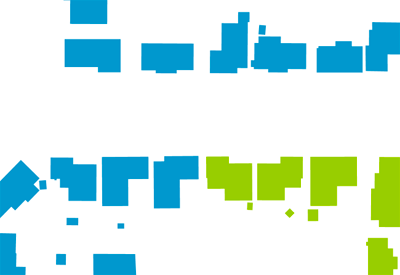
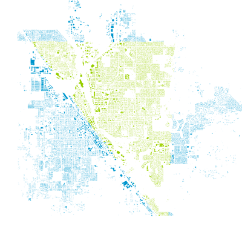

.. _ysld_reference_filters:

Filters
=======

Filters are predicates that allow rules to be applied selectively.

A filter can take a great many different forms.

.. note:: A scale is a type of filter, but is :ref:`discussed separately <ysld_reference_scalezoom>`.

.. note:: For more information, please see the `GeoTools CQL documentation <http://docs.geotools.org/stable/userguide/library/cql/ecql.html>`_ and `GeoServer CQL tutorial <../../../geoserver/tutorials/cql/cql_tutorial.html>`_.

Syntax
------

The basic syntax of a filter is::

  rules:
    ...
    filter: ${<expression>}
    ...

where ``<expression>`` is any valid CQL/ECQL filter.

.. note:: Be aware that filters are applied to :ref:`rules <ysld_reference_rules>` and so appear inside them, but outside of any :ref:`symbolizers <ysld_reference_symbolizers>`.

Types of filters
----------------

As mentioned above, the filter can be any valid construction made with CQL/ECQL (Extended/Contextual Query Language).

CQL is written using a familiar text-based syntax with strong similarities to SQL statements. One can think of a CQL expression as the "WHERE" clause of a SQL statement.

The following are all standard filter constructions:

Object comparison
~~~~~~~~~~~~~~~~~

This filter will test to see if a comparison to an attribute is true. It has the following form::

  ${<attribute> <operator> <value>}

where:

.. list-table::
   :class: non-responsive
   :header-rows: 1
   :stub-columns: 1
   :widths: 20 10 50 20

   * - Attribute
     - Required?
     - Description
     - Default value
   * - ``<attribute>``
     - Yes
     - That to which something is going to be compared. Typically an **attribute name**. May be case sensitive.
     - N/A
   * - ``<operator>``
     - Yes
     - Method of comparison. Valid operators are ``=``, ``<``, ``>``, ``<=``, ``>=``, ``<>``, ``LIKE``, ``ILIKE``, ``BETWEEN``, ``IS NULL``, ``IN``. ``NOT`` can be added to invert the comparison.
     - N/A
   * - ``<value>``
     - Yes
     - That which the ``<attribute>`` is being compared to. Typically a static value such as a string or scalar, though can be an expression that evaluates to a static value. Can include mathematical operators such as ``+``, ``-``, ``*``, ``/``. Use **single quotes** for strings, as double-quotes will be interpreted as an attribute name. Omit quotes for scalar values.
     - N/A

The following is a description of all available operators:

.. list-table::
   :class: non-responsive
   :header-rows: 1
   :stub-columns: 1
   :widths: 20 80

   * - Operator
     - Description
   * - ``=``
     - Equals
   * - ``<``
     - Less than (non-inclusive)
   * - ``>``
     - Greater than (non-inclusive)
   * - ``<=``
     - Less than or equal to (inclusive)
   * - ``>=``
     - Greater than or equal to (inclusive)
   * - ``LIKE``
     - Fuzzy matching for strings and other non-numeric attributes. Add ``%`` for multi-character wildcards, and ``_`` for single-character wildcards. 
   * - ``ILIKE``
     - Case-insensitive version of ``LIKE``
   * - ``BETWEEN``
     - Tests if a value that is between two given values
   * - ``IS NULL``
     - For testing against a ``NULL`` value
   * - ``IN``
     - Used when specifying a list. Must be contained in the list for the statement to be true.
   * - ``NOT``
     - Negates a boolean (true/false) condition. Can be used with an additional operator such as ``NOT LIKE`` or ``NOT BETWEEN``.
   * - ``<>``
     - Not equal (used when comparing a string or numeric value only)

.. note:: These operators are not case sensitive, but are shown here in all caps for legibility and consistency.

Spatial filters
~~~~~~~~~~~~~~~

Filters can be spatial in nature. Any valid spatial construction in `WKT (Well Known Text) <http://en.wikipedia.org/wiki/Well-known_text>`_ can be used. Spatial filters include ``INTERSECTS``, ``DISJOINT``, ``CONTAINS``, ``WITHIN``, ``TOUCHES``, ``CROSSES``, ``EQUALS``, ``DWITHIN``, and ``BBOX``. ``NOT`` can be added to negate the condition.

For more details about these spatial filters and their syntax, please see the `GeoServer ECQL reference <../../../geoserver/filter/ecql_reference.html>`_ or `uDig CQL reference <http://udig.github.io/docs/user/concepts/Constraint%20Query%20Language.html>`_.

Compound statements
~~~~~~~~~~~~~~~~~~~

The filter can be a combination of statements. A common case is testing if the value of an attribute is greater than one value but less than another.

The syntax for creating compound statements is to use standard Boolean notation such as ``AND``, ``OR``, and ``NOT`` along with relevant parentheses.

For example, a filter where both statements need to be true would be::

  filter: ${<statement1> AND <statement2>}

A filter where either statement would need to be true would be::

  filter: ${<statement1> OR <statement2>}

Larger filters can be built up in this way::

  filter: ${(<statement1> OR <statement2>) AND <statement3> OR NOT <statement4>}

In these examples, every ``<statement>`` is a valid filter.

In terms of precedence, ``AND`` is evaluated first, followed by ``OR``, unless modified by parentheses. So, in the last example above, ``(<statement1> OR <statement2>)`` will be evaluated first, followed by the result of that ``AND <statement3>``, and finally the result of that with ``OR NOT <statement4>``.

Examples
--------

**Filter size based on an attribute**

Filters are used to style different features of a layer based on certain conditions. The ``ILIKE`` operator is used to compare two strings (ignoring case) to see if they are similar. When using ``LIKE`` or ``ILIKE``, the ``%`` character matches any number of letters (So ``%hwy`` matches any streetname ending in ``hwy``). This example uses filters to distinguish between Highways, Roads, and other streets, and draw them using different colors and sizes::

  feature-styles:
  - rules:
    - filter: ${streetname ILIKE '%hwy'}
        symbolizers:
        - line:
            stroke-color: '#007799'
            stroke-width: 8
    - filter: ${streetname ILIKE '%rd'}
        symbolizers:
        - line:
            stroke-color: '#00AA00'
            stroke-width: 4
    - else: true
        symbolizers:
        - line:
            stroke-color: black
            stroke-width: 2

.. figure:: img/filters_roadtypes.png

   Filter based on road types 

**Filter color based on attribute value**

Filters can also be used to color a map based on attributes of the data. The following example uses the ``YEARBLT`` attribute to color different lots based on the year they were built. The ``else`` rule applies only if no other filter rule applies

.. note:: The Recode :ref:`function <ysld_reference_functions>` can perform the same functionality in a more compact syntax.

::

  name: Year Built Filter
  feature-styles:
  - rules:
    - filter: ${YEARBLT > 2000}
      symbolizers:
      - polygon:
          stroke-color: '#000000'
          stroke-width: 0.5
          fill-color: '#00FF00'
    - filter: ${YEARBLT > 1990 AND YEARBLT < 2000}
      symbolizers:
      - polygon:
          stroke-color: '#000000'
          stroke-width: 0.5
          fill-color: '#22DD00'
    - filter: ${YEARBLT > 1980 AND YEARBLT < 1990}
      symbolizers:
      - polygon:
          stroke-color: '#000000'
          stroke-width: 0.5
          fill-color: '#44BB00'
    - filter: ${YEARBLT > 1970 AND YEARBLT < 1980}
      symbolizers:
      - polygon:
          stroke-color: '#000000'
          stroke-width: 0.5
          fill-color: '#668800'
    - else: true
      symbolizers:
      - polygon:
          stroke-color: '#000000'
          stroke-width: 0.5
          fill-color: '#DD4400'

.. figure:: img/filters_categories.png

   Filter based on attribute value

**Filter by bounding box**

Spatial filters can be used to filter a layer based on its geometry. The ``bbox`` filter can be used to select features that are contained within a bounding box. This example colors polygons orange within the bounding box, and blue outside the bounding box::

  name: Spatial Filter
  feature-styles:
  - name: name
    rules:
    - filter: bbox(the_geom, -122.9, 42.36, -122.85, 42.28)
      symbolizers:
      - polygon:
           fill-color: '#99CC00'
    - else: true
      symbolizers:
      - polygon:
           fill-color: '#0099CC'

   Detail of ``bbox`` filter

**Filter by arbitrary geometries**

Spatial filters can also be used to compare layer geometries against arbitrary geometries, not just bounding boxes. In this example, the ``within`` filter is used to select all buildings inside a triangular region defined using Well-Known Text (WKT) and color them green. All other features are colored blue::

  feature-styles:
  - name: name
    rules:
    - filter: within(the_geom, POLYGON ((-122.9075 42.3625, -122.8225 42.3625, -122.8268 42.2803, -122.9075 42.3625)))
      symbolizers:
      - polygon:
          fill-color: '#00CC00'
    - else: true
      symbolizers:
      - polygon:
          fill-color: '#0099CC'

   Filter using ``within``
