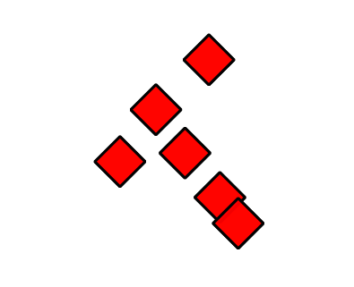
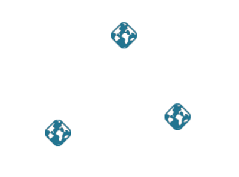

.. _ysld_reference_symbolizers_point:

Point symbolizer
================

The point symbolizer is used to style point features or centroids of non-point features.

Syntax
------

The full syntax of a point symbolizer is::

  symbolizers:
  - point:
      symbols:
      - external:
          url: <text>
          format: <text>
      - mark:
          shape: <shape>
          fill-color: <color>
          fill-opacity: <expression>
          fill-graphic: 
            <graphic_options>
          stroke-color: <color>
          stroke-width: <expression>
          stroke-opacity: <expression>
          stroke-linejoin: <expression>
          stroke-linecap: <expression>
          stroke-dasharray: <float list>
          stroke-dashoffset: <expression>
          stroke-graphic: 
            <graphic_options>
          stroke-graphic-fill: 
            <graphic_options>
      size: <expression>
      anchor: <tuple>
      displacement: <tuple>
      opacity: <expression>
      rotation: <expression>
      geometry: <expression>
      uom: <text>
      x-labelObstacle: <boolean>
      x-composite-base: <boolean>
      x-composite: <text>

where:

.. include:: include/stroke.txt

.. include:: include/fill.txt

.. list-table::
   :class: non-responsive
   :header-rows: 1
   :stub-columns: 1
   :widths: 20 10 50 20

   * - Property
     - Required?
     - Description
     - Default value
   * - ``external``
     - No
     - Specifies an image to use to style the point.
     - N/A
   * - ``url``
     - Yes
     - Location of the image. Can either be an actual URL or a file path (relative to where the style file is saved in the GeoServer data directory). Should be enclosed in single quotes.
     - N/A
   * - ``format``
     - Yes
     - Format of the image. Must be a valid MIME type (such as ``image/png`` for PNG, ``image/jpeg`` for JPG, ``image/svg+xml`` for SVG) 
     - N/A
   * - ``mark``
     - No
     - Specifies a regular shape to use to style the point.
     - N/A
   * - ``shape``
     - No
     - Shape of the mark. Options are ``square``, ``circle``, ``triangle``, ``cross``, ``x``, and ``star``. 
     - ``square``
   * - ``size``
     - No
     - Size of the mark in pixels. If the aspect ratio of the mark is not 1:1 (square), will apply to the *height* of the graphic only, with the width scaled proportionally.
     - 16
   * - ``anchor``
     - No
     - Specify the center of the symbol relative to the feature location. Value is an ``[x,y]`` tuple with decimal values from 0-1, with ``[0,0]`` meaning that the symbol is anchored to the top left, and ``[1,1]`` meaning anchored to bottom right. 
     - ``[0.5,0.5]``
   * - ``displacement``
     - No
     - Specifies a distance to which to move the symbol relative to the feature. Value is an ``[x,y]`` tuple with values expressed in pixels, so [10,5] will displace the symbol 10 pixels to the right and 5 pixels down.
     - ``[0,0]``
   * - ``opacity``
     - No
     - Specifies the level of transparency. Value of ``0`` means entirely transparent, while ``1`` means entirely opaque. Only affects graphics referenced by the ``external`` parameter; the opacity of ``mark`` symbols is controled by the ``fill-opacity`` and ``stroke-opacity`` of the mark.
     - ``1``
   * - ``rotation``
     - No
     - Value (in degrees) or rotation of the mark. Larger values increase counter-clockwise rotation. A value of ``180`` will make the mark upside-down.
     - ``0``

.. include:: include/symbol.txt

The following properties are equivalent to SLD "vendor options".

.. include:: include/misc.txt

.. include:: include/composite.txt

Examples
--------

Basic point
~~~~~~~~~~~

A point symbolizer draws a point at the center of any geometry. It is defined by an external image or a symbol, either of which can be sized and rotated. A mark is a pre-defined symbol that can be drawn at the location of a point. Similar to polygons, marks have both a fill and a stroke. This example shows a point symbolizer that draws semi-transparent red diamonds with black outlines::

  feature-styles:
  - name: name
    rules:
    - title: red point
      symbolizers:
      - point:
          symbols:
          - mark:
              shape: square
              fill-color: '#FF0000'
              fill-opacity: 0.75
              stroke-color: '#000000'
              stroke-width: 1.5
              stroke-opacity: 1
          size: 20
          rotation: 45

   Basic point

Point as image
~~~~~~~~~~~~~~

Sometimes it may be useful to use an image to represent certain points. This can be accomplished using the ``external`` symbol property, which requires a ``url`` and a ``format``. The ``url`` should be enclosed in single quotes. The ``format`` property is a `MIME type image <http://en.wikipedia.org/wiki/Internet_media_type#Type_image>`_. This example shows a point symbolizer that draws an image centered on each point::

  name: point
  feature-styles:
  - name: name
    rules:
    - symbolizers:
      - point:
          symbols:
          - external:
              url: 'geoserver.png'
              format: image/png
          size: 16

   Point as image

Point composition
~~~~~~~~~~~~~~~~~

Using more than one point symbolizer allows the composition of more complex symbology. This example shows two symbolizers along with the ``x-composite`` parameter in order to *subtract* a shape from a square mark, allowing the background to show through.

.. code-block:: yaml

   symbolizers:
   - point:
       symbols:
       - mark:
           shape: square
           fill-color: '#222222'
       size: 40
   - point:
       symbols:
       - external:
           url: 'stamp.png'
           format: image/png
       x-composite: xor
       size: 40

.. figure:: img/point_composition.png

   Point composition
   

Points as arrow heads
~~~~~~~~~~~~~~~~~~~~~

Sometimes it is useful to generate a point using a CQL expression. The following example generates a point at the end of each line in the shape of an arrow, rotated such that it matches the orientation of the line.

.. code-block:: yaml

   name: arrow
   symbolizers:
   - line:
      stroke-color: '#808080'
      stroke-width: 3
   - point:
       geometry: ${endPoint(the_geom)}
       symbols:
       - mark:
           shape: shape://oarrow
           fill-color: '#808080'
       size: 30
       rotation: ${endAngle(the_geom)}

.. figure:: img/arrow.png
   
   Point as arrow head
