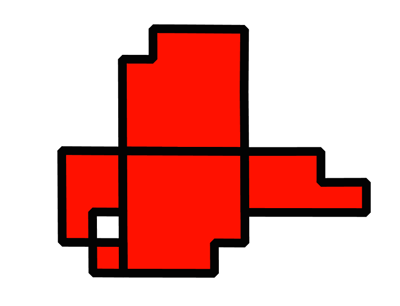

.. _ysld_reference_symbolizers_polygon:

Polygon symbolizer
==================

The polygon symbolizer styles polygon (2-dimensional) features. It contains facilities for the stroke (outline) of a feature as well as the fill (inside) of a feature. 

Syntax
------

The full syntax of a polygon symbolizer is::

  symbolizers:
  - polygon:
      fill-color: <color>
      fill-opacity: <expression>
      fill-graphic: 
        <graphic_options>
      stroke-color: <color>
      stroke-width: <expression>
      stroke-opacity: <expression>
      stroke-linejoin: <expression>
      stroke-linecap: <expression>
      stroke-dasharray: <float list>
      stroke-dashoffset: <expression>
      stroke-graphic:
        <graphic_options>
      stroke-graphic-fill: 
        <graphic_options>
      offset: <expression>
      displacement: <expression>
      geometry: <expression>
      uom: <text>
      x-labelObstacle: <boolean>
      x-composite-base: <boolean>
      x-composite: <text>

where:

.. include:: include/stroke.txt

.. include:: include/fill.txt

.. list-table::
   :class: non-responsive
   :header-rows: 1
   :stub-columns: 1
   :widths: 20 10 50 20

   * - Property
     - Required?
     - Description
     - Default value
   * - ``offset``
     - No
     - Value in pixels for moving the drawn line relative to the location of the feature. 
     - ``0``
   * - ``displacement``
     - No
     - Specifies a distance to which to move the symbol relative to the feature. Value is an ``[x,y]`` tuple with values expressed in pixels, so [10,5] will displace the symbol 10 pixels to the right, and 5 pixels down.
     - ``[0,0]``

.. include:: include/symbol.txt

The following properties are equivalent to SLD "vendor options".

.. include:: include/misc.txt

.. include:: include/composite.txt

Examples
--------

Basic polygon
~~~~~~~~~~~~~

Polygon symbolizers have both a stroke and a fill, similar to marks for point symbolizers. The following example draws a polygon symbolizer with a red fill and black stroke with beveled line joins for the stroke::

  feature-styles:
  - name: name
    rules:
    - title: fill-graphic
      symbolizers:  
      - polygon:
          fill-color: '#FF0000'
          fill-opacity: 0.9
          stroke-color: '#000000'
          stroke-width: 8
          stroke-opacity: 1
          stroke-linejoin: bevel

Fill with graphic
~~~~~~~~~~~~~~~~~

The ``fill-graphic`` property is used to fill a geometry with a repeating graphic. This can be a mark or an external image. The ``x-graphic-margin`` option can be used to specify top, right, bottom, and left margins around the graphic used in the fill. This example uses two sets of repeating squares with different offset values to draw a checkerboard pattern::

  name: checkers
  feature-styles:
  - name: name
    rules:
    - title: fill-graphic
      symbolizers:  
      - polygon:
          stroke-width: 1
          fill-graphic:
            symbols:
            - mark:
                shape: square
                fill-color: '#000000'
            size: 8
          x-graphic-margin: 16 16 0 0
      - polygon:
          stroke-width: 1
          fill-graphic:
            symbols:
            - mark:
                shape: square
                fill-color: '#000000'
            size: 8
          x-graphic-margin: 0 0 16 16

.. figure:: img/polygon_checkers.png

   Checkered fill

Randomized graphic fill
~~~~~~~~~~~~~~~~~~~~~~~

Normally, the graphic used for the ``fill-graphic`` property is tiled. Alternatively, one can scatter this image randomly across the fill area using the ``x-random`` option and associated other options. This could be used to create a speckled pattern, as in the following example::  

  name: speckles
  feature-styles:
  - name: name
    rules:
    - title: fill-graphic
      symbolizers:  
      - polygon:
          stroke-width: 1
          fill-graphic:
            symbols:
              - mark:
                  shape: circle
                  fill-color: '#000000'
            size: 3
            x-random: grid
            x-random-seed: 2
            x-random-tile-size: 1000
            x-random-rotation: free
            x-random-symbol-count: 1000

.. figure:: img/polygon_random.png

   Randomized graphic fill
