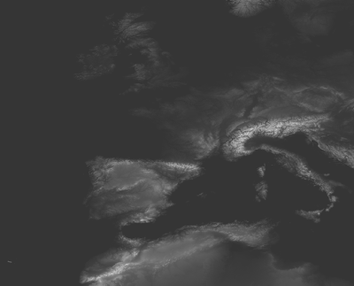
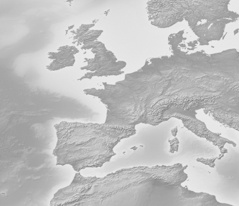
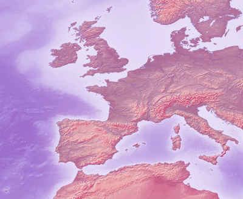
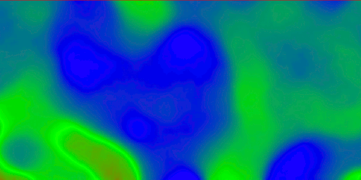

.. _ysld_reference_symbolizers_raster:

Raster symbolizer
=================

The raster symbolizer styles raster (coverage) layers. A raster is an array of information with each cell in the array containing one or more values, stored as "bands".

The full syntax of a raster symbolizer is::

  symbolizers:
  - raster:
      opacity: <expression>
      channels:
        gray: 
          <channel_options>
        red:
          <channel_options>
        green:
          <channel_options>
        blue:
          <channel_options>
      color-map:
        type: <ramp|interval|values>
        entries:
        - [color, entry_opacity, band_value, text_label]
      contrast-enhancement: 
        mode: <normalize|histogram>
        gamma: <expression>

where:

.. list-table::
   :class: non-responsive
   :header-rows: 1
   :stub-columns: 1
   :widths: 20 10 50 20

   * - Property 
     - Required? 
     - Description
     - Default value
   * - ``opacity``
     - No
     - Opacity of the entire display. Valid values are a decimal between ``0`` (completely transparent) and ``1`` (completely opaque).
     - ``1``
   * - ``channels``
     - No
     - Selects the band(s) to display and the display method.
     - N/A
   * - ``gray``
     - No
     - Display a single band as a grayscale image. Cannot be used with ``red``, ``green``, and ``blue``. The ``<channel_options>`` can be the band name or a mapping containing ``name:`` and ``contrast-enhancement:`` (optional).
     - ``1``
   * - ``red``
     - No
     - Display three bands as an RGB image. Must be used with ``green``, and ``blue``. Cannot be used with ``gray``. The ``<channel_options>`` can be the band name or a mapping containing ``name:`` and ``contrast-enhancement:`` (optional).
     - ``1``
   * - ``green``
     - No
     - Display three bands as an RGB image. Must be used with ``red``, and ``blue``. Cannot be used with ``gray``. The ``<channel_options>`` can be the band name or a mapping containing ``name:`` and ``contrast-enhancement:`` (optional).
     - ``2``
   * - ``blue``
     - No
     - Display three bands as an RGB image. Must be used with ``red``, and ``green``. Cannot be used with ``gray``. The ``<channel_options>`` can be the band name or a mapping containing ``name:`` and ``contrast-enhancement:`` (optional). See examples below.
     - ``3``
   * - ``color-map``
     - No
     - Creates a mapping of colors to grid values. Can only be used with a single band.
     - N/A
   * - ``type``
     - No
     - Type of color mapping. Options are ``ramp``, an interpolated list of values; ``interval``, a non-interpolated list of values; and ``values``, where values need to match exactly to be drawn.
     - ``ramp``
   * - ``entries``
     - No
     - Values for the color mapping. Syntax is a list of tuples.
     - N/A
   * - ``color``
     - Yes
     - Color for the particular color map entry. Value is a standard color value.
     - N/A
   * - ``entry_opacity``
     - Yes
     - Opacity of the particular color map entry. Valid values are a decimal between ``0`` (completely transparent) and ``1`` (completely opaque).
     - N/A
   * - ``band_value``
     - Yes
     - Grid value to use for the particular color map entry. Values are data-dependent. Behavior at or around this value is determined by the color ramp ``type``.
     - N/A
   * - ``text_label``
     - No
     - Label for the particular color map entry
     - Blank
   * - ``contrast-enhancement``
     - No
     - Modifies the contrast of the display
     - N/A
   * - ``mode``
     - No
     - Type of contrast enhancement. Options are ``normalize`` (stretches contrast so that the smallest and largest values are set to black and white, respectively) or ``histogram`` (produces equal number of content in the image at each brightness level).
     - ``normalize``
   * - ``gamma``
     - No
     - Multiplier value for contrast adjustment. A value greater than 1 will increase darkness, while a value less than 1 will decrease darkness.
     - ``1``

Examples
--------

.. todo:: All examples need figures

Enhanced contrast
~~~~~~~~~~~~~~~~~

This example takes a given raster and lightens the output by a factor of 2::

  symbolizers:
  - raster:
      contrast-enhancement: 
        gamma: 0.5

.. figure:: img/raster_brightness.png

   Lightened image

Normalized output
~~~~~~~~~~~~~~~~~

This example takes a given raster and adjusts the contrast so that the smallest values are darkest and the highest values are lightest::

  symbolizers:
  - raster:
      contrast-enhancement: 
        mode: normalize

   Normalized image

Band selection
~~~~~~~~~~~~~~

This example takes a raster with multiple bands and outputs band 2 as a grayscale image (This could be used to select a single band in a multi-band image to use with ``color-map``)::

  name: raster
  feature-styles:
  - name: name
    rules:
    - symbolizers:
      - raster:
          opacity: 1.0
          channels:
            gray: 2

   Grayscale band selection

Band selection with contrast
~~~~~~~~~~~~~~~~~~~~~~~~~~~~

This example takes an RGB raster, doubles the intensity of the red, and normalizes the green band::

  name: raster
  feature-styles:
  - name: name
    rules:
    - symbolizers:
      - raster:
          channels:
            red:
              name: 1
              contrast-enhancement:
                gamma: .5
            green:
              name: 2
              contrast-enhancement:
                mode: normalize
            blue:
              name: 3
 

 Band selection with contrast enhancement            

Color ramp
~~~~~~~~~~

This example shows a color ramp from red to green to blue, with raster band values from 0-200::

  symbolizers:
  - raster:
      color-map:
        type: ramp
        entries:
        - ['#FF0000', 1, 0, red]
        - ['#00FF00', 1, 100, green]
        - ['#0000FF', 1, 200, blue]

In this example, the grid values will have the following colors applied:

* Less than or equal to 0 will have an output color of **solid red**
* Between 0 and 100 will have an output color **interpolated between red and green**
* Between 100 and 200 will have an output color **interpolated between green and blue**
* Greater than 200 will have an output color of **solid blue** 

   Color map with ramp

Color intervals
~~~~~~~~~~~~~~~

The same example as above, but with the ``color-map`` type set to ``intervals``::

  symbolizers:
  - raster:
      color-map:
        type: intervals
        entries:
        - ['#FF0000', 1, 0, red]
        - ['#00FF00', 1, 100, green]
        - ['#0000FF', 1, 200, blue]

In this example, the grid values will have the following colors applied:

* Less than or equal to 0 will have an output color of **solid red**
* Between 0 and 100 will have an output color of **solid green**
* Between 100 and 200 will have an output color of **solid blue**
* Greater than 200 will **not be colored** at all (transparent)

.. figure:: img/raster_map_intervals.png

   Color map with intervals

Color values
~~~~~~~~~~~~

The same example as above, but with the ``color-map`` type set to ``values``::

  symbolizers:
  - raster:
      color-map:
        type: values
        entries:
        - ['#FF0000', 1, 0, red]
        - ['#00FF00', 1, 100, green]
        - ['#0000FF', 1, 200, blue]

In this example, the grid values will have the following colors applied:

* Equal to 0 will have an output color of **solid red**
* Equal to 100 will have an output color of **solid green**
* Equal to 200 will have an output color of **solid blue**

Any other values (even those in between the above values) will not be colored at all.

.. figure:: img/raster_map_values.png

   Color map with values
