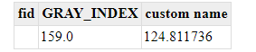

.. _tutorials_getfeatureinfo_raster:

Raster GetFeatureInfo Response Customization
============================================

The default output for a ``GetFeatureInfo`` request over a raster layer, comprises just the value of the selected pixel for each band of the image.
For instance in case of an ``application/json`` output format:

.. code-block:: json
  
  {
  "type": "FeatureCollection",
  "features": [
    {
      "type": "Feature",
      "id": "",
      "geometry": null,
      "properties": {
        "GRAY_INDEX": 124,
      }
    }
  ],
  "totalFeatures": "unknown",
  "numberReturned": 1,
  "timeStamp": "2021-03-19T11:33:52.587Z",
  "crs": null
 }

If the raster layer is served with a Style having a ``ColorMap``, GeoServer provides the possibility to include in the output the label of the ``ColorMapEntry`` matching the pixel value, thanks to a ``VendorOption`` to be added inside the ``RasterSymbolizer`` holding the ``ColorMap``

.. code-block:: xml
  
 <sld:RasterSymbolizer>
    <sld:ColorMap>
        <sld:ColorMapEntry color="#0000FF" quantity="1.0" label="label is 1"/>
        <sld:ColorMapEntry color="#FFFF00" quantity="124.81173566700335" label="label is 124.811736"/>
        <sld:ColorMapEntry color="#FF7F00" quantity="559.2041949413946" label="label is 559.204195"/>
        <sld:ColorMapEntry color="#FF0000" quantity="55537.0" label="label is 55537"/>
    </sld:ColorMap>
    <sld:ContrastEnhancement/>
    <VendorOption name="labelInFeatureInfo">add</VendorOption>
 </sld:RasterSymbolizer>

With the example ``RasterSymbolizer`` we will obtain something like:

.. code-block:: json
  
  {
  "type": "FeatureCollection",
  "features": [ 
    { 
      "type": "Feature",
      "id": "",
      "geometry": null,
      "properties": {
        "GRAY_INDEX": 124,
        "Label_GRAY_INDEX": "label is 124.811736"
      }
    }
  ],
  "totalFeatures": "unknown",
  "numberReturned": 1,
  "timeStamp": "2021-03-19T11:33:52.587Z",
  "crs": null
 }

As it's possible to see, the label's value has been added to the output with attribute name ``Label_GRAY_INDEX``.

The ``VendorOption labelInFeatureInfo`` supports the following values:

* ``add`` the label value is added to the normal GetFeatureInfo output.

* ``replace`` the label value replaces the pixel value in the output.

* ``none`` no label is added to the output. We obtain a normal ``GetFeaturInfo`` response.

Additionally it is possible to customize the attribute name of the label value, by means of a second ``VendorOption``: 
``<VendorOption name="labelAttributeName">your custom name</VendorOption>``.

Assuming to have a ``RasterSymbolizer`` like this

.. code-bloc::xml
  
 <sld:RasterSymbolizer>
    <sld:ColorMap>
        <sld:ColorMapEntry color="#0000FF" quantity="1.0" label="label is 1"/>
        <sld:ColorMapEntry color="#FFFF00" quantity="124.81173566700335" label="label is 124.811736"/>
        <sld:ColorMapEntry color="#FF7F00" quantity="559.2041949413946" label="label is 559.204195"/>
        <sld:ColorMapEntry color="#FF0000" quantity="55537.0" label="label is 55537"/>
    </sld:ColorMap>
    <sld:ContrastEnhancement/>
    <VendorOption name="labelInFeatureInfo">add</VendorOption>
    <VendorOption name="labelAttributeName">custom name</VendorOption>
 </sld:RasterSymbolizer>

we would obtain the following output, where the attribute name of the label value has been replaced by the one specified in the labelAttributeName ``VendorOption``:

.. code-block:: json
  
 {
  "type": "FeatureCollection",
  "features": [
    {
      "type": "Feature",
      "id": "",
      "geometry": null,
      "properties": {
        "GRAY_INDEX": 159,
        "custom name": "label is 124.811736"
      }
    }
  ],
  "totalFeatures": "unknown",
  "numberReturned": 1,
  "timeStamp": "2021-03-19T11:50:32.433Z",
  "crs": null
 }

We have been using the ``JSON`` output format for the example above, but the two ``VendorOptions`` work also with ``HTML`` output.

