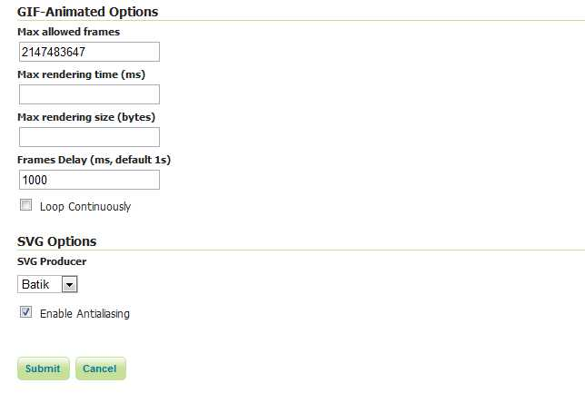

.. _tutorials_animreflector:

WMS Animator
=============

Overview
--------

Standard WMS can generate static maps only. 
There is a number of use cases in which generating an animation is of interest.
An obvious case is time-based animation.
Other uses include elevation-based animation, 
varying the values of SQL View or SLD substitution parameters, 
or the changing the extent of the generated map to produce the appearance of a moving viewport.

This capability is provided by the **WMS Animator**.
The WMS Animator works in a similar way to the WMS Reflector.  
It uses a provided partial WMS request as a template, 
and the **animator parameters** are used to generate and execute a sequence of complete requests.
The rendered map images are combined into a single output image (in a format that supports multi-frame images).

The Animator is invoked by using the ``wms/animate`` request path.
Any WMS paramaters can be animated, including nested ones such as :ref:`SLD environment variables <sld_variable_substitution>`.
To define the appearance of the animation additional parameters are provided:

* **aparam** specifies the name of the parameter that will be changed in the request for each frame. 
  This can be any WMS parameter such as ``layers``, ``cql_filter``, ``bbox``, ``style`` and so on. 
  Nested parameters (such as required by the ``format_options``, ``env`` and ``view_params`` parameters), 
  are supported using the syntax of ``param:name`` (for example, ``view_params:year``).
* **avalues** is a comma-separated list of the values the animation parameter has for each frame.  
  If a value contain commas these must be escaped using a backslash.
  (For instance, this occurs when providing BBOX values.)

The Animator parses the input values and uses string replacement to generate the sequence of WMS requests to be executed. 
Each generated request is executed to produce one frame.
It is up to the caller to ensure the provided animation parameters result in valid WMS requests.

For example, to generate an animation of a layer with the viewport scrolling towards the east,
the WMS BBOX parameter is given the series of values ``-90,40,-60,70``, ``-80,40,-60,70`` and ``-70,40,-50,70``
(note the escaping of the commas in the BBOX values)::

   http://localhost:8080/geoserver/wms/animate
   ?layers=topp:states
   &aparam=bbox
   &avalues=-90\,40\,-60\,70,-80\,40\,-60\,70,-70\,40\,-50\,70

For an example of nested parameters, assume the existence of a style named ``selection`` using an SLD variable ``color``.
The following request creates an animated map where the selection color changes between red, green and blue::

    http://localhost:8080/geoserver/wms/animate
    ?layers=topp:states,topp:states
    &styles=polygon,selection
    &aparam=env:color
    &avalues=FF0000,00FF00,0000FF
  

Using the WMS Animator
----------------------

To invoke the WMS Animator specify the path ``wms/animate`` instead of ``wms`` in a GetMap request. 

Every Animator request must specify the ``layers``, ``aparam`` and ``avalues`` parameters. 
Any other valid WMS parameters may be used in the request as well.
If any necessary parameters are omitted, the Animator provides sensible default values for them. 
The following defaults are used:

.. list-table::
   :widths: 50 50  

   * - **Parameter**
     - **Default Value**
   * - ``request``
     - ``getmap``
   * - ``service``
     - ``wms``
   * - ``version``
     - ``1.1.1`` 
   * - ``format``
     - ``image/png``
   * - ``width``
     - ``512``
   * - ``height``
     - ``512`` if width is not specified 
   * - ``srs``
     - ``EPSG:4326``, or SRS common to all layers 
   * - ``bbox``
     - bounds of specified layer(s) 
   * - ``styles``
     - default styles configured for specified layer(s)  
     
Further details of these parameters are:

**layers**: This is the only mandatory standard parameter. It is a comma-separated list of the layers to be included in the output map.

**format**: The default output format is ``image/png``. 
Supported values are ``image/jpeg`` (suitable for raster backgrounds), ``image/png8`` (8-bit colors, smaller files) and ``image/gif``

.. Warning:: In order to produce an actual animated image the format must support animation. At this time the only one provide in GeoServer is **image/gif;subtype=animated**

**width**: Describes the width of the image. It defaults to 512 pixels, and can be calculated based on the specified height and the aspect ratio of the bounding box.

**height**: Describes the height of the image. It can be calculated based on the specified width and the aspect ratio of the bounding box.

**bbox**: Specifies the extent of the map frame.  The default bounding box is determined by taking the union of the bounds of the specified layers. 
(For example, if one layer shows Los Angeles and another shows New York, the default map shows most of the United States. 
The bounding box also determines the aspect ratio of the map. 
If only one of ``width`` or ``height`` is specified, the other is determined based on the aspect ratio of the bounding box. 

**styles**: The default value is the default styles configured in GeoServer for the layers specified in the ``layers`` parameter.
This can be overridden by providing a comma-separated list of style names (which must be known to the server).

**srs**: If all layers share the same SRS, this is used as the default value.
Otherwise, the default value is EPSG:4326 (WGS84).

Animation Options
^^^^^^^^^^^^^^^^^

The Animator provides options to control looping and frame speed.  
These are specified using the ``format_options`` :ref:`WMS parameter <wms_vendor_parameters>`.
The available options are:

.. list-table::
   :widths: 50 50  

   * - **Option**
     - **Description**
   * - ``gif_loop_continuously``
     - If ``true`` the animation will loop continuously.
       The default is ``false``.
   * - ``gif_frames_delay``
     - Specifies the frame delay in milliseconds.  
       The default is 1000 ms.
   * - ``gif_disposal``
     - Specifies what to do with the previous GIF frame once a new frame is displayed. 
       Valid values are ``none``, ``doNotDispose``, ``backgroundColor`` and ``previous``. 
       The default is ``none``.

Example 1
^^^^^^^^^

Requests the layer ``topp:states``, 
using the default style (``demographic``), width (512 pixels) and height (adjusted to aspect ratio). 
The ``aparam=bbox`` parameter specifies that the output animation has two frames, one using a whole-world extent and the other with the extent of the USA.
This gives the effect of zooming in::

    http://localhost:8080/geoserver/wms/animate
    ?layers=topp:states
    &format=image/gif;subtype=animated
    &aparam=bbox
    &avalues=-180\,-90\,180\,90,-125\,25\,-67\,50

Example 2
^^^^^^^^^

Requests the layers ``topp:states`` and ``sf:restricted``,  
using ``format_options=gif_loop_continuosly:true`` to request an infinite loop animation.
The output map uses the default styles, the specified width (640 pixels), and the height automatically adjusted to the aspect ratio::

    http://localhost:8080/geoserver/wms/animate
    ?layers=topp:states,sf:restricted
    &format=image/gif;subtype=animated
    &aparam=bbox
    &avalues=-180\,-90\,180\,90,-125\,25\,-67\,50
    &format_options=gif_loop_continuosly:true
    &width=640

Example 3
^^^^^^^^^

The following request uses 
the ``format_options`` of ``gif_loop_continuosly:true`` and ``gif_frames_delay:10``
to rotate the map image fast and continuously::

    http://localhost:8080/geoserver/wms/animate
    ?layers=topp:states,sf:restricted
    &format=image/gif;subtype=animated
    &aparam=angle
    &avalues=0,45,90,135,180,225,270,365
    &format_options=gif_loop_continuosly:true;gif_frames_delay:10
    &width=640

Displaying frame parameters as decorations
------------------------------------------

It is possible to decorate each frame image with the ``avalue`` parameter value that generated it using the 
:ref:`wms_decorations` ``text`` decoration.
The current animation parameter value can be accessed via the ``avalue`` environment variable.
(This environment variable can also be used in :ref:`sld_variable_substitution`.)

Here is an example that uses a decoration showing the frame parameter value::

   http://localhost:8080/geoserver/wms/animate
   ?layers=topp%3Aworld
   &aparam=time
   &avalues=2004-01-01T00:00:00.000Z,2004-02-01T00:00:00.000Z
   &format=image/gif;subtype=animated
   &format_options=layout:message

It uses the following decoration layout, located in ``layouts/message.xml``:

.. code-block:: xml

  <layout>
    <decoration type="text" affinity="bottom,right" offset="6,6">
      <option name="message" value="${avalue}"/>
      <option name="font-size" value="12"/>
      <option name="font-family" value="Arial"/>
      <option name="halo-radius" value="2"/>        
    </decoration>
  </layout>
  

Specifying WMS Animator default behaviour
-----------------------------------------

The GeoServer Adinistrator GUI allows specifying some limits and default options for the WMS Animator. 
The settings are made on the :guilabel:`Services > WMS` config screen as shown below:

   
   *WMS Animator default settings*

The first three options set server limits on the animation output. 
It is possible to set the **maximum number of frames** an animation can contain, the **maximum rendering time** to produce an animation and the **maximum size** of the whole animation.

The default animation 
**frame delay** (expressed in ms) **looping behaviour** and **disposal method** can be set as well.
These values can be overridden by using the ``format_options`` parameter as described above.