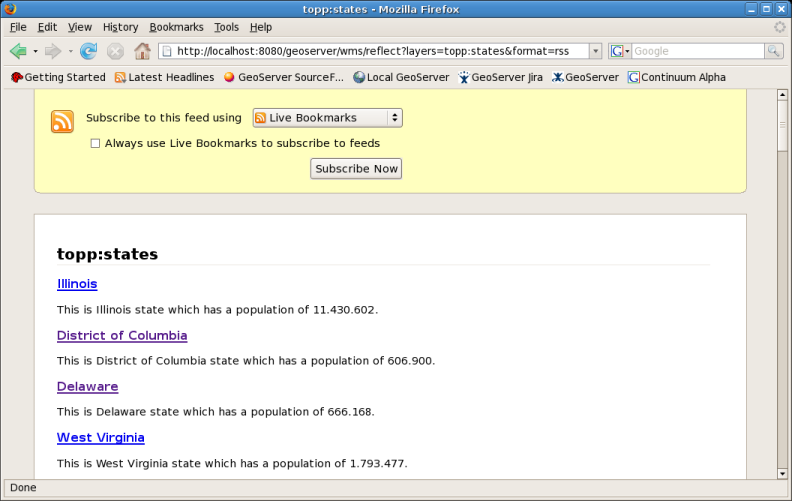
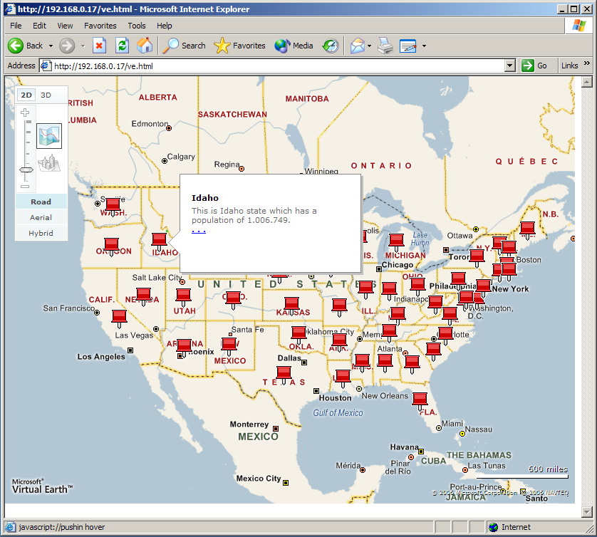

.. _tutorials_georss:

GeoRSS
======
GeoServer supports `GeoRSS <http://georss.org/>`_ as an output format allowing you to serve features as an RSS feed. 

Quick Start
-----------
If you are using a web browser which can render rss feeds simply visit the url `http://localhost:8080/geoserver/wms/reflect?layers=states&format=rss <http://localhost:8080/geoserver/wms/reflect?layers=states&format=rss>`_  in your browser. This is assuming a local GeoServer instance is running with an out of the box configuration. You should see a result that looks more or less like this:

   *topp:states rss feed*

Templating
----------
GeoServer uses freemarker templates to customize the returned GeoRSS feed. If you are not familiar with freemarker templates you may wish to read the :ref:`tutorial_freemarkertemplate` tutorial, and the :ref:`getutorial_kmlplacemark` page, which has simple examples.

Three template files are currently supported:

* ``title.ftl``
* ``description.ftl``
* ``link.ftl``

Each of these files may be used to customize the assocated field in the GeoRSS feed.

Ajax Map Mashups
----------------
.. note::

  For Ajax map mashups to work, the GeoServer instance must be visible to the Internet (i.e. using the address ``localhost`` will not work).

Google Maps
-----------
How to create a Google Maps mashup with a GeoRSS overlay produced by GeoServer.

#. Obtain a `Google Maps API Key <http://www.google.com/apis/maps/signup.html>`_ from Google.
#. Create an html file called ``gmaps.html``::

    <!DOCTYPE html PUBLIC "-//W3C//DTD XHTML 1.0 Strict//EN" "http://www.w3.org    R/xhtml1/DTD/xhtml1-strict.dtd">
    <html xmlns="http://www.w3.org/1999/xhtml">
        <head>
        <meta http-equiv="content-type" content="text/html; charset=utf-8"/>
        <title>Google Maps JavaScript API Example<    itle>
        

        
        
        </head>
        <body onload="load()" onunload="GUnload()">
            

        </body>
    </html>
    
#. Visit ``gmaps.html`` in your web browser.

.. note::

  The version of the google maps api must be **2.x**, and not just **2** You must insert your specific maps api key, and geoserver base url
        
Yahoo Maps
----------
How to create a Yahoo! Maps mashup with a GeoRSS overlay produced by GeoServer.

#. Obtain a <Yahoo Maps Application ID <http://search.yahooapis.com/webservices/register_application>`_ from Yahoo.
#. Create an html file called ``ymaps.html``::

    <html>
        <head>
        <title>Yahoo! Maps GeoRSS Overlay Example<    itle>
        
        
          </head>
          <body>
               

         </body>
    </html>

#. Visit ``ymaps.html`` in your web browser. 

.. note::

  The version of the yahoo maps api must be **3.0** You must insert your specific application id, and geoserver base url

Microsoft Virtual Earth
-----------------------
.. note::
   
   Non Internet Explorer Users*: GeoRSS overlays are only supported in Internet Explorer, versions greater then 5.5.
    
How to create a Microsoft Virtual Earth mashup with a GeoRSS overlay produced by GeoServer.

.. note::

   To access a GeoRSS feed from Microsoft Virtual Earth the file (ve.html) must be accessed from a Web Server, IE. It will not work if run from local disk.
    
#. Create an html file called ``ve.html``.  **Note**: You must insert your specific maps api key, and geoserver base url::

    <html>
      <head>
        
        
     </head>
     <body onload="OnPageLoad();">
        

      </body>

    </html>
    
#. Visit ``ve.html`` in your web browser. You should see the following:

   *Virtual Earth*

