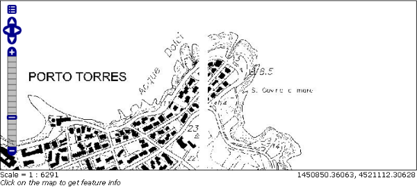
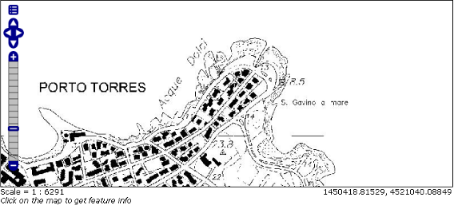
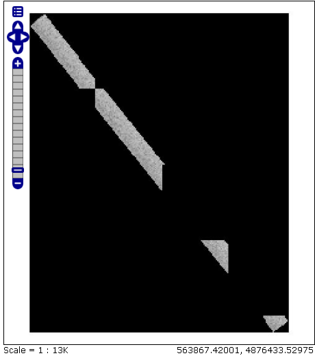
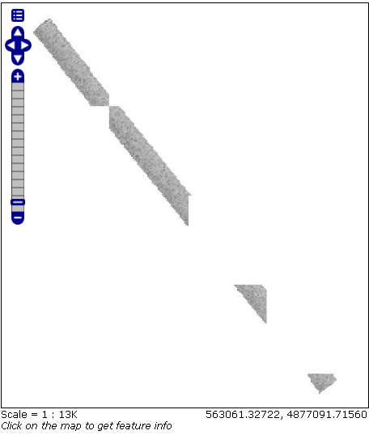
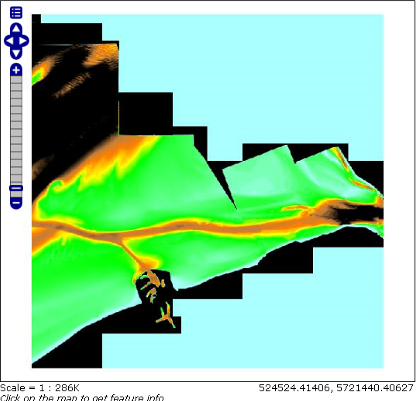
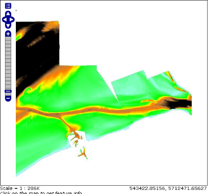
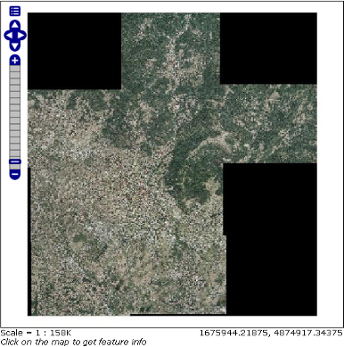
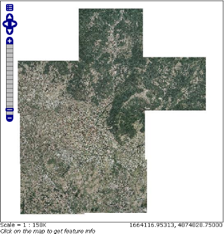
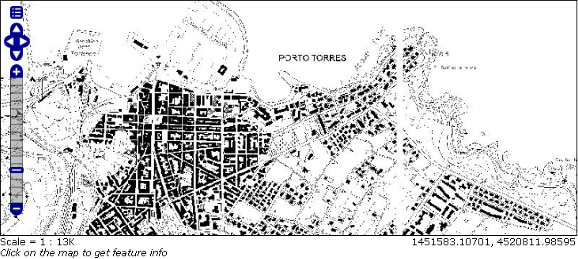
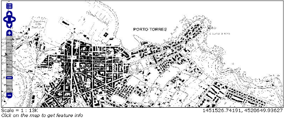

.. _tutorial_imagemosaic_extension:

Using the ImageMosaic plugin
============================

Introduction
------------

This tutorial describes the process of creating a new coverage using the ImageMosaic plugin. The ImageMosaic plugin is provided by `GeoTools <http://geotools.org/>`_, and allows the creation of a mosaic from a number of georeferenced rasters. The plugin can be used with Geotiffs, as well as rasters accompanied by a world file (.pgw for png files, .jgw for jpg files, etc.). In addition, if imageio-ext GDAL extensions are properly installed we can also serve all the formats supported by it like MrSID, ECW, JPEG2000, etc... See :ref:`data_gdal` for more information on how to install them.

The JAI documentation gives a good description about what a Mosaic does:

  The "Mosaic" operation creates a mosaic of two or more source images. This operation could be used for example to assemble a set of overlapping geospatially rectified images into a contiguous image. It could also be used to create a montage of photographs such as a panorama.

Briefly the ImageMosaic plugin is responsible for composing together a set of similar raster data. Each member of this set is commonly refered to as a *granule*.. The plugin has, of course, some limitations:

1. All the granules must share the same Coordinate Reference System; no reprojection is performed.  This will always be a constraint.
2. All the granules must share the same ColorModel and SampleModel. This is a limitation/assumption of the underlying JAI Mosaic operator: it basically means that the granules must share the same pixel layout and photometric interpretation. It would be quite difficult to overcome this limitation, but to some extent it could be done. In the case of colormapped granules, if the various granules share the same colormap the code will do its best to retain it and try not to expand them in memory. This can also be controlled via the ExpandToRGB parameter in the `configuration file <#configuration-file>`_.
3. If overviews are used, the set of overviews must be the same for all the granules (if this is not true, overviews will not be used). 
  
Granule Index
-------------

In order to configure a new CoverageStore and a new Coverage with this plugin, an index must be generated to associate each granule file to its bounding box. By default, a Shapefile is used for the index, but PostGIS, H2, and Oracle are also supported.

The granule index must contain the enclosing polygon for each raster file (in an appropriate coordinate reference system), and the location of each of these files. The location attribute can be relative to the ImageMosaic configuration folder, or absolute. By default, the name of this attribute is "location", but this can be changed in the main configuration file.

datastore.properties
~~~~~~~~~~~~~~~~~~~~

If the index is specified by a shapefile, it must be included in the ImageMosaic configuration folder. Otherwise, the index connection parameters should be specified by a `datastore.properties` file:

.. list-table::
   :widths: 15 5 80

   * - **Parameter**
     - **Mandatory**
     - **Description**
   * - `SPI`
     - Y
     - The DataStoreFactory used to connect to the index store. 
       For PostGIS, use `org.geotools.data.postgis.PostgisNGDataStoreFactory`. 
       For Oracle, use `org.geotools.data.oracle.OracleNGDataStoreFactory`. 
       For H2, use `org.geotools.data.h2.H2DataStoreFactory`.
       :ref:`JNDI <tomcat_jndi>` can also be used with any of these stores (In which case, the DataStoreFactory name will be different).
   * - Connection parameters
     - Y
     - The connection parameters used by the specified SPI. The list of these connection parameters can be found in the GeoTools documentation on the relevant store:

       * `PostGIS <http://docs.geotools.org/latest/userguide/library/jdbc/postgis.html>`_
       * `Oracle <http://docs.geotools.org/latest/userguide/library/jdbc/oracle.html>`_
       * `H2 <http://docs.geotools.org/latest/userguide/library/jdbc/h2.html>`_

       If JNDI is used, the connection parameters will include `jndiReferenceName` instead of `host`, `port`, etc.
       Note that for any connection parameters that include a space (such as `loose bbox`), the space must be escaped by preceding it with a backslash.

A sample `datastore.properties` file for a PostGIS index follows::

  SPI=org.geotools.data.postgis.PostgisNGDataStoreFactory
  host=localhost
  port=5432
  database=osm
  schema=public
  user=user
  passwd=password
  Loose\ bbox=true
  Estimated\ extends=false
  validate\ connections=true
  Connection\ timeout=10
  preparedStatements=true

indexer.properties
~~~~~~~~~~~~~~~~~~

In addition to the required envelope and location attributes, the schema for the index store may expose other custom attributes. This is configured by the `indexer.properties` file:

.. list-table::
   :widths: 15 5 80

   * - **Parameter**
     - **Mandatory**
     - **Description**
   * - `Schema`
     - Y
     - A comma-separated sequence describing the mapping between attribute and data type.
   * - `PropertyCollectors`
     - Y
     - A comma-seperated list of PropertyCollectors. Each entry in the list includes the extractor class, the file name (within square brackets *[ ]*, not including the required `.properties` suffix) containing the regular expression needed to extract the attribute value from the granule file name, and the and the attribute name (within round brackets *( )*). The instance of the extractor class also indicates the type of object computed by the specific collector, so a TimestampFileNameExtractorSPI will return Timestamps whilst a DoubleFileNameExtractorSPI will return Double numbers.
   * - `TimeAttribute`
     - N
     - Specifies the name of the time-variant attribute.
   * - `ElevationAttribute`
     - N
     - Specifies the name of the elevation attribute.
   * - AuxiliaryFile
     - N
     - Path to an auxiliaryFile to be used for internal purposes (As an instances when dealing with NetCDF granules, it refers to the NetCDF XML Ancillary file previously discussed).
   * - AbsolutePath
     - N
     - A boolean flag stating whether the granules paths to be saved within the location attribute of the index should be absolute paths or relative ones.
   * - Caching
     - N
     - A boolean flag to disable/enable caching. When enabled the ImageMosaic will try to pin in memory the entire content of the index to reduce loading/query time. If we have a large granule index and/or we want to ingest in real time new granules (e.g. the index is on a database and we interact directly with it) we need to disable caching, otherwise we can enable it.
   * - CanBeEmpty
     - N
     - A boolean flag used for configuring empty mosaics. When enabled the ImageMosaic will not throw an exception caused by the absence of any coverage. By default it is set to false.
   * - Envelope2D
     - N
     - An imposed envelope (LLX, LLY ULX, ULY). It overrides any envelope information contained within the granules.
   * - ExpandToRGB
     - N
     - A boolean flag to force (if set to true) color expansion from index color model (paletted datasets) to component color model (RGB).
   * - IndexingDirectories
     - N
     - Comma separated values list of paths referring to directories containing granules to be indexed. If unspecified, the IndexingDirectory will be the mosaic configuration dir. This parameter allows to configure a mosaic on a folder which contains configuration files only whilst the real granules to be indexed are stored somewhere else.
   * - Name
     - N
     - The name to be assigned to the index. If unspecified, the index name will usually match the name of the folder containing the mosaic.
   * - Recursive
     - N
     - A boolean flag used at indexing time. When set the true, the indexer will look for granules by scanning any subdirectory contained in the indexing directory. If false, only the main folder will be analyzed. (Default value is “true”).
   * - UseExistingSchema
     - N
     - A boolean flag used for enabling/disabling the use of existing schemas. When enabled the ImageMosaic will start indexing granules using the existing database schema (from datastore.properties) instead of populating it. It is useful when you already have a database with a valid mosaic schema (the_geom, location and other attributes, f.e. take a look at gdalindex) or when you do not want to rename the images to add times and dimensions (you should simply add them to the table, to AdditionalDomainAttributes and to PropertyCollectors). By default it is set to false.
   * - Wildcard
     - N
     - Wildcard used to specify which files should be scan by the indexer (As an instance: “.”).

A sample `indexer.properties` file follows::

    Schema=*the_geom:Polygon,location:String,ingestion:java.util.Date,elevation:Double
    PropertyCollectors=TimestampFileNameExtractorSPI[timeregex](ingestion),DoubleFileNameExtractorSPI[elevationregex](elevation)
    TimeAttribute=ingestion
    ElevationAttribute=elevation
    Caching=false
    AbsolutePath=false

The PropertyCollectors parameter indicates two additional `*.properties` files used to populate the `ingestion` and `elevation` attributes:

timeregex.properties::

    regex=[0-9]{8}T[0-9]{9}Z(\?!.\*[0-9]{8}T[0-9]{9}Z.\*)

elevationregex.properties::

    regex=(?<=_)(\\d{4}\\.\\d{3})(?=_)

Configuration File
------------------  

The mosaic configuration file is the primary `*.properties` file used to store the configuration parameters that control the ImageMosaic plugin. It can have any name, as long as it does not conflict with other files such as `datastore.properties` or `indexer.properties`, but usually matches the store name. It is created as part of the mosaic creation and usually does not require manual editing.
The table below describes the various elements in this configuration file.

.. list-table::
   :widths: 15 5 80

   * - **Parameter**
     - **Mandatory**
     - **Description**
   * - *Envelope2D*
     - Y
     - Contains the envelope for this mosaic formatted as LLCx,LLXy URCx,URCy (notice the space between the coordinates  of the Lower Left Corner and the coordinates of the Upper Right Corner). An example is *Envelope2D=432500.25,81999.75 439250.25,84999.75*
   * - *LevelsNum*
     - Y
     - Represents the number of reduced resolution layers that we currently have for the granules of this mosaic.
   * - *Levels*
     - Y
     - Represents the resolutions for the various levels of the granules of this mosaic. Please remember that we are currently assuming that the number of levels and the resolutions for such levels are the same across alll the granules.
   * - *Name*
     - Y
     - Represents the name for  this mosaic.
   * - *ExpandToRGB*
     - N
     - Applies to colormapped granules. Asks the internal mosaic engine to expand the colormapped granules  to RGB prior to mosaicking them. This is needed whenever the the granules do not share the same color map hence a straight composition that would retain such a color map cannot be performed.
   * - *AbsolutePath*
     - Y
     - It controls whether or not the path stored inside the "location" attribute  represents an absolute path or a path relative to the location of the shapefile index. Notice that  a relative index  ensure much more portability of the mosaic itself. Default value for this parameter is False, which means relative paths.
   * - *LocationAttribute*
     - N
     - The name of the attribute path in the shapefile index. Default value is *location*.

A sample configuration file follows::

    Levels=0.4,0.4
    Heterogeneous=false
    AbsolutePath=false
    Name=osm
    TypeName=osm
    Caching=false
    ExpandToRGB=false
    LocationAttribute=location
    SuggestedSPI=it.geosolutions.imageioimpl.plugins.tiff.TIFFImageReaderSpi
    CheckAuxiliaryMetadata=false
    LevelsNum=1
   
Creating Granules Index and Configuration File
----------------------------------------------

The ImageMosaic plugin can be used to create a shapefile index as well as the mosaic configuration file on the fly without having to rely on gdal or some other similar utility. 

If you have a tree of directories containing the granules you want to be able to serve as a mosaic (and providing that you are respecting the conditions written above) all you need to do is to point the GeoServer to such a directory and it will create the proper ancillary files by inspecting all the files present in the the tree of directories starting from the provided input one.

Configuring a Coverage in GeoServer
-----------------------------------

This is a process very similar to creating a FeatureType. More specifically, one has to perform the steps highlighted in the sections here below.

Create a new CoverageStore:
~~~~~~~~~~~~~~~~~~~~~~~~~~~

1. Go to "Data Panel | Stores" via the web interface and click 'Add new Store'. Finally click "ImageMosaic - Image mosaicking plugin" from "Raster Data Source":

.. figure:: img/imagemosaiccreate.png
   :align: center

   *ImageMosaic in the list of raster data stores*

2. In order to create a new mosaic it is necessary:

* To choose the Workspace in the 'Basic Store Info' section.

* To provide a store name in the 'Basic Store Info' section.

* To fill the field URL in the 'Connection Parameters' section. Valid URLs include:

  * The absolute path to the shapefile index, or a directory containing the shapefile index.

  * The absolute path to the configuration file (`*.properties`) or a directory containing the configuration file. If `datastore.properties` and `indexer.properties exist`, they should be in the same directory as this configuration file.

  * The absolute path of a directory where the files you want to mosaic together reside.  In this case GeoServer automatically creates the needed mosaic files (.dbf, .prj, .properties, .shp and .shx) by inspecting the data that is present in the given directory (GeoServer will also find the data in any subdirectories).

Finally click the "Save" button:

.. figure:: img/imagemosaicconfigure.png
   :align: center

   *Configuring an ImageMosaic data store*

Create a new Coverage using the new ImageMosaic CoverageStore:
~~~~~~~~~~~~~~~~~~~~~~~~~~~~~~~~~~~~~~~~~~~~~~~~~~~~~~~~~~~~~~

1. Go to "Data Panel | Layers" via the web interface and click 'Add a new resource'. Finally choose the name of the Store you just created:

.. figure:: img/newlayerchoser.png
   :align: center

*Layer Chooser*

2. Click on the layer you wish to configure and you will be presented with the Coverage Editor:

.. figure:: img/coverageeditor.png
   :align: left

*Coverage Editor*

3. Make sure there is a value for "Native SRS", then click the Submit button. If the "Native CRS" is 'UNKNOWN', you must to declare the SRS specifying him in the "Declared SRS" field. Hopefully there are no errors.

4. Click on the Save button.

Once you complete the preceding operations it is possible to access the OpenLayers map preview of the created mosaic.

.. warning:: If the created layer appears to be all black, it may be that GeoServer has not found any acceptable granules in the provided ImageMosaic index. It is also possible that the shapefile index is empty (no granules were found in in the provided directory) or it might be that the granules' paths in the shapefile index are not correct, which could happen if an existing index (using absolute paths) is moved to another place. If the shapefile index paths are not correct, then the DBF file can be opened and fixed with OpenOffice (for example). As an alternative would be to delete the index and let GeoServer recreate it from the root directory.

Tweaking an ImageMosaic CoverageStore:
~~~~~~~~~~~~~~~~~~~~~~~~~~~~~~~~~~~~~~

The Coverage Editor gives users the possibility to set a few control parameters to further tweak and/or control the mosaic creation process. The parameters are as follows:

.. list-table::
   :widths: 25 75

   * - **Parameter**
     - **Description**
   * - *Accurate resolution computation*
     - If true, compute the resolution of the granules in 9 points, the corners of the requested area and the middle points and take the better one. This will provide better results for cases where there is a lot more deformation on a subregion (top/bottom/sides) of the requested bbox with respect to others. Otherwise, compute the resolution using a basic affine scale transform.
   * - *AllowMultithreading*
     - If true enable  tiles multithreading loading. This allows to perform parallelized loading of the granules that compose the mosaic.
   * - *BackgroundValues*
     - Set the value of the mosaic background. Depending on the nature of the mosaic it is wise to set a value for the 'no data' area (usually -9999). This value is repeated on all the mosaic bands.
   * - *Filter* 
     - Set the default mosaic filter. It should be a valid :ref:`ECQL query<cql_tutorial>` which will be used as default if no 'cql_filter' is specified (instead of Filter.INCLUDE). This filter will be applied against the mosaic index, and may include any attributes exposed by the index store. If the cql_filter is specified in the request it will be overridden.

.. note:: Do not use this filter to change time or elevation dimensions defaults. It will be added as AND condition with CURRENT for 'time' and LOWER for 'elevation'.

.. list-table::
   :widths: 25 75

   * - *FootprintBehavior*
     - Set the behavior of the regions of a granule that are outside of the granule footprint. Can be `None` (Ignore the footprint), `Cut` (Remove regions outside the footprint from the image. Does not add an alpha channel), or `Transparent` (Make regions outside the footprint completely transparent. Will add an alpha channel if one is not already present). Defaults to `None`.
   * - *InputTransparentColor*
     - Set the transparent color for the granules prior to mosaicking them in order to control the superimposition process between them. When GeoServer composes the granules to satisfy the user request, some of them can overlap some others, therefore, setting this parameter with the opportune color avoids the overlap of 'no data' areas between granules. See below for an example:

   *InputTransparentColor parameter not configured*

   *InputTransparentColor parameter configured*

.. list-table::
   :widths: 25 75

   * - *MaxAllowedTiles*
     - Set the maximum number of the tiles that can be loaded simultaneously for a request. In case of a large mosaic this parameter should be opportunely set to not saturate the server with too many granules loaded at  the same  time.
   * - *MergeBehavior*
     - The method used to handle overlapping granules during the mosaic operation. Can be `FLAT` (only the topmost granule is visible in the case of an overlap) or `STACK` (a band-stacking merge is applied to the overlapping granules). Defaults to `FLAT`.
   * - *OutputTransparentColor*
     - Set the transparent color for the created mosaic. See below for an example:

   *OutputTransparentColor parameter configured with 'no color'*

   *OutputTransparentColor parameter configured with 'no data' color*

.. list-table::
   :widths: 25 75

   * - *SORTING*
     - Controls the order the granules are passed to the mosaic operation. Only useful for if MergeBehavior is `FLAT`. Should be the name of an attribute in the index file, followed by a space, followed by `A` for ascending, or `D` for descending. For example: `sortattr D`.
   * - *SUGGESTED_TILE_SIZE:*
     - Controls the tile size  of the input granules as well as the tile size of  the output mosaic. It consists of two positive integers separated by a comma,like 512,512.
   * - *USE_JAI_IMAGEREAD*
     - Controls the low level mechanism to read the granules. If 'true' GeoServer will make use of JAI ImageRead operation and its deferred loading mechanism, if  'false' GeoServer will perform direct ImageIO read calls which will result in immediate loading.
   
.. note:: Deferred loading consumes less memory since it uses a streaming approach to only load into memory the data that is needed for processing at a given time, but may cause problems under heavy load since it keeps the granule files open for a long time to support deferred loading.

.. note:: Immediate loading consumes more memory since it loads the requested mosaic at into memory all at once, but usually performs faster and does not leave room for the "too many files open" error conditions that can occur with deferred loading.

Configuration examples
----------------------

Now we are going to provide a few examples of mosaic configurations to demonstrate how we can make use of the ImageMosaic parameters.

DEM/Bathymetric mosaic configuration (raw data)
~~~~~~~~~~~~~~~~~~~~~~~~~~~~~~~~~~~~~~~~~~~~~~~

Such a mosaic can be use to serve large amount of data which represents altitude or depth and therefore does not specify colors directly while it reather needs an SLD to generate pictures. In our case we have a DEM dataset which consists of a set of raw GeoTIFF files.

The first operation is to create the CoverageStore following the three steps showed in 'Create a new CoverageStore' specifying, for example, the path of the shapefile in the 'URL' field. 
Inside the Coverage Editor, Publishing tab - Default Title section, you can specify the 'dem' default style (Default Style combo box) in order to represent the visualization style of the mosaic. The following is an example style:

.. code-block:: xml

  <?xml version="1.0" encoding="ISO-8859-1"?>
  <StyledLayerDescriptor version="1.0.0"
    xmlns="http://www.opengis.net/sld" xmlns:ogc="http://www.opengis.net/ogc"
    xmlns:xlink="http://www.w3.org/1999/xlink" xmlns:xsi="http://www.w3.org/2001/XMLSchema-instance"
    xsi:schemaLocation="http://www.opengis.net/sld 	http://schemas.opengis.net/sld/1.0.0/StyledLayerDescriptor.xsd">
    <NamedLayer>
      <Name>gtopo</Name>
      <UserStyle>
        <Name>dem</Name>
        <Title>Simple DEM style</Title>
        <Abstract>Classic elevation color progression</Abstract>
        <FeatureTypeStyle>
          <Rule>
            <RasterSymbolizer>
              <Opacity>1.0</Opacity>
              <ColorMap>
                <ColorMapEntry color="#000000" quantity="-9999" label="nodata" opacity="1.0" />
                <ColorMapEntry color="#AAFFAA" quantity="0" label="values" />
                <ColorMapEntry color="#00FF00" quantity="1000" label="values" />
                <ColorMapEntry color="#FFFF00" quantity="1200" label="values" />
                <ColorMapEntry color="#FF7F00" quantity="1400" label="values" />
                <ColorMapEntry color="#BF7F3F" quantity="1600" label="values" />
                <ColorMapEntry color="#000000" quantity="2000" label="values" />
              </ColorMap>
            </RasterSymbolizer>
          </Rule>
        </FeatureTypeStyle>
      </UserStyle>
    </NamedLayer>
  </StyledLayerDescriptor>

In this way you have a clear distinction between the different intervals of the dataset that compose the mosaic, like the background and the 'no data' area.

.. figure:: img/vito_config_1.png
   :align: left

.. note:: The 'no data' on the sample mosaic is -9999, on the other  side the default background value is for mosaics is '0.0'.

The result is the following.

   *Basic configuration*

By setting in opportune  ways the other configuration parameters, it is possible to improve at the same time both the appearance of the mosaic as well as the its performances. As an instance we could:

1. Make the 'no data' areas transparent and coherent with the real data. To achieve this we need to change the opacity of the 'no data' ColorMapEntry in the 'dem' style to '0.0' and set 'BackgroundValues' parameter at '-9999' so that empty areas will be filled with this value. The result is as follows:

   *Advanced configuration*

2. Allow multithreaded granules loading. By setting the 'AllowMultiThreading' parameter to true, GeoServer will load the granules in parallel using multiple threads with a consequent increase of the performances on some architectures..

The configuration parameters are the followings:

1. MaxAllowedTiles: 2147483647

2. BackgroundValues: -9999.

3. OutputTransparentColor: 'no color'.

4. InputImageThresholdValue: NaN.

5. InputTransparentColor: 'no color'.

6. AllowMultiThreading: true.

7. USE_JAI_IMAGEREAD: true.

8. SUGGESTED_TILE_SIZE: 512,512.

Aerial Imagery mosaic configuration
~~~~~~~~~~~~~~~~~~~~~~~~~~~~~~~~~~~

In this example we are going to create a mosaic that will serve aerial imagery, RGB geotiffs in this case. Notice that since we are talking about visual data, in the Coverage Editor you can use the basic 'raster' style, as reported here below, which is just a stub SLD to instruct the  GeoServer raster renderer to not do anything particular in terms of color management:

.. code-block:: xml

  <?xml version="1.0" encoding="ISO-8859-1"?>
  <StyledLayerDescriptor version="1.0.0"
    xmlns="http://www.opengis.net/sld" xmlns:ogc="http://www.opengis.net/ogc"
    xmlns:xlink="http://www.w3.org/1999/xlink" xmlns:xsi="http://www.w3.org/2001/XMLSchema-instance"
    xsi:schemaLocation="http://www.opengis.net/sld 	http://schemas.opengis.net/sld/1.0.0/StyledLayerDescriptor.xsd">
    <NamedLayer>
      <Name>raster</Name>
      <UserStyle>
        <Name>raster</Name>
        <Title>Raster</Title>
        <Abstract>A sample style for rasters, good for displaying imagery	</Abstract>
        <FeatureTypeStyle>
          <FeatureTypeName>Feature</FeatureTypeName>
          <Rule>
            <RasterSymbolizer>
              <Opacity>1.0</Opacity>
            </RasterSymbolizer>
          </Rule>
        </FeatureTypeStyle>
      </UserStyle>
    </NamedLayer>
  </StyledLayerDescriptor>

The result is the following.

   
   *Basic configuration*

.. note:: Those ugly black areas, are the resulting of applying the default mosaic parameters to a mosaic that does not entirely cover its bounding box. The areas within the BBOX that are not covered with data will default to a value of 0 on each band. Since this mosaic is RGB we can simply set  the OutputTransparentColor to 0,0,0 in order to get transparent fills for the BBOX.

The  various parameters can be set as follows:

1. MaxAllowedTiles: 2147483647

2. BackgroundValues: default value.

3. OutputTransparentColor: #000000 (to make transparent the background).

4. InputImageThresholdValue: NaN.

5. InputTransparentColor: 'no color'.

6. AllowMultiThreading: true (in this way GeoServer manages the loading of the tiles in parallel mode which will increase performance).

7. USE_JAI_IMAGEREAD: true.

8. SUGGESTED_TILE_SIZE: 512,512.

The results is the following:

   *Advanced configuration*

Scanned Maps mosaic configuration
~~~~~~~~~~~~~~~~~~~~~~~~~~~~~~~~~

In this case we want to show how to serve scanned maps (mostly B&W images) via a GeoServer mosaic.

In the Coverage Editor you can use the basic 'raster' style as shown above since there is not need to use any of the advanced RasterSymbolizer capabilities.

The result is the following.

   *Basic configuration*

This mosaic, formed by two single granules,  shows a typical case where the 'no data' collar areas of the granules overlap, as it is shown in the picture above.
In this case we can use the 'InputTransparentColor' parameter to make the collar areas disappear during the superimposition process, as instance, in this case, by using the '#FFFFFF' 'InputTransparentColor'.  

This is the result:

   *Advanced configuration*

The final configuration parameters are the followings:

1. MaxAllowedTiles: 2147483647

2. BackgroundValues: default value.

3. OutputTransparentColor: 'no color'.

4. InputImageThresholdValue: NaN.

5. InputTransparentColor: #FFFFFF.

6. AllowMultiThreading: true (in this way GeoServer manages the loading of the tiles in parallel mode which will increase performance)

7. USE_JAI_IMAGEREAD: true.

8. SUGGESTED_TILE_SIZE: 512,512.

