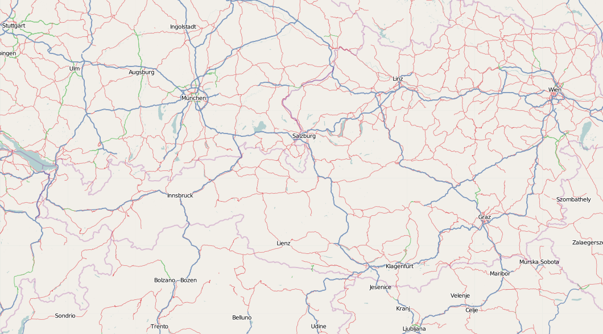
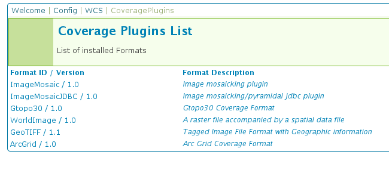
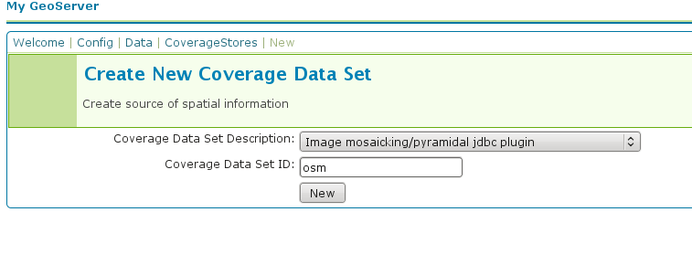
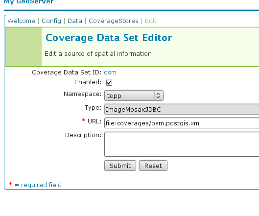
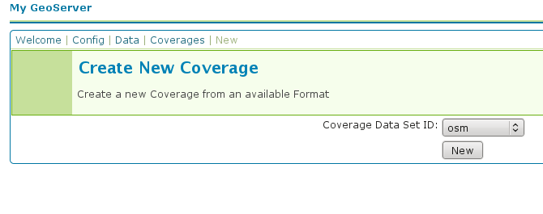
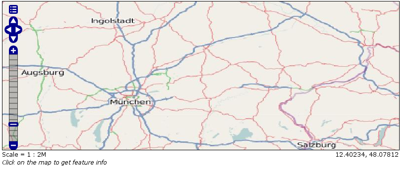

..  _imagemosaic-jdbc_tutorial:

Storing a coverage in a JDBC database
=====================================

.. warning:: The screenshots on this tutorial have not yet been updated for the 2.0.x user interface.  But most all the rest of the information should be valid, and the user interface is roughly the same, but a bit more easy to use.

Introduction
------------

This tutorial describes the process of storing a coverage along with its pyramids in a jdbc database. The ImageMosaic JDBC plugin is authored by Christian Mueller and is part of the geotools library.

The full documentation is available here:`<http://docs.geotools.org/latest/userguide/library/coverage/jdbc/index.html>`_

This tutorial will show one possible scenario, explaining step by step what to do for using this module in GeoServer (since Version 1.7.2)

Getting Started
---------------

We use postgis/postgres as database engine, a database named "gis" and start with an image from openstreetmap. We also need this utility  `<http://www.gdal.org/gdal_retile.html>`_ . The best way to install with all dependencies is downloading from here `<http://fwtools.maptools.org/>`_ 

Create a working directory, lets call it :file:`working` ,download this image with a right mouse click (Image save as ...) and save it as :file:`start_rgb.png`

Check your image with::
  
  gdalinfo start_rgb.png

This image has 4 Bands (Red,Green,Blue,Alpha) and needs much memory. As a rule, it is better to use images with a color table. We can transform with :command:`rgb2pct` (:command:`rgb2pct.py` on Unix).::

  rgb2pct -of png start_rgb.png start.png

Compare the sizes of the 2 files.

Afterwards, create a world file :file:`start.wld` in the :file:`working` directory with the following content.::

  0.0075471698
  0.0000000000
  0.0000000000
  -0.0051020408
  8.9999995849
  48.9999999796

Preparing the pyramids and the tiles
------------------------------------

If you are new to tiles and pyramids, take a quick look here `<http://northstar-www.dartmouth.edu/doc/idl/html_6.2/Image_Tiling.html>`_

How many pyramids are needed ?
------------------------------

Lets do a simple example. Given an image with 1024x1024 pixels and a tile size with 256x256 pixels.We can calculate in our brain that we need 16 tiles. Each pyramid reduces the number of tiles by a factor of 4. The first pyramid has 16/4 = 4 tiles, the second pyramid has only 4/4 = 1 tile.

Solution: The second pyramid fits on one tile, we are finished and we need 2 pyramids.

The formula for this:

**number of pyramids = log(pixelsize of image) / log(2) - log (pixelsize of tile) / log(2)**.

Try it: Go to Google and enter as search term "log(1024)/log(2) - log(256)/log(2)" and look at the result.

If your image is 16384 pixels , and your tile size is 512 pixels, it is

log(16384)/log(2) - log(512)/log(2) = 5

If your image is 18000 pixels, the result = 5.13570929. Thake the floor and use 5 pyramids. Remember, the last pyramid reduces 4 tiles to 1 tile, so this pyramid is not important.

If your image is 18000x12000 pixel, use the bigger dimension (18000) for the formula.

For creating pyramids and tiles, use `<http://www.gdal.org/gdal_retile.html>`_ from the gdal project.

The executeable for Windows users is :command:`gdal_retile.bat` or only :command:`gdal_retile`, Unix users call :command:`gdal_retile.py`

Create a subdirectory :file:`tiles` in your :file:`working` directory and execute within the :file:`working` directory::

  gdal_retile -co "WORLDFILE=YES"  -r bilinear -ps 128 128 -of PNG -levels 2 -targetDir tiles start.png

What is happening ? We tell gdal_retile to create world files for our tiles (-co "WORLDFILE=YES"), use bilinear interpolation (-r bilinear), the tiles are 128x128 pixels in size (-ps 128 128) , the image format should be PNG (-of PNG), we need 2 pyramid levels (-levels 2) ,the directory for the result is :file:`tiles` (-targetDir tiles) and the source image is :file:`start.png`.

.. note::

  A few words about the tile size. 128x128 pixel is proper for this example. Do not use such small sizes in a production environment. A size of 256x256 will reduce the number of tiles by a factor of 4, 512x512 by a factor of 16 and so on. Producing too much tiles will degrade performance on the database side (large tables) and will also raise cpu usage on the client side ( more image operations).

Now you should have the following directories

*	:file:`working` containing :file:`start.png` , :file:`start.wld` and a subdirectory :file:`tiles`.
*	:file:`working/tiles` containing many :file:`\*.png` files and associated :file:`\*.wld` files representing the tiles of :file:`start.png`
*	:file:`working/tiles/1` containing many :file:`\*.png` files and associated :file:`\*.wld` files representing the tiles of the first pyramid
*	:file:`working/tiles/2` containing many :file:`\*.png` files and associated :file:`\*.wld` files representing the tiles of the second pyramid 

Configuring the new map
-----------------------

The configuration for a map is done in a xml file. This file has 3 main parts.

#.	The connect info for the jdbc driver
#.	The mapping info for the sql tables
#.	Configuration data for the map

Since the jdbc connect info and the sql mapping may be reused by more than one map, the best practice is to create xml fragments for both of them and to use xml entity references to include them into the map xml.

First, find the location of the GEOSERVER_DATA_DIR. This info is contained in the log file when starting GeoServer.::

  ----------------------------------
  - GEOSERVER_DATA_DIR: /home/mcr/geoserver-1.7.x/1.7.x/data/release
  ----------------------------------

Put all configuration files into the :file:`coverages` subdirectory of your GeoServer data directory. The location in this example is 

:file:`/home/mcr/geoserver-1.7.x/1.7.x/data/release/coverages`

1) Create a file :file:`connect.postgis.xml.inc` with the following content

.. code-block:: xml 
   
    <connect>
      <!-- value DBCP or JNDI -->
      <dstype value="DBCP"/>
      <!--   <jndiReferenceName value=""/>  -->
      <username value="postgres" />
      <password value="postgres" />
      <jdbcUrl value="jdbc:postgresql://localhost:5432/gis" />
      <driverClassName value="org.postgresql.Driver"/>
      <maxActive value="10"/>
      <maxIdle value="0"/>
    </connect>
 
The jdbc user is "postgres", the password is "postgres", maxActive and maxIdle are parameters of the apache connection pooling, jdbcUrl and driverClassName are postgres specific. The name of the database is "gis".

If you deploy GeoServer into a J2EE container capable of handling jdbc data sources, a better approach is

.. code-block:: xml 
   
  <connect>
    <!-- value DBCP or JNDI -->
    <dstype value="JNDI"/>
    <jndiReferenceName value="jdbc/mydatasource"/>        
  </connect> 

For this tutorial, we do not use data sources provided by a J2EE container.

2) The next xml fragment to create is :file:`mapping.postgis.xml.inc`

.. code-block:: xml 

  <!-- possible values: universal,postgis,db2,mysql,oracle -->
  <spatialExtension name="postgis"/>
  <mapping>
      <masterTable name="mosaic" >
	<coverageNameAttribute name="name"/>
	<maxXAttribute name="maxX"/>
	<maxYAttribute name="maxY"/>
	<minXAttribute name="minX"/>
	<minYAttribute name="minY"/>
	<resXAttribute name="resX"/>
	<resYAttribute name="resY"/>
	<tileTableNameAtribute  name="TileTable" />
	<spatialTableNameAtribute name="SpatialTable" />
      </masterTable>
      <tileTable>
	<blobAttributeName name="data" />
	<keyAttributeName name="location" />
      </tileTable>
      <spatialTable>
	<keyAttributeName name="location" />
	<geomAttributeName name="geom" />
	<tileMaxXAttribute name="maxX"/>
	<tileMaxYAttribute name="maxY"/>
	<tileMinXAttribute name="minX"/>
	<tileMinYAttribute name="minY"/>
      </spatialTable>
  </mapping>
 
The first element ``<spatialExtension>`` specifies which spatial extension the module should use. "universal" means that there is no spatial db extension at all, meaning the tile grid is not stored as a geometry, using simple double values instead.

This xml fragment describes 3 tables, first we need a master table where information for each pyramid level is saved. Second and third, the attribute mappings for storing image data, envelopes and tile names are specified. To keep this tutorial simple, we will not further discuss these xml elements. After creating the sql tables things will become clear.

3) Create the configuration xml :file:`osm.postgis.xml` for the map (osm for "open street map") 

.. code-block:: xml 

  <?xml version="1.0" encoding="UTF-8" standalone="no"?>
  <!DOCTYPE ImageMosaicJDBCConfig [
    <!ENTITY mapping PUBLIC "mapping"  "mapping.postgis.xml.inc">
    <!ENTITY connect PUBLIC "connect"  "connect.postgis.xml.inc">]>
  <config version="1.0">
    <coverageName name="osm"/>
    <coordsys name="EPSG:4326"/>
    <!-- interpolation 1 = nearest neighbour, 2 = bilinear, 3 = bicubic -->
    <scaleop  interpolation="1"/>
    <verify cardinality="false"/>
    &mapping;
    &connect;
  </config>

This is the final xml configuration file, including our mapping and connect xml fragment. The coverage name is "osm", CRS is EPSG:4326. ``<verify cardinality="false">`` means no check if the number of tiles equals the number of rectangles stored in the db. (could be time consuming in case of large tile sets).

This configuration is the hard stuff, now, life becomes easier :-)

Using the java ddl generation utility
-------------------------------------

The full documentation is here: `<http://docs.geotools.org/latest/userguide/library/coverage/jdbc/ddl.html>`_

To create the proper sql tables, we can use the java ddl generation utility. This utility is included in the :file:`gt-imagemosaic-jdbc-{version}.jar`. Assure that this jar file is in your :file:`WEB-INF/lib` directory of your GeoServer installation.

Change to your :file:`working` directory and do a first test::
  
  java -jar <your_geoserver_install_dir>/webapps/geoserver/WEB-INF/lib/gt-imagemosaic-jdbc-{version}.jar

The reply should be::

  Missing cmd import | ddl

 
Create a subdirectory :file:`sqlscripts` in your :file:`working` directory. Within the :file:`working` directory, execute::

 java -jar <your_geoserver_install_dir>/webapps/geoserver/WEB-INF/lib/gt-imagemosaic-jdbc-{version}.jar ddl -config <your geoserver data dir >/coverages/osm.postgis.xml -spatialTNPrefix tileosm -pyramids 2 -statementDelim ";" -srs 4326 -targetDir sqlscripts
 
Explanation of parameters

.. list-table::
  :widths: 20 80

  * - **parameter** 
    - **description**
  * - ddl 
    - create ddl statements
  * - -config
    - the file name of our :file:`osm.postgis.xml` file
  * - -pyramids
    - number of pyramids we want
  * - -statementDelim
    - The SQL statement delimiter to use
  * - -srs 
    - The db spatial reference identifier when using a spatial extension
  * - -targetDir
    - output directory for the scripts
  * - -spatialTNPrefix
    - A prefix for tablenames to be created.

In the directory :file:`working/sqlscripts` you will find the following files after execution:

:file:`createmeta.sql`  :file:`dropmeta.sql` :file:`add_osm.sql` :file:`remove_osm.sql`

.. note::

  *IMPORTANT:*

  Look into the files :file:`createmeta.sql` and :file:`add_osm.sql` and compare them with the content of :file:`mapping.postgis.xml.inc`. If you understand this relationship, you understand the mapping.

The generated scripts are only templates, it is up to you to modify them for better performance or other reasons. But do not break the relationship to the xml mapping fragment.

Executing the DDL scripts
-------------------------

For user "postgres", databae "gis", execute in the following order::

  psql -U postgres -d gis  -f createmeta.sql
  psql -U postgres -d gis  -f add_osm.sql

To clean your database, you can execute :file:`remove_osm.sql` and :file:`dropmeta.sql` after finishing the tutorial.

Importing the image data
------------------------

The full documentation is here: `<http://docs.geotools.org/latest/userguide/library/coverage/jdbc/ddl.html>`_

First, the jdbc jar file has to be in the :file:`lib/ext` directory of your java runtime. In my case I had to copy :file:`postgresql-8.1-407.jdbc3.jar`.

Change to the :file:`working` directory and execute::

  java -jar <your_geoserver_install_dir>/webapps/geoserver/WEB-INF/lib/gt-imagemosaic-jdbc-{version}.jar import  -config <your geoserver data dir>/coverages/osm.postgis.xml -spatialTNPrefix tileosm -tileTNPrefix tileosm -dir tiles -ext png

This statement imports your tiles including all pyramids into your database.

Configuring GeoServer
---------------------

Start GeoServer and log in.Under :menuselection:`Config --> WCS --> CoveragePlugins` you should see 

If there is no line starting with "ImageMosaicJDBC", the :file:`gt-imagemosiac-jdbc-{version}.jar` file is not in your :file:`WEB-INF/lib` folder.
Go to :menuselection:`Config-->Data-->CoverageStores-->New` and fill in the formular

Press :guilabel:`New` and fill in the formular

Press :guilabel:`Submit`.

Press :guilabel:`Apply`, then :guilabel:`Save` to save your changes.

Next select :menuselection:`Config-->Data-->Coverages-->New` and select "osm".

Press :guilabel:`New` and you will enter the Coverage Editor. Press :guilabel:`Submit`, :guilabel:`Apply` and :guilabel:`Save`.

Under :menuselection:`Welcome-->Demo-->Map Preview` you will find a new layer "topp:osm". Select it and see the results 

If you think the image is stretched, you are right. The reason is that the original image is georeferenced with EPSG:900913, but there is no support for this CRS in postigs (at the time of this writing). So I used EPSG:4326. For the purpose of this tutorial, this is ok.

Conclusion
----------

There are a lot of other configuration possibilities for specific databases. This tutorial shows a quick cookbook to demonstrate some of the features of this module. Follow the links to the full documentation to dig deeper, especially if you are concerned about performance and database design.

If there is something which is missing, proposals are welcome.
