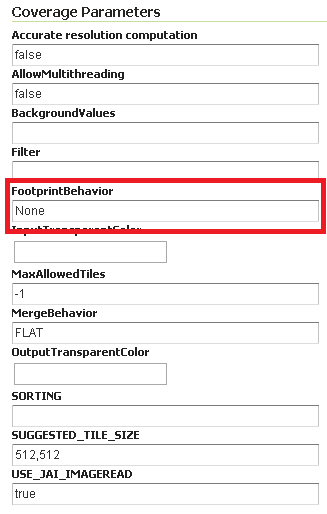
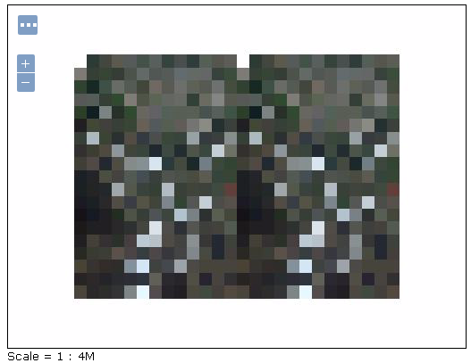
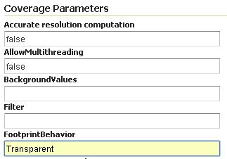

.. _tutorial_imagemosaic_footprint:

Using the ImageMosaic plugin with footprint mangement
=====================================================


Introduction
------------

This step-by-step tutorial describes how to associate Footprint to a raster data using the ImageMosaic plugin.

Footprint is a Shape used as a Mask for the mosaic. Masking can be useful for hiding pixels which are meaningless, or for enhancing only few regions of the image in respect to others.

This tutorial assumes knowledge of the concepts explained in :ref:`data_imagemosaic` section.

This tutorial contains two sections:

* The first section, **Configuration**, describes the possible configurations needed to set up an ImageMosaic with footprint.
* The second section, **Examples**, provides examples of configuration of an ImageMosaic with footprint.

Configuration
-------------
Footprint can be configured in three different ways:

1.	By using for each mosaic granule a *Sidecar File*, a Shapefile with the same name of the granule which contains the footprint for it;
2.  By using a single Shapefile called *footprints.shp* which contains all the footprints for each granule; each footprint is associated to a granule with the **location** attribute;
3.  By using a file called **footprints.properties** . 

The last option should be used when the first two are not available and requires to write the following piece of code inside the **footprints.properties** file::
	
	footprint_source=*location of the Shapefile*
	footprint_filter=*filter on the Shapefile searching for the attribute associated to each granule*
	
For example if a Shapefile called **fakeShapeFile** stores the various footprints in a table like this, where each *Name* attribute is referred to a granule file:

	.. figure:: img/shp_table.png
	
And the associated granules are:

	* ortho_1-1_1n_s_la087_2010_1.tif
	* ortho_2-2_1n_s_la075_2010_1.tif
	* ortho_1-1_1n_s_la103_2010_1.tif
	* and so on ...
	
The associated **footprints.properties** file must be like this::
	
	footprint_source=fakeShapeFile.shp
	footprint_filter=Name=strSubstring(granule.location, 0, strLength(granule.location) - 4)

The substring operation is done for comparing the footprint attribute names and the granule names without the *.tif* extension.

There are three possible behaviours for Footprint:
	
	* *None*: simply doesn't use the Footprint and behaves like a standard ImageMosaic layer;
	* *Transparent*: adds an alpha band of 0s on the image portions outside of the Footprint making them transparent, typically used for RGB data;
	* *Cut*: set the background value on the image portions outside of the Footprint, typically used for GrayScale data.
	
The behaviour must be set directly on the Layer configuration page.

Another feature of the *Footprint* is the possibility to calculate an **Inset** of the image. *Inset* is a reduction of the footprint border by a value defined by the user which 
is typically used for removing the compression artifacts. This feature can be achieved by adding the following code inside **footprints.properties** (in case of the first two configurations this file 
must be added)::

	footprint_inset=*value in the shapefile u.o.m.*
	footprint_inset_type=*full/border*
	
**Full** inset type calculates the inset for each footprint side while **Border** does the same operation but those straight lines that overlap the image bounds are avoided; this last parameter is useful for
images already cut in a regular grid.

Each modification of the **footprints.properties** file requires to *Reload* GeoServer. This operation can be achieved by going to :guilabel:`Server Status` and cliking on the 
:guilabel:`Reload` button on the bottom-right side of the page.

The two datasets used in the tutorial can be downloaded here: `Mosaic with a single image <http://demo.geo-solutions.it/share/tutorial/mosaic_single_tiff.zip>`_  which represents Boulder (Colorado), `Mosaic with multiple images <http://demo.geo-solutions.it/share/tutorial/mosaic_sample.zip>`_ which represents Italy. 
The first can be used for testing footprint configuration with a *Sidecar File* and the second for the other two configurations.

Examples
--------
 
Here are presented a few steps for configuring a new ImageMosaic layer with footprint.

Step 1: Create a new ImageMosaic Layer
``````````````````````````````````````

As seen before an ImageMosaic data store can be created by going to :menuselection:`Stores --> Add New Store --> ImageMosaic`.

.. figure:: ../../data/raster/imagemosaic/images/imagemosaicconfigure.png

An associated Layer can be created by going to :menuselection:`Layers --> Add New Resource`, choosing the name of the data store created above and then clicking on the :guilabel:`publish` button.

Step 2: Configuring a new Layer for the Mosaic
``````````````````````````````````````````````

Inside the new page the only field which is interesting for this tutorial is *FootprintBehavior*:


	
The user can set one of the three values for the Footprint behaviour as described above.
	
After that, the user must confirm the modification by clicking on the :guilabel:`Save` button on the bottom side of the page.

Step 3: Example Results
```````````````````````

Here are presented the results for each dataset.

Footprint configured with *Sidecar File*
""""""""""""""""""""""""""""""""""""""""

This is an example of mosaic without applying Footprint:
	
	.. figure:: img/footprint_normal.png
	
And this is the result of setting **FootprintBehavior** to *Cut*:

	.. figure:: img/footprint_cut.png
	
Background is gray because in this example the *BackgroundValues* field has been set to -20000.
	
If an Inset is added, the final mosaic is:

	.. figure:: img/footprint_cut_inset.png
	
	
The **footprints.properties** file is::

	footprint_inset=0.01
	footprint_inset_type=full

.. note:: Remember that each modification on **footprints.properties** requires a *Reload* of GeoServer for seeing the results.
	
.. note:: When configuring this mosaic you must set the *declared CRS* field to "EPSG:4326".


Footprint configured with *footprints.shp*
""""""""""""""""""""""""""""""""""""""""""

This is another example of mosaic without Footprint:

	.. figure:: img/footprint_mosaic_none.png
	
And now after setting **FootprintBehavior** to *Transparent* (no Inset is used) on the Layer:

	.. figure:: img/footprint_mosaic.png
	
Footprint configured with *footprints.properties*
"""""""""""""""""""""""""""""""""""""""""""""""""

.. note:: For testing this functionality the user must rename all the *footprints.xxx* files to *mask.xxx*.

The result of setting **FootprintBehavior** to *Transparent*, Inset type to *border* and Inset value to 0.00001 is:

	.. figure:: img/footprint_mosaic_prop.png
	
The **footprints.properties** file is::

	footprint_source=mask.shp
	footprint_inset=0.00001
	footprint_inset_type=border
	

Raster Masking
------------------------

From 2.8.x version, GeoServer is able to support also Raster Masks. Those masks can be internal or external (in which case the mask files should use the **.msk** extension), for each file. It is crucial that mask files should have the same pixel size, georeferencing and CRS as the image they are masking.

It must be pointed out that external/internal masks may have overviews like the related original images.

More information about Mask bands may be found at the `GDAL Mask Band Page <http://trac.osgeo.org/gdal/wiki/rfc15_nodatabitmask>`_

.. note :: Raster masking is supported for GeoTiff format only and it does not take into account inset definition. The same support is used for ImageMosaic or ImagePyramids made of GeoTiff files.

A **footprints.properties** file that would exploit raster masks would be as follows::

	footprint_source=raster
	
.. note:: Raster masks do not support to control inset.

Below you may find an example of configuring a Mosaic with Raster masks:

Step 1: Create a new ImageMosaic Layer
``````````````````````````````````````
Download data from the following :download:`link <rastermask.zip>` and configure an ImageMosaic layer called *rastermask* without changing default configuration parameters.

Zip file contains two images and their related **.msk** files. For this example the two masks are two simple squares. 

Step 2: Watch the layer using LayerPreview
```````````````````````````````````````````

Go to :menuselection:`LayerPreview --> rastermask --> OpenLayers`. The result should be similar to the one below.




Step 3: Change the Footprint Behavior
``````````````````````````````````````
Change the **FootprintBehavior** parameter to *Transparent*. *Cut* value should not be used since the files are RGB.



Step 4: Check the result
``````````````````````````````````````
Go to :menuselection:`LayerPreview --> rastermask --> OpenLayers`. The result should be changed now.

.. figure:: img/footprint_transparent.png


Multilevel Geometry Masking
---------------------------

From 2.14.x version, GeoServer is able to support also multilevel overviews geometries (A geometry footprint for each overview, being stored on a separate sidecar file).


A **footprints.properties** file that would exploit multiple WKB sidecar files would be as follows::

	footprint_source=multisidecar
	footprintLoaderSPI=org.geotools.coverage.grid.io.footprint.WKBLoaderSPI
	overviewsFootprintLoaderSPI=org.geotools.coverage.grid.io.footprint.WKBLoaderSPI
	overviewsRoiInRasterSpace=True
	overviewsSuffixFormat=_%d
	
Notes:
	
	* *footprintLoaderSPI*: Contains the fully qualified name of the SPI implementation for main footprint loading (Optional property. When not specified, the proper footprint loader will be automatically found by scanning the available SPIs). Currently supported values are:

		* org.geotools.coverage.grid.io.footprint.WKBLoaderSPI for WKB overviews
		* org.geotools.coverage.grid.io.footprint.WKTLoaderSPI for WKT overviews
		* org.geotools.gce.imagemosaic.catalog.ShapeFileLoaderSPI for Shapefile overviews
	* *overviewsFootprintLoaderSPI*: Contains the fully qualified name of the SPI implementation for overviews footprints loading (Optional property. When not specified, same loader as footprintLoaderSpi will be used if provided);
	* *overviewsRoiInRasterSpace*: Specifies whether the overviews ROI footprint geometrys are in raster space or model space coordinates. (Optional property. Default is False, meaning that overviews footprints are in model space);
	* *overviewsSuffixFormat*: Specifies the String format syntax used to define the suffix of the overviews footprints file name. (Optional property. Default is \_%d). To give an example, if granule file is R1C1.tif and related 1st overview footprint is stored into R1C1_1.wkt, overviewsSuffixFormat should be \_%d. In case 1st overview footprint is stored into R1C1-Ov1.wkt, overviewsSuffixFormat should be -Ov%d.

Same steps of previous section are required to configure an ImageMosaic layer with footprint management.
