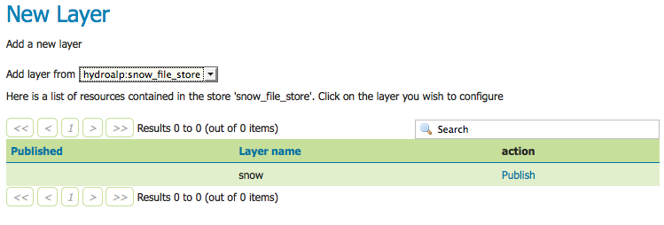
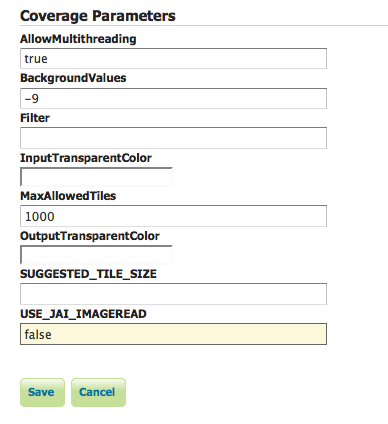
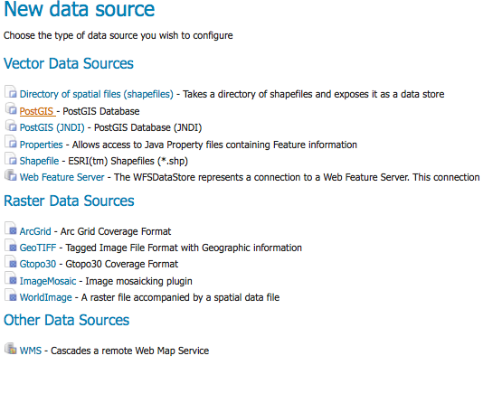
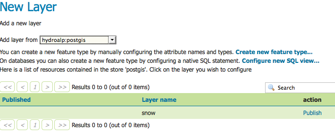
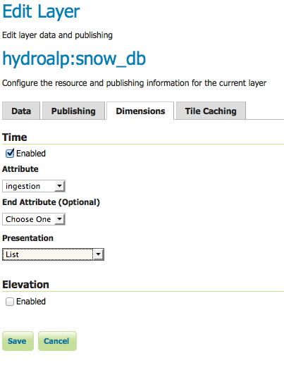

.. _tutorial_imagemosaic_timeseries:

Using the ImageMosaic plugin for raster time-series data
========================================================


Introduction
------------

This step-by-step tutorial describes how to build a time-series coverage using the ImageMosaic plugin. The ImageMosaic plugin allows the creation of a time-series layer of a raster dataset. The single images are held in a queryable structure to allow access to a specific dataset with a temporal filter.

This tutorial assumes knowledge of the concepts explained in :ref:`data_imagemosaic` section.

This tutorial contains four sections:

* The first section, **Configuration**, describes the configuration files needed to set up an ImageMosaic store from GeoServer.
* The second section, **Configuration examples**, providing examples of the configuration files needed.
* The last two sections, **Coverage based on filestore** and **Coverage based on database** describe, once the previous configurations steps are done, how to create and configure an ImageMosaic store using the GeoServer GUI.

The dataset used in the tutorial can be downloaded :download:`Here <snowLZWdataset.zip>`. It contains 3 image files and a .sld file representing a style needed for correctly render the images.

Configuration
-------------
To support time-series layers, GeoServer needs to be run in a web container that has the **timezone properly configured**. To set the time zone to be Coordinated Universal Time (UTC), add this switch when launching the java process::

-Duser.timezone=GMT

If using a shapefile as the mosaic index store (see next section), another java process option is needed to enable support for timestamps in shapefile stores::

-Dorg.geotools.shapefile.datetime=true

.. note:: Support for timestamp is not part of the DBF standard (used in shapefile for attributes). The DBF standard only supports Date, and only few applications understand it. As long as shapefiles are only used for GeoServer input that is not a problem, but the above setting will cause issues if you have WFS enabled and users also download shapefiles as GetFeature output: if the feature type extracted has timestamps, then the generated shapefile will have as well, making it difficult to use the generated shapefile in desktop applications. As a rule of thumb, if you also need WFS support it is advisable to use an external store (PostGIS, Oracle) instead of shapefile. Of course, if all that's needed is a date, using shapefile as an index without the above property is fine as well.

In order to load a new CoverageStore from the GeoServer GUI two steps are needed:

1. Create a new directory in which you store all the raster files (the mosaic granules) and three configuration files. This directory represents the **MOSAIC_DIR**.
2. Install and setup a DBMS instance, this DB is that one where the mosaic indexes will be stored.


MOSAIC_DIR and the Configuration Files
``````````````````````````````````````

The user can name and place the **MOSAIC_DIR** as and where they want.

The **MOSAIC_DIR** contains all mosaic granules files and the 3 needed configuration files. The files are in ``.properties`` format.

.. note:: Every tif file must follow the same naming convention. In this tutorial will be used {coveragename}_{timestamp}.tif

In a properties file you specify your properties in a  key-value manner: e.g. `myproperty=myvalue`

The configuration files needed are:

1. **datastore.properties**: contains all relevant information responsible for connecting to the database in which the spatial indexes of the mosaic will be stored
2. **indexer.properties**: specifies the name of the time-variant attribute, the elevation attribute and the type of the attributes
3. **timeregex.properties**: specifies the regular expression used to extract the time information from the filename.

All the configuration files must be placed in the root of the **MOSAIC_DIR**. The granule images could be placed also in **MOSAIC_DIR** subfolders.

Please note that **datastore.properties** isn't mandatory. The plugin provides two possibilities to access to time series data:

* **Using a shapefile** in order to store the granules indexes. That's the default behavior without providing the *datastore.properties* file.
* **Using a DBMS**, which maps the timestamp to the corresponding raster source. The former uses the **time** attribute for access to the granule from the mapping table. 

For production installation is strong recommended the usage of a DBMS instead of shapefile in order to improve performances. 

Otherwise the usage of a shapefile could be useful in development and test environments due to less configurations are needed.

datastore.properties
""""""""""""""""""""

Here is shown an example of datastore.properties suitable for Postgis.

.. list-table::
   :widths: 15 20 75

   * - **Parameter**
     - **Mandatory**
     - **Description**
   * - *SPI*
     - **Y**
     - The factory class used for the datastore e.g. org.geotools.data.postgis.PostgisNGDataStoreFactory
   * - *host*
     - **Y**
     - The host name of the database.
   * - *port*
     - **Y**
     - The port of the database
   * - *database*
     - **Y**
     - The name/instance of the database.
   * - *schema*
     - **Y**
     - The name of the database schema.
   * - *user*
     - **Y**
     - The database user.
   * - *passwd*
     - **Y**
     - The database password.    
   * - *Loose bbox*
     - **N** default 'false'
     - Boolean value to specify if loosing the bounding box.    
   * - *Estimated extend*
     - **N** default 'true'
     - Boolean values to specify if the extent of the data should be estimated.    
   * - *validate connections*
     - **N** default 'true'
     - Boolean value to specify if the connection should be validated.    
   * - *Connection timeout*
     - **N** default '20'
     - Specifies the timeout in minutes.    
   * - *preparedStatements*
     - **N** default 'false'
     - Boolean flag that specifies if for the database queries prepared statements should be used. This improves performance, because the database query parser has to parse the query only once     

.. note:: The first 8 parameters are valid for each DBMS used, the last 4 may vary from different DBMS. for more information see `GeoTools JDBC documentation <http://docs.geotools.org/latest/userguide/library/jdbc/index.html>`_
 
indexer.properties
""""""""""""""""""
.. list-table::
   :widths: 15 5 80

   * - **Parameter**
     - **Mandatory**
     - **Description**
   * - *TimeAttribute*
     - N
     - Specifies the name of the time-variant attribute
   * - *ElevationAttribute*
     - N
     - Specifies the name of the elevation attribute.
   * - *Schema*
     - Y
     - A comma separated sequence that describes the mapping between attribute and the data type.
   * - *PropertyCollectors*
     - Y
     - Specifies the extractor classes.

.. warning:: **TimeAttribute** is not a mandatory param but for the purpose of this tutorial is needed.
	 
timeregex.properties
""""""""""""""""""""
.. list-table::
   :widths: 15 5 80

   * - **Parameter**
     - **Mandatory**
     - **Description**
   * - *regex*
     - Y
     - Specifies the pattern used for extracting the information from the file

After this you can create a new ImageMosaic datastore.

Install and setup a DBMS instance
`````````````````````````````````
First of all, note that the usage of a DBMS to store the mosaic indexes **is not mandatory**. If the user does not create a `datastore.properties` file in the MOSAIC_DIR, then the plugin will use a **shapefile**. The shapefile will be created in the MOSAIC_DIR.

Anyway, especially for large dataset, **the usage of a DBMS is strongly recommended**. The ImageMosaic plugin supports all the most used DBMS. 

The configuration needed are the basics: create a new empty DB with geospatial extensions, a new schema and configure the user with W/R grants.

If the user wants to avoid to manually create the DB, it will be automatically generated by the ImageMosaic plugin taking the information defined inside the `datastore.properties` file. 

.. note:: In case of automatic DB creation with PostgreSQL the user must check the PostgreSQL and PostGIS versions: if the first is lower than 9.1 and the second is lower than 2.0, the user have to add the following string of code inside the `datastore.properties` file :

	.. code-block:: xml

		create\ database\ params=WITH\ TEMPLATE\=template_postgis

	(Specifying the proper PostGIS template... in this example: *template_postgis*).

This tutorial shows use of PostgreSQL 9.1 together with PostGIS 2.0.

Configuration examples
---------------------- 

As example is used a set of data that represents hydrological data in a certain area in South Tyrol, a region in northern Italy. The origin data was converted from asc format to TIFF using the GDAL **gdal translate** utility. 

For this running example we will create a layer named snow.

As mentioned before the files could located in any part of the file system.

In this tutorial the chosen MOSAIC_DIR directory is called ``hydroalp`` and is placed under the root of the GEOSERVER_DATA_DIR.


Configure the MOSAIC_DIR:
`````````````````````````
This part showsn an entire MOSAIC_DIR configuration.


datastore.properties:
"""""""""""""""""""""
.. include:: src/datastore.properties
   :literal:

.. note:: In case of a missing datastore.properties file a shape file is created to hold the indexes.


Granules Naming Convention
"""""""""""""""""""""""""""
Here an example of the granules naming that satisfies the rule shown before:

.. include:: src/tiffiles.out
   :literal:


timeregex.properties:
"""""""""""""""""""""
In the timeregex property file you specify the pattern describing the date(time) part of the file names. In this example it consists simply of 8 digits as specified below. 

.. include:: src/timeregex.properties
   :literal:


indexer.properties:
"""""""""""""""""""
Here the user can specify the information that GeoServer uses to create the index table in the database. In this example, the time values are stored in the column ingestion.

.. include:: src/indexer.properties
   :literal:

   
Create and Publish an ImageMosaic store:
----------------------------------------

Step 1: Create new ImageMosaic data store
`````````````````````````````````````````
We create a new data store of type raster data and choose ImageMosaic.

.. figure:: img/step_1_1.png
   :align: center


.. note:: Be aware that GeoServer creates a table which is identical with the name of your layer. If the table already exists, it will not be dropped from the DB and the following error message will appear. The same message wwill appear if the generated property file already exists in the directory or there are incorrect connection parameters in datastore.properties file.

.. figure:: img/errormessage.png
   :align: center


Step 2: Specify layer
```````````````````````
We specify the directory that contains the property and TIFF files (path must end with a slash) and add the layer. 



   
Step 3: Set coverage parameters
```````````````````````````````
The relevant parameters are AllowMultithreading and USE_JAI_IMAGEREAD. Do not forget to specify the background value according to your the value in your tif file. If you want to control which granule is displayed when a number of images match the time period specified then set the SORTING parameter to the variable name you want to use for sorting followed by a space and either D or A for descending or ascending. Descending values will mean that the latest image in a series that occurs in the time period requested is shown.



Remember that for display correctly the images contained in the provided dataset a custom style is needed.

Set as default style the *snow_style.sld* contained in the dataset archive.

More information about raster styling can be found in chapter :ref:`sld_cookbook_rasters`
   
Step 4: Set temporal properties
```````````````````````````````
In the Dimensions tab you can specify how the time attributes are represented. 

By enabling the Time or Elevation checkbox you can specify the how these dimensions will be presented. 
In this example, queries are only over the time attribute. 

Below is shown a snippet of the Capabilities document for each presentation case:

Setting the presentation to **List**, all mosaic times are listed:

.. code-block:: xml

	<Dimension name="time" default="current" units="ISO8601">
		2009-10-01T00:00:00.000Z,2009-11-01T00:00:00.000Z,2009-12-01T00:00:00.000Z,2010-01-01T00:00:00.000Z,2010-02-01T00:00:00.000Z,2010-03-01T00:00:00.000Z,2010-04-01T00:00:00.000Z,2010-05-01T00:00:00.000Z,2010-06-01T00:00:00.000Z,2010-07-01T00:00:00.000Z,2010-08-01T00:00:00.000Z,2010-09-01T00:00:00.000Z,2010-10-01T00:00:00.000Z,2010-11-01T00:00:00.000Z,2010-12-01T00:00:00.000Z,2011-01-01T00:00:00.000Z,2011-02-01T00:00:00.000Z,2011-03-01T00:00:00.000Z,2011-04-01T00:00:00.000Z,2011-05-01T00:00:00.000Z,2011-06-01T00:00:00.000Z,2011-07-01T00:00:00.000Z,2011-08-01T00:00:00.000Z,2011-09-01T00:00:00.000Z
	</Dimension>
	
Setting the presentation to **Continuous interval** only the start, end and interval extent times are listed:

.. code-block:: xml

	<Dimension name="time" default="current" units="ISO8601">
		2009-10-01T00:00:00.000Z/2011-09-01T00:00:00.000Z/P1Y11MT10H
	</Dimension>


Setting the presentation to **Interval and resolutions** gives to user the possibility to specify the resolutions of the interval:

.. code-block:: xml

	<Dimension name="time" default="current" units="ISO8601">
		2009-10-01T00:00:00.000Z/2011-09-01T00:00:00.000Z/P1DT12H
	</Dimension>

In this case the resolution is set to 1.5 days.

.. note:: To visualize the GetCapabilities document, go to the GeoServer homepage, and click on the WMS 1.3.0 link under the tab labeled **Service Capabilities**.

For this tutorial the Presentation attribute is set to **List**

.. figure:: img/step_2_2.png
   :align: center


After this steps the new layer is available in GeoServer. GeoServer will create a property file in the source directory. GeoServer will either create a shapefile for the mosaic indexes, or will create a table on the database (named the same as the layer name) for the index.


Generated property file:
""""""""""""""""""""""""

.. include:: src/snow.properties
   :literal:

.. note:: The parameter **Caching=false** is important to allow the user is to update manually the mosaic, by adding to and removing granules from MOSAIC_DIR and updating the appropriate database entry.
   
Generated table:
""""""""""""""""

.. figure:: img/step_2_3.png
   :align: center


.. note:: The user must create manually the index on the table in order to speed up the search by attribute.
   
Step 5: query layer on timestamp: 
`````````````````````````````````

In order to display a snapshot of the map at a specific time instant you have to pass in the request an additional time parameter with a specific notation
**&time=** < **pattern** > where you pass a value that corresponds to them in the filestore. The only thing is the pattern of the time value is slightly different.

For example if an user wants to obtain the snow coverage images from the months **Oct,Nov,Dec 2009**, pass in each request **&time=2009-10-01**, **&time=2009-11-01** and **&time=2009-12-01**. You can recognize in the three images how the snow coverage changes. Here the color blue means a lot of snow.


.. figure:: img/step_3.png
   :align: center
   

Create and publish a Layer from mosaic indexes:
-----------------------------------------------

After the previous steps it is also possible to create a layer that represents the spatial indexes of the mosaic. This is an useful feature when handling a large dataset of mosaics with high resolutions granules, since the user can easily get the footprints of the images. In this case will be rendered only the geometries stored on the indexes tables.

Step 1: add a postgis datastore:
````````````````````````````````


and specify the connection parameters

.. figure:: img/create_postgis_store.png
   :align: center

   
Step 2: add database layer:
```````````````````````````

Choose from the created datastore the table that you want to publish as a layer.



   
Step 3: specify dimension:
````````````````````````````
In the tab Dimension specify the time-variant attribute and the form of presentation.


  
That's it. Now is possible query this layer too. 
