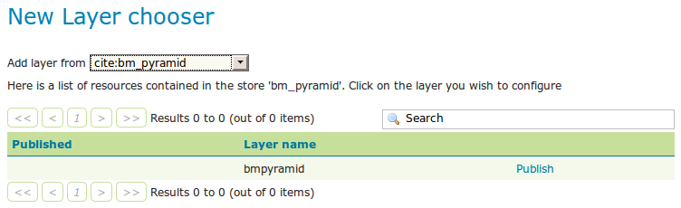

.. _tutorials_imagepyramid:

Building and using an image pyramid
===================================

GeoServer can efficiently deal with large TIFF with overviews, as long as the TIFF is below the 2GB size limit.

Once the image size goes beyond such limit it's time to start considering an image pyramid instead.

An image pyramid builds multiple mosaics of images, each one at a different zoom level, making it so that each tile is stored in a separate file. This comes with a composition overhead to bring back the tiles into a single image, but can speed up image handling as each overview is tiled, and thus a sub-set of it can be accessed efficiently (as opposed to a single GeoTIFF, where the base level can be tiled, but the overviews never are).

This tutorial shows how to build an image pyramid with open source utilities and how to load it into GeoServer. The tutorial assumes you're running at least GeoServer 2.0.2.

Building a pyramid
------------------

For this tutorial we have prepared a `sample BlueMarble TNG subset <http://data.opengeo.org/bmreduced.tiff>`_ in GeoTIFF form. The image is tiled and JPEG compressed, without overviews. Not exactly what you'd want to use for high performance data serving, but good for redistribution and as a starting point to build a pyramid.

In order to build the pyramid we'll use the `gdal_retile.py <http://www.gdal.org/gdal_retile.html>`_ utility, part of the GDAL command line utilities and available for various operating systems (if you're using Microsoft Windows look for `FWTools <http://fwtools.maptools.org/>`_).

The following commands will build a pyramid on disk::

   mkdir bmpyramid
   gdal_retile.py -v -r bilinear -levels 4 -ps 2048 2048 -co "TILED=YES" -co "COMPRESS=JPEG" -targetDir bmpyramid bmreduced.tiff
   
The `gdal_retile.py  <http://www.gdal.org/gdal_retile.html>`_ user guide provides a detailed explanation for all the possible parameters, here is a description of the ones used in the command line above:
   
  * `-v`: verbose output, allows the user to see each file creation scroll by, thus knowing progress is being made (a big pyramid construction can take hours)
  * `-r bilinear`: use bilinear interpolation when building the lower resolution levels. This is key to get good image quality without asking GeoServer to perform expensive interpolations in memory
  * `-levels 4`: the number of levels in the pyramid
  * `-ps 2048 2048`: each tile in the pyramid will be a 2048x2048 GeoTIFF
  * `-co "TILED=YES"`: each GeoTIFF tile in the pyramid will be inner tiled
  * `-co "COMPRESS=JPEG"`: each GeoTIFF tile in the pyramid will be JPEG compressed (trades small size for higher performance, try out it without this parameter too)
  * `-targetDir bmpyramid`: build the pyramid in the bmpyramid directory. The target directory must exist and be empty
  * `bmreduced.tiff`: the source file
  
This will produce a number of TIFF files in bmpyramid along with the sub-directories `1`, `2,` `3`, and `4`.
   
Once that is done, and assuming the GeoServer image pyramid plug-in is already installed, it's possible to create the coverage store by pointing at the directory containing the pyramid and clicking save:

.. figure:: configureStore.png
   :align: center
   
   *Configuring a image pyramid store*

When clicking save the store will look into the directory, recognize a `gdal_retile` generated structure and perform some background operations:

  - move all tiff files in the root to a newly create directory `0`
  - create an image mosaic in all sub-directories (shapefile index plus property file)
  - create the root property file describing the whole pyramid structure
  
Once that is done the user will be asked to choose a coverage, which will be named after the pyramid root directory:

   *Choosing the coverage for publishing*

Publish the layer, and then setup the layer parameter `USE_JAI_IMAGEREAD` to `false` to get better scalability:

.. figure:: layerParams.png
   :align: center

   *Tuning the pyramid parameters*

Submit and go to the preview, the pyramid should be ready to use:

.. figure:: preview.png
   :align: center

   *Previewing the pyramid*

Notes on big pyramids
---------------------

The code that is auto-creating the pyramid indexes and metadata files might take time to run, especially if:

  - the pyramid zero level is composed of many thousands of files
  - the system is busy with the disk already and that results in higher times to move all the files to the `0` directory

If the delay is too high the request to create the store will time out and might break the pyramid creation.
So, in case of very big pyramids consider loosing some of the comfort and creating the `0` directory and moving the files by hand::

  cd bmpyramid
  mkdir 0
  mv *.tiff 0
  

