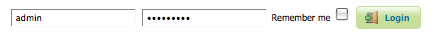

.. _webadmin_basics:

Interface basics
================

This section will introduce the basic concepts of the web administration interface (generally abbreviated to "web admin" .)

Welcome Page
------------

For most installations, GeoServer will start a web server on localhost at port 8080, accessible at the following URL::

   http://localhost:8080/geoserver/web

.. note:: This URL is dependent on your installation of GeoServer. When using the WAR installation, for example, the URL will be dependent on your container setup.

When correctly configured, a welcome page will open in your browser.

.. figure:: images/web-admin.png
   :align: center
   
   *Welcome Page*
   
The welcome page contains links to various areas of the GeoServer configuration. The :guilabel:`About GeoServer` section in the :guilabel:`Server` menu provides external links to the GeoServer documentation, homepage, and bug tracker. The page also provides login access to the geoserver console. This security measure prevents unauthorized users from making changes to your GeoServer configuration. The default username and password is ``admin`` and ``geoserver``. These can be changed only by editing the :file:`security/users.properties` file in the :ref:`data_directory`. 

   
   *Login*

Regardless of authorization access, the web admin menu links to the :guilabel:`Demo` and :guilabel:`Layer Preview` portion of the console. The :ref:`webadmin_demos` page contains links to various information pages, while the :ref:`layerpreview` page provides spatial data in various output formats.

When logged on, additional options will be presented.

.. figure:: images/welcome_logged_in.png
   :align: center
   
   *Additional options when logged in*

Geoserver Web Coverage Service (WCS), Web Feature Service (WFS), and Web Map Service (WMS) configuration specifications can be accessed from this welcome page as well. For further information, please see the section on :ref:`services`.

.. _webadmin_lists:

List Pages
----------

Some web admin pages show list views of configuration data type items available in the GeoServer instance.
The page displays links to the items, and where applicable their parent items as well.
To facilitate working with large sets of items, list views allow sorting and searching across all items in the data type.

In the example below, the :ref:`webadmin_layers` page displays a list of layers along with links to their parent :ref:`webadmin_stores` and :ref:`webadmin_workspaces`. 

.. figure:: images/data_layers.png
   :align: center

   *Layers list page*

Sorting
^^^^^^^

To sort a column alphabetically, click the column header. 

.. figure:: images/data_sort.png
   :align: center

   *Unsorted (left) and sorted (right) columns*

Searching
^^^^^^^^^

Searching can be used to filter the number of items displayed.  This is useful for working with data types that contain a large number of items.

To search data type items, enter the search string in the search box and click Enter. GeoServer will search the data type for items that match your query, and display a list view showing the search results.

.. figure:: images/data_search_results.png
   :align: center
   
   *Search results for the query "top" on the Workspace page*

