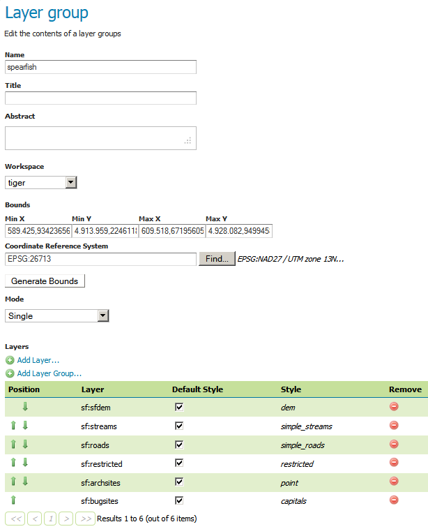
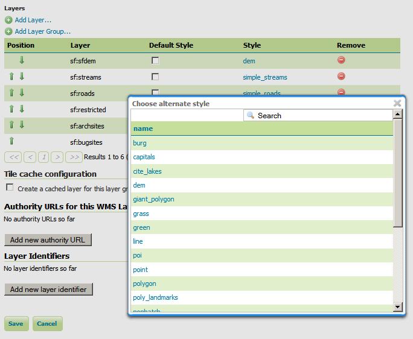
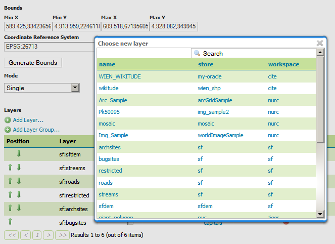
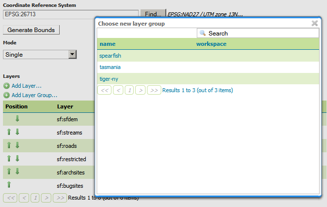
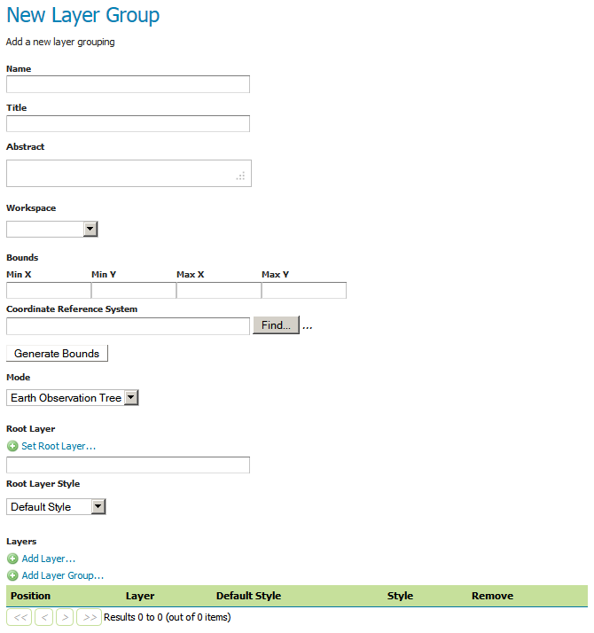

.. _webadmin_layergroups:

Layer Groups
============

A layer group is a container in which layers and other layer groups can be organized in a hierarchical structure. A layer group can be referred to by a single name in WMS requests.  This allows simpler requests, as one layer can be specified instead of multiple individual layers.
A layer group also provides a consistent, fixed ordering of the layers it contains, and can specify different (non-default) styles for layers.

Layer group behaviour can be configured by setting its :guilabel:`mode`. There are 4 available values:

* **single**: the layer group is exposed as a single layer with a name.
* **named tree**: the layer group can be referred to by one name, but also exposes its nested layers and groups in the capabilities document.
* **container tree**: the layer group is exposed in the capabilities document, but does not have a name, making it impossible to render it on its own. This is called "containing category" in the WMS specification.
* **Earth Observation tree**: a special type of group created to manage the WMS Earth Observation requirements. This group does not render its nested layers and groups, but only a "preview layer" called Root Layer. When this mode is chosen, a new field "Root Layer" will be exposed in the configuration UI.

If a layer is included in any non *single* mode group, it will no longer be listed in the flat layer list.  It will still be possible to include the layer in other layer groups. 

.. figure:: ../images/data_layergroups.png
   :align: center

   *Layer Groups page*

Edit Layer Group
----------------

To bring up the layer group edit page, click a layer group name. The initial fields allow you configure the name, title, abstract, workspace, bounds, projection and mode of the layer group. To automatically set bounding box, select the :guilabel:`Generate Bounds` button. You may also provide your own custom bounding box parameters. To select an appropriate projection click the :guilabel:`Find` button.

.. note:: A layer group can consist of layers with dissimilar bounds and projections. GeoServer will automatically reproject all layers to the projection of the layer group.

.. figure:: ../images/data_layergroups_edit_table.png
   :align: center

   *Layer Groups Edit page*

The table at the bottom of the page lists layers and groups contained within the current layer group. We refer to layers and layer groups as :guilabel:`publishable elements`. When a layer group is processed, the layers are rendered in the order provided, so the :guilabel:`publishable elements` at the bottom of list will be rendered last and will show on top of the other :guilabel:`publishable elements`.

A :guilabel:`publishable element` can be positioned higher or lower on this list by clicking the green up or down arrows, respectively. The layer at the top of the list is the first one to be painted, the layer below it will be painted second, and so on, the last layer will be painted on top of all others (this is the so called "painter's model").

The :guilabel:`Style` column shows the style associated with each layer. To change the style associated with a layer, click the appropriate style link. A list of enabled styles will be displayed. Clicking on a style name reassigns the layer's style.

   
   *Style editing for a layer within a layer group*

To remove a :guilabel:`publishable element` from the layer group, select its button in the :guilabel:`Remove` column. You will now be prompted to confirm or cancel this deletion.

A layer can be added to the list by clicking the :guilabel:`Add Layer...` button at the top of the table. From the list of layers, select the layer to be added by clicking the layer name. The selected layer will be appended to the bottom of the :guilabel:`publishable` list. 

   *Dialog for adding a layer to a layer group*

A layer group can be added by clicking the :guilabel:`Add Layer Group...` button at the top of the table. From the list of layer groups, select the layer group to be added by clicking its name. The selected group will be appended to the bottom of the :guilabel:`publishable` list. 

   *Dialog for adding a layer group to a layer group*

You can view layer groups in the :ref:`layerpreview` section of the web admin.

.. figure:: ../images/data_layergroups_tasmania.png
   :align: center 

   *Openlayers preview of the layer group "tasmania"*

Add a Layer Group
-----------------

The buttons for adding and removing a layer group can be found at the top of the :guilabel:`Layer Groups` page. 

.. figure:: ../images/data_layergroups_add.png
   :align: center

   *Buttons to add or remove a layer group*
   
To add a new layer group, select the "Add a new layer group" button. You will be prompted to name the layer group.
   
.. figure:: ../images/data_layergroups_name.png
   :align: center

   *New layer group dialog*

When finished, click :guilabel:`Submit`. You will be redirected to an empty layer group configuration page. Begin by adding layers by clicking the :guilabel:`Add layer...` button (described in the previous section). Once the layers are positioned accordingly, press :guilabel:`Generate Bounds` to automatically generate the bounding box and projection. Press :guilabel:`Save` to save the new layer group.

   *New layer group configuration page*

Remove a layer group
--------------------

To remove a layer group, click the check box next to the layer group. Multiple layer groups can be selected for batch removal. Click the :guilabel:`remove selected layer group(s)` link. You will be asked to confirm or cancel the deletion. Selecting :guilabel:`OK` successfully removes the layer group. 
 
.. figure:: ../images/data_layergroups_delete.png
   :align: center
   
   *Removing a layer group*
