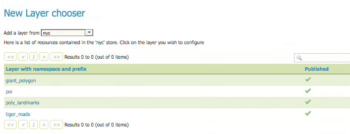
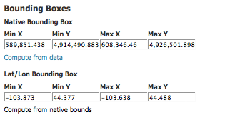
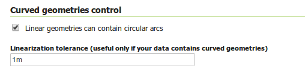
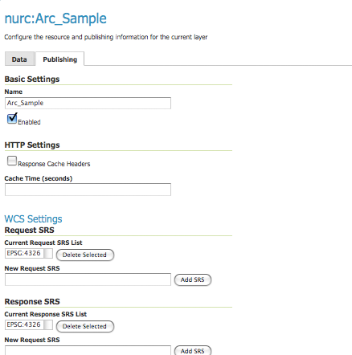

.. _webadmin_layers:

Layers
======

In GeoServer, the term "layer" refers to raster or vector data that contains a collection of geographic features. Vector layers are analogous to "featureTypes" and raster layers are analogous to "coverages". All layers have a source of data, known as a Store.

In the Layers section of the web interface, you can view and edit existing layer, add (register) a new layer, or delete (unregister) a layer. The Layers View page displays the not only the list of layers, but the Store and Workspace where those layers are contained. The View page also displays the layer's status and native SRS.

.. figure:: ../images/data_layers.png

   Layers View
   
Layer types
-----------

Layers can be divided into two types of data: raster and vector. These two formats differ in how they store spatial information. Vector types store information about feature types as mathematical paths—a point as a single x,y coordinate, lines as a series of x,y coordinates, and polygons as a series of x,y coordinates that start and end on the same place. Raster format data is a cell-based representation of features on the earth surface. Each cell has a distinct value, and all cells with the same value represent a specific feature. 

.. list-table::
   :widths: 5 70 
   :header-rows: 1

   * - Field
     - Description
   * - .. image:: ../images/data_layers_type1.png
     - raster (grid)
   * - .. image:: ../images/data_layers_type2.png
     - vector (feature)  

Add or delete a layer
---------------------

At the upper left-hand corner of the layers view page there are two buttons for the adding and deletion of layers. The green plus button allows you to add a new layer, referred to as resource. The red minus button allows you to remove selected layers. 

.. figure:: ../images/data_layers_add_remove.png
   
   Buttons to Add or Remove a Layer

Clicking the :guilabel:`Add a new resource` button brings up a :guilabel:`New Layer Chooser` panel. The menu displays all currently enabled stores. From this menu, select the Store where the layer should be added. 

.. figure:: ../images/data_layers_add_chooser.png

   List of all currently enabled stores

Upon selection of a Store, a view table of existing layers within the selected store will be displayed. In this example, ``giant_polygon``, ``poi``, ``poly_landmarks`` and ``tiger_roads`` are all layers within the NYC store. 

   
   View of all layers

On selecting a layer name, you are redirected to a :ref:`layer edit page <webadmin_layers_edit_data>`. 

To delete a layer, click the check box on the left side of each layer row. As shown below, multiple layers can be selected for removal on a single results page. It should be noted, however, that selections for removal will not persist from one results pages to the next. 
  
.. figure:: ../images/data_layers_delete.png
   
   Some layers selected for deletion

All layers can be selected for removal by selecting the check box in the header row. 

.. figure:: ../images/data_layers_delete_all.png
   
   All layers selected for deletion

Once layer(s) are selected, the :guilabel:`Remove selected resources` link is activated. Once you've clicked the link, you will be asked to confirm or cancel the deletion. Selecting :guilabel:`OK` successfully deletes the layer. 
     
.. _webadmin_layers_edit_data:

Edit Layer: Data 
----------------

Clicking the layer name opens a layer configuration panel. The :guilabel:`Data` tab, activated by default, allows you to define and change data parameters for a layer. 

.. figure:: ../images/data_layers_edit_data.png
   
   Edit Layer: Data tab

Basic Info
^^^^^^^^^^

The beginning sections—Basic Resource Info, Keywords and Metadata link—are analogous to the :ref:`service_metadata` section for WCS, WFS, and WMS. These sections provide "data about the data," specifically textual information that make the layer data easier to work with it. 

* **Name**—Identifier used to reference the layer in WMS requests 
* **Title**—Human-readable description to briefly identify the layer to clients (required)   
* **Abstract**—Describes the layer
* **Keywords**—List of short words associated with the layer to assist catalog searching
* **Metadata Link**—Allows linking to external documents that describe the data layer. Currently only two standard format types are valid: TC211 and FGDC. TC211 refers to the metadata structure established by the `ISO Technical Committee for Geographic Information/Geomatics <http://www.isotc211.org/>`_ (ISO/TC 211) while FGDC refers to those set out by the `Federal Geographic Data Committee <http://www.fgdc.gov/>`_ (FGDC) of the United States. 

  .. figure:: ../images/data_layers_meta.png

     Adding a metadata link n FGDC format
   
Coordinate Reference Systems
^^^^^^^^^^^^^^^^^^^^^^^^^^^^

A coordinate reference system (CRS) defines how your georeferenced spatial data relates to real locations on the Earth’s surface. CRSs are part of a more general model called Spatial Reference Systems (SRS), which includes referencing by coordinates and geographic identifiers. GeoServer needs to know the Coordinate Reference System of your data. This information is used for computing the latitude/longitude bounding box and reprojecting the data during both WMS and WFS requests.

.. figure:: ../images/data_layers_CRS.png
   
   *Coordinate reference system of the layer*  

* **Native SRS**—Refers to the projection the layer is stored in. Clicking the projection link displays a description of the SRS.
* **Declared SRS**—Refers to what GeoServer publishes to clients 
* **SRS Handling:**—Determines how GeoServer should handle projection when the two SRS differ 

Bounding Boxes
^^^^^^^^^^^^^^

The bounding box determines the extent of a layer. The :guilabel:`Native Bounding Box` is the bounds of the data projected in the Native SRS. You can generate these bounds by clicking the :guilabel:`Compute from data` button. The :guilabel:`Lat/Long Bounding Box` computes the bounds based on the standard lat/lon. These bounds can be generated by clicking the :guilabel:`Compute from native bounds` button.

   
   Bounding Box

Coverage Parameters (Raster)
^^^^^^^^^^^^^^^^^^^^^^^^^^^^

Optional coverage parameters are possible for certain types of raster data. For example, WorldImage formats request a valid range of grid coordinates in two dimensions known as a :guilabel:`ReadGridGeometry2D.` For ImageMosaic, you can use :guilabel:`InputImageThresholdValue`, :guilabel:`InputTransparentColor`, and :guilabel:`OutputTransparentColor` to control the rendering of the mosaic in terms of thresholding and transparency.

Feature Type Details (Vector)
^^^^^^^^^^^^^^^^^^^^^^^^^^^^^

Vector layers have a list of the :guilabel:`Feature Type Details`. These include the :guilabel:`Property` and :guilabel:`Type` of a data source. For example, the ``sf:archsites`` layer shown below includes a geometry (``the_geom``) of type "point". 

.. figure:: ../images/data_layers_feature.png

   Feature Type Details

The :guilabel:`Nillable` option refers to whether the property requires a value or may be flagged as being null. Meanwhile :guilabel:`Min/Max Occurrences` refers to how many values a field is allowed to have. Currently both :guilabel:`Nillable` and :guilabel:`Min/Max Occurrences` are set to ``true`` and ``0/1`` but may be extended with future work on complex features.

Curves support (Vector)
^^^^^^^^^^^^^^^^^^^^^^^

GeoServer can handle geometries containing circular arcs (initially only from Oracle Spatial and the "properties data store", though more data sources are planned).

These geometries are kept in memory in their circular representation for as long as possible, are properly visually depicted in WMS, and encoded in GML 3.x as curved.

There are two options pertaining the circular arcs:

* **Linear geometries can contain circular arcs** should be checked to inform the GML encoder that the layer can contain circular arcs among other linear segments in the geometries, and thus use "gml:Curve" in place of "gml:LineString" in GML 3.1 output format. This is required because there is no quick way to know from the data sources if the linear geometries do contain circular arcs, and the choice of top level GML elements influences whether it is possible, or not, to represent circular arcs in their natural form.
* **Linearization tolerance** controls how accurately the linearized version of geometries matches the original circular version of them. The tolerance can be expressed as an absolute number in the native unit of measure of the data, or it can be expressed in meters or feet using the "m" and "ft" suffixes (such as "10m" or "15ft"). 

   Curved geometry control

.. _webadmin_layers_edit_publishing:

Edit Layer: Publishing 
----------------------

The Publishing tab is for configuring HTTP and WMS/WCS settings.

   
   *Edit Layer: Publishing tab*
   
* **Enabled**—A layer that is not enabled won't be available to any kind of request, it will just show up in the configuration (and in REST config)
* **Advertised**—A layer is advertised by default. A non-advertised layer will be available in all data access requests (for example, WMS GetMap, WMS GetFeature) but won't appear in any capabilities document or in the layer preview. 
* **HTTP Settings**—Cache parameters that apply to the HTTP response from client requests. If :guilabel:`Response Cache Headers` is selected, GeoServer will not request the same tile twice within the time specified in :guilabel:`Cache Time`. One hour measured in seconds (3600), is the default value for :guilabel:`Cache Time`.
* **WMS Settings**—Sets the WMS specific publishing parameters.

  .. figure:: ../images/wms_settings.png

     *WMS Settings*

* **Default style**:—Style that will be used when the client does not specify a named style in GetMap requests.
* **Additional styles**—Other styles that can be associated with this layer. Some clients (and the GeoServer Layer Preview) will present those as styling alternatives for that layer to the user.
* **Default rendering buffer**—Default value of the ``buffer`` GetMap/GetFeatureInfo vendor parameter. See the :ref:`wms_vendor_parameters` for more details.
* **Default WMS path**—Location of the layer in the WMS capabilities layer tree. Useful for building non-opaque layer groups
* **WMS Attribution**—Sets publishing information about data providers

  .. figure:: ../images/data_layers_WMS.png
   
     WMS Attribution

* **Attribution Text**—Human-readable text describing the data provider. This might be used as the text for a hyperlink to the data provider's web site.
* **Attribution Link**—URL to the data provider's website.
* **Logo URL**—URL to an image that serves as a logo for the data provider.
* **Logo Content Type, Width, and Height**—These fields provide information about the logo image that clients may use to assist with layout. GeoServer will auto-detect these values if you click the :guilabel:`Auto-detect image size and type` link at the bottom of the section. The text, link, and URL are each advertised in the WMS Capabilities document if they are provided. Some WMS clients will display this information to advise users which providers provide a particular dataset. If you omit some of the fields, those that are provided will be published and those that are not will be omitted from the Capabilities document.
* **WFS Settings**—Sets the maximum number of features for a layer a WFS GetFeature operation should generate (regardless of the actual number of query hits) and the maximum number of decimals in GML output.

  .. note::

     It is also possible to override the ``OtherSRS/OtherCRS`` list configured in the WFS service, including overriding it with an empty list if need be. The input area will accept a comma separated list of EPSG codes:

     .. figure:: ../images/data_layers_WFS.png

        WFS otherSRS/otherCRS override

     The list will be used only for the capabilities document generation, but will not be used to limit the actual target SRS usage in GetFeature requests.

* **WCS Settings**—Provides a list of SRSs the layer can be converted to. :guilabel:`New Request SRS` allows you to add an SRS to that list. 
* **Interpolation Methods**—Sets the raster rendering process, if applicable.
* **Formats**—Lists which output formats a layers supports.
* **GeoSearch**—When enabled, allows the Google Geosearch crawler to index from this particular layer. See `What is a Geo Sitemap? <http://www.google.com/support/webmasters/bin/answer.py?hl=en&answer=94554>`_ for more information.
* **KML Format Settings**—Limits features based on certain criteria, otherwise known as **regionation**. Choose which feature should show up more prominently than others with the :guilabel:`Default Regionating Attribute`. There are four types of :guilabel:`Regionating Methods`:

  * *external-sorting*—Creates a temporary auxiliary database within GeoServer. The first request to build an index takes longer than subsequent requests. 
  * *geometry*—Externally sorts by length (if lines) or area (if polygons)
  * *native-sorting*—Uses the default sorting algorithm of the backend where the data is hosted. It is faster than external-sorting, but will only work with PostGIS datastores.
  * *random*—Uses the existing order of the data and does not sort

.. _webadmin_layers_edit_dimensions:

Edit Layer: Dimensions
----------------------

GeoServer supports adding specific dimensions to WMS layers, as specified in WMS 1.1.1 and WMS 1.3.0 standards. There are two pre-defined dimensions in the WMS standards mentioned above, **TIME** and **ELEVATION**. Enabling dimensions for a layer allows users to specify those as extra parameters in GetMap requests, useful for creating maps or animations from underlying multi-dimensional data.

These dimensions can be enabled and configured on the Dimensions tab.

.. figure:: ../images/data_layers_dimension_editor_time.png
   
   TIME dimension enabled for a WMS layer

For each enabled dimension the following configuration options are available:

* **Attribute**—Attribute name for picking the value for this dimension (vector only). This is treated at start of the range if **End attribute** is also given.
* **End attribute**—Attribute name for picking the end of the value range for this dimension (optional, vector only).
* **Presentation**—The presentation type for the available values in the capabilities document. Either *each value separately (list)*, *interval and resolution*, or *continuous interval*.
* **Default value**—Default value to use for this dimension if none is provided with the request. Select one of from four strategies:

  * **smallest domain value**—Uses the smallest available value from the data
  * **biggest domain value**—Uses the biggest available value from the data
  * **nearest to the reference value**—Selects the data value closest to the given reference value
  * **reference value**—Tries to use the given reference value as-is, regardless of whether its actually available in the data or not.

* **Reference value**—The default value specifier. Only shown for the default value strategies where its used.

For time dimension the value must be in ISO 8601 DateTime format ``yyyy-MM-ddThh:mm:ss.SSSZ`` For elevation dimension, the value must be and integer of floating point number.

.. note:: For more information on specifying times, please see the section on :ref:`wms_time`.
