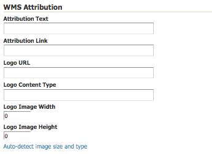

.. _webadmin_layers:

Layers
======
In Geoserver, the term layer refers to raster or vector data that contains geographic features.  Vector layers are analogous to featureTypes and raster layers are analogous to coverages.  Layers represent each feature that needs to be shown on the map. All layers have a source of data, called a Store.

In the layers section, you can view and edit an existing layers, add (register) a new layer, or delete (unregister) a layer.  As in previous View tables, the Layers View page displays relevant dependencies, i.e., the layer within the store within the workspace.  The View page also displays the layer's status and native SRS.

.. figure:: ../images/data_layers.png
   :align: center
   
   *Layers View*
   
Layer Types
-----------
Layers are organized into two types of data, raster and vector.  The difference between the two formats rests in how they store spatial information.  Vector types store information about feature types as mathematical paths--a point as a single x,y coordinate, lines as a series of x,y coordinates, and polygons as a series of x,y coordinates that start and end on the same place. Raster format data is a cell-based representation of earth surface features. Each cell has a distinct value, and all cells with the same value represent a specific feature. 

.. list-table::
   :widths: 5 70 

   * - **Field**
     - **Description**

   * - .. image:: ../images/data_layers_type1.png
     - raster (grid)
   * - .. image:: ../images/data_layers_type2.png
     - vector (feature)  
     
.. _edit_layer_data:

Edit Layer Data 
---------------
Clicking the layer name opens a layer configuration panel.  The :guilabel:`Data` tab, activated by default, allows you to define and change data parameters for a layer.  

.. figure:: ../images/data_layers_edit_data.png
   :align: center
   
   *Layers Data View*   
   
Basic Info
````````````
The beginning sections--Basic Resource Info, Keywords and Metadata link are analogous to the :ref:`service_metadata` section for WCS, WFS and WMS. These sections provide "data about the data," specifically textual information that make the layer data easier to work with it. 

**Name:** Identifier used to reference the layer in WMS requests. 

**Title:** A human-readable description to briefly identify the layer to clients. (Required)   
   
**Abstract:**
Provides a descriptive narrative with more information about the layer. 
   
**Keywords:**
List of short words associated with the layer to aid in catalog searching.
 
**Metadata Link:**
Allows linking to external documents that describe the data layer. Currently only two standard format types are valid: TC211 and FGDC.  TC211 refers to the metadata structure established by the `ISO Technical Committee for Geographic Information/Geomatics <http://www.isotc211.org/>`_ (ISO/TC 211) while FGDC refers to those set out by the `Federal Geographic Data Committee <http://www.fgdc.gov/>`_ (FGDC) of the United States. 

.. figure:: ../images/data_layers_meta.png
   :align: center
   
   *Adding a metadata link n FGDC format*  
   
Coordinate Reference Systems
````````````````````````````
A coordinate reference system (CRS) defines how your georeferenced spatial data relates to real locations on the Earth’s surface.  CRSs are part of a more general model called Spatial Reference Systems (SRS), which includes referencing by coordinates and geographic identifiers.   Geoserver needs to know what Coordinate Reference System of your data. This information is used for computing the latitude/longitude bounding box and reprojecting during both WMS and WFS requests

.. figure:: ../images/data_layers_CRS.png
   :align: center
   
   *Adding a metadata link n FGDC format*  

**Native SRS:**
Refers to the projection the layer is stored in. Clicking on the projection link displays a description of the SRS.

**Declared SRS:**
Refers to what GeoServer gives to clients. 

**SRS Handling:**
Determines how GeoServer should handle projection when the two SRS differ.  

Bounding Boxes
````````````````
The bounding box is determines the extent of a layer. The :guilabel:`Native Bounding Box` are the bounds of the data projected in the Native SRS. You can generate these bounds by clicking the :guilabel:`Compute from data` button. The :guilabel:`Lat/Long Bounding Box` computes the bounds based on the standard lat/long.  These bounds can be generated by clicking the :guilabel:`Compute from native bounds` button.  

.. figure:: ../images/data_layers_BB.png
   :align: center
   
   *Bounding Box for sf:archsites*

Coverage Parameters (Raster)
````````````````````````````

Optional coverage parameters are possible for certain types of raster data.  WorldImage formats request a valid range of grid coordinates in 2 dimensions known as a :guilabel:`ReadGridGeometry2D.` For ImageMosaic, you can use :guilabel:`InputImageThresholdValue`, :guilabel:`InputTransparentColor`, and :guilabel:`OutputTransparentColor` to control the rendering of the mosaic in terms of thresholding and transparency.  

     
Feature Type Details (Vector)
````````````````````````````````
Instead of coverage parameters, vector layers have a list of the :guilabel:`Feature Type Details`. These include the :guilabel:`Property` and :guilabel:`Type` of a data source.  For example, the ``sf:archsites`` layer show below includes a geometry, ``the_geom`` of type point. 

.. figure:: ../images/data_layers_feature.png
   :align: center

   *Feature Types Detaisl for sf:archsites*

The :guilabel:`Nillable` refers to whether the property requires a value or may be flagged as being null. Meanwhile :guilabel:`Min/Max Occurrences` refers to how many values a field is allowed to have.  Currently both :guilabel:`Nillable` and :guilabel:`Min/Max Occurrences` are set to ``true`` and ``0/1`` but might be   extended with future work on complex features.      

Edit Publishing Information 
---------------------------
The publishing tab allows for configuration of HTTP and WCS settings.

.. figure:: ../images/data_layers_edit_publish.png
   :align: center
   
   *Editing Publishing Data*
   
* *Enabled*: A layer that is not enabled won't be available to any kind of request, it will just show up in the configuration (and in REST-config)
* *Additional styles*: A layer is advertised by default. A non advertised layer will be available in all data access requests (e.g., WMS GetMap, WMS GetFeature) but won't appear in any capabilities document or in the layer preview. 

**HTTP Settings:** Cache parameters that apply to the HTTP response from client requests.  If :guilabel:`Response Cache Headers` is checked, GeoServer will not request the same tile twice within the time specified in :guilabel:`Cache Time`.  One hour measured in seconds (i.e., 3600), is the default value for :guilabel:`Cache Time`.

**WMS Settings:** Sets the WMS specific publishing parameters.

.. figure:: ../images/wms_settings.png

* *Defalt style*: The style that will be used when the client does not specify a named style in GetMap requests
* *Additional styles*: Other styles that can be associated to this layers. Some clients (and the GeoServer own preview) will present those as styling alternatives for that layer to the end user
* *Default rendering buffer* (available since version 2.0.3): the default value of the ``buffer`` GetMap/GetFeatureInfo vendor parameter. See the :ref:`wms_vendor_parameters` for more details 
* *Default WMS path*: the location of the layer in the WMS capabilities layer tree. Useful to build non opaque layer groups

**WMS Attribution:** Sets publishing information about data providers.  


   
   *WMS Attribution*

* *Attribution Text*: Human-readable text describing the data provider.  This might be used as the text for a hyperlink to the data provider's web site.
* *Attribution Link*: A URL to the data provider's website.
* *Logo URL:* A URL to an image that serves as a logo for the data provider.
* *Logo Content Type, Width, and Height:* These fields provide information about the logo image that clients may use to assist with layout.  GeoServer will auto-detect these values if you click the :guilabel:`Auto-detect image size and type` link at the bottom of the section.

The text, link, and URL are each advertised in the WMS Capabilities document if they are provided; some WMS clients will display this information to allow users to know which providers provide a particular dataset.  If you omit some of the fields, those that are provided will be published and those that are not will be omitted from the Capabilities document.

**WFS Settings:**
For the layer, sets the maximum number of features a WFS GetFeature operation should generate, regardless of the actual number of query hits.

**WCS Settings:** Provides a list the SRS the layer can be converted to. :guilabel:`New Request SRS` allows you to add an SRS to that list. 

**Interpolation Methods:** Sets the raster rendering process.  

**Formats:** Lists which output formats a layers supports.  

**Default Title:** Assigns a style to a layer. Additional styles are ones published with the layer in the capabilities document. 

**Geosearch:** When enabled, allows for Google Geo search crawler, to index from this particular layer. See `What is a Geo Sitemap? <http://www.google.com/support/webmasters/bin/answer.py?hl=en&answer=94554>`_ for more information.

**KML Format Settings:** Allows for limiting features based on certain criteria, otherwise known as *regionation*. Choose which feature should show up more prominently than others with the guilabel:`Default Regionating Attribute`. There are four types of :guilabel:`Regionating Methods`:

* *external-sorting:* Creates a temporary auxiliary database within GeoServer. It takes slightly extra time to build the index upon first request.
* *geometry:* Externally sorts by length (if lines) or area (if polygons).
* *native-sorting:* Uses the default sorting algorithm of the backend where the data is hosted. It is faster than external-sorting, but will only work with PostGIS datastores.
* *random:* 	Uses the existing order of the data and does not sort.

Add or Delete a Layer
---------------------     
At the upper left-hand corner of the layers view page there are two buttons for the adding and deletion of layers.  The green plus button allows you to add a new layer, here referred to as resource.  The red minus button allows you to remove selected layers.  

.. figure:: ../images/data_layers_add_remove.png
   :align: center
   
   *Buttons to Add or Remove a Layer*  

Clicking on the :guilabel:`Add a new resource` button brings up a :guilabel:`New Layer Chooser` panel.  The drop down menu displays all currently enabled stores.  From this menu, select the Store where the layer should be added.  

.. figure:: ../images/data_layers_add_chooser.png
   :align: center
   
   *List of all currently enabled stores* 

Upon selection of a Store, a view table of existing layers within the selected store will be displayed.  In this example, ``giant_polygon``, ``poi``, ``poly_landmarks`` and ``tiger_roads`` are all layers within the NYC store. 

.. figure:: ../images/data_layers_add_view.png
   :align: center
   
   *View of all layers* 

Upon selection of a layer name, you're redirected to a layer edit page. :ref:`edit_layer_data` 
     
In order to delete a layer, click on the check box on the left side of each layer row.  As shown below, multiple layers can be checked for removal on a single results page.  It should be noted, however, that selections for removal will not persist from one results pages to the next.  
  
.. figure:: ../images/data_layers_delete.png
   :align: center
   
   *Layers nurc:Img_Sample, sf:restricted, sf:streams selected for deletion*
   
All layers can be selected for removal by enabling the checkbox in the header row. 

.. figure:: ../images/data_layers_delete_all.png
   :align: center
   
   *All layers selected to be deleted*
   
   
Once layer(s) are checked, the :guilabel:`Remove selected resources` link is activated.  Upon clicking on the link, you will be asked to confirm or cancel the deletion.  Selecting :guilabel:`OK` successfully deletes the layer. 
     
     
     
     
     
     
