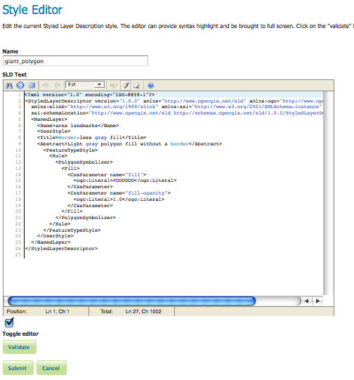
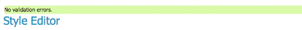
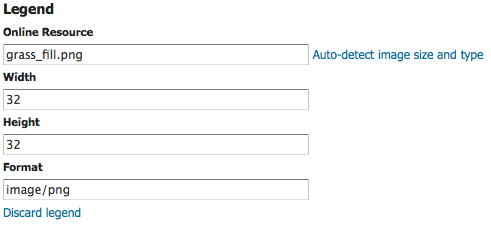

.. _webadmin_styles:

Styles
======

Styles are used to control the appearance of geospatial data. Styles for GeoServer are written in Styled Layer Descriptor (SLD), a subset of XML. Please see the section on :ref:`styling` for more information on working with styles. 

On the Styles page, you can add a new style, view or edit an existing style, or remove a style.

.. figure:: ../images/data_style.png
   :align: center
   
   *Styles page*

Edit a Style
------------

The :guilabel:`Style Editor` page presents options for configuring a style's name, code, and other attributes. SLD   names are specified at the top in the name field. The style's workspace can be chosen using the workspace selector. Styles are edited using a plain text editor with some basic utilities.

   
   *Style editor*
   
The style editor supports line numbering, automatic indentation, and real-time syntax highlighting. You can also increase or decrease the font size of the editor.

.. list-table::
   :widths: 25 75 

   * - **Button**
     - **Description**

   * - .. image:: ../images/data_style_editor_undo.png
     - undo
   * - .. image:: ../images/data_style_editor_redo.png
     - redo
   * - .. image:: ../images/data_style_editor_goto.png
     - go to line
   * - .. image:: ../images/data_style_editor_reformat.png
     - auto-format the editor contents
   * - .. image:: ../images/data_style_editor_fontsize.png
     - change the font size of the editor

To confirm that the SLD code is fully compliant with the SLD schema, click the :guilabel:`Validate` button. A message box will confirm whether the style contains validation errors.

.. note:: GeoServer will sometimes render styles that fail validation, but this is not recommended. 

   
   *No validation errors* 
   
.. figure:: ../images/data_style_editor_error.png
   :align: center
   
   *Validation error message* 

To view the :ref:`generated legend entry <decoration_types>` for the style, click the :guilabel:`Preview Legend` button.

Add a Style
-----------

The buttons for adding and removing a style can be found at the top of the :guilabel:`Styles` page. 

.. figure:: ../images/data_style_add_delete.png
   :align: center

   *Adding or removing a style*
   
To add a new style, select the :guilabel:`Add a new style` button. You will be redirected to an editor page. Enter a name for the style. You can also select the style format. In a default GeoServer installation only SLD is supported, but other extensions (such as :ref:`css <extensions_css>`) add support for 
additional formats. The editor page provides several options for submitting a new style. You can paste the style directly into the editor contents. You can generate a new default style based on an internal template:

.. figure:: ../images/data_style_editor_generate.png
   :align: center

   *Generating a new default style.*

You can copy the contents of an existing style into the editor:

.. figure:: ../images/data_style_editor_copy.png
   :align: center

   *Copying an existing Style from GeoServer*

You can select and upload a local file that contains the SLD:

.. figure:: ../images/data_style_upload.png
   :align: center

   *Uploading an SLD file from your local computer*
   
Once a style is successfully submitted, you will be redirected to the main :guilabel:`Styles` page where the new style will be listed.

Remove a Style
--------------

To remove a style, select it by clicking the checkbox next to the style. Multiple styles can be selected, or all can be selected by clicking the checkbox in the header. Click the :guilabel:`Remove selected style(s)` link at the top of the page. You will be asked to confirm or cancel the removal. Clicking :guilabel:`OK` removes the selected style(s). 
 
.. figure:: ../images/data_style_delete.png
   :align: center
   
   *Confirmation prompt for removing styles*

Add a Legend
------------

By default GeoServer will generate a legend based on your SLD file. You can use the :guilabel:`Add legend` link to provide a custom legend.

   
   *Legend*

Use :guilabel:`Online Resource` to reference one of the images in your styles folder. See  :ref:`data_dir_structure` for a description of the styles folder. 
     
Use :guilabel:`Width`, :guilabel:`Height` and :guilabel:`Format` to describe your image or click :guilabel:`Auto-detect image size and type` to fill in these fields.

Use :guilabel:`Discard legend` to remove your custom legend and revert to legend generation based on your SLD file.

