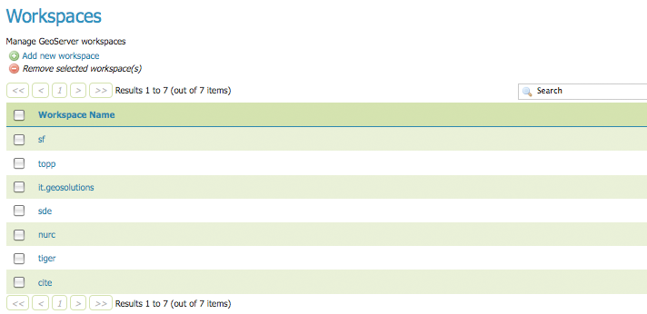
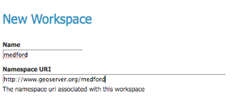

.. _webadmin_workspaces:

Workspaces
==========

This section describes how to view and configure workspaces. Analogous to a namespace, a workspace is a container which organizes other items. In GeoServer, a workspace is often used to group similar layers together. Individual layers are often referred to by their workspace name, colon, then store. For example, Ex: topp:states. Two different layers with the same name can exist as long as they exist in different workspaces. For example, Ex: sf:states, topp:states.

   
   *Workspaces page*

Edit Workspace
--------------

To view details and edit a workspace, click a workspace name.

.. figure:: ../images/data_workspaces_URI.png
   :align: center
   
   *Workspace named "topp"*
   
A workspace consists of a name and a Namespace URI (Uniform Resource Identifier). The workspace name is limited of ten characters and may not contain space. A URI is similar to a URL, except URIs don't need to point to a location on the web, and only need to be a unique identifier. For a Workspace URI, we recommend using a URL associated with your project, with perhaps a different trailing identifier, such as ``http://www.openplans.org/topp`` for the "topp" workspace. 
   
.. figure:: ../images/data_workspaces_ROOT.png
   :align: center
   
   *Workspace Root Directory parameter*
   
This parameter is used by the RESTful API as the `Root Directory` for the newly uploaded files, following the structure::

	${rootDirectory}/workspace/store[/<file>]
	
.. note:: This parameter is visible only when the **Enabled** parameter of the *Settings* section is checked. 
   
Add or Remove a Workspace
-------------------------

The buttons for adding and removing a workspace can be found at the top of the Workspaces view page. 

.. figure:: ../images/data_workspaces_add_remove.png
   :align: center
   
   *Buttons to add and remove*
   
To add a workspace, select the :guilabel:`Add new workspace` button. You will be prompted to enter the the workspace name and URI.  
   

   
   *New Workspace page with example*
 
To remove a workspace, click the workspace's corresponding check box. As with the layer deletion process, multiple workspaces can be checked for removal on a single results page. Click the :guilabel:`Remove selected workspaces(s)` button. You will be asked to confirm or cancel the deletion. Clicking :guilabel:`OK` will remove the workspace. 

.. figure:: ../images/data_workspaces_rename_confirm.png
   :align: center
   
   *Workspace removal confirmation*
      