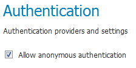
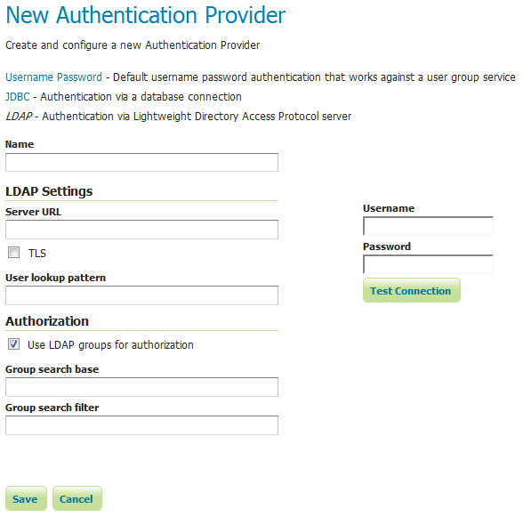
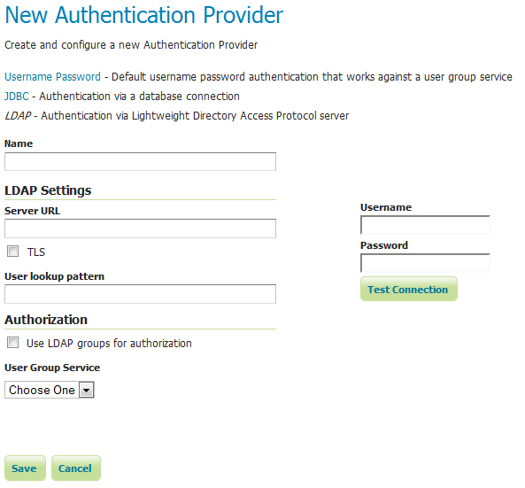

.. _webadmin_sec_auth:

Authentication
==============

This page manages the authentication options, including authentication providers and the authentication chain.

Anonymous authentication
------------------------

By default, GeoServer will allow anonymous access to the :ref:`web_admin`. Without authentication, users will still be able to view the :ref:`layerpreview`, capabilities documents, and basic GeoServer details. Anonymous access can be disabled by clearing the :guilabel:`Allow anonymous authentication` check box. Anonymous users navigating to the GeoServer page will get an HTTP 401 status code, which typically results in a browser-based request for credentials.

.. note:: Read more about :ref:`sec_auth_webadmin`.

   *Anonymous authentication checkbox*
   
Authentication filters
------------------------

This section manages the Authentication Filters (adding, removing, and editing). Several authentication filters are configured by default (anonymous, basic, form, rememberme), but others can be added to the list.

.. figure:: images/auth_filters.png
   :align: center
   
   *List of authentication filters*

Credentials From Headers Filter
~~~~~~~~~~~~~~~~~~~~~~~~~~~~~~~
This filter allows gathering user credentials (username and password) from request headers in a flexible and configurable way.

.. figure:: images/auth_filter_credentials_from_header.png
   :align: center

   *Creating a new authentication filter fetching credentials from request headers*
   
   
.. list-table:: 
   :widths: 40 60 
   :header-rows: 1

   * - Option
     - Description
   * - Name
     - Name of the filter
   * - Username Header
     - Name of the Request Header containing the username
   * - Regular Expression for Username
     - Regular Expression used to extract the username from the related Header. Must define a group that will match the username.
   * - Password Header
     - Name of the Request Header containing the password
   * - Regular Expression for Password
     - Regular Expression used to extract the password from the related Header. Must define a group that will match the password.
   * - Parse Arguments as Uri Components
     - If checked username and password are uri deocded before being used as credentials

   
	 
Authentication providers
------------------------

This section manages the :ref:`sec_auth_providers` (adding, removing, and editing). The default authentication provider uses basic :ref:`username/password authentication <sec_auth_provider_userpasswd>`. :ref:`JDBC <sec_auth_provider_jdbc>` and :ref:`LDAP <sec_auth_provider_ldap>` authentication can also be used.

Click :guilabel:`Add new` to create a new provider. Click an existing provider to edit its parameters.

.. figure:: images/auth_providers.png
   :align: center

   *List of authentication providers*
   
Username/password provider
~~~~~~~~~~~~~~~~~~~~~~~~~~

The default new authentication provider uses a user/group service for authentication.

.. figure:: images/auth_userpass.png
   :align: center

   *Creating a new authentication provider with a username and password*

.. list-table:: 
   :widths: 40 60 
   :header-rows: 1

   * - Option
     - Description
   * - Name
     - Name of the provider
   * - User Group Service
     - Name of the user/group service associated with this provider. Can be any one of the active user/group services.

JDBC provider
~~~~~~~~~~~~~

The configuration options for the JDBC authentication provider are illustrated below.

.. figure:: images/auth_jdbc.png
   :align: center

   *Configuring the JDBC authentication provider*

.. list-table::
   :widths: 40 60
   :header-rows: 1

   * - Option
     - Description
   * - Name
     - Name of the JDBC connection in GeoServer
   * - User Group Service
     - Name of the user/group service to use to load user information after the user is authenticated
   * - Driver class name
     - JDBC driver to use for the database connection
   * - Connection URL
     - JDBC URL to use when creating the database connection

LDAP provider
~~~~~~~~~~~~~

The following illustration shows the configuration options for the LDAP authentication provider. The default option is to use LDAP groups for role assignment, but there is also an option to use a user/group service for role assignment. Depending on whether this option is selected, the page itself will have different options.

   *Configuring the LDAP authentication provider using LDAP groups for role assignment*

   *Configuring the LDAP authentication provider using user/group service for authentication*

.. list-table::
   :widths: 40 60
   :header-rows: 1

   * - Option
     - Description
   * - Name
     - Name of the LDAP connection in GeoServer
   * - Server URL
     - URL for the LDAP server connection. It must include the protocol, host, and port, as well as the "distinguished name" (DN) for the root of the LDAP tree.
   * - TLS
     - Enables a STARTTLS connection. (See the section on :ref:`sec_auth_provider_ldap_secure`.)
   * - User DN pattern
     - Search pattern to use to match the DN of the user in the LDAP database. The pattern should contain the placeholder ``{0}`` which is injected with the ``uid`` of the user. Example: ``uid={0},ou=people``. The root DN specified as port of the *Server URL* is automatically appended.
   * - User Filter
     - LDAP Filter used to extract User data from LDAP database. Used alternatively to User DN pattern and combined with User Format to separate bind and user data extraction handling. Example: ``(userPrincipalName={0})``. Gets user data searching for a single record matching the filter. This may contain two placeholder values:
       ``{0}``, the full DN of the user, for example ``uid=bob,ou=people,dc=acme,dc=com``
       ``{1}``, the ``uid`` portion of the full DN, for example ``bob``.
   * - User Format
     - String formatter used to build username used for binding. Used alternatively to User DN pattern and combined with User Filter to separate bind and user data extraction handling. Example: ``{0}@domain``. Binds user with the username built applying the format.  This may contain one placeholder:
       ``{0}``, the username, for example ``bob``
   * - Use LDAP groups for authorization
     - Specifies whether to use LDAP groups for role assignment
   * - Bind before group search
     - Specifies whether to bind to LDAP server with the user credentials before doing group search
   * - Group search base
     - Relative name of the node in the tree to use as the base for LDAP groups. Example: ``ou=groups``. The root DN specified as port of the *Server URL* is automatically appended. Only applicable when the *Use LDAP groups for authorization( parameter is **checked**.
   * - Group search filter
     - Search pattern for locating the LDAP groups a user belongs to. This may contain two placeholder values:
       ``{0}``, the full DN of the user, for example ``uid=bob,ou=people,dc=acme,dc=com``
       ``{1}``, the ``uid`` portion of the full DN, for example ``bob``.
       Only applicable when the *Use LDAP groups for authorization( parameter is **checked**.
   * - Admin Group
     - Name of the group to be mapped to Administrator role (defaults to ADMINISTRATOR). Example: ``ADMIN``. Adds the role ROLE_ADMINISTRATOR if the user belongs to a group named ADMIN (case insensitive)
   * - Group Admin Group
     - Name of the group to be mapped to Group Administrator role (defaults to GROUP_ADMIN). Example: ``GROUPADMIN``. Adds the role ROLE_GROUP_ADMIN if the user belongs to a group named GROUPADMIN (case insensitive)     
   * - User Group Service
     - The user/group service to use for role assignment. Only applicable when the *Use LDAP groups for authorization* parameter is **cleared**.

Authentication chain
--------------------

This section selects the authentication chain. Currently, only one default authentication chain is available. For further information about the default chain, please refer to :ref:`sec_auth_chain`.

.. figure:: images/auth_chain.png
   :align: center

   *Selecting the authentication chain*

