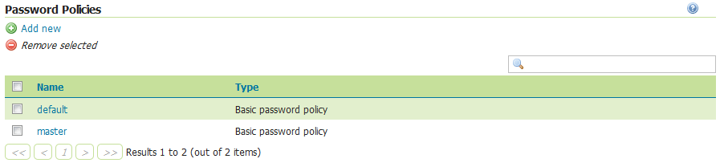

.. _webadmin_sec_passwd:

Passwords
=========

This page configures the various options related to :ref:`sec_passwd`, the :ref:`sec_master_passwd`, and :ref:`sec_passwd_policy`.

.. note:: User passwords may be changed in the Users dialog box accessed from the :ref:`webadmin_sec_ugr` page.

.. _webadmin_sec_masterpasswordprovider:

Active master password provider
-------------------------------

This option sets the active master password provider, via a list of all available master password providers.  

.. figure:: images/passwd_activemaster.png
   :align: center

   *Active master password provider*

To change the master password click the :guilabel:`Change password` link.

.. figure:: images/passwd_changemaster.png
   :align: center

   *Changing the master password*

Master Password Providers
-------------------------

This section provides the options for adding, removing, and editing master password providers.

.. figure:: images/passwd_masterprovider.png
   :align: center

   *Master password provider list*

Password policies
-----------------

This section configures the various :ref:`sec_passwd_policy` available to users in GeoServer.  New password policies can be added or renamed, and existing policies edited or removed.

By default there are two password policies in effect, ``default`` and ``master``.  The ``default`` password policy, intended for most GeoServer users, does not have any active password constraints.  The ``master`` password policy, intended for the :ref:`sec_root`, specifies a **minimum password length of eight characters**.  Password policies are applied to users via the user/group service.

   *List of password policies*

Clicking an existing policy enables editing, while clicking the :guilabel:`Add new` button will create a new password policy.

.. figure:: images/passwd_newpolicy.png
   :align: center

   *Creating a new password policy*
