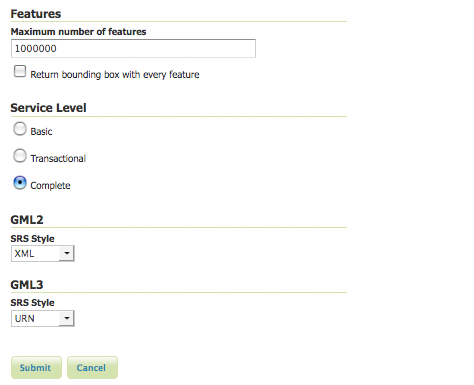

.. _webadmin_wfs:

WFS
===

The Web Feature Service (WFS) page supports the configuration of features, service levels, and GML output. 

   
   *WFS configuration options*

Service Metadata
----------------

See the section on :ref:`service_metadata`.   

Features
--------

The `Open Geospatial Consortium <http://www.opengeospatial.org/>`_ (OGC) Web Feature Service (WFS) is a protocol for serving geographic features across the Web. Feature information that is encoded and transported using WFS includes both feature geometry and feature attribute values. Basic Web Feature Service (WFS) supports feature query and retrieval. Feature limits and bounding can be configured on the WFS page. 

**Maximum number of features**—Maximum number of features sets the global feature limit that a WFS GetFeature operation should generate, regardless of the actual number of query hits. A WFS request can potentially contain a large dataset that is impractical to download to a client, and/or too large for a client's renderer. Maximum feature limits are also available for feature types. The default number is 1000000.

**Return bounding box**—Includes in the GetFeature GML output, an auto-calculated bounds element on each feature type. Not typically enabled, as including bounding box takes up extra bandwidth. 

Service Levels
--------------

GeoServer is compliant with the full "Transactional Web Feature Server" (WFS-T) level of service as defined by the OGC. Specifying the WFS service level limits the capabilities of Geoserver while still remaining compliant. The WFS Service Level is an integer bitmask that indicates what WFS operations are "turned on." It defines the available operations and content at a service instance 

**Basic**—Basic service levels provides facilities for searching and retrieving feature data with the GetCapabilities, DescribeFeatureType and GetFeature operations. It is compliant with the OGC basic Web Feature Service. This is considered a READ-ONLY web feature service. 

**Transactional**—In addition to all basic WFS operations, transactional service level supports transaction requests. A transaction request facilities the creation, deletion, and updating of geographic features in conformance with the OGC Transactional Web Feature Service (WFS-T). 

**Complete**—Includes the LockFeature support to the suite of transactional level operations. LockFeature operations help resolve links between related resources by processing lock requests on one or more instances of a feature type. 

GML
---

Geography Markup Language (GML) is the XML-based specification defined by the Open Geospatial Consortium (OGC) to express geographical features. GML serves as a modeling language for geographic systems as well as an open interchange format for geographic transactions on the Internet. 

The older GML standard, `GML 2 <http://portal.opengeospatial.org/files/?artifact_id=11339>`_ encodes geographic information, including both spatial and non-spatial properties. GML3 extends GML2 support to 3D shapes (surfaces and solids) as well as other advanced facilities. GML3 is modular superset of GML2 that simplifies and minimizes the implementation size by allowing users to select out necessary parts. Additions in GML3 include support for complex geometries, spatial and temporal reference systems, topology, units of measure, metadata, gridded data, and default styles for feature and coverage visualization. GML3 is almost entirely backwards compatible with GML2.

WFS 1.1.0 requests return GML3 as the default GML and style a Spatial Reference System (SRS) is in the URN format. Meanwhile WFS 1.0.0 requests return GML2 as default and specify SRS in the XML or normal format.  These formats effect the longitude/latitude (x/y) order of the returned data and are further described below.

**Normal**—Returns the typical EPSG number, ``EPSG:XXXX``. This formats the geographic coordinates in longitude/latitude (x/y) order. 

**XML**—Returns a URL that identifies each EPSG code: ``http://www.opengis.net/gml/srs/epsg.xml#XXXX``. This formats the geographic coordinates in longitude/latitude (x/y) order. 

**URN**—(WFS 1.1.1 only) Returns the colon delimited SRS formatting: ``urn:x-ogc:def:crs:EPSG:XXXX``. This formats data in the traditional axis order for geographic and cartographic systems—latitude/longitude (y/x).

