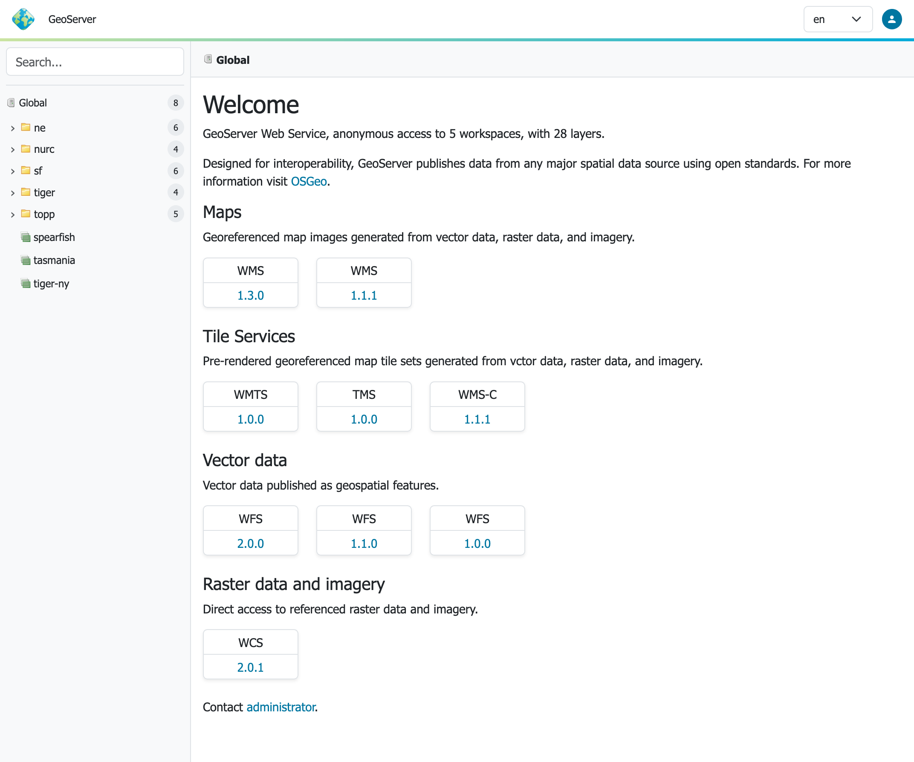

# Tomcat Hardening

Hide the Tomcat version in error responses and its error details:

1.  To remove the Tomcat version, create the following file with empty parameters:
     
    ```bash
    cd $CATALINA_HOME (where Tomcat binaries are installed)
    mkdir -p ./lib/org/apache/catalina/util/
    cat > ./lib/org/apache/catalina/util/ServerInfo.properties <<EOF
    server.info=
    server.number=
    server.built=
    EOF
    ```

2.  Additionally add to **`server.xml`** the ErrorReportValve to disable showReport and showServerInfo. This is used to hide errors handled globally by tomcat in the host section.
    
    ```bash
    vi ./conf/server.xml
    ```

    Add to `Host name=...` section this new ErrorReportValve entry:

    ```xml
        <Host name="localhost"  appBase="webapps"
            unpackWARs="true" autoDeploy="true">
    
        ...
    
        <Valve className="org.apache.catalina.valves.ErrorReportValve" showReport="false" showServerInfo="false" />
    
        </Host>
      </Engine>
      </Service>
    </Server>
    ```

3.  Even though this is partial solution, it at least mitigates the visible eye-catcher of outdated software packages.

    Response with just HTTP status confirms Tomcat is installed with no additional detail.
    ```
    HTTP Status 400 – Bad Request
    ```

4.  Notice: For support reason, the local output of **`version.sh`** still outputs the current version :
    ```bash
    $CATALINA_HOME/bin/version.sh
    ```
    ```
    ...
    Server version: Apache Tomcat/11.0.7
    Server built:   May 7 2025 14:55:59 UTC
    Server number:  11.0.7.0
    ...
    ```

### Why hide version number

Prior to performing the configuration steps above, the default full response includes the version number:
```
HTTP Status 400 – Bad Request
Type Status Report
Message Invalid URI
Description The server cannot or will not process the request due to something that is perceived to be a client error (e.g., malformed request syntax, invalid request message framing, or deceptive request routing).
Apache Tomcat/11.0.7.0
```
 
This response indicates this instance of Tomcat is from May 7 2025 (1 year old at the time of writing Apr. 2026).

An attacker can search for Tomcat version 11.0.7.0 to obtain a [list of known vulnerabilities](https://tomcat.apache.org/security-11.html).

## Running

1.  Use your container application's method of starting and stopping webapps to run GeoServer.

2.  To access the [Web administration interface](../../webadmin/index.md), open a browser and navigate to `http://SERVER/geoserver` .

    For example, with Tomcat running on port 8080 on localhost, the URL would be `http://localhost:8080/geoserver`.

3.  When you see the GeoServer Welcome page, GeoServer has been successfully installed.

    

    *GeoServer Welcome Page*

## Update

Update GeoServer:

- Backup any customizations you have made to **`webapps/geoserver/web.xml`**.
  
  In general application properties should be [configured](../../configuration/properties/index.md#application_properties_setting) using **`conf/Catalina/localhost/geoserver.xml`** rather than by modifying **`web.xml`** which is replaced each update.

 -  Follow the [Upgrading GeoServer](../../installation/upgrade3.md) to update **`geoserver.war`**.
  
    Before you start, ensure you have moved your data directory to an external location not located inside the **`webapps/geoserver/data`** folder.

 -  Be sure to stop the application server before deploying updated **`geoserver.war`**.
  
    This is important as when Tomcat is running it will replace the entire **`webapps/geoserver`** folder, including any configuration in the default GEOSERVER_DATA_DIR **`geoserver/data`** folder location or customizations made to **`web.xml`**.

 -  Re-apply any customizations you have made to **`webapps/geoserver/web.xml`**.

Update Tomcat:

 -  Update regularly at least the container application, and repeat the hardening process.
  
    This is a general problem, there are lots of visibly outdated Tomcat installations on the web.

## Uninstallation

1.  Stop the container application.

2.  Remove the GeoServer webapp from the container application's `webapps` directory. This will usually include the **`geoserver.war`** file as well as a **`geoserver`** directory.
    
    Remove **`conf/Catalina/localhost/geoserver.xml`**.
