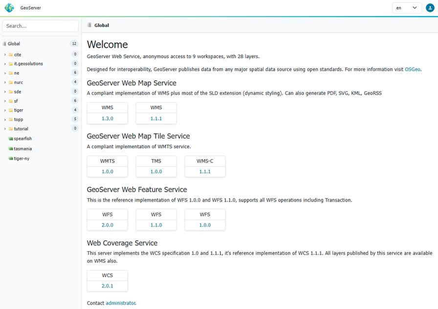
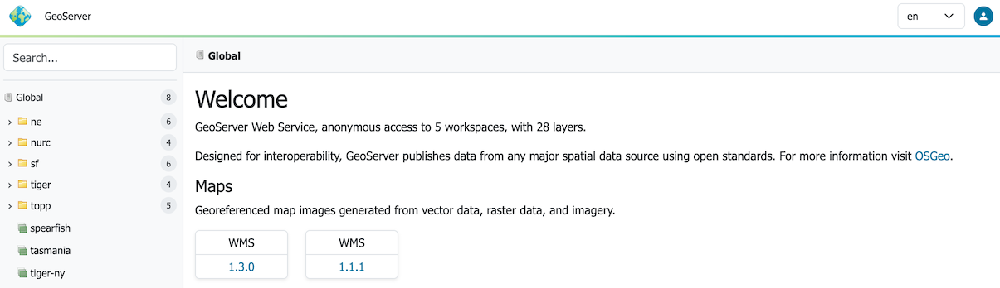
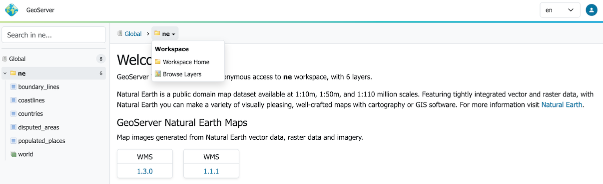
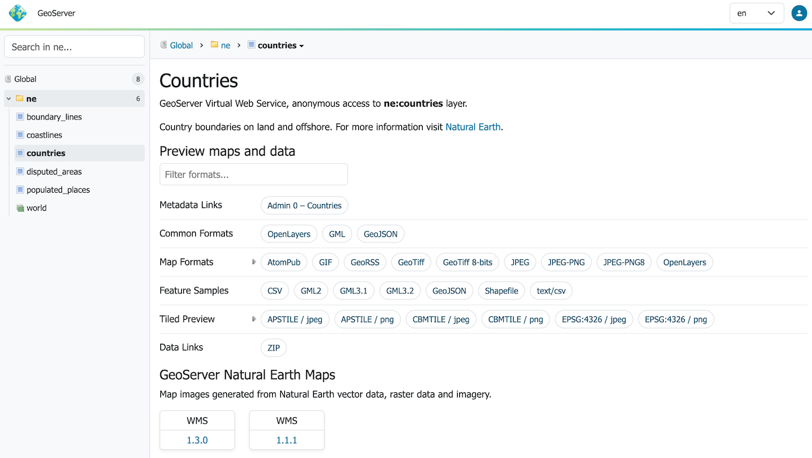
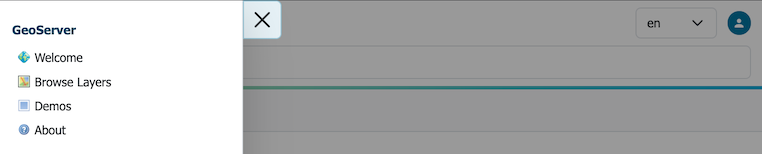
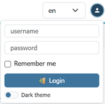
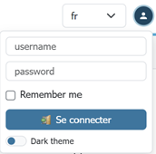

# Web administration interface

The Web administration interface is a web-based tool for configuring all aspects of GeoServer, from adding data to changing service settings. In a default GeoServer installation, this interface is accessed via a web browser at `http://localhost:8080/geoserver/web`. However, this URL may vary depending on your local installation.

*Web admin interface*

The following sections detail the top-level navigation menu options available in GeoServer. **Unless otherwise specified, you will need to be logged in with administrative credentials to see the complete list of pages.**

## GeoServer

The GeoServer menu allows visitors to find and access information and web services.
**You do not need to be logged into GeoServer to access the GeoServer menu.**

 -  The [Welcome](welcome.md) page lists the web services published by GeoServer.
  
    Changing the context to a **Workspace** adjusts the welcome page to show the web services available the workspace.
  
    Changing the content to a **Layer** adjust to show information about the Layer, along with download links, and web
  services available for interaction.
   
    When logged in with administrative credentials a configuration overview is provided, along with any information or warning notifications.

 -  The [Browse Layers](../data/webadmin/browselayers.md) page provides links to layer previews in different output formats, including the frequently used OpenLayers and KML formats. This page helps to visually verify and explore the configuration of a particular layer.

 -  The [Demos](../configuration/demos/index.md) section contains links to example WMS, WCS, and WFS requests for GeoServer as well as a listing all SRS info known to GeoServer. In addition, there is a reprojection console for converting coordinates between spatial reference systems, and a request builder for WCS requests.

 -  The [About GeoServer Page](about.md) section provides links to the GeoServer documentation, homepage and bug tracker.

## Data

The [Data management](../data/index.md) menu contains configuration options for all the different data-related settings.
**These pages are shown to administrators, and users that have workspace or layer admin permissions.**

- The [Workspaces](../data/webadmin/workspaces.md) page displays a list of workspaces, with the ability to add, edit, and delete. Also shows which workspace is the default for the server.

- The [Stores](../data/webadmin/stores.md) page displays a list of stores, with the ability to add, edit, and delete. Details include the workspace associated with the store, the type of store (data format), and whether the store is enabled.

- The [Layers](../data/webadmin/layers.md) page displays a list of layers, with the ability to add, edit, and delete. Details include the workspace and store associated with the layer, whether the layer is enabled, and the spatial reference system (SRS) of the layer.

- The [Layer Groups](../data/webadmin/layergroups.md) page displays a list of layer groups, with the ability to add, edit, and delete. Details include the associated workspace (if any).

- The [Styles](../styling/webadmin/index.md) page displays a list of styles, with the ability to add, edit, and delete. Details include the associated workspace (if any).

In each of these pages that contain a table, there are three different ways to locate an object: sorting, searching, and paging. To alphabetically sort a data type, click on the column header. For simple searching, enter the search criteria in the search box and hit Enter. And to page through the entries (25 at a time), use the arrow buttons located on the bottom and top of the table.

## Services

The [Services](../services/index.md) section is for configuring the services published by GeoServer.

- The [Mapping](../services/wms/webadmin.md) page manages metadata, resource limits, SRS availability, and other data-specific output for WMS services.
- The [Vectors](../services/wfs/webadmin.md) page manages metadata, feature publishing, service level options, and data-specific output for WFS and OGCAPI-Features services.
- The [Rasters](../services/wcs/webadmin.md) page manages metadata, resource limits, and SRS availability for raster and imagery services including WCS.
- The [Tiling](../services/wmts/webadmin.md) page manages visualized geospatial data as cached tile sets for WMTS.
- The [Process](../services/wps/administration.md) page manages metadata and resource limits for WPS.

## Server

The **Server** section configuration settings that apply to the entire server, along with diagnostic and configuration tools, and can be particularly useful when troubleshooting.

- The [Contact Information](../configuration/contact.md) page sets the public contact information available in the Capabilities document of the WMS server.
- The [Server Status](../configuration/status.md) page shows a summary of server configuration parameters and run-time status.
- The [Logs](../configuration/logging.md) page shows the GeoServer log output. This is useful for determining errors without having to leave the browser.
- The [Global Settings](../configuration/globalsettings.md) page configures messaging, logging, character and proxy settings for the entire server.
- The [Image Processing](../configuration/image_processing/index.md) page configures several image processing parameters, used by both WMS and WCS operations.
- The [Raster Access](../configuration/raster_access.md) page configures settings related to loading and publishing coverages.

## Tile Cache

The **Tile Caching** section configures the embedded [GeoWebCache](../geowebcache/index.md).

- The [Tile Layers](../geowebcache/webadmin/layers.md) page shows which layers in GeoServer are also available as tiled (cached)layers, with the ability to add, edit, and delete.
- The [Tile Cache Settings](../geowebcache/webadmin/defaults.md) page sets the global options for the caching service.
- The [Gridsets](../geowebcache/webadmin/gridsets.md) page shows all available gridsets for the tile caches, with the ability to add, edit, and delete.
- The [Disk Quota](../geowebcache/webadmin/diskquotas.md) page sets the options for tile cache management on disk, including strategies to reduce file size when necessary.
- The [BlobStores](../geowebcache/webadmin/blobstores.md) pages manages the different blobstores (tile cache sources) known to the embedded GeoWebCache.

## Security

The [Security](../security/webadmin/index.md) section configures the built-in [security subsystem](../security/index.md).

- The [Settings](../security/webadmin/settings.md) page manages high-level options for the security subsystem.
- The [Authentication](../security/webadmin/auth.md) page manages authentication filters, filter chains, and providers.
- The [Passwords](../security/webadmin/passwords.md) page manages the password policies for users and the root account.
- The [Users, Groups, Roles](../security/webadmin/ugr.md) page manages the users, groups, and roles, and how they are all associated with each other. Passwords for user accounts can be changed here.
- The [Data](../security/webadmin/data.md) page manages the data-level security options, allowing workspaces and layers to be restricted by role.
- The [URL Checks](../security/urlchecks.md) page allows administrators to limit the machines GeoServer can interact with.
- The [Content Security Policy](../security/csp.md) page allows administrators to control HTTP CSP response headers.
- The [CORS](../production/container.md#production_container.enable_cors) page allows administrators to control the Cross Origin Request Headers.
- The [Services](../security/webadmin/services.md) page manages the service-level security options, allowing services and operations to be restricted by role.

## Utilities

- The [Tools](../configuration/tools/index.md) section contains administrative tools.

  - The [Web Resource](../configuration/tools/resource/index.md) tool provides management of data directory icons, fonts, and configuration files.
  - The [Catalog Bulk Load Tool](../configuration/tools/bulk/index.md) can bulk copy configuration for testing

## User interface

### Search

Using the left hand side search field to find published information. Autocomplete results are shown as you type, and results are listed in a tree which can be navigated below.

*Search*

### Context

Clicking on a search item establishes the context which is shown as breadcrumbs along the top of the page. A drop-down context menu provides quick access to actions that can be performed by the current user.

*Context Menu*

Page content adjusts to the current context. As an example the welcome page adjusts to showing the layer tile and description, along with preview links, sample data downloads, metadata and data links configured.

*Context Page*

### Navigation Menu

A top-level navigation menu is provided listing configuration pages.

*Navigation Menu*

When working with a narrow display this menu is repositioned as a drop-down menu.

{: width=50%}  
*Navigation Menu on Narrow Display*

To return to the main [Welcome](welcome.md) page click on the GeoServer logo at the top of the navigation menu.

### User login

The upper right of the web administration interface provides options to [login](../gettingstarted/web-admin-quickstart/index.md#logging_in).

*Application Login*

GeoServer will share only the web services and layers available to the current user.

### Choosing the UI language

The administration interface is displayed using the browser's preferred language when available, otherwise it will fall back to English. The drop-down chooser on the side of the login/logout button allows selection of a different language.

*Language Chooser en*

*Language Chooser fr*

The language choice is saved in the session, as well as in a cookie, to retain the language choice across user sessions.

### Extensions

[GeoServer extensions](../extensions/index.md) can add functionality and extra options to the web interface. Details can be found in the section for each extension.

### Troubleshooting

Please see:

- [Oops, something went wrong](../production/troubleshooting.md#wicket_error)
- [User interface non-responsive](../production/troubleshooting.md#csp_strict)
