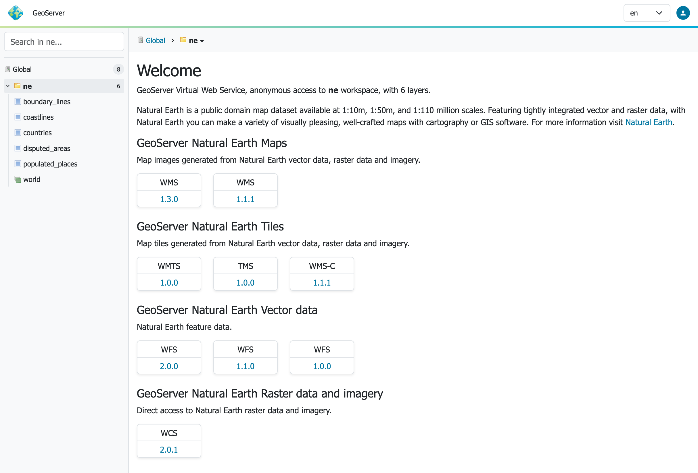
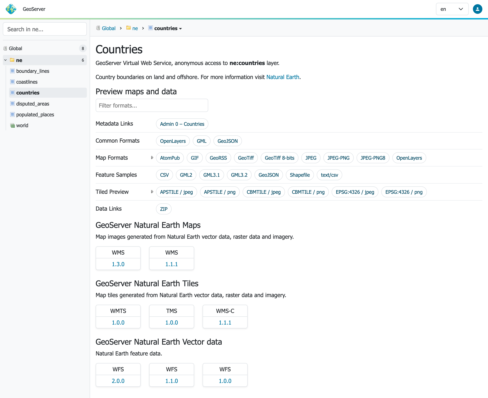
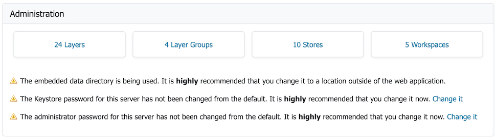
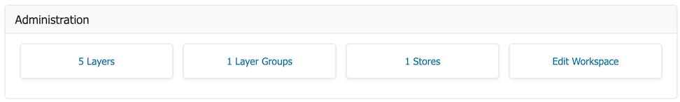
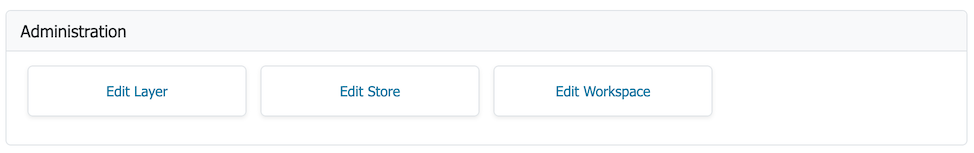

# Welcome

The **Welcome Page** lists the web services published by GeoServer for mapping, data access and processing.

## Web Services {: #welcome_webservices }

The welcome page lists the global web services (accessing the complete list of layers).

*Welcome Page Global Services*

To use copy-and-paste the web services URLs into your Desktop GIS or web mapping application.

*QGIS Desktop GIS WMS Connection*

*QGIS Desktop GIS Add WMS Layer*

*QGIS Desktop GIS Map*

Opening these URLs in the browser download or display machine readable the service description.

*WMS 1.3.0 GetCapabilities Document*

If global web services are disabled the initial welcome page web services will not be available.

## Workspace Web Services

Use the **workspace** selector in the side panel on the left of the welcome page to choose a workspace. The welcome page contact information and web services are updated to match the workspace selected.

*Welcome Workspace Web Services*

The web service links provided may be used in your Desktop GIS or web mapping application to access the workspace layers.

## Layer Web Services

Use the **layer** selector in the side panel on the left of the welcome page to choose a layer or layer group.

*Welcome Workspace Web Services*

The **workspace** selector, along with the page contact information and web services, are updated to match the layer selected.

## Administration

When logged in with administrative credentials a configuration overview is provided, access to common actions, along with any information or warning notifications.

*Global Administration*

For global context:

* Click **Layers** link to navigate to the [Layers page](../data/webadmin/layers.md). If no layers are available the option to [Add layers](../data/webadmin/layers.md#data_webadmin_layers_add_a_layer) to create a new layer.

* Click **Stores** link to navigate to the [Stores page](../data/webadmin/stores.md). If no stores are available press [Add stores](../data/webadmin/stores.md#data_webadmin_stores_add_a_store) to create a new store.

* Click **Workspaces** link to navigate to the [Workspaces page](../data/webadmin/workspaces.md). If no workspace is available, press [Add workspaces](../data/webadmin/workspaces.md#data_webadmin_workspaces_add_workspace) to create a new workspace.

For information and warnings:

* GeoServer status information messages provide feedback on normal operation.
* Warnings describe configuration issues to be addressed, often with a short-cut to the configuration page used to address the issue.

*Workspace Administration*

For workspace context:

* Click **Edit Workspace** link to navigate to [Workspace editor](../data/webadmin/workspaces.md#data_webadmin_workspaces_edit).

*Layer Administration*

For workspace context:

* Click **Edit Layer** link to navigate to [Layer editor](../data/webadmin/layers.md#data_webadmin_layers_edit_data).
