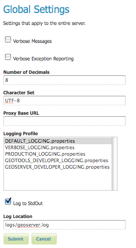
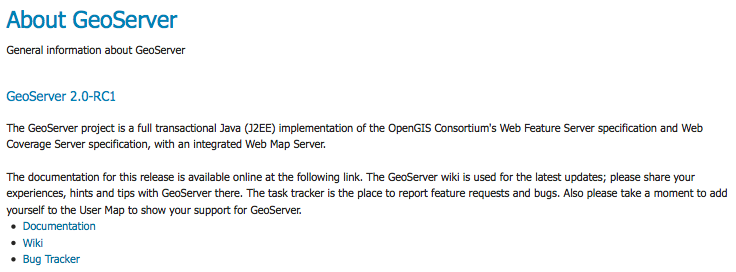
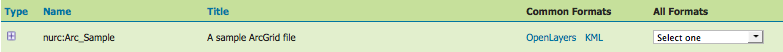

.. _web_admin_quickstart:

Démarrage rapide de l'interface d'administration web
=====================================================

L'*interface web d'administration* est une application web utilisée pour 
configurer tous les aspects de GeoServer, de l'ajout de donnée à la personnalisation 
de paramètres des services. L'interface web est accessible via le navigateur web 
``http://<host>:<port>/geoserver``. http://localhost:8080/geoserver/web dans une 
installation par défaut fonctionnant sur un hôte local.

.. figure:: web-admin.png
   :align: center
   
   *Page de bienvenue*

.. _logging_in:

Authentification
-----------------

Afin de changer n'importe quels paramètres ou configurer des données, un utilisateur 
doit d'abord s'authentifier. Naviguer jusqu'au coin en haut à gauche pour vous 
identifier dans GeoServer. L'utilisateur et mot de passe par défaut est ``admin`` 
et ``geoserver``.  Ceux-ci peuvent être seulement changé en éditant le fichier 
:file:`security/users.properties` dans le :ref:`data_directory`.  

.. figure:: login-page.png
   :align: center

   *Authentification*

Serveur
--------
La section :guilabel: `Serveur` de l'admin web propose un accès aux informations 
d'environnement de GeoServer. C'est une combinaison d'outils de configuration et 
de diagnostique utile pour débuguer. La page :guilabel:`Status du serveur` offre 
un résdumé des paramètres de configuration du serveur et du status en cours.

.. figure:: ../../webadmin/images/server_status.png
   :align: center
   
   *Page status*

La section :guilabel:`Information de contact` définie des informations de contact 
public dans le document Capabilities du serveur WMS.

.. figure:: ../../webadmin/images/server_contact.png
   :align: center
   
   *Page de contact*

La page :guilabel:`Paramètrages globaux` configure les paramètres de messages, 
log et proxy pour le serveur.

   
   *Page de paramètrage global*

La page :guilabel:`Configuration JAI` est utilisée pour configurer plusieurs 
paramètres JAI, utilisé à la fois dans les opérations WMS et WCS.

.. figure:: ../../webadmin/images/server_JAI.png
   :align: center

   *Paramètra JAI*

La section :guilabel:`À propos de GeoServer` fournis des liens vers la documentation 
de GeoServer, la page principale et liste des bugs.

   *Section À propos*

Services
--------

La section :guilabel:`Services` est pour les utilisateurs avancés qui ont besoin 
de configurer les protocoles demandés par GeoServer. La page Web Coverage Service 
(:guilabel:`WCS`) gère les informations de métadonnées, commune aux requêtes WCS, 
WFS et WMS.  La pge Web Feature Service (:guilabel:`WFS`) permet de configurer 
les features, niveaux de services et sortie GML. La page Web Map Service 
(:guilabel:`WMS`) définie les options raster et SVG.

Données
--------

Le lien :guilabel:`Données` amène directement à la page données avec les 
fonctionnalités d'édition, d'ajout et de suppression. Toutes les sous sections des 
types de données suivent un workflow similaire. De la même manière que ce que nous 
avons vue dans les exemples de :guilabel:`Styles` ci-dessous, la première page de 
chaque type de données affiche une page de visualisation des données sous forme 
de tableau.

.. figure:: ../../webadmin/images/data_style.png
   :align: center
   
   *Page de vue des styles*

Chaque nom de type de données amène vers une page de configuration correspondante. 
Par exemple, tous les items listés sous Workspace, Store et Layer Name dans la 
page de visualisation des :guilabel:`Couches`, amène vers sa page de configuration 
correspondante.

.. figure:: ../../webadmin/images/data_layers.png
   :align: center
   
   *Vues des couches*

Dans le panneau de visualisation des types, il y a trois façons différentes de 
localiser un type de données--par classement, par recherche et par l'ascenseur.

Pour classer alphabétiquement un type de donnée, cliquez sur l'en-tête de la 
colonne.

.. figure:: ../../webadmin/images/data_sort.png
   :align: center
   
   *Sur la gauche une colonne non classée ; sur la droite une colonne classée.*

Pour la recherche simple, entrez le critère de recherche dans la boîte de 
recherche et taper entrer.

.. figure:: ../../webadmin/images/data_search_results.png
   :align: center

   *Résultats de la recheche pour le requête "top".*

Pour naviguer à travers les pages des types de données, utilisez le bouton flèche 
en bas et enhaut du tableau.

.. figure:: data_scroll.png
   :align: center

   *Navigation dans la page des types de données.*

Comme nous l'avons vue dans l'exemple :guilabel:`Stores` ci-dessous, les boutons 
pour ajouter et supprimer les types de données peuvnet être trouvés en haut de la 
page de visualisation.

.. figure:: ../../webadmin/images/data_stores_add_remove.png
   :align: center
   
   *Boutons pour ajouter et supprimer des Stores.*

Pour ajouter de nouvelle donnée, sélectionnez le bouton :guilabel:`Ajouter`, et 
suivez les questions spécifique au type de donnée. Pour supprimer un type de 
données, cliquez sur la case à cocher du type de données correspondant et 
sélectionnez le bouton :guilabel:`Supprimer` (plusieurs types de donnes, du 
même type, peut être coché pour une suppression multiple).

.. figure:: ../../webadmin/images/data_stores_delete.png
   :align: center

   *Stores coché pour suppression.*

Démos
-----
La page :guilabel:`Démos` contient des liens vers des requêtes d'exemple de 
services WMS, WCS et WFS pour GeoServer ainsi qu'un lien listant toutes les 
informations de SRS connus de GeoServer. Vous n'avez pas besoin d'être identifier 
dans GeoServer pour visualiser cette page.

.. figure:: ../../webadmin/images/demos_view.png
   :align: center
   
   *Page de démos*

Prévisualisation des couches
-----------------------------

La page :guilabel:`Prévisualisation des couches` fournie des visualisations de 
couches pour plusieurs formats de sorties, incluant les formats OpenLayers et KML. 
Cette page aide à vérifier visuellement et à explorer la configuration d'une 
couche particulière.

.. figure:: ../../webadmin/images/preview_list.png
   :align: center
   
   *Page de prévisualisation des couches.*

Chaque ligne de couche comprend un :guilabel:`type`, :guilabel:`nom`, 
:guilabel:`titre`, et les formats disponibles pour la visualisation. 
:guilabel:`Nom` référe au nom du Workspace et de la couche, tandis que 
:guilabel:`Titre` se référe à une brève description configuré dans le panneau 
:ref:`edit_layer_data`. :guilabel:`Formats communs` inclus les rendus OpenLayers 
et KML, tandis que :guilabel:`Tous les formats` inclus des formats de rendus 
additionnels pour des utilisations plus particulière ou partager les données.

   
   *Ligne de visualisation d'une couche unique.*

.. yjacolin at free.fr 2011/07/07 r16069
