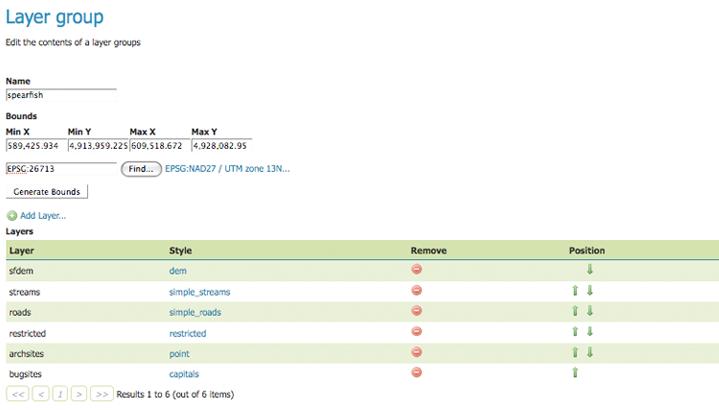

.. _webadmin_layergroups:

Groupes de couches
===================

Un groupe de couches est un groupe de couches qui peuvent être référencé par un 
seul nom. Cela permet des requêtes WMS plus simples, puisqu'il n'est nécessaire 
de référencer une seule couche dans la requête par opposition aux multiples couches 
individuelles. Les groupes de couches agissent simplement comme des couches 
standards au sein des sservices WMS.

.. figure:: ../images/data_layergroups.png
   :align: center
   
   *Page des groupes de couches*

Éditer un groupe de couches
----------------------------

Pour afficher la page d'édition d'un groupe de couches, cliquez sur un nom de 
groupe de couche. Les champs initiaux permettent la configuration du nom, des 
limites et la projection du groupe de couches. Pour définir automatiquement la 
bouding box, sélectionnez le bouton :guilabel:`Générez les limites`, sinon mettez 
y les limites personnalisées. Pour sélectionner une projection appropriée cliquez 
sur le bouton :guilabel:`Trouver`.

.. note:: Un groupe de couche peut consister de couches avec des projections et 
   des limites différentes. GeoServer va automatiquement reprojeter toutes les 
   couches du groupe de couches.

En bas de la page il y a un tableau de couches contenu dans le groupe de couches 
actuel. Quand un groupe de couches est réalisé, les couches sont rendues dans 
l'ordre donné, la couche en bas de la liste sera rendu en dernière et donc sera 
affichée par dessus les autres.

   
   *Page d'édition des groupes de couches*

La colonne :guilabel:`Style` affiche le style associé avec chaque couches. Pour 
changer le style associé à la couche, cliquez sur le lien du style. Une liste de 
styles activés sera affichée. Cliquez sur le nom du style pour l'assigner comme 
style de la couche.

.. figure:: ../images/data_layergroups_edit_styles.png
   :align: center
   
   *Édition du style pour une couche dans le groupe de couche*

Pour supprimer une couche d'un groupe de couches, sélectionnez le bouton de la 
couche dans la colonne :guilabel:`Supprimer`. On vous demandera alors de confirmer 
ou d'annuler la suppression.

Vous pouvezvoir le groupe de couches dans la section :ref:`layerpreview` de la 
console d'admin web.

.. figure:: ../images/data_layergroups_tasmania.png
   :align: center
   
   *Prévisualisation avec Openlayers du groupe de couches "tasmania"*

Une couche peut être positionnée plus haut ou plus bas dans la liste en cliquant 
sur les flèches vertes 'haut' et 'basse' respectivement.

Une couche peut être ajoutée à la liste en pressant le bouton :guilabel:`Ajouter une couche...` 
en haut du tableau de couches. À partir de la liste de couches résultantes, 
sélectionnez la couche à ajouter en cliquant sur le nom de la couche. Cette dernière 
sera ajoutée en bas de la liste des couches.

.. figure:: ../images/data_layergroups_add_layer.png
   :align: center

   *Dialogue pour ajouter une couche au groupe de couches*

Ajouter un groupe de couches
-----------------------------

Les boutons pour ajouter et supprimer un groupe de couche sont situés en haut de 
la page :guilabel:`Groupes de couches`. 

.. figure:: ../images/data_layergroups_add.png
   :align: center

   *Boutons pour ajouter et supprimer un groupe de couches*

Pour ajouter un nouveau groupe de couches, sélectionnez le bouton "Ajouter un 
groupe de couches". On vous demandera le nom du groupe de couches.

.. figure:: ../images/data_layergroups_name.png
   :align: center

   *Dialogue de nouveau groupe de couches*

Lorsque c'est terminé, cliquez sur :guilabel:`Soumettre`. Vous serez alors 
redirigé vers une page de configuration de groupe de couche vide. Commencez en 
ajoutant des couches en cliquant sur le bouton :guilabel:`Ajouter une couche...` 
(décrit dans la section précédente). Un fois que les couches sont positionnées 
correctement, pressez :guilabel:`Générez les limites` pour générer automatiquement 
la projection et l'étendue de la couche. Pressez :guilabel:`Sauver` pour sauver 
le nouveau groupe de couche.

.. figure:: ../images/data_layergroups_add_edit.png
   :align: center

   *Page de configuration d'un nouveau groupe de couches*

Supprimer un groupe de couches
-------------------------------

Dans le but de supprimer un groupe de couches,cliquez sur la case à cocher près 
du groupe de couche. Plusieurs groupes de couches peuvent être sélectionnés pour 
la suppression. CLiquez sur le lien :guilabel:`supprimer le(s) groupe(s) de couches sélectionné(s)`. 
On vous demandera de confirmer ou d'annuler la suppression. Sélectionner 
:guilabel:`OK` supprime le groupe de couches.
 
.. figure:: ../images/data_layergroups_delete.png
   :align: center
   
   *Supprimer un groupe de couches*
   
.. yjacolin at free.fr 2011/07/07 r16069
