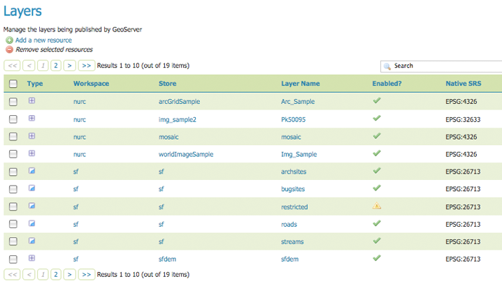
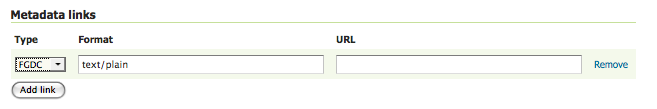

.. _webadmin_layers:

Couches
========

Dans GeoServer, le terme de couche se réfère aux données raster ou vecteur qui 
contiennent des objets géographiques. Les couches vecteurs sont analogues au 
*featureTypes* et les couches raster analogues au *coverages*. Les couches 
représentent chaque objet qui doivent être affichés sur la carte. Toutes les 
couches ont une source de données, appellé *Store*.

Dans la section couches, vous pouvez voir et éditer des couches existantes, 
ajouter (enregistrer) une nouvelle couche ou effacer (désenregistrer) une couche. 
Comme dans la table Vues précédente, la page de visualisation des couches 
affiche les dépendances appropriées, i.e. les couches dans le store dans 
l'espace de nom. La page Vue affiche également les status des couches et le SRS 
natif.


   
   *Vue de couches*
   
Types de couches
-----------------

Les couches sont organisées en deux types de données, raster et vecteur. La 
différence entre ces deux formats est la manière dont il stocke l'information 
spatiale. Les types vecteurs stocke l'information sous forme de type d'objet 
en tant que chemin mathématique -- un point comme une unique coordonnées x,y, des 
lignes comme une série de coordonnées x,y et des polygones comme une série de 
coordonnées x,y qui démarre etse termine au même endroit. Les données au format 
raster est une représentation basée sur des cellules d'objet surfacique de la terre. 
Chaque cellule possède une valeur distinctes, et toutes les cellules avec une 
valeur identique représentent un objet spécifique.

.. list-table::
   :widths: 5 70 

   * - **Champ**
     - **Description**

   * - .. image:: ../images/data_layers_type1.png
     - raster (grille)
   * - .. image:: ../images/data_layers_type2.png
     - vecteur (feature)  
     
.. _edit_layer_data:

Éditez les données d'une couche
-------------------------------

Cliquer le nom de la couche ouvre un panneau de configuration de couche. L'onglet 
:guilabel:`Données`, activé par défaut, vous permet de définir et changer les 
paramètres desdonnées pour une couche.

.. figure:: ../images/data_layers_edit_data.png
   :align: center
   
   *Vues des données des couches*   
   
Info basique
````````````

La section qui début -- Information basique des ressources, mots clés et lien 
de métadonnées sont analogues à la section :ref:`service_metadata` pour le WCS, 
WFS et WMS. Ces sections fournisee des "données sur les données," précisemment 
des informations textuelles qui permette de travailler plus facilement sur les 
couches.

**Nom :** Identifiant utilisé pour référencer la couche dans les requêtes WMS.

**Titre :** Une description lisible pour identifier brièvement la couche au 
client (requis)   
   
**Résumé :** Fournis une description plus longue avec plus d'information sur la 
couche.

**Mots-clés :** Liste de mots courts associés à la couche pour aider dans la 
recherche du catalogue.

**Lien de métadonnées :** Permet de lier des documents externes qui décrivent la 
couche de données. Pour le moment seulement deux types de formats standards sont 
valides : TC211 et FGDC. TC211 fait référence à la structure de métadonnées établies 
par le `Comité Technique ISO pour l'information Géographique/Géomatique <http://www.isotc211.org/>`_ 
(ISO/TC 211) tandis que FGDC fait référence à ceux définie par le 
`Comité des données géographiques fédérales <http://www.fgdc.gov/>`_ (FGDC) des 
États-Unis.


   
   *Ajouter un lien de métadonnées au format FGDC*  
   
Systems de référence des coordonnées
`````````````````````````````````````
Un Système de Coordonnées de Référence (CRS) définie comment les données spatiales 
géoréférencées sont représentés par rapport à leur localisation réelle sur la 
surface de la terre. CRS font partie du modèle générale appellé Systèmes de 
Références Spatiales (SRS) qui inclut le référencement par des identifiant 
géographique et de coordonnées. Géoserver a besoin de savoir le Système de 
Référence de Coordoonées de vos données. Cette information est utilisé pour 
calculer la boîte englobante en latitude/longitude et reprojeter pendant les 
requêtes WMS et WFS.

.. figure:: ../images/data_layers_CRS.png
   :align: center
   
   *Ajouter un CRS à une couche*  

**SRS native :** fait référence à la projection de la couche. Cliquer sur le lien 
projection affichera une description du SRS.

**SRS déclaré :** fait référence à ce que GeoServer envoie aux clients.

**SRS pris en charge :** détermine comment GeoServer doit prendre en charge la 
projection quand les deux SRS diffèrent.

Boîtes englobantes
```````````````````

La boîte englobante détermine l'étandue d'une couche. La :guilabel:`boîte englobante native` 
sont les limites des données projetées dans la SRS native. Vous pouvez générer 
ces limites en cliquant le boutton :guilabel:`Calculer à partir des données`. Le 
bouton :guilabel:`Boîte englobante Lat/Long` calcule les limites basées sur le 
standard lat/long. Ces limites peuvent être générées en cliquant sur le bouton 
:guilabel:`Calculer les limites natives`.  

.. figure:: ../images/data_layers_BB.png
   :align: center
   
   *Boîte englobante sf:archsites*

Paramètres de coverage (Raster)
````````````````````````````````
Les paramètres optionnels des coverage sont possible pour certaines dtypes de 
données raster. Les formats worldImage demandent un domaine valide de coordonnées 
grilles en deux dimensions connu comme :guilabel:`ReadGridGeometry2D.` Pour 
ImageMosaic, vous pouvez utiliser :guilabel:`InputImageThresholdValue`, 
:guilabel:`InputTransparentColor`, et :guilabel:`OutputTransparentColor` pour 
contrôler le rendu de la mosaïque en terme de seuil et de transparence.
     
Détail des Feature Type (Vecteur)
``````````````````````````````````
À la place des paramètres de couvertures, les couches vecteurs ont une liste de 
:guilabel:`Détailes de Feature Type`. Cela inclus :guilabel:`Propriété` et 
:guilabel:`Type` de source de données. Par exemple, la couche ``sf:archsites`` 
affichée ci-dessous inclues une géométrie, ``the_geom`` de type point. 

.. figure:: ../images/data_layers_feature.png
   :align: center

   *Détails du Feature Types pour sf:archsites*

Le :guilabel:`Nillable` fait référence à la nécessité d'avoir une valeur pour une 
propriété ou si elle peut être null (vide). Alors que :guilabel:`Occurences Min/Max` 
fait référence au nombre de valeurs que lechamp est autorisé à avoir. Pour le 
moment :guilabel:`Nillable` et :guilabel:`Occurences Min/Max` sont définie à 
``true`` et ``0/1`` mais peut être étendue avec un travail supplémentaire sur 
les features traitées.

Éditez les informations de publication
---------------------------------------
L'onglet publication permet la configuration des paramètres HTTP et WCS.

.. figure:: ../images/data_layers_edit_publish.png
   :align: center
   
   *Édition des données publiées*   

**Paramètrage HTTP :** paramètres de cache qui s'applique aux réponses HTTP à 
partir des requêtes clients. Si :guilabel:`En-tête du cache de la réponse` est 
coché, GeoServer n'interrogera pas la même tuile deux fois dans un temps définie 
dans :guilabel:`Durée du cache`. Une heure mesurée en seconde (i.e., 3600), est 
la valeur par défaut de :guilabel:`Cache Time`.

**Paramètrages WMS :** définie les paramètres de publication sépcifique au WMS.

.. figure:: ../images/wms_settings.png

* *Style par défaut* : le style qui sera utilisé quand le client ne définie pas 
  un style nommé dans les requêtes GetMap.
* *Styles supplémentaires* : autres styles qui peut être associés à cette couche. 
  Certains clients (et celui de prévisualisation de GeoServer) présentera ceux-ci 
  comme styles alternatifs pour cette couche à l'utilisateur final.
* *Buffer de rendu par défaut* (disponible depuis la version 2.0.3) : la valeur 
  pas défaut du paramètres fournisseur GetMap/GetFeatureInfo ``buffer``. Voyez 
  :ref:`wms_vendor_parameters` pour plus de détails.
* *Chemin par défaut du WMS* : la localisation de la couche dans l'arbre de 
  couches du capabilities du WMS. Utile pour construire des groupes de couches non 
  opaques.

**Attribution WMS :** définie les informations de publication sur les fournisseurs 
de données.

.. figure:: ../images/data_layers_WMS.png
   :align: center
   
   *Attribution WMS*

* *Texte d'attribution* : Texte lisible décrivant le fournisseur de données. Cela 
  peut être utilisé comme texte pour un lien html vers le site web du fournisseur 
  de données.
* *Lien d'attribution* : une URL vers le site web du fournisseur de données.
* *URL du logo* : une URL vers une image qui sert de logo pour le fournisseur de 
  données.
* *Content Type, largeur et hauteur du logo* : ces champs fournissent des 
  informations sur l'image du logo que les clients peuvent utiliser pour aider à la 
  mise en page. GeoServer auto-détectera ces valeurs si vous cliquez le lien 
  :guilabel:`Auto-détecter le type et la taille de l'image` en bas de la section.

Le texte, lien et URL sont chacun affichés dans le document Capabilities WMS s'ils 
sont définis ; certains clients WMS les afficheront pour permettre aux utilisateurs 
de savoir quel fournisseur fournie un jeu de données particulier. Si vous oubliez 
certains champs, ceux qui sont définies seront publiés et ceux qui ne le sont pas 
seront omis du document Capabilities.

**Paramètrages WFS :** pour la couche, définie un nombre maximal de features qu'une 
opération GetFeature WFS peut générer, sans liaison avec le nombre de requêtes.

**Paramètrages WCS :** fournie une liste de SRS vers lesquelles une couche peut 
être convertie. :guilabel:`Nouvelle requête SRS` vous permet d'ajouter un SRS à 
cette liste.

**Méthodes d'interpolation :** définie le processus de rendu du raster.

**Formats :** liste quels formats de sortie sont géré par une couche.  

**Titre par défaut :** assigns un style à une couche. Des styles supplémentaires 
sont publiés avec la couche dans le document capabilities. 

**Geosearch :** lorsqu'il est activé, permet au crawler de Google Geo search 
d'indexer cette couche particulière. Voyez `Qu'est ce qu'un Sitemap géographique 
? <http://www.google.com/support/webmasters/bin/answer.py?hl=en&answer=94554>`_ 
pour plus d'information.

**Paramètrages du format KML :** Permet de limiter les entités basé sur certains 
critères. Choisissez quelles entités doit s'afficher d'une manière plus visible 
que les autres avec guilabel:`Attribut par défaut de régionalisation`. Il y a quatre types 
de :guilabel:`Méthodes de régionalisation` :

* *external-sorting:* créé une base de données auxiliaire au sein de GeoServer. 
  Cela prend un peu de temps supplémentaire pour construire l'index lors de la 
  première requête.
* *geometry:* classe en externe par longueur (si ce sont des lignes) ou par 
  surface (si ce sont des polygones).
* *native-sorting:* utilise l'algorithme de classement par défaut du backend dans 
  lequel sont stocké les données. Cela est plus rapide que l'external-sorting, 
  mais fonctionnera seulement avec les datastores PostGIS.
* *random:* utilise l'ordre existant des données et ne les classera pas.

Ajouter un supprimer une couche
--------------------------------
En haut à gauche de la page de la liste des couches se trouve deux boutons pour 
l'ajout et la suppression des couches. Le bouton "plus" en vert permet d'ajouter 
une nouvelle couche, ici nommé comme ressource. Le bouton "moins" en rouge 
permet de supprimer des couches sélectionnées.

.. figure:: ../images/data_layers_add_remove.png
   :align: center
   
   *Bouton pour ajouter ou supprimer une couche*  

Cliquer sur le bouton :guilabel:`Ajouter une nouvelle ressource` affiche une 
fenêtre :guilabel:`Choix de la nouvelle couche`.  La liste déroulante affiche 
tous les stores activés. À partir de ce menu sélectionnez le store dans lequel 
se trouve la couche qui doit être activée.

.. figure:: ../images/data_layers_add_chooser.png
   :align: center
   
   *Liste de tous les stores activés*

Après la sélection du store, une table de vue des couches existances dans 
le store sélectionné sera affichée. Dans cet exemple, ``giant_polygon``, ``poi``, 
``poly_landmarks`` et ``tiger_roads`` sont toutes les couches dans le store NYC.

.. figure:: ../images/data_layers_add_view.png
   :align: center
   
   *Vues de toutes les couches* 

Après la sélection d'un nom de couche, vous êtes redirigés vers une page d'édition 
de couche, :ref:`edit_layer_data` 

Pour supprimer une couche, cliquez sur la case à cocher présesnt sur la gauche de 
chaque couche. Comme indiqué plus bas, plusieurs couches peuvent être cochées pour 
suppression sur une seule page. Cependant la sélection pour supprimer ne persistera 
pas d'une page vers une autre.

.. figure:: ../images/data_layers_delete.png
   :align: center
   
   *Couches nurc:Img_Sample, sf:restricted, sf:streams sélectionnées pour suppression*

Toutes les couches peuvent être sélectionnées pour suppression en activant la 
case à cocher dans la ligne d'en-tête.

.. figure:: ../images/data_layers_delete_all.png
   :align: center
   
   *Toutes les couches sélectionnées pour suppression*
   
Une fois que les couches ont été sélectionné, le lien :guilabel:`Retirer les 
ressources sélectionnées` est activé. En cliquant sur le lien, une confirmation 
vous sera demandée. La sélection de :guilabel:`OK` supprime la couche. 
     
     

.. yjacolin at free.fr 2011/07/07 r16069
