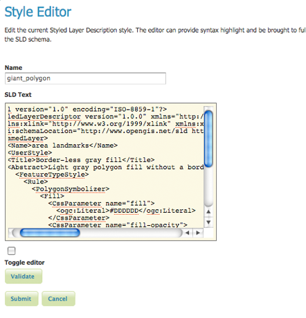
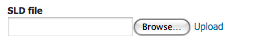

.. _webadmin_styles:

Styles
======

Les styles sont la manière pour déterminer le rendu des données spatiales. Les 
styles pour GeoServer sont écrit en Styled Layer Descriptor (SLD), un sous-ensemble 
de XML. Lisez la section :ref:`styling` pour plus d'information sur comment 
utiliser les styles.

Sur cette page, vous pouvez enregistrer ou créer un nouveau style, éditer ou 
supprimer un style existant.  

.. figure:: ../images/data_style.png
   :align: center
   
   *Page styles*

Éditer des styles
------------------

La page :guilabel:`Éditeur de style` présente des options pour configurer le nom 
et le code d'un style. Les noms des SLD sont définie en haut dans le champs nom. 
Entrer ou coller le code SLD peut être réalisé en un ou deux modes. Le premier 
mode est un éditeur riche inclu dans un `EditArea <http://www.cdolivet.com/index.php?page=editArea>`_. 
Le second mode est un éditeur de texte non formaté. Cliquez sur le 
:guilabel:`bouton éditeur` pour passer d'un mode à l'autre.

.. figure:: ../images/data_style_editor.png
   :align: center
   
   *Éditeur de texte riche*

   
   *Éditeur de texte simple*

L'éditeur riche est conçu pour le formattage de texte, la recherche et le 
remplacement, la numérotation de ligne et la surcharge syntaxique en temps réel. 
Vous pouvez aussi passer en mode plein écran pour une zone d'édition plus grande.

.. list-table::
   :widths: 25 75 

   * - **Bouton**
     - **Description**

   * - .. image:: ../images/data_style_editor1.png
     - recherche
   * - .. image:: ../images/data_style_editor2.png
     - aller à la ligne  
   * - .. image:: ../images/data_style_editor3.png
     - mode plein écran
   * - .. image:: ../images/data_style_editor4.png
     - annuler     
   * - .. image:: ../images/data_style_editor5.png
     - refaire
   * - .. image:: ../images/data_style_editor6.png
     - alterner la surcharge de la syntaxe en on/off
   * - .. image:: ../images/data_style_editor7.png
     - reset la surcharge de la syntaxe (lorsqu'elle n'est plus synchroniser)
   * - .. image:: ../images/data_style_editor8.png
     - à propos

Pour confirmer que le code SLD est pleinement conforme avec le schéma SLD, pressez 
le bouton :guilabel:`Valider`. Une boîte de messafe confirmera si le style possède 
des erreurs de validation.

.. note:: GeoServer pourra parfois utiliser un style qui ne passe pas la validation, 
   mais cela n'est pas recommandé. 

.. figure:: ../images/data_style_editor_noerrors.png
   :align: center
   
   *Aucune erreur de validation* 
   
.. figure:: ../images/data_style_editor_error.png
   :align: center
   
   *Message d'erreur de validation* 

Ajouter un style
----------------

Les boutons pour ajouter et supprimer un style peuvent être trouvé en haut de la 
page :guilabel:`Styles`. 

.. figure:: ../images/data_style_add_delete.png
   :align: center

   *Boutons pour ajouter et supprimer un style*

Pour ajouter un nouveau groupe de couche, sélectionnez le bouton :guilabel:`Ajouter 
un nouveau style`. Vous serez redirigé vers une page d'édition. Entrez un nom 
pour le style. La page d'édition propose deux options pour soumettre un SLD. Vous 
pouvez coller directement le SLD dans l'éditeur ou vous pouvez télécharger un 
fichier local qui contient le SLD.

   *Télécharger un fichier SLD à partir de votre ordinateur*

Une fois que le style est soumis, vous serez redirigé vers la page principale des 
:guilabel:`Styles` où le style sera listé.

Supprimer un style
-------------------

Pour supprimer un style, cliquez sur la case à cocher près du style. Plusieurs 
groupes de couches peut être cochés pour suppression multiple. Cliquez sur le lien 
:guilabel:`Supprimer les styles sélectionnés` en haut de la page. Vous devrez 
confirmer la suppression ou annuler. Cliquer sur :guilabel:`OK` supprime le 
groupe de couche.
 
.. figure:: ../images/data_style_delete.png
   :align: center
   
   *Message de confirmation pour la suppression d'un style*

.. yjacolin at free.fr 2011/11/18 r13133
