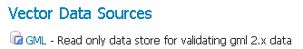

.. _data_gml:

GML
===

.. note::  GeoServer没有内置对GML的支持。它必须通过扩展安装。继续 :ref:`gml_install` 获取安装详细信息。

.. warning:: 当前，GML扩展程序是未维护的，并且处于不受支持的状态。尽管仍然可用，但不要期望与其他扩展模块具有相同的可靠性。

地理标记语言（GML）是一种基于XML的格式，用于表示基于矢量的空间数据。

支持的版本
------------------

当前支持GML版本2。

.. _gml_install:

安装GML扩展
----------------------------

#. 从 :website:`GeoServer download page 
   <download>`.下载GML扩展。

   .. warning:: 确保将扩展版本与GeoServer实例的版本匹配！

#. 将存档内容提取到 ``WEB-INF/lib`` GeoServer安装目录中。

添加GML数据存储
-----------------------

一旦正确安装了扩展程序，在创建新的数据存储区时 :guilabel:`GML`将成为 :guilabel:`Vector Data Sources` 列表中的一个选项。

   *矢量数据存储列表中的GML*

配置GML数据存储
----------------------------

.. figure:: images/gmlconfigure.png
   :align: center

   *配置GML数据存储*
  