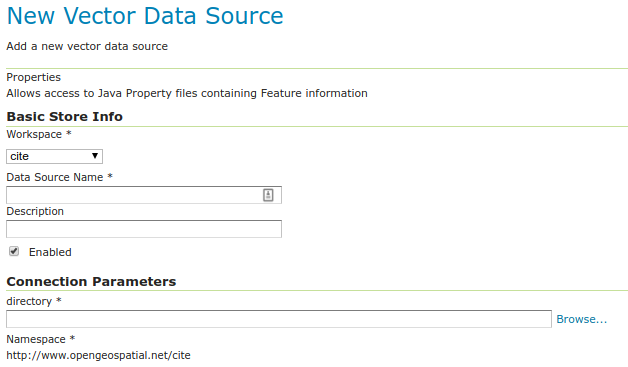

.. _data_java_properties:

Java 属性
===============

“属性”数据存储区提供对存储在Java属性文件中的一种或多种要素类型（层）的访问；这些是存储在本地文件系统上的纯文本文件。属性数据存储区从未打算与GeoServer一起提供。它起源于GeoTools教程，后来被开发人员广泛地用于自动测试中，这些测试需要方便的存储小片段数据。打包过程完成后，它就滑入了GeoServer，并被自动检测并通过Web界面提供给用户。在教程和示例中，Property数据存储已被证明是有用的。

* 我们不建议将属性数据存储用于具有许多功能或较大几何的大量数据。它的性能将是可怕的。

* 对于小型数据集（例如几十个点的集合），您可能会发现它是令人满意的。例如，如果您希望添加几个点作为额外的层，并且没有方便的数据库来存储它们，则“属性”数据存储提供了一种直接的方式来交付它们。

* 对属性文件的更改将立即反映在GeoServer响应中。除非更改了属性文件的第一行，或者添加或删除了属性文件，否则无需重新创建数据存储。

添加属性数据存储
------------------------------

默认情况下，创建新数据存储时, :guilabel:`Properties`将是 :guilabel:`Vector Data Sources` 列表中的一个选项。

   *向量数据存储列表中的属性*

配置属性数据存储
-----------------------------------

   *配置属性数据存储*

.. list-table::
   :widths: 20 80

   * - **选项**
     - **描述**
   * - ``Workspace``
     - 设置要素类型（图层）及其属性的名称空间前缀
   * - ``Data Source Name``
     - 唯一标识符以区分此数据存储
   * - ``Description``
     - 可选文本，提供对数据存储的详细描述
   * - ``Enabled``
     - 仅在选中此选项后，功能才会交付
   * - ``directory``
     - 包含一个或多个属性文件的目录的文件系统路径,例如 ``/usr/local/geoserver/data/ex``

在数据存储的名称空间 ``TYPENAME.properties``中，指定目录中的每个属性文件均用作功能类型 ``TYPENAME`` (文件名不带 ``.properties``)。

在使用要素类型（图层）之前，必须对其进行编辑以确保已配置其边界框和其他元数据。

属性文件格式
--------------------

属性文件格式是Java属性格式的子集：形式的行列表 ``KEY=VALUE``.

示例 ``stations.properties`` 定义要素类型（图层）的四个要素 ``stations``::

    _=id:Integer,code:String,name:String,location:Geometry:srid=4326
    stations.27=27|ALIC|Alice Springs|POINT(133.8855 -23.6701)
    stations.4=4|NORF|Norfolk Island|POINT(167.9388 -29.0434)
    stations.12=12|COCO|Cocos|POINT(96.8339 -12.1883)
    stations.31=31|ALBY|Albany|POINT(117.8102 -34.9502)

* 文件中的任何地方都不允许有空行。

* 属性文件的第一行以 ``_=`` 开头 并定义了解释以下各行所需的类型信息。

  * 逗号分隔值的形式为 ``NAME:TYPE``
  * 名称是用于在WFS响应中编码属性的属性名称。
  * 类型包括 ``Integer``, ``String``, ``Float``, and ``Geometry``
  * ``Geometry`` 可以有一个额外的后缀 ``:srid=XXXX`` 用于通过数字EPSG代码定义空间参考系统。请注意，以这种方式定义的几何按经度/纬度顺序排列。

* 随后的行定义要素，每行一个。

  *  ``=`` 之前的键是feature ID (``fid`` 或 ``gml:id`` 在WFS响应中)。每个都必须是 `NCName <http://www.w3.org/TR/1999/REC-xml-names-19990114/#NT-NCName>`_。
  * 特征数据遵循 ``=`` 竖线(``|``)分隔。数据类型必须与第一行的声明匹配。
  * 如果您希望该字段为空，则将该字段留空；在这种情况下，该属性将被忽略。

请注意，在本示例中， ``srid=4326`` 将空间参考系统（SRS）设置为 ``EPSG:4326``,，当以缩写形式引用时，按照惯例按经度/纬度顺序。如果您在GML 3中请求这些功能，您将看到GeoServer正确地将几何图形转换为 ``urn:x-ogc:def:crs:EPSG:4326`` 纬度/经度形式的URN形式SRS 。有关SRS轴顺序选项的更多信息，请参见 ref:`services_webadmin_wfs` 页面。

