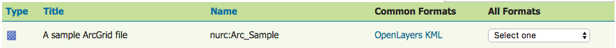
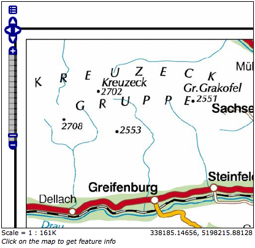

.. _layerpreview:

图层预览
=============

该页面提供各种输出格式的图层视图。必须启用图层才能进行预览。

.. figure:: img/preview_list.png
   
  图层预览页页面

每个图层行都包含类型，名称，标题和可用的查看格式。

.. list-table::
   :widths: 5 70
   :header-rows: 1

   * - 字段
     - 描述
   * - .. image:: img/raster_icon.png
     - Raster (grid)
   * - .. image:: img/polygon_icon.png
     - Polygon
   * - .. image:: img/line_string_icon.png
     - Line
   * - .. image:: img/point_icon.png
     - Point
   * - .. image:: img/vector.png
     - Other Geometry
   * - .. image:: img/layers.png
     - Layer Group
   * - .. image:: img/map.png
     - Cascading WMS
   * - .. image:: img/error.png
     - Unknown/Other
    
名称是指图层的工作区和图层名称，而标题是指在 ref:`data_webadmin_layers_edit_data` 面板中配置的简短描述。在以下示例中，nurc表示工作区，Arc_Sample表示图层名称，并且在“稍后编辑数据”面板上指定了 "A sample ArcGrid file" 。



    单层预览行

输出格式
--------------

“图层预览”页面支持多种输出格式，以供进一步使用或共享数据。您可以预览通用的OpenLayers和KML格式的所有三种图层类型。类似地，使用“所有格式”菜单，您可以以7种其他输出格式预览所有图层类型-AtomPub，GIF，GeoRss，JPEG，KML（压缩），PDF，PNG，SVG和TIFF。仅Vector图层提供WFS输出预览，包括常见的GML以及CSV，GML3，GeoJSON和shapefile格式。下表简要说明了所有受支持的输出格式，并按输出类型（图像，文本或数据）进行了组织。

图像输出
`````````````

可以从WMS getMap请求对栅格，矢量或coverage数据启动所有图像输出。WMS是允许视觉显示空间数据而不必提供对包含那些数据的要素的访问的方法。

.. list-table::
   :widths: 10 90 
   :header-rows: 1

   * - 格式
     - 描述
   * - KML
     - KML（钥匙孔标记语言）是一种基于XML的语言架构，用于在Google浏览器（例如Google Earth或Google Maps）中表达地理数据。KML使用具有嵌套元素和属性的基于标记的结构。对于GeoServer，KML文件以KMZ的形式分发，这是一个压缩的KML文件。
   * - JPEG
     - WMS以栅格格式输出。JPEG是一种压缩的图形文件格式，由于压缩而导致质量下降。它最适合用于照片，不建议用于精确复制数据。
   * - GIF
     - WMS以栅格格式输出。GIF（图形交换格式）是一种位图图像格式，最适用于颜色数量有限的锐利线条艺术。这充分利用了格式的无损压缩功能，该功能有利于边缘均匀且具有明确边界的平坦区域（与JPEG相反，JPEG有利于平滑渐变和更柔和的图像）。GIF限于8位调色板或256色。
   * - SVG
     - WMS矢量格式输出。SVG（可伸缩矢量图形）是一种用于在XML中对二维图形进行建模的语言。它与GIF和JPEG的不同之处在于，它使用图形对象而不是单个点。
   * - TIFF
     - WMS以栅格格式输出。TIFF（标记图像文件格式）是一种灵活，适应性强的格式，用于在单个文件中处理多个数据。GeoTIFF包含在TIFF文件中嵌入为标签的地理数据。
   * - PNG
     - WMS以栅格格式输出。PNG（便携式网络图形）文件格式是GIF的免费开放源代码后继版本。PNG文件格式支持truecolor（1600万种颜色），而GIF仅支持256种颜色。当图像具有较大且均匀着色的区域时，PNG文件会很出色。       
   * - OpenLayers
     - WMS GetMap请求输出一个简单的OpenLayers预览窗口。 `OpenLayers <http://openlayers.org/>`_ 是一个开源JavaScript库，用于在Web浏览器中显示地图数据。OpenLayers输出具有一些高级过滤器，这些过滤器在使用独立版本的OpenLayers时不可用。此外，生成的预览包含带有易于配置的显示选项的标题，用于显示。默认情况下使用OpenLayers库的版本3。可以使用ENABLE_OL3（true / false）格式选项或系统属性来禁用版本3 。对于OpenLayers 3不支持的旧版浏览器，无论设置如何，均使用版本2。
   * - PDF
     - PDF（便携式文档格式）封装了固定布局的2D文档的完整描述，包括任何文本，字体，光栅图像和2D矢量图形。
 

   
    样本图像输出- nurc:Pk50095的OpenLayers预览

文本输出
````````````

.. list-table::
   :widths: 10 90 
   :header-rows: 1

   * - 格式
     - 描述
   * - AtomPub
     - WMS以XML格式输出空间数据。AtomPub（Atom发布协议）是用于使用HTTP和XML发布和编辑Web资源的应用程序级协议。作为替代内容联合的RSS系列标准而开发的Atom允许订阅地理数据。
   * - GeoRss
     - WMS GetMap请求以XML格式输出矢量数据。RSS（丰富站点摘要）是一种XML格式，用于交付定期更改的Web内容。 `GeoRss <http://www.georss.org>`_ 是作为RSS提要的一部分对位置进行编码的标准。支持Layers Preview生成RSS 2.0文档，该文档具有使用Atom的GeoRSS Simple几何形状。 
   * - GeoJSON
     - `JavaScript Object Notation <http://json.org/>`_ （JSON）是一种基于JavaScript编程语言的轻量级数据交换格式。这使它成为基于浏览器的应用程序的理想交换格式，因为它可以直接轻松地解析为javascript。GeoJSON是纯文本输出格式，可将地理类型添加到JSON。
   * - CSV
     - WFS GetFeature输出，以逗号分隔。CSV（逗号分隔值）文件是包含数据行的文本文件。每行中的数据值用逗号分隔。CSV文件还包含一个逗号分隔的标题行，解释了每一行的值顺序。GeoServer的CSV已完全流式传输，对可输出的数据量没有限制。
     
一个简单的使用Atom的GeoRSS片段 nurc:Pk50095 ::

   <?xml version="1.0" encoding="UTF-8"?>
	<rss xmlns:atom="http://www.w3.org/2005/Atom"
	     xmlns:georss="http://www.georss.org/georss" version="2.0">
	   <channel>
		 <title>Pk50095</title>
		 <description>Feed auto-generated by GeoServer</description>
		 <link>></link>		
		 <item>
		   <title>fid--f04ca6b_1226f8d829e_-7ff4</title>
		   <georss:polygon>46.722110379286 13.00635746384126 
			46.72697223230676 13.308182612644663 46.91359611878293
			13.302316867622581 46.90870264238999 12.999446822650462 
			46.722110379286 13.00635746384126
		   </georss:polygon>
		   </item>
	   </channel>
   </rss>

数据输出
````````````

所有数据输出均从对矢量数据的WFS GetFeature请求启动。

.. list-table::
   :widths: 10 90 
   :header-rows: 1

   * - 格式
     - 描述
   * - GML2/3
     - GML（地理标记语言）是 `Open Geospatial Consortium <http://en.wikipedia.org/wiki/Open_Geospatial_Consortium>`_ OGC）定义的XML语法，用于表达地理特征。GML用作地理系统的建模语言以及用于地理数据共享的开放交换格式。GML2是默认的（通用）输出格式，而GML3可从“所有格式”菜单使用。
   * - Shapefile
     - ESRI Shapefile（或简称为shapefile）是交换GIS数据最常用的格式。GeoServer以zip格式输出shapefile，目录为.cst，.dbf，.prg，.shp和.shx。
