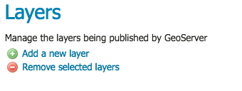
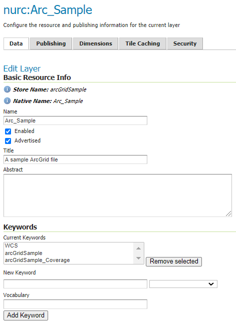
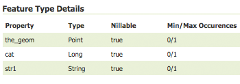

.. _data_webadmin_layers:

图层
======

在GeoServer中，术语“图层”是指表示地理要素集合的栅格或矢量数据集。矢量层类似于“ featureTypes”，而栅格层类似于“ coverage”。所有层都有一个数据源，称为存储。该层与在其中定义商店的工作区相关联。

在Web界面的图层中，您可以查看和编辑现有层，添加（注册）新层或删除（取消注册）层。“层视图”页面显示层的列表以及每个层所包含的存储和工作区。查看页面还显示图层的状态和本机SRS。

.. figure:: img/data_layers.png

   图层视图

图层类型
-----------

图层可分为两种类型的数据：栅格和矢量。这两种格式在存储空间信息的方式上有所不同。向量类型将有关要素类型的信息存储为数学路径-一个点作为单个x，y坐标，线作为一系列x，y坐标，而多边形作为一系列x，y坐标在同一位置开始和结束。栅格格式数据是地球表面要素的基于单元的表示形式。每个单元格都有一个不同的值，而所有具有相同值的单元格都代表一个特定的功能。

.. list-table::
   :widths: 5 70
   :header-rows: 1

   * - 字段
     - 描述
   * - .. image:: img/raster_icon.png
     - Raster (grid)
   * - .. image:: img/polygon_icon.png
     - Polygon
   * - .. image:: img/line_string_icon.png
     - Line
   * - .. image:: img/point_icon.png
     - Point

.. _data_webadmin_layers_add_a_layer:

添加图层
-----------

在图层视图页面的左上角，有两个按钮用于添加和删除图层。绿色的加号按钮允许您添加新层。红色减号按钮可让您删除选定的图层。

   添加和删​​除图层的按钮

单击 :guilabel:`Add a new layer` 按钮将弹出 :guilabel:`New Layer Chooser` 面板。菜单显示所有当前启用的商店。从此菜单中，选择应在其中添加图层的存储。

.. figure:: img/data_layers_add_chooser.png

   当前启用的所有存储的列表

选择存储后，将显示存储中资源的列表。首先列出已经发布为图层的资源，然后列出其他可以发布的资源。
在这个例子中，``giant_polygon``, ``poi``, ``poly_landmarks`` and ``tiger_roads`` 是 NYC 存储中所有存在的图层.

.. figure:: img/data_layers_add_view.png

   存储中已发布和可用资源的列表

要为可用资源添加层，请单击 :guilabel:`Publish`。
T要为已发布资源添加新层，请单击 :guilabel:`Publish Again`。
（请注意，在重新发布新图层的名称时，可能必须修改以避免与现有图层冲突。）
这些操作将显示 ref:`Edit Layer <data_webadmin_layers_edit_data>` 页面，以输入新图层的定义。

删除图层
--------------

要删除图层，请通过单击图层旁边的复选框将其选中。如下所示，可以选择多个图层以批量删除。请注意，从一个结果页到下一个结果页的删除选项将不会保留。

.. figure:: img/data_layers_delete.png

   选择删除某些图层

通过单击标题中的复选框，可以选择要删除的所有图层。

.. figure:: img/data_layers_delete_all.png

   选择要删除的所有层

选择图层后，将激活 :guilabel:`Remove selected resources` 链接。单击链接后，将要求您确认或取消删除。选择 :guilabel:`OK` 将删除选定的图层。

.. _data_webadmin_layers_edit_data:

编辑图层：数据
----------------

GeoServer 2.20.x用户手册» 资料管理» 资料设定» 层数
模组下一个|上一个|
层
在GeoServer中，术语“图层”是指表示地理要素集合的栅格或矢量数据集。矢量层类似于“ featureTypes”，而栅格层类似于“ coverage”。所有层都有一个数据源，称为存储。该层与在其中定义商店的工作区相关联。

在Web界面的“层”部分中，您可以查看和编辑现有层，添加（注册）新层或删除（取消注册）层。“层视图”页面显示层的列表以及每个层所包含的存储和工作区。“查看”页面还显示图层的状态和本机SRS。

../../_images/data_layers.png
图层视图

图层类型
图层可分为两种类型的数据：栅格和矢量。这两种格式在存储空间信息的方式上有所不同。向量类型将有关要素类型的信息存储为数学路径-一个点作为单个x，y坐标，线作为一系列x，y坐标，而多边形作为一系列x，y坐标在同一位置开始和结束。栅格格式数据是地球表面要素的基于单元的表示形式。每个单元格都有一个不同的值，而所有具有相同值的单元格都代表一个特定的功能。

场地

描述

../../_images/raster_icon.png	
栅格（网格）

../../_images/polygon_icon.png	
多边形

../../_images/line_string_icon.png	
线

../../_images/point_icon.png	
观点

添加图层
在图层视图页面的左上角，有两个按钮用于添加和删除图层。绿色的加号按钮允许您添加新层。红色减号按钮可让您删除选定的图层。

../../_images/data_layers_add_remove.png
添加和删​​除图层的按钮

单击“添加新层”按钮将弹出“新层选择器”面板。菜单显示所有当前启用的商店。从此菜单中，选择应在其中添加图层的存储。

../../_images/data_layers_add_chooser.png
当前启用的所有商店的列表

选择商店后，将显示商店中资源的列表。首先列出已经发布为图层的资源，然后列出其他可以发布的资源。在这个例子中，giant_polygon，poi，poly_landmarks和tiger_roads是纽约市商店内所有现有层。

../../_images/data_layers_add_view.png
商店中已发布和可用资源的列表

要为可用资源添加层，请单击发布。要为已发布资源添加新层，请单击“再次发布”。（请注意，在重新发布新图层的名称时，可能必须修改以避免与现有图层冲突。）这些操作将显示“编辑图层”页面，以输入新图层的定义。

删除图层
要删除图层，请通过单击图层旁边的复选框将其选中。如下所示，可以选择多个图层以批量删除。请注意，从一个结果页到下一个结果页的删除选项将不会保留。

../../_images/data_layers_delete.png
选择用于去除某些层

通过单击标题中的复选框，可以选择要删除的所有图层。

../../_images/data_layers_delete_all.png
选择要删除的所有层

选择图层后，将激活“删除所选资源”链接。单击链接后，将要求您确认或取消删除。选择确定将删除选定的图层。

编辑层：数据
要查看或编辑图层，请单击图层名称。将显示一个层配置页面。 :guilabel:`Data` 选项卡默认情况下处于激活状态，可让您定义和更改图层的数据参数。

   编辑图层：“数据”选项卡

基本信息
^^^^^^^^^^

开始的部分（基本资源信息，关键字和元数据链接）类似于WCS，WFS和WMS的 ref:`service_metadata` 部分。这些部分提供“有关数据的数据”，特别是文本信息，这些信息使图层数据更易于理解和使用。元数据信息将出现在引用该层的功能文档中。

* **Name**—用于在WMS请求中引用图层的标识符。（请注意，对于已发布资源的新层，必须更改名称以避免冲突。）
* **Enabled**—未启用的层将无法用于任何类型的请求，它将仅显示在配置中（以及REST配置中）
* **Advertised**—默认情况下播发一个图层。未播发的图层将在所有数据访问请求（例如WMS GetMap，WMS GetFeature）中可用，但不会出现在任何功能文档或图层预览中。
* **Title**—用于向客户端简要标识该层的人类可读描述（必填）
* **Abstract**—详细描述图层
* **Keywords**—与图层相关联的短词汇列表，以帮助目录搜索
* **Metadata Links**—允许链接到描述数据层的外部文档。“类型”输入提供了一些示例类型，例如FGDC或ISO19115：2003，但允许声明任何其他类型。可选的“关于”条目可用于指向元数据标准的定义或有关此标准的任何其他辅助信息。最后，“ URL”指向实际的元数据，而“格式”提供其MIME类型。

  .. figure:: img/data_layers_meta.png

     以FGDC格式添加元数据链接

坐标参考系统
^^^^^^^^^^^^^^^^^^^^^^^^^^^^

坐标参考系统（CRS）定义了地理参考空间数据如何与地球表面上的实际位置相关。CRS是称为空间参考系统（SRS）的更通用模型的一部分，该模型包括按坐标和地理标识符进行的参考。GeoServer需要知道数据的坐标参考系统。此信息用于计算纬度/经度边界框，并在WMS和WFS请求期间重新投影数据。

.. figure:: img/data_layers_CRS.png

   图层的坐标参考系统

* **Native SRS**—指定存储图层的坐标系。单击投影链接将显示SRS的描述。
* **Declared SRS**—指定GeoServer发布给客户端的坐标系
* **SRS Handling**—确定当两个SRS不同时，GeoServer应如何处理投影。可能的值为：

  * **Force declared** (默认): 声明的SRS被强加于数据上，覆盖本机数据。这是默认选项，通常是最佳做法，声明的代码来自EPSG数据库，并且其中包含大量额外的信息，从有效的EPSG代码，有效范围，数据库中的链接返回到在需要重新投影的情况下，找到其他坐标参考系统的最佳转换步骤。当源没有本机CRS，源错误或具有与EPSG代码匹配的源时（请在GeoServer使用的CRS中获取完整的元数据），请使用此选项。
  * **Reproject from native**: 当本机数据集的CRS与任何官方EPSG不匹配时，应使用此设置。OGC协议需要为这些层通告一个EPSG代码，通过此设置，声明的一个将被通告，并且将根据需要动态进行从本机的重新投影（如果请求了第三个CRS，则该重新投影将直接从本机传递到本机）
  * **Keep native**: 这是在极少数情况下应使用的设置。保持本机意味着在功能文档中使用已声明的本机，然后在所有其他请求中使用本机CRS（除非客户端明确要求，否则之间不进行任何重新投影）。如果源是shapefile，则这尤其成问题，因为PRJ文件缺少EPSG数据库提供的所有额外信息（例如，它将中断GML输出中的WFS 1.1和2.0 SRS声明）。该设置旨在用于以下情况：WMS是主要目标，并且本机CRS和声明的CRS具有很小的差异，从而避免了动态重新投影和基准更改。

总之，请使用 **Force Declared** 作为主要选项，仅在源数据与任何EPSG代码不匹配 **Reproject from native** ， 仅在您真正知道自己在做什么时才使用 **Keep Native**。

对于功能文档中具有多个受支持的CRS的WMS Server和WFS-NG层，可以通过单击Native SRS字段旁边的FIND按钮来选择本地CRS

.. figure:: img/cascade_srs.png

边界框
^^^^^^^^^^^^^^

边界框确定图层中数据的范围。

* **Native Bounding Box**—本机SRS中指定的数据的边界。这些边界可以通过单击 :guilabel:`Compute from data` 按钮来生成，也可以通过单击 :guilabel:`Compute from SRS bounds` 来从SRS定义中生成。所使用的SRS取决于所选的 :guilabel:`SRS Handling` 在选择 *Force declared* 或 *Reproject native to declared* 时选择声明的SRS ，否则使用本机SRS。如果SRS没有定义边界，则不会生成任何边界。
* **Lat/Lon Bounding Box**—以地理坐标指定的边界。可以通过单击 :guilabel:`Compute from native bounds` 按钮来计算这些边界。

.. figure:: img/data_layers_BB.png

   图层的边界框

覆盖参数（栅格）
^^^^^^^^^^^^^^^^^^^^^^^^^^^^

对于某些类型的栅格数据，可选的coverage参数是可能的。例如，WorldImage格式要求二维有效范围的网格坐标，这称为 :guilabel:`ReadGridGeometry2D.` 。对于ImageMosaic，可以使用 :guilabel:`InputImageThresholdValue`, :guilabel:`InputTransparentColor`, 和 :guilabel:`OutputTransparentColor` 来控制阈值和透明度方面的马赛克渲染。

曲线支持（矢量）
^^^^^^^^^^^^^^^^^^^^^^^

GeoServer可以处理包含圆弧的几何图形（最初计划仅来自Oracle Spatial和“属性数据存储库”，尽管计划更多的数据源）。

这些几何形状尽可能长时间以圆形表示形式保存在内存中，在WMS中正确地以视觉方式描绘，并在GML 3.x中编码为弯曲的。

有两个与圆弧有关的选项：

* 应当检查**Linear geometries can contain circular arcs** 的情况，以告知GML编码器该图层在几何中其他线性段中可以包含圆弧，因此在GML 3.1输出格式中使用“ gml：Curve”代替“ gml：LineString” 。这是必需的，因为无法从数据源中快速了解线性几何图形是否确实包含圆弧，并且顶级GML元素的选择会影响是否有可能以其自然形式表示圆弧。
* **Linearization tolerance** 控制几何的线性化版本与它们的原始圆形版本匹配的精确度。公差可以用数据的原始度量单位表示为绝对数，也可以使用后缀“ m”和“ ft”（例如“ 10m”或“ 15ft”）以米或英尺表示。

.. figure:: img/curved.png

   弯曲几何控制

.. _data_webadmin_layers_edit_publishing:

特征类型详细信息（向量）
^^^^^^^^^^^^^^^^^^^^^^^^^^^^^

向量图层具有 :guilabel:`Feature Type Details` 列表。其中包括数据源的 :guilabel:`属性` 和 :guilabel:`类型` 。例如， ``sf:archsites`` 下面显示的层包括"point"类型的 (``the_geom``) 。

   功能类型细节

:guilabel:`Nillable` 选项是指该属性是否需要一个值，或者可以标记为空。同时， :guilabel:`Min/Max Occurrences` 是指一个字段可以具有多少个值。当前 :guilabel:`Nillable` 和 :guilabel:`Min/Max Occurrences` 都设置为 ``true`` 和 ``0/1`` 但以后在复杂功能方面的工作可能会扩展。

限制显示在图层中的功能
^^^^^^^^^^^^^^^^^^^^^^^^^^^^^^^^^^^^^^^^^^^^

默认情况下，GeoServer将发布该图层中所有可用的功能。通过在配置中指定CQL过滤器，可以将功能限制为子集：

.. figure:: img/data_layers_cql.png

   通过CQL过滤器限制图层上的功能

.. note::

   建议将此设置用于不需要编辑的图层。该过滤器仅应用于读取，如果WFS-T插入添加的功能与过滤器不匹配，则该过滤器仍将添加到存储中，但不会显示在任何输出中。

编辑图层：发布
----------------------

发布选项卡配置HTTP和WMS / WFS / WCS设置。

.. figure:: img/data_layers_edit_publish.png

   编辑图层：发布选项卡

HTTP设置
^^^^^^^^^^^^^

适用于客户端请求的HTTP响应的缓存参数。

* **Response Cache Headers**— 如果选中，GeoServer将不会在 :guilabel:`Cache Time` 指定的时间内两次请求相同的切片。 :guilabel:`Cache Time` 的默认值是以秒为单位的一小时（3600）。

Root Layer in Capabilities
^^^^^^^^^^^^^^^^^^^^^^^^^^
GeoServer中的功能文档始终具有一个顶层（根）图层元素，该元素用作所有可用图层和组的容器。

如果图层是“功能”文档中唯一的顶级元素，则可以删除该根图层并返回以该图层为根的层次结构。

要启用此功能，请从“功能的根层”部分中选择 **No** 选项。

默认情况下，此行为继承自全局WMS服务设置 (**WMS Global Settings** option).
。最后，可以覆盖服务设置并强制 **Yes** 始终包含GeoServer根元素。
 
.. figure:: img/data_layers_root_in_capabilities.png
  
   图层 root layer in capabilities 选项

服务设置
^^^^^^^^^^^^^^^^^

在层级别设置服务配置。

  .. figure:: img/service_enable_layer.png

      服务设置

* **Selectively enable services for layer**—激活/停用该层的服务启用/禁用配置。
* **Enabled Services**—选择此层的启用的服务列表。
* **Disabled Services**—选择此层的禁用的服务列表。

  .. note::

      还可以使用 ``org.geoserver.service.disabled`` system / env / servlet上下文变量将默认禁用的服务设置为所有层。如果有问题的资源没有显式配置，则此变量接受逗号分隔的服务列表，默认情况下应禁用这些服务。

WMS设置
^^^^^^^^^^^^

设置WMS特定的发布参数。

  .. figure:: img/wms_settings.png

      WMS设置

* **Queryable**—控制该层是否经由WMS是可查询 ``GetFeatureInfo`` 请求。
* **Default style**—当客户端未在GetMap请求中指定命名样式时将使用的样式。
* **Additional styles**—可以与此层关联的其他样式。某些客户端（和GeoServer图层预览）会将这些客户端显示为该图层的样式替代项。
* **Default rendering buffer**— 供应商参数``buffer``的默认值 GetMap/GetFeatureInfo 。有关更多详细信息，请参阅 ref:`wms_vendor_parameters` 。
* **Default WMS path**—WMS功能层树中该层的位置。用于构建不透明的图层组
* **Default Interpolation Method**—允许为此层指定默认重采样（插值）方法。可用的选项是 *Nearest neighbor*, *Bilinear*, *Bicubic*, 或 *Use service default*，这意味着将不会创建特定于图层的配置（将使用WMS服务配置页面中选择的默认插值方法，有关详细信息，请参阅 ref:`Raster Rendering Options <services_webadmin_wms_raster_options>` )。 可以由 ref:`interpolations vendor parameter <wms_vendor_parameter_interpolations>` 覆盖。

WMS属性
^^^^^^^^^^^^^^^

设置有关数据提供者的发布信息。

  .. figure:: img/data_layers_WMS.png

     WMS属性

* **Attribution Text**—描述数据提供者的人类可读文本。可以将其用作指向数据提供者网站的超链接的文本。
* **Attribution Link**—指向数据提供商网站的URL。
* **Logo URL**—用作数据提供者徽标的图像的URL。
* **Logo Content Type, Width, and Height**— 这些字段提供有关徽标图像的信息，客户可以使用这些徽标图像来帮助进行布局。如果单击该部分底部的 :guilabel:`Auto-detect image size and type` 链接，GeoServer将自动检测这些值。如果提供了文本，链接和URL，则在WMS功能文档中分别进行广告。一些WMS客户端将显示此信息，以建议用户哪些提供商提供了特定的数据集。如果您省略某些字段，则将在“功能”文档中发布所提供的那些字段，而忽略那些未提供的字段。

WFS设置
^^^^^^^^^^^^

设置WFS特定的发布参数。

  .. figure:: img/wfs_settings.png

      WFS设置

* **Per-Request Feature Limit**—设置WFS GetFeature操作应生成的图层的最大功能数量（与查询命中的实际数量无关）
* **Maximum number of decimals**—设置GML输出中的最大小数位数。
* **Activate complex to simple features conversion** - 如果目标输出格式本身不能处理复杂特征，则此选项仅使用SF-0（简单）属性就可以将复杂特征转换为简单特征。这意味着嵌套要素和多值属性将从最终结果中省略，而不是在生成输出时引发错误。能够处理复杂功能的输出格式不受影响。

  .. note::

      也可以覆盖 ``OtherSRS/OtherCRS`` WFS服务中配置的列表，包括在需要时使用空列表覆盖它。输入区域将接受逗号分隔的EPSG代码列表：

     .. figure:: img/data_layers_WFS.png

        WFS otherSRS/otherCRS 覆盖

     该列表将仅用于功能文档的生成，而不会用于限制GetFeature请求中实际目标SRS的使用。

* **Encode coordinates measures**—选中此设置将导致坐标测量值（“ M”）以支持测量值的WFS输出格式进行编码。默认值（未选中）是不对坐标度量进行编码。

WCS设置
^^^^^^^^^^^^

* **Request SRS**—提供可转换为该图层的SRS列表。 :guilabel:`New Request SRS` 允许您将SRS添加到该列表。
* **Interpolation Methods**—设置栅格渲染过程（如果适用）。
* **Formats**—列出图层支持的输出格式。
* **GeoSearch**—启用后，允许Google Geosearch搜寻器从该特定图层建立索引。想要查询更多的信息，请参阅 `What is a Geo Sitemap? <http://www.google.com/support/webmasters/bin/answer.py?hl=en&answer=94554>`_ 。

KML格式设置
^^^^^^^^^^^^^^^^^^^

根据某些条件限制要素，也称为 **regionation**.

* **Default Regionating Attribute**—选择哪个功能应该比其他功能更显眼。
* **Regionating Methods**—有四种类型的区域划分方法：

  * *external-sorting*—在GeoServer中创建一个临时辅助数据库。建立索引的第一个请求比后续请求花费更长的时间。
  * *geometry*—外部按长度（如果是线）或面积（如果是多边形）排序
  * *native-sorting*—使用托管数据的后端的默认排序算法。它比外部排序更快，但仅适用于PostGIS数据存储。
  * *random*—使用数据的现有顺序并且不进行排序

.. _data_webadmin_layers_edit_dimensions:

编辑图层：尺寸
----------------------

根据WMS 1.1.1和WMS 1.3.0标准的规定，GeoServer支持向WMS图层添加特定尺寸。上面提到的WMS标准中有两个预定义的维度： **TIME** 和 **ELEVATION**。启用图层尺寸后，用户可以将其指定为GetMap请求中的额外参数，从而将数据集过滤到特定的时间或海拔高度集合。

可以在“尺寸”选项卡上启用和配置这些尺寸。

.. figure:: img/data_layers_dimension_editor_time.png

   为WMS层启用了TIME维度

对于每个启用的维度，以下配置选项可用：

* **Attribute**—用于为此尺寸选取值的属性名称（仅矢量）。如果还给出了 **End attribute** ，则在范围的开头对此进行处理。
* **End attribute**—用于为此尺寸选取值范围终点的属性名称（可选，仅矢量）。
* **Presentation**—功能文档中可用值的演示文稿类型。或者 *每个单独值（列表）*, *间隔和分辨率*, 或 *连续间隔*.
* **Default value**—如果请求中未提供此尺寸，则用于此维度的默认值。从以下四种策略中选择一种：

  * **smallest domain value**—使用数据中的最小可用值
  * **biggest domain value**—使用数据中的最大可用价值
  * **nearest to the reference value**—选择最接近给定参考值的数据值
  * **reference value**—尝试按原样使用给定的参考值，而不管其实际在数据中是否可用。

* **Reference value**—默认值说明符。仅针对使用其的默认值策略显示。
* **Nearest match**—是否启用此维度上的WMS最近匹配支持。当前仅在时间维度上受支持。
* **Nearest match on raw data**—最接近匹配-是否在此维度上启用或禁用对原始数据请求的最近匹配支持（覆盖层为WCS，要素层为WFS）。当前仅在WCS服务的时间维度上受支持。
* **Acceptable interval**—距指定值的最大搜索距离（仅在启用最近匹配时可用）。可以为空（无限制），单个值（对称搜索）或使用 ``before/after`` 语法指定非对称搜索范围。时间距离应使用ISO周期语法指定。例如， ``PT1H/PT0H`` 允许在用户指定值之前一小时内进行搜索，但之后不进行搜索。

对于时间维，该值必须采用ISO 8601 DateTime格式。 ``yyyy-MM-ddThh:mm:ss.SSSZ`` 对于高程维，该值必须为浮点数的整数。

仅对于“参考值”策略，也可以使用形式的范围或时间和高度范围 ``fromValue/toValue``。仅对于“参考值”策略，并且受时间限制，也可以使用诸如的相对时间``P1M/PRESENT``，但是要注意，参考值应逐字复制到功能文档中，因此，并非所有客户都可能识别出该语法。

.. note:: 有关指定时间的更多信息，请参见 ref:`wms_time`。

矢量自定义尺寸
^^^^^^^^^^^^^^^^^^^^^^^^
GeoServer还支持向矢量图层添加自定义尺寸，定义其名称和配置。

.. figure:: img/data_layers_dimension_editor_custom.png

   为矢量层启用自定义尺寸

对于每个启用的维度，以下配置选项可用：

* **Name**—自定义尺寸名称。
* **Attribute**—用于为此尺寸选取值的属性名称（仅矢量）。如果还给出了**End 属性** 则在范围的开头对此进行处理。
* **End attribute**—用于为此尺寸选取值范围终点的属性名称（可选，仅矢量）。
* **Presentation**—功能文档中可用值的演示文稿类型。 或者 *每个单独值（列表）*, *间隔和分辨率*, 或 *连续间隔*.
* **Default value**—如果请求中未提供此尺寸，则用于此维度的默认值。从以下四种策略中选择一种：

  * **smallest domain value**—使用数据中的最小可用值
  * **biggest domain value**—使用数据中的最大可用价值
  * **nearest to the reference value**—选择最接近给定参考值的数据值
  * **reference value**—尝试按原样使用给定的参考值，而不管其实际在数据中是否可用。

* **Reference value**—默认值说明符。仅针对使用其的默认值策略显示。
* **Nearest match**—是否启用此维度上的WMS最近匹配支持。
* **Acceptable interval**—距指定值的最大搜索距离（仅在启用最近匹配时可用）。可以为空（无限制），单个值（对称搜索）或使用 ``before/after`` 语法指定非对称搜索范围。

编辑层：安全性
^^^^^^^^^^^^^^^^^^^^^^^^

.. note:: 有关数据访问规则的更多信息，请参见 ref:`security_webadmin_data`。

在层级别设置数据访问规则。

.. figure:: img/data_layers_security_editor.png

要创建/编辑图层的数据访问规则，只需根据所需的访问模式和角色选中/取消选中复选框即可。授予对任何角色的访问权限复选框会为每种访问模式授予每个角色。
