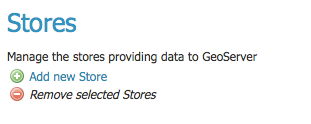
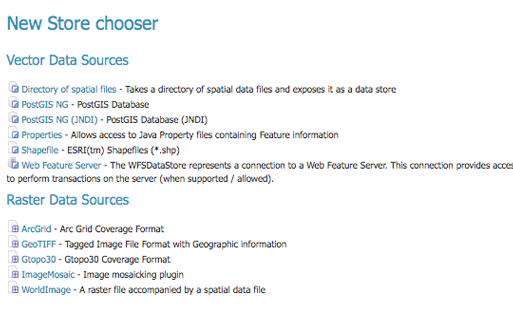

.. _data_webadmin_stores:

存储
======

存储连接到包含栅格或矢量数据的数据源。数据源可以是文件或文件组，数据库中的表，单个栅格文件或目录（例如，矢量产品格式库）。存储构造允许一次定义连接参数，而不是为源中的每个数据集定义一次。因此，在配置存储中的数据集之前，必须先对其进行注册。

.. figure:: img/data_stores.png

   存储视图

存储类型
-----------

尽管数据源有许多潜在的格式，但是只有四种类型的存储。对于栅格数据，存储可以是文件。对于矢量数据，存储可以是文件，数据库或服务器。

.. list-table::
   :widths: 15 85
   :header-rows: 1

   * - 类型图标
     - 描述
   * - .. image:: img/data_stores_type1.png
     - 文件中的栅格数据
   * - .. image:: img/data_stores_type3.png
     - 文件中的矢量数据
   * - .. image:: img/data_stores_type2.png
     - 数据库中的矢量数据
   * - .. image:: img/data_stores_type5.png
     - 矢量服务器（Web功能服务器）

编辑存储
------------

要查看或编辑存储，请单击存储名称。将显示一个存储配置页面。该页面的确切内容取决于存储的特定格式。有关特定数据格式的信息，请参见 ref:`data_vector`, ref:`data_raster`, and ref:`data_database` 部分。该示例显示了 ``nurc:ArcGridSample`` 存储的配置.

.. figure:: img/data_stores_edit.png

   编辑栅格数据存储

存储基本信息
^^^^^^^^^^^^^^^^

基本信息适用于所有格式。

* **工作区** - 存储已分配给选定的工作区
* **数据源名称** - 视图页面上列出的商店名称
* **描述** - 可选）在管理界面中显示的描述
* **启用** - 启用或禁用对商店及其定义的所有数据集的访问

连接参数
^^^^^^^^^^^^^^^^^^^^^

连接参数因数据格式而异。

.. _data_webadmin_stores_add_a_store:

添加存储
-----------

可以在“存储”页面的顶部找到用于添加和删除存储的按钮。

   添加和删​​除存储的按钮

要添加商店，请选择 :guilabel:`Add new Store` 按钮。系统将提示您选择一个数据源。GeoServer本机支持多种格式（可通过扩展名获得更多格式）。单击适当的数据源以继续。

   为新商店选择数据源

   下一页配置商店。由于连接参数因数据源而异，因此此页面的确切内容取决于商店的特定格式。有关特定数据格式的信息，请参见 ref:`data_vector`, ref:`data_raster`, 和 ref:`data_database` 部分。下面的示例显示了ArcGrid栅格配置页面。

.. figure:: img/data_stores_add.png

   ArcGrid栅格数据源的配置页面

删除存储
--------------

要删除存储，请单击存储旁边的复选框。可以选择多个存储，也可以通过单击标题中的复选框来选择所有存储。

.. figure:: img/data_stores_delete.png

   选择要删除的存储

   单击 :guilabel:`Remove selected Stores` 按钮。系统将要求您确认删除商店及其下定义的所有资源的配置。单击 :guilabel:`OK` 将删除选定的商店，然后返回到存储页面。

.. figure:: img/data_stores_delete_confirm.png

   确认删除存储
