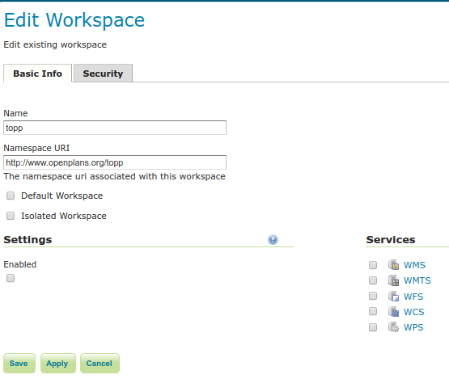

.. _data_webadmin_workspaces:

工作区
==========

本节介绍如何查看和配置工作区。类似于名称空间，工作空间是组织其他项目的容器。在GeoServer中，工作空间通常用于将相似的图层分组在一起。图层可以通过其工作空间名称，冒号，图层名称来引用(例如 ``topp:states``)。两个不同的层可以具有相同的名称，只要它们属于不同的工作空间即可(例如 ``sf:states`` 和 ``topp:states``)。

.. figure:: img/data_workspaces.png
   
   工作区页面

编辑工作区
----------------

要查看或编辑工作空间，请单击工作空间名称。将显示工作空间配置页面。

   
   命名为“ topp”的工作区
   
工作空间由名称和命名空间URI（统一资源标识符）定义。工作区名称限制为十个字符，并且不能包含空格。URI与URL相似，只是URI不需要指向网络上的实际位置，而只需要是唯一的标识符即可。对于工作区URI，我们建议使用与您的项目关联的URL，并可能带有不同的尾随标识符。例如， ``http://www.openplans.org/topp`` 是“ topp”工作区的URI。

通过“安全性”选项卡，可以在工作区级别设置数据访问规则。

.. note:: 有关数据访问规则的更多信息，请参见 ref:`security_webadmin_data`.

.. figure:: img/data_workspaces_security_edit.png

要创建/编辑工作区的数据访问规则，只需根据所需角色选中/取消选中复选框即可。授予对任何角色的访问权限复选框为任何访问模式授予每个角色。

REST PathMapper的根目录 
^^^^^^^^^^^^^^^^^^^^^^^^^^^^^^^^^^

.. figure:: img/data_workspaces_ROOT.png
   
   工作区根目录参数
   
TRESTful API使用以下参数作为上传文件的 `根目录` ::

	${rootDirectory}/workspace/store[/<file>]

.. note:: 此参数仅当 **启用** 该参数 *设置* 部分被选中。 
   
添加工作区
---------------

用于添加和删除工作空间的按钮可以在“工作空间”视图页面的顶部找到。

.. figure:: img/data_workspaces_add_remove.png

   添加和删除按钮
   
要添加工作区，请选择 :guilabel:`Add new workspace` 按钮。系统将提示您输入工作区名称和URI。
   
.. figure:: img/data_workspaces_medford.png

   带有示例的新工作区页面

删除工作区
------------------

要删除工作区，请通过单击工作区旁边的复选框将其选中。可以选择多个工作空间，或者可以通过单击标题中的复选框来选择所有工作空间。单击 :guilabel:`Remove selected workspaces(s)` 按钮。系统将要求您确认或取消删除。单击 :guilabel:`OK` 将删除选定的工作空间。

.. figure:: img/data_workspaces_rename_confirm.png

   工作区删除确认

隔离工作区
-------------------

隔离工作区的内容仅在绑定到隔离工作区的虚拟服务的上下文中可见且可查询。这意味着隔离的工作空间内容将不会显示在全局功能文档中，并且全局服务无法查询隔离的工作空间内容。值得一提的是，这些限制不适用于REST API。

在创建或编辑工作空间时，可以通过选中 :guilabel:`Isolated Workspace` 复选框来隔离工作空间。

.. figure:: img/isolated_workspace.png

   使工作空间隔离

隔离的工作空间将能够重用另一个工作空间已经使用的命名空间，但是只有在使用该工作空间虚拟服务时才能检索其资源（层，样式等），并且只能显示在那些虚拟服务功能文档中。

如果只有一个是非隔离的，则只能在GeoServer中创建两个或多个具有相同名称空间的工作空间，即隔离的工作空间对名称空间的使用没有限制，但是两个非隔离的工作空间不能使用相同的名称空间。

以下情况将是有效的：

  - 前缀: st1 命名空间: http://www.stations.org/1.0 隔离: false

  - 前缀: st2 命名空间: http://www.stations.org/1.0 隔离: true

  - 前缀: st3 命名空间: http://www.stations.org/1.0 隔离: true

  但不是以下之一：

  - 前缀: st1 命名空间: http://www.stations.org/1.0 隔离: false

  - **前缀: st2 命名空间: http://www.stations.org/1.0 隔离: false**

  - 前缀: st3 命名空间: http://www.stations.org/1.0 隔离: true

  最多只有一个非隔离的工作空间可以使用某个命名空间。

考虑以下图像，该图像向使用相同名称空间 (http://www.stations.org/1.0) 的工作区（st1和st2）显示，并且它们包含多个层：

.. figure:: img/workspaces_example.png

   使用相同名称空间的两个工作区，其中一个是隔离的。

在上面的示例中，st2是隔离的工作空间。考虑以下WFS GetFeature请求：

  1. http://localhost:8080/geoserver/ows?service=WFS&version=2.0.0&request=DescribeFeatureType&typeName=layer2

  2. http://localhost:8080/geoserver/st2/ows?service=WFS&version=2.0.0&request=DescribeFeatureType&typeName=layer2

  3. http://localhost:8080/geoserver/ows?service=WFS&version=2.0.0&request=DescribeFeatureType&typeName=st1:layer2

  4. http://localhost:8080/geoserver/st2/ows?service=WFS&version=2.0.0&request=DescribeFeatureType&typeName=st2:layer2

  5. http://localhost:8080/geoserver/ows?service=WFS&version=2.0.0&request=DescribeFeatureType&typeName=st2:layer2

  6. http://localhost:8080/geoserver/ows?service=WFS&version=2.0.0&request=DescribeFeatureType&typeName=layer5

第一个请求以WFS全局服务为目标并请求layer2，该请求将使用工作空间st1包含的layer2。第二个请求以st2工作空间WFS虚拟服务为目标，将使用属于工作空间st2的layer2。请求3和4将使用属于工作区的layer2，分别为st1和st2。最后两个请求将失败，表明找不到功能部件类型，孤立的工作空间内容在全局上不可见。

**根据经验，属于隔离工作区的资源（层，样式等）只能在使用该工作区虚拟服务时进行检索，并且只会显示在这些虚拟服务功能文档中。**