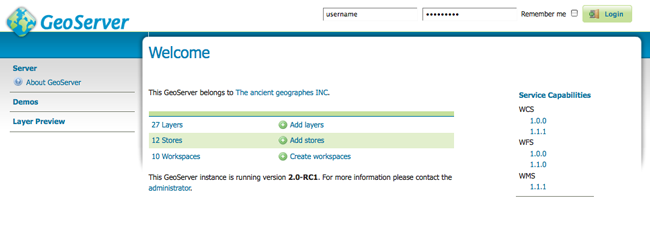

.. _web_admin_quickstart:

使用 Web 管理界面
======================================

GeoServer 有一个用于配置它各个方面的基于浏览器的管理界面应用程序。它涵盖了从添加到发布数据到改变服务设置的各种配置项目。

Web 管理界面可以从浏览器中访问::

  http://<host>:<port>/geoserver

在服务器上，对于默认安装，地址是::

  http://localhost:8080/geoserver

当应用程序启动时，它会显示欢迎页面。

   
   欢迎页面

.. _logging_in:

登录
----------

为了改变任何服务器设置或配置数据，用户必须首先被授权。

#. 导航到 Web 管理界面的右上方来登入 GeoServer. 默认管理令牌是：

   * 用户名: ``admin``
   * 密码: ``geoserver``

   .. note:: 这些可在 :ref:`security` 区域中更改.

   .. figure:: login-page.png

      登录页
   
#. 登录后，欢迎屏幕会改为显示可用的管理功能。这些功能主要显示在页面左侧的菜单里。

   .. figure:: logged_in.png
   
      登录后的附加选项

图层预览
-------------

layerpreview 页面允许你快速查看发布的图层输出。

#. 点击菜单中的 :guilabel:`Layer Preview` 链接来导航到该页面。

   .. figure:: ../../data/webadmin/img/preview_list.png

#. 在这里，你可以找到你想要预览的图层，或者点击对应链接来获取输出格式。点击 :guilabel:`OpenLayers` 链接，然后系统会显示预览。

#. 要对一个列以字母表顺序排序，点击表头。 

   .. figure:: ../../data/webadmin/img/data_sort.png

      未排序 (左)  和 已排序 (右) 

#. 搜索功能可以被用于过滤显示出来的众多项目。这个功能在处理庞大数量的项目时尤其有用。要开始搜索，在搜索框中输入搜索字符串，然后按下回车键。GeoServer 将会搜索匹配您的输入的项目，然后显示搜索结果。

   .. figure:: ../../data/webadmin/img/data_search_results.png
   
      对于查询“top”的搜索结果

   .. note:: 排序和搜索适用于所有数据配置页面。

.. note:: 欲知更多，请查阅 layerpreview 部分。

