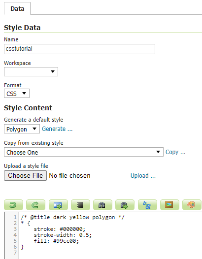
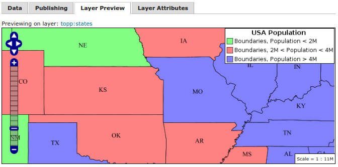

.. _css_tutorial:

教程: 使用 CSS 样式化数据
===============================

本教程将展示如何使用 CSS 来设置图层的样式，以及等效的 SLD 代码。

要使用本教程，你需要 :ref:`CSS 扩展 <css_install>` 以及来自 `默认 GeoServer 配置 <https://github.com/geoserver/geoserver/tree/main/data/release/data/shapefiles>`_ 的 ``states`` 图层.

为 states 图层创建样式
-------------------------------------

.. highlight:: xml

默认 ``states`` 图层的 SLD 文件看起来像这样::

    <?xml version="1.0" encoding="ISO-8859-1"?>
    <StyledLayerDescriptor
      version="1.0.0"
      xmlns="http://www.opengis.net/sld" 
      xmlns:ogc="http://www.opengis.net/ogc"
      xmlns:xlink="http://www.w3.org/1999/xlink"
      xmlns:xsi="http://www.w3.org/2001/XMLSchema-instance"
      xmlns:gml="http://www.opengis.net/gml"
      xsi:schemaLocation="http://www.opengis.net/sld
        http://schemas.opengis.net/sld/1.0.0/StyledLayerDescriptor.xsd
    ">
      <NamedLayer>
        <Name>USA states population</Name>
        <UserStyle>
          <Name>population</Name>
          <Title>Population in the United States</Title>
          <Abstract>A sample filter that filters the United States into three
            categories of population, drawn in different colors</Abstract>
          <FeatureTypeStyle>
            <Rule>
              <Title>&lt; 2M</Title>
              <ogc:Filter>
                <ogc:PropertyIsLessThan>
                 <ogc:PropertyName>PERSONS</ogc:PropertyName>
                 <ogc:Literal>2000000</ogc:Literal>
                </ogc:PropertyIsLessThan>
              </ogc:Filter>
              <PolygonSymbolizer>
                 <Fill>
                    <!-- CssParameters allowed are fill (the color) and fill-opacity -->
                    <CssParameter name="fill">#4DFF4D</CssParameter>
                    <CssParameter name="fill-opacity">0.7</CssParameter>
                 </Fill>     
              </PolygonSymbolizer>
            </Rule>
            <Rule>
              <Title>2M - 4M</Title>
              <ogc:Filter>
                <ogc:PropertyIsBetween>
                  <ogc:PropertyName>PERSONS</ogc:PropertyName>
                  <ogc:LowerBoundary>
                    <ogc:Literal>2000000</ogc:Literal>
                  </ogc:LowerBoundary>
                  <ogc:UpperBoundary>
                    <ogc:Literal>4000000</ogc:Literal>
                  </ogc:UpperBoundary>
                </ogc:PropertyIsBetween>
              </ogc:Filter>
              <PolygonSymbolizer>
                 <Fill>
                    <!-- CssParameters allowed are fill (the color) and fill-opacity -->
                    <CssParameter name="fill">#FF4D4D</CssParameter>
                    <CssParameter name="fill-opacity">0.7</CssParameter>
                 </Fill>     
              </PolygonSymbolizer>
            </Rule>
            <Rule>
              <Title>&gt; 4M</Title>
              <!-- like a linesymbolizer but with a fill too -->
              <ogc:Filter>
                <ogc:PropertyIsGreaterThan>
                 <ogc:PropertyName>PERSONS</ogc:PropertyName>
                 <ogc:Literal>4000000</ogc:Literal>
                </ogc:PropertyIsGreaterThan>
              </ogc:Filter>
              <PolygonSymbolizer>
                 <Fill>
                    <!-- CssParameters allowed are fill (the color) and fill-opacity -->
                    <CssParameter name="fill">#4D4DFF</CssParameter>
                    <CssParameter name="fill-opacity">0.7</CssParameter>
                 </Fill>     
              </PolygonSymbolizer>
            </Rule>
            <Rule>
              <Title>Boundary</Title>
              <LineSymbolizer>
                <Stroke>
                  <CssParameter name="stroke-width">0.2</CssParameter>
                </Stroke>
              </LineSymbolizer>
              <TextSymbolizer>
                <Label>
                  <ogc:PropertyName>STATE_ABBR</ogc:PropertyName>
                </Label>
                
                  <CssParameter name="font-family">Times New Roman</CssParameter>
                  <CssParameter name="font-style">Normal</CssParameter>
                  <CssParameter name="font-size">14</CssParameter>
                
                <LabelPlacement>
                  <PointPlacement>
                    <AnchorPoint>
                      <AnchorPointX>0.5</AnchorPointX>
                      <AnchorPointY>0.5</AnchorPointY>
                    </AnchorPoint>
                  </PointPlacement>
                </LabelPlacement>
              </TextSymbolizer>
            </Rule>
         </FeatureTypeStyle>
        </UserStyle>
        </NamedLayer>
    </StyledLayerDescriptor>

现在，让我们从完成相同任务的 CSS 文件开始。

首先，进入样式页面，点击 :guilabel:`add a new style` 链接来开始新样式。在“新样式”页面中，执行以下操作::

* 将新样式命名为任何您喜欢的名称，例如 ``csstutorial``
* 选择 ``CSS``格式
* 在 :guilabel:`Generate a default style` 下拉菜单中选择 ``Polygon`` 然后点击 :guilabel:`Generate...`

   Creating a new CSS style
    

.. highlight:: css
    
这样就创建了一个示例样式，其源代码与此类似(颜色可能不同) ::

    /* @title cyan polygon */
    * {
        stroke: #000000;
        stroke-width: 0.5;
        fill: #0099cc;
    }

这展示了 CSS 样式的基本元素:

一个 **选择器** ，用于标识要样式化的部分数据。这里，选择器是 ``*``, 表示所有数据都应该使用样式属性。

在花括号(``{}``)内的 **属性** 指定受影响的特性应该如何样式化。属性由用冒号(``:``)分隔的名称/值对组成。

我们也可以看到基本的样式一个多边形(``fill``)，和它的轮廓((``stroke``)。

.. seealso:: 

    :ref:`css_filters`  和 :ref:`css_properties`  列表页面提供了有关 CSS 样式中可用选项的更多信息。

.. highlight:: xml

在继续之前，让我们保存样式并在状态层预览它:

* 点击“应用”保存图层，并启用样式预览
* 现在在“样式编辑器页面”，切换到“图层预览”标签，点击“预览图层”链接，然后在对话框中选择“状态”图层
* 样式编辑器现在应该显示状态层填充和描边

.. figure:: images/tutorial_preview.png

   Previewing the CSS style with the state layer

让我们使用这些基础知识开始转换状态样式。SLD的第一条规则适用于  ``PERSONS`` 字段小于200万的州::

    <Rule>
      <Title>&lt; 2M</Title>
      <ogc:Filter>
        <ogc:PropertyIsLessThan>
         <ogc:PropertyName>PERSONS</ogc:PropertyName>
         <ogc:Literal>2000000</ogc:Literal>
        </ogc:PropertyIsLessThan>
      </ogc:Filter>
      <PolygonSymbolizer>
         <Fill>
            <!-- CssParameters allowed are fill (the color) and fill-opacity -->
            <CssParameter name="fill">#4DFF4D</CssParameter>
            <CssParameter name="fill-opacity">0.7</CssParameter>
         </Fill>
      </PolygonSymbolizer>
    </Rule>

.. highlight:: css

使用基于 :doc:`CQL</tutorials/cql/cql_tutorial>` 的选择器，并复制 csparameters 的名称和值，我们得到::

    [PERSONS < 2000000] {
      fill: #4DFF4D;
      fill-opacity: 0.7;
    }

.. highlight:: xml

对于第二种样式，我们有一个 ``PropertyIsBetween`` 过滤器，它不直接转换为 CSS ::

    <Rule>
      <Title>2M - 4M</Title>
      <ogc:Filter>
        <ogc:PropertyIsBetween>
          <ogc:PropertyName>PERSONS</ogc:PropertyName>
          <ogc:LowerBoundary>
            <ogc:Literal>2000000</ogc:Literal>
          </ogc:LowerBoundary>
          <ogc:UpperBoundary>
            <ogc:Literal>4000000</ogc:Literal>
          </ogc:UpperBoundary>
        </ogc:PropertyIsBetween>
      </ogc:Filter>
      <PolygonSymbolizer>
         <Fill>
            <!-- CssParameters allowed are fill (the color) and fill-opacity -->
            <CssParameter name="fill">#FF4D4D</CssParameter>
            <CssParameter name="fill-opacity">0.7</CssParameter>
         </Fill>     
      </PolygonSymbolizer>
    </Rule>

.. highlight:: css

但是，``PropertyIsBetween``  可以很容易地被两个比较选择器的组合取代。在 CSS 中，您可以简单地将多个选择器一个接一个地放置到一个规则上。只有空格分隔的选择器必须全部满足才能应用样式。通过逗号 (``,``)分隔，可以将多个这样的组附加到一个规则。如果一个特性匹配规则的任何逗号分隔组，则应用该样式。因此 CSS 的第二条等价规则是::

    [PERSONS >= 2000000] [PERSONS < 4000000] {
      fill: #FF4D4D;
      fill-opacity: 0.7;
    }

第三条规则的处理方式与第一条基本相同::

    [PERSONS >= 4000000] {
      fill: #4D4DFF;
      fill-opacity: 0.7;
    }

.. highlight:: xml

第四条也是最后一条规则有点不同。它适用于所有州的标签和大纲::

    <Rule>
      <Title>Boundary</Title>
      <LineSymbolizer>
        <Stroke>
          <CssParameter name="stroke-width">0.2</CssParameter>
        </Stroke>
      </LineSymbolizer>
      <TextSymbolizer>
        <Label>
          <ogc:PropertyName>STATE_ABBR</ogc:PropertyName>
        </Label>
        
          <CssParameter name="font-family">Times New Roman</CssParameter>
          <CssParameter name="font-style">Normal</CssParameter>
          <CssParameter name="font-size">14</CssParameter>
        
        <LabelPlacement>
          <PointPlacement>
            <AnchorPoint>
              <AnchorPointX>0.5</AnchorPointX>
              <AnchorPointY>0.5</AnchorPointY>
            </AnchorPoint>
          </PointPlacement>
        </LabelPlacement>
      </TextSymbolizer>
    </Rule>

.. highlight:: scss

与迄今为止的所有规则不同，这引入了将提取的值 (``STATE_ABBR``) 直接渲染到地图中的想法。为此，您可以将包裹在方形括号 (``[]``) 中的CQL表达式用作 CSS 属性的值。 还有必要将包含空格的值，如 ``Times New Roman``, 用单引号或双引号 (``"``, ``'``)括起来。考虑到这些细节，让我们来编写规则::

    * {
      stroke-width: 0.2;
      label: [STATE_ABBR];
      label-anchor: 0.5 0.5;
      font-family: "Times New Roman";
      font-fill: black;
      font-style: normal;
      font-size: 14;
    }

综上所述，您现在应该有一个看起来像::

    [PERSONS < 2000000] {
      fill: #4DFF4D;
      fill-opacity: 0.7;
    }
    
    [PERSONS >= 2000000] [PERSONS < 4000000] {
      fill: #FF4D4D;
      fill-opacity: 0.7;
    }
    
    [PERSONS >= 4000000] {
      fill: #4D4DFF;
      fill-opacity: 0.7;
    }

    * {
      stroke-width: 0.2;
      label: [STATE_ABBR];
      label-anchor: 0.5 0.5;
      font-family: "Times New Roman";
      font-fill: black;
      font-style: normal;
      font-size: 14;
    }

单击表单底部的 :guilabel:`Apply` 按钮以保存更改。

.. figure:: images/tutorial_noborder.png

   CSS style applied to the ``states`` layer

你会发现边界消失了!在 GeoServer CSS 模块中，每种类型的符号都有一个“ key ”属性来控制是否应用它。没有这些“ key ”属性，下级属性将被忽略。这些“ key ”属性是:

* **fill**, 它控制是否应用多边形填充。这指定了用于填充的颜色或图形。
* **stroke**, 控制是否应用线条和多边形轮廓线。它指定笔画的颜色(或图形填充)。
* **mark**, 它控制是否绘制点标记。这标识了要使用的已知标记或图像URL。
* **label**, 它控制是否在地图上绘制标签。这标识用于标记映射的文本，通常作为 CQL 表达式。
* **halo-radius**, 它控制是否在标签周围绘制光环。这将指定此类光晕的大小。

.. seealso:: 

    :ref:`css_properties` 页以获取有关其他属性的信息。

因为我们没有指定 ``stroke`` 颜色，所以没有应用描边。让我们添加它，取代最终的规则，使它现在看起来像这样 ::

    * {
      stroke: black;
      stroke-width: 0.2;
      label: [STATE_ABBR];
      label-anchor: 0.5 0.5;
      font-family: "Times New Roman";
      font-fill: black;
      font-style: normal;
      font-size: 14;
    }

.. figure:: images/tutorial_border.png

   Border added to style

改进风格
------------------

移除重复的属性
^^^^^^^^^^^^^^^^^^^^^^^^^^^^^^

我们现在拥有的样式只有 23 行，相对于最初的 103 行 XML 来说，这是一个很好的改进。然而，我们仍然到处重复 ``fill-opacity`` 属性。

我们可以将其移动到 ``*`` 规则中，并将其应用于任何地方。这是可行的，因为 GeoServer CSS 模块模拟了 *级联* :而SLD使用了一个“ 画家模型 ”，其中每个规则都是独立处理的，级联样式允许你提供一般样式属性，只覆盖特定功能的特定属性。

这将样式减少到只有 21 行::

    [PERSONS < 2000000] {
      fill: #4DFF4D;
    }
    
    [PERSONS > 2000000] [PERSONS < 4000000] {
      fill: #FF4D4D;
    }
    
    [PERSONS > 4000000] {
      fill: #4D4DFF;
    }

    * {
      fill-opacity: 0.7;
      stroke-width: 0.2;
      label: [STATE_ABBR];
      label-anchor: 0.5 0.5;
      font-family: "Times New Roman";
      font-fill: black;
      font-style: normal;
      font-size: 14;
    }

比例相关样式
^^^^^^^^^^^^^^^^^^^^^^

这种风格的标签很好，但在较低的缩放级别，它们似乎有点拥挤。我们可以很容易地将标签移动到一个规则，直到刻度分母低于 2000000 才会激活。 我们确实希望在所有缩放级别上保持 stroke 和不透明度填充，以便将它们与标签属性分开。

在main (``*``) 规则中保持以下属性::

    * {
      fill-opacity: 0.7;
      stroke-width: 0.2;
    }

移除所有其他的，将它们移动到一个新规则中::

    [@sd < 20M] {
      label: [STATE_ABBR];
      label-anchor: 0.5 0.5;
      font-family: "Times New Roman";
      font-fill: black;
      font-style: normal;
      font-size: 14;
    }

为图例设置标题
^^^^^^^^^^^^^^^^^^^^^^^^^^^^^

到目前为止，我们还没有为任何样式规则设置标题。这实际上不会在查看地图时造成任何问题，但 GeoServer 会在自动生成图例图形时使用标题。如果没有标题， GeoServer 会依赖于名称，而在 CSS 模块中，名称是根据每个规则的过滤器生成的。 标题通常不是 CSS 的一部分，所以 GeoServer 会在每个规则之前的特殊格式注释中查找它们。我们可以添加这样的标题::

    /* @title Population < 2M */
    [PERSONS < 2000000] {
    
      ...

    /* @title 2M < Population < 4M */
    [PERSONS > 2000000] [PERSONS < 4000000] {

      ...
    
    /* @title Population > 4M */
    [PERSONS > 4000000] {

      ...

    /* @title Boundaries */
    * {

      ...

由于 CSS 转换为 SLD 的方式，每个 SLD 规则都是若干 CSS 规则的组合。这是通过将标题与单词 “with” 结合起来处理的。如果规则的标题被省略，那么 SLD 输出中就不包括它。

最终的CSS应该是这样的::

    /* @title Population < 2M */
    [PERSONS < 2000000] {
      fill: #4DFF4D;
      fill-opacity: 0.7;
    }
    
    /* @title 2M < Population < 4M */
    [PERSONS >= 2000000] [PERSONS < 4000000] {
      fill: #FF4D4D;
      fill-opacity: 0.7;
    }
    
    /* @title Population > 4M */
    [PERSONS >= 4000000] {
      fill: #4D4DFF;
      fill-opacity: 0.7;
    }
    
    
    /* @title Boundaries */
    * {
      stroke: black;
      stroke-width: 0.2;
      fill-opacity: 0.7;
    }
    
    [@sd < 20M] {
      label: [STATE_ABBR];
      label-anchor: 0.5 0.5;
      font-family: "Times New Roman";
      font-fill: black;
      font-style: normal;
      font-size: 14;
    }

   Final style with rule names

应用规则嵌套
^^^^^^^^^^^^^^^^^^^^^

作为最后一种变体，可以通过利用规则嵌套使样式更紧凑::

  * {
    stroke: black;
    stroke-width: 0.2;
    fill-opacity: 0.7;
  
    /* @title Population < 2M */
    [PERSONS < 2000000] {
      fill: #4DFF4D;
    };
    /* @title 2M < Population < 4M */
    [PERSONS >= 2000000] [PERSONS < 4000000] {
      fill: #FF4D4D;
    };
    /* @title Population > 4M */
    [PERSONS >= 4000000] {
      fill: #4D4DFF;
    };
    
    /* Labelling */
    [@sd < 20M] {
      label: [STATE_ABBR];
      label-anchor: 0.5 0.5;
      font-family: "Times New Roman";
      font-fill: black;
      font-style: normal;
      font-size: 14;
    }   
  }

CSS 工作室
^^^^^^^^^^^^

更多详细信息, 请访问下一部分， `CSS workshop <../workshop/index.html>`_。 该研讨会过去曾教授 CSS 扩展并被采用于课程设置，现已移植到用户文档中。
