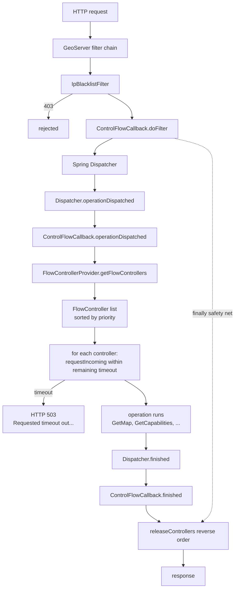
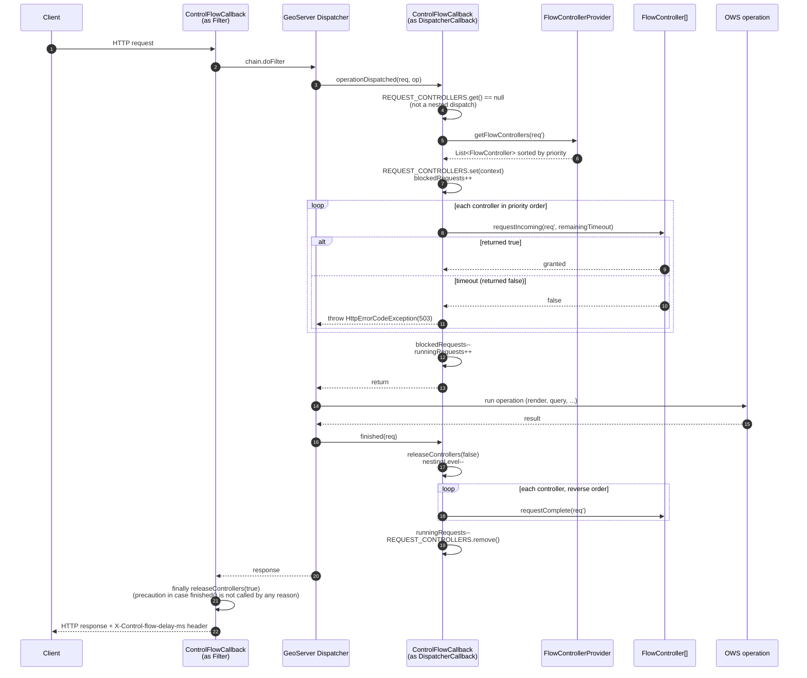

# control-flow

> **Note:** this document was prepared in April 2026 against the module behavior at that time. It is intended as
> onboarding material and is not actively maintained alongside the code. Treat it as a starting point: the module may
> have evolved since, and individual statements below may be out of sync with the current source. When in doubt,
> trust the code.

Throttles concurrent OWS requests and optionally rate-limits or prioritises them by user, IP or HTTP header.

The extension also ships a small IP blacklist filter that rejects blacklisted addresses before the dispatcher runs.

This README covers the internals - for configuration reference, see the GeoServer user manual.

## How it works

Every HTTP request that reaches GeoServer goes through a Spring-delegated servlet filter. For OWS requests the
dispatcher also fires callbacks once the request has been parsed into a service+operation. `ControlFlowCallback` is
registered as both a filter and a dispatcher callback, hooking both points from a single class. When the dispatcher
callback fires it asks a `FlowControllerProvider` for the list of controllers that apply to the request, walks that list
in priority order calling `requestIncoming(request, timeout)` on each, and only lets the operation run after every controller
has granted a slot. When the operation finishes the list is walked in reverse and each slot is released. Everything
else in this module is configuration surface around that core flow.

Rules live in `$GEOSERVER_DATA_DIR/controlflow.properties`. Example:

```properties
timeout=10
ows.global=16
ows.wms.getmap=4
user.ows.wms.getmap=6/s;2s
ip=8
ip.blacklist=192.168.1.8, 192.168.1.10
ows.priority.http=gs-priority,0
```

## Where the code lives

```
org.geoserver.flow              ControlFlowCallback (filter + DispatcherCallback in one class),
                                ControlFlowConfigurator, FlowController, FlowControllerProvider,
                                DefaultFlowControllerProvider, ControllerPriorityComparator, ControlModuleStatus
org.geoserver.flow.config       DefaultControlFlowConfigurator - the controlflow.properties parser
org.geoserver.flow.controller   FlowController implementations + ThreadBlocker implementations +
                                key/priority providers + IpBlacklistFilter + request matchers
```

Start with `ControlFlowCallback.java` - the rest of the module is easier to follow afterwards.

## Spring wiring (`applicationContext.xml`)

Three beans:

| Bean                   | Class                 | Role |
| ---------------------- | --------------------- | ---- |
| `controlFlowCallback`  | `ControlFlowCallback` | Implements **both** `AbstractDispatcherCallback` **and** `GeoServerFilter`. Acquires/releases controllers per request. |
| `ipBlacklistFilter`    | `IpBlacklistFilter`   | Rejects requests from blacklisted IPs with HTTP 403. Reads the same `controlflow.properties`. |
| `controlExtension`     | `ControlModuleStatus` | Shows up in the module status panel on the admin UI. |

Both `ControlFlowCallback` and `IpBlacklistFilter` are auto-discovered by GeoServer's `SpringDelegatingFilter`, which wraps every incoming
request in all `GeoServerFilter` beans it finds in the context. No `web.xml` changes, no explicit filter mapping.

If the data dir doesn't ship a custom `ControlFlowConfigurator` or `FlowControllerProvider`, `ControlFlowCallback.setApplicationContext` registers
the defaults (`DefaultControlFlowConfigurator`, `DefaultFlowControllerProvider`) as singletons on first access. See `ControlFlowCallback.registDefaultBeansIfNeeded`.

## High-level architecture



## Per-request lifecycle



## Per-request state

Everything per-request lives in two `ThreadLocal`s on `ControlFlowCallback`:

- `REQUEST_CONTROLLERS` holds a `CallbackContext`: the list of controllers acquired for this request, the timeout in
force, the `Request` clone we used as the queue key, a `nestingLevel` counter, plus a couple of fields the stuck-slot watchdog uses (start time, owning thread).
- `FAILED_ON_FLOW_CONTROLLERS` is a single boolean: `true` if acquisition failed partway through, so that on release
we know not to decrement `runningRequests` for a request that never actually started running.

Two process-wide `AtomicLong` counters gives an overall view of the server's state: `blockedRequests` (requests currently
sitting in some controller's queue) and `runningRequests` (requests that made it through all controllers and are now
executing).

### Re-entrance (integrated GWC, internal dispatches)

When GWC is integrated into the WMS pipeline - as transparent integration or as a native tile service - a single HTTP request
can re-enter `Dispatcher` on the same thread, which fires `operationDispatched` a second (and possibly third) time. Acquiring the same
controller twice on one thread would deadlock immediately on the first BasicOWS slot, so nested calls are detected via
`REQUEST_CONTROLLERS.get() != null` and only bump `nestingLevel`; actual release happens when `nestingLevel` hits zero. As a safety net, the
servlet-filter `doFilter` also calls `releaseControllers(true)` in its `finally` block, so if anything swallowed `finished()` on the way out the slot
is still released before the HTTP response returns.

## Controllers and blockers

Controllers live in `org.geoserver.flow.controller`. The `FlowController` contract is minimal:

```java
public interface FlowController {
    boolean requestIncoming(Request request, long timeout); // true if entered, false on timeout
    void    requestComplete(Request request);               // always called, matches every requestIncoming
    int     getPriority();                                  // used to sort via ControllerPriorityComparator
}
```

Controllers run in **priority order** on acquire and in **reverse** on release. The three base classes the rest build on:

- `SingleQueueFlowController` - a controller whose matching is a single `Predicate<Request>` and whose blocking behaviour is delegated to a `ThreadBlocker`.
The global and per-OWS controllers are instances of this.
- `QueueController` - for controllers that maintain a dynamic set of queues, one per key (IP, user). Creates `SingleQueueFlowController`-like queues on demand.
- `RateFlowController` - implements `FlowController` directly: no queue, only per-key counters over sliding time windows. Rate-limiter, not concurrency-limiter.

### ThreadBlocker implementations

A `ThreadBlocker` is the primitive that blocks a thread until a slot is available. Two exist:

- `SimpleThreadBlocker(queueSize)` - wraps a fair `ArrayBlockingQueue<Request>` of capacity `queueSize`. `requestIncoming` calls
`queue.offer(request, timeout, MS)` which returns `false` if the queue stayed full for the whole timeout; `requestComplete`
calls `queue.remove(request)`, matching by object identity against the `Request` clone stored in `CallbackContext`. `toString()` returns
`SimpleBlocker(N)`, which is the form that appears in the logs.
- `PriorityThreadBlocker(queueSize, priorityProvider)` - used only when `ows.priority.http=...` is configured. Maintains a `Set<Request>`
of currently-running requests and a `PriorityQueue<WaitToken>` of waiters, each waiter owning a `CountDownLatch`. When a slot frees,
`releaseNext()` polls the highest-priority waiter and counts its latch down. All mutations are under `synchronized(this)`.

### Controllers catalog

| Config key  | Class | What it does |
| ----------- | ----- | ------------ |
| `ows.global=N` | `GlobalFlowController` | `N` concurrent OWS operations across the whole server (the matcher always returns true). |
| `ows.<svc>[.<op>[.<fmt>]]=N` | `BasicOWSController` | `N` concurrent matches for the given `service[.request[.outputFormat]]` via `OWSRequestMatcher`. `toString()` is what produces `BasicOWSController(wms.getmap,SimpleBlocker(4))` in the logs. |
| `ip=N` | `IpFlowController` | Per-IP limit of `N` concurrent requests. Dynamic `ConcurrentHashMap<ip, Queue>` with 10s idle cleanup. Honours `X-Forwarded-For`. |
| `ip.<A.B.C.D>=N` | `SingleIpFlowController` | Hard-coded per-IP limit for a specific address. |
| `user=N` | `UserConcurrentFlowController` | Per-user concurrent limit, keyed by a `CookieKeyGenerator` (sets a `gs-user-id` cookie when missing). |
| `user.ows.<svc>[.<op>[.<fmt>]]=R/U[;Ds]` | `RateFlowController` | Sliding rate limit per cookie key - `R` requests per interval `U`, with an optional `Ds` delay before responding 429. |
| `ip.ows.<svc>[.<op>[.<fmt>]]=R/U[;Ds]`      | `RateFlowController`           | Same shape, keyed by IP via `IpKeyGenerator`. |
| `timeout=N`                                 | (not a controller)             | Seconds to wait in *any* queue before responding HTTP 503. Applied as a single shared deadline across all controllers for the request. |
| `ows.priority.http=Header,default`          | (config only)                  | Flips the blocker factory in `DefaultControlFlowConfigurator.buildBlocker` from `SimpleThreadBlocker` to `PriorityThreadBlocker` and reads the priority from `Header` (integer; `default` when missing/invalid). |
| `ip.blacklist=a,b,c` / `ip.whitelist=a,b,c` | `IpBlacklistFilter`            | Reject the listed IPs with HTTP 403 at the servlet-filter level before the dispatcher runs. Whitelist overrides blacklist. A `*` in a pattern becomes the regex `(.{0,1}[0-9]+.{0,1}){0,4}`. |

Rate unit in `R/U[;Ds]` is one of `s`, `m`, `h`, `d` (see the `RATE_PATTERN` constant).

### The parser

`DefaultControlFlowConfigurator.buildFlowControllers()` walks `controlflow.properties` and maps each key to a controller per
the table above. A `PropertyFileWatcher` detects on-disk changes; `DefaultFlowControllerProvider.checkConfiguration` rebuilds
the sorted controller list under `synchronized(configurator)` when `configurator.isStale()` returns `true`. `timeout` is
stored in milliseconds (key value × 1000) on a `volatile long`.

## Response headers

`ControlFlowCallback` sets the following response headers:

- `X-Control-flow-delay-ms` - milliseconds spent between entering `operationDispatched` and either clearing flow-controller
acquisition or throwing. Set in the `finally` block of `operationDispatched`, so every response carries it.
- `X-Concurrent-Limit` / `X-Concurrent-Requests` - set by controllers enforcing concurrency limits; useful for clients that want to self-throttle.

The 503 body reads `Requested timeout while waiting to be executed, please lower your request rate`.

## Stuck-slot watchdog

### The two time windows of a request

A request spends its life in two consecutive states, and control-flow only bounds one of them:

1. **Queue wait.** The thread is inside `operationDispatched`'s controller loop, parked in `SimpleThreadBlocker.offer(req, maxWait, MS)`
because a peer holds the slot. It exits either when a slot frees (loop continues) or when the wait exceeds `timeout=N` (503 is thrown).
This window is **strictly bounded** by `timeout`. The `blockedRequests` counter reflects it.
2. **Running.** Every controller has granted; `operationDispatched` has returned; the thread is executing the actual OWS operation
(rendering, querying, building the response). Control-flow holds no lock here — it just waits for `DispatcherCallback.finished(req)`
to fire and release the slots. This window is **not bounded by anything in control-flow**; its natural length is however long
the operation takes. The `runningRequests` counter reflects it.

A **stuck slot** is a request that entered state (2) and never left it - typically because something downstream (a datastore,
a renderer, a cache, a native call) is wedged and `finished` never fires. The slot stays held indefinitely. From control-flow's
point of view, the slot *looks* occupied exactly like a normal running request — same counter, same callbacks not-yet-fired,
no exception. Peer requests arriving behind it pile up in state (1), hit `timeout`, and return 503. The 503 log message is identical
whether those peers are held up by legitimately busy work or by a wedged one, which is what makes stuck slots annoying to diagnose from logs alone.

|                                     | Queue wait (state 1) | Running (state 2) | Stuck slot        |
| ----------------------------------- | -------------------- | ----------------- | ----------------- |
| Bounded by `timeout`                | yes                  | no                | no                |
| `blockedRequests` counter           | incremented          | -                 | -                 |
| `runningRequests` counter           | -                    | incremented       | incremented       |
| Entry in `ACTIVE_RUNNING`           | no                   | yes               | yes               |
| Clears on its own                   | yes (slot or 503)    | yes (op returns)  | **no**            |
| Recovery                            | automatic            | automatic         | restart / fix bug |

That last row is the point: control-flow's built-in `timeout` only bounds states that clear themselves anyway. The watchdog adds
visibility for the state that does not.

### What the watchdog does

`ControlFlowCallback` maintains a live map of currently-running requests (`ACTIVE_RUNNING`, keyed by thread id; populated once all
controllers have granted, cleared on release). Two hooks use it:

1. **Timeout-triggered peer dump.** When `requestIncoming` returns `false` and the callback is about to throw a 503, it walks
`ACTIVE_RUNNING` once and emits one `WARNING` per peer whose hold duration exceeds `timeout`. Each line names the peer thread,
the `Request` it is running, and the **top stack frame** of that thread. So at the moment of the 503 the log already distinguishes
a peer doing real work (top frame inside the renderer, the datastore query, etc.) from a peer wedged in, e.g. `org.sqlite.core.NativeDB._open_utf8(Native Method)`,
without needing a separate `jstack`.
2. **Release-time confirmation.** When a request finally releases after holding its slot longer than `timeout`, the release path
logs a single `WARNING` naming the request and the hold duration. If the operation never returns - the stuck case - this line
never appears; the peer dump from (1) is the primary signal.

The heuristic is "a hold longer than the queue-wait budget is suspicious, not necessarily stuck". A legitimately slow 20-second
render with `timeout=10` will also trigger the WARN, but its top frame reads as progress (e.g. `StreamingRenderer.drawFeature`), not as a wedge.
A stuck slot has a top frame that is identical across successive dumps and inside I/O or native code. The watchdog is a pointer,
not a verdict; the stack frame is the evidence.

The message format is stable so alerts can key off it:

```
Request [<timedOutRequest>] timed out waiting on <controller>; peer thread <name> has been holding a slot for <heldMs>ms running [<peerRequest>] - top frame: <stack element>
```

Sample output from a real incident - a GetMap request on thread `-148` times out waiting on `wms.getmap` because four
peer threads have been wedged in native SQLite calls for ~770 seconds:

```
'qtp1439007204-148' INFO   [geoserver.flow] - Request [WMS 1.1.0 GetMap] starting, processing through flow controllers
'qtp1439007204-148' WARN   [geoserver.flow] - Request [WMS 1.1.0 GetMap] timed out waiting on BasicOWSController(wms.getmap,SimpleBlocker(4)); peer thread qtp1439007204-81 has been holding a slot for 769328ms running [WMS 1.1.1 GetMap] - top frame: org.sqlite.core.NativeDB._open_utf8(Native Method)
'qtp1439007204-148' WARN   [geoserver.flow] - Request [WMS 1.1.0 GetMap] timed out waiting on BasicOWSController(wms.getmap,SimpleBlocker(4)); peer thread qtp1439007204-149 has been holding a slot for 769348ms running [WMS 1.1.1 GetMap] - top frame: org.sqlite.core.NativeDB._close(Native Method)
'qtp1439007204-148' WARN   [geoserver.flow] - Request [WMS 1.1.0 GetMap] timed out waiting on BasicOWSController(wms.getmap,SimpleBlocker(4)); peer thread qtp1439007204-154 has been holding a slot for 769349ms running [WMS 1.1.1 GetMap] - top frame: org.sqlite.core.NativeDB._open_utf8(Native Method)
'qtp1439007204-148' WARN   [geoserver.flow] - Request [WMS 1.1.0 GetMap] timed out waiting on BasicOWSController(wms.getmap,SimpleBlocker(4)); peer thread qtp1439007204-155 has been holding a slot for 769349ms running [WMS 1.1.1 GetMap] - top frame: org.sqlite.core.NativeDB._open_utf8(Native Method)
'qtp1439007204-148' INFO   [geoserver.flow] - Request control-flow performed, running requests: 4, blocked requests: 0
'qtp1439007204-148' INFO   [geoserver.flow] - releasing flow controllers for [WMS 1.1.0 GetMap]
'qtp1439007204-148' INFO   [geoserver.flow] - Request completed, running requests: 4, blocked requests: 0
```

That block points straight at the root cause: every peer has held its slot for ~770 s (hold times consistent across the
four WARN lines), and every top frame is inside `org.sqlite.core.NativeDB`. The problem is in the SQLite/GeoPackage connection layer,
not in control-flow, and the evidence is right there in the log without a separate `jstack`.

The watchdog introduces no background threads or scheduled tasks; it runs inline on the 503-throwing path and on the normal release path.

## Log format cheatsheet

Messages emitted under the `geoserver.flow` logger:

| Level | Message | Meaning |
| ----- | ------- | ------- |
| INFO  | `Request [...] starting, processing through flow controllers` | A non-nested dispatch has started acquiring controllers. |
| FINE  | `Request [...] enter BasicOWSController(wms.getmap,SimpleBlocker(4))/4` | About to call `requestIncoming` on this controller. The trailing `/N` is the **live** queue size at log time, not a per-request counter. For a `SimpleThreadBlocker` of capacity 4, `/4` indicates the queue is full and the call will block until a slot frees or the timeout expires. |
| FINE  | `Request [...] exit BasicOWSController(...)/N` | `requestIncoming` returned `true`; the request is now counted in the queue. `/N` is the queue size **after** entry. Not emitted on timeout - there is no `exit` line when the controller returned `false`. |
| INFO  | `Request control-flow performed, running requests: X, blocked requests: Y` | Emitted in the `finally` of `operationDispatched`; controller acquisition has finished (successfully or by throwing). |
| INFO  | `releasing flow controllers for [...]` | Release path has started (`finished()` or the `doFilter` `finally`). |
| INFO  | `Request completed, running requests: X, blocked requests: Y` | End of release path. |
| FINE  | `Nested request found, not locking on it` | Re-entrant `operationDispatched` on the same thread; only `nestingLevel` was incremented. |
| WARN  | `Request [...] timed out waiting on <controller>; peer thread <name> has been holding a slot for <N>ms running [...] - top frame: ...` | Stuck-slot watchdog (see above). |
| WARN  | `Request [...] held flow-controller slot for <N>ms, over the configured <timeout>ms timeout; peer requests may have returned HTTP 503 while waiting for this one.` | Release-time stuck-slot warning. |

Because `/N` is a shared counter read at log-emission time, values across different threads' `enter`/`exit` lines fluctuate freely. Do not read them as belonging to a single request.

## Operational notes

- **Only queue waits are bounded.** `timeout` caps time spent in a queue, not execution time. A slot held by a stuck operation remains
held until that operation returns - which may be never. The [stuck-slot watchdog](#stuck-slot-watchdog) is the first-line diagnostic; `jstack` confirms.
- **`timeout=0` or omitted disables the queue-wait deadline.** Waiters then block on `BlockingQueue.put` with no timeout. Not recommended
for production: a slow operation can cause waiters to pile up indefinitely.
- **`controlflow.properties` is hot-reloaded.** Changes are picked up on the next request through the `PropertyFileWatcher.isStale` check in
`DefaultFlowControllerProvider.checkConfiguration`. No restart required.
- **Ordering matters.** Lower-priority controllers are acquired first and released last. Reverse-order release drains the most specific
limits (usually OWS-level) before more general ones (global), which reduces the chance of a low-priority request keeping a slot a higher-priority request needs.
- **`ControlFlowCallback`'s constructor calls `REQUEST_CONTROLLERS.remove()`** to isolate unit tests from leftover thread-locals
in the test runner. At runtime there is a single callback bean, so the call is effectively a no-op.

## Developer tips

- Start with `ControlFlowCallback.java`, specifically `operationDispatched` and `releaseControllers`. The rest of the module is easier to follow afterwards.
- To add a new flow controller: implement `FlowController`, add a parser branch in `DefaultControlFlowConfigurator.buildFlowControllers`,
and provide a `toString()` that includes the controller's parameters - the logs rely on it.
- To add a new blocker: implement `ThreadBlocker` and wire it through `buildBlocker` in the configurator, or wrap it directly inside a controller.
- For concurrency tests use `AbstractFlowControllerTest` and `FlowControllerTestingThread`. These were recently hardened (`state` is `volatile`,
`waitBlockedOrTimedOut` accepts `TIMED_OUT`) to eliminate sporadic CI failures caused by ad-hoc thread-state polling. Reuse them rather than rolling your own.

